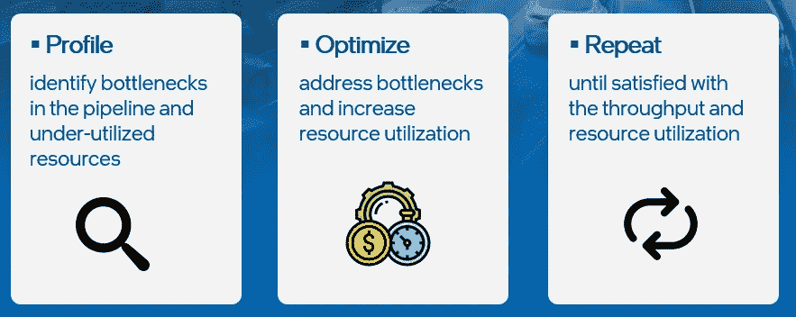
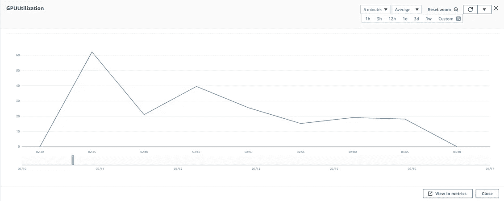
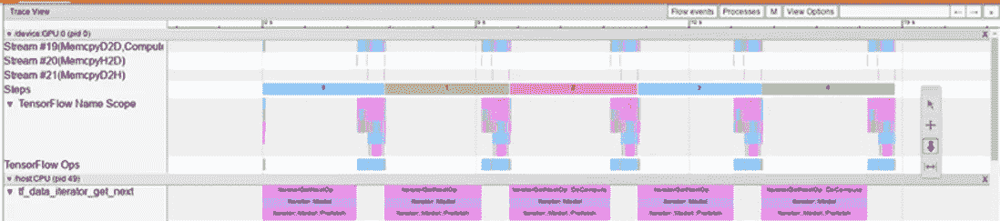
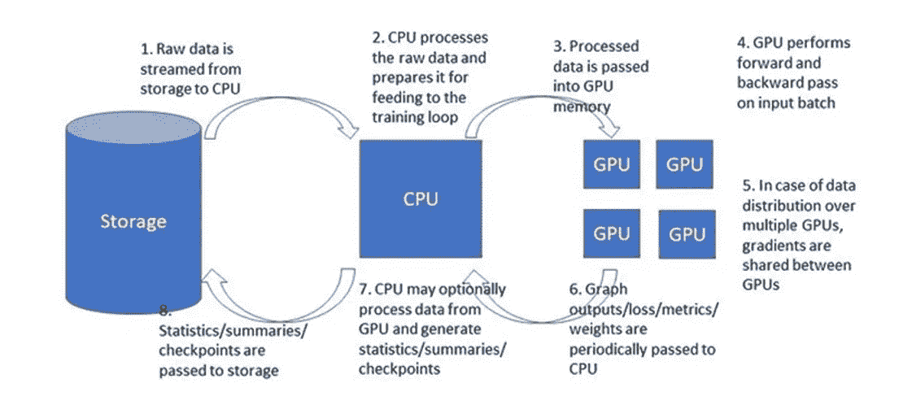

# 云 ML 性能清单

> 原文：<https://towardsdatascience.com/cloud-ml-performance-checklist-caa51e798002>

## 优化基于云的培训的指南

杰克·威瑞克在 [Unsplash](https://unsplash.com?utm_source=medium&utm_medium=referral) 上的照片

在云中培训有很多好处。其中包括**对多种培训实例类型的可访问性**，将培训无限制地扩展到多个实例和多个并行实验的能力**，以及丰富的**生态系统**功能和服务促进了 ML 工作负载。**然而，如果管理不当，cloud ML 会产生相当高的成本。**虽然主要职责是制定和实施治理政策、监控云服务的使用和成本、与云服务提供商(CSP)协商定价策略等。，可能会落到您组织的云支持团队头上，**算法开发人员也有责任尽自己的一份力量来提高效率，减少浪费**。下面嵌入推文中的迷因说明了一切。**

本文档描述了一个项目清单，我们发现该清单有助于指导算法开发人员提高训练效率，进而降低训练成本。

# 性能测定

我们的主要性能指标是 ***每美元的样本数*** ，即每花费一美元，训练循环遍历的样本数。 ***样本每美元*** 的公式为:

每美元公式示例(按作者)

其中*每秒样本数=批量*每秒批次数*。培训实例费用可在您的 CSP 网站上找到。

虽然您的目标应该是最大化每美元 的 ***样本，但有时您需要考虑其他因素。例如，您可能决定将训练分布在多个 GPU 上以加速训练，即使这可能会减少每美元*** 的 ***个样本。另一个例子是，最大化每美元的样本会损害训练工作的收敛速度(例如，对批量大小的增加敏感的模型)。***

性能优化是一个迭代过程，如下图所示:

性能优化流程(按作者)

这个迭代过程应该伴随项目的整个生命周期。

# 性能分析工具

有许多分析性能的工具和方法。一些基本指标包括云服务提供商(CSP)报告的资源利用率指标和 [TensorBoard profiler 插件](https://www.tensorflow.org/guide/profiler)。

这张图片显示了一个由[亚马逊云观察](https://aws.amazon.com/cloudwatch/)监控工具报告的低 GPU 利用率的例子:

亚马逊 CloudWatch 中的 GPU 利用不足(作者)

[TensorBoard profiler 插件](https://www.tensorflow.org/guide/profiler)是一个强大的工具，支持许多流行的机器学习框架的分析(包括 [TensorFlow](https://www.tensorflow.org/guide/profiler) 、 [PyTorch](https://pytorch.org/tutorials/intermediate/tensorboard_profiler_tutorial.html) 和 [Jax](https://jax.readthedocs.io/en/latest/profiling.html#tensorboard-profiling) )。一开始，这个分析器看起来有点吓人，但是它非常容易设置，并且是识别性能瓶颈的一个非常有用的工具。更多详情参见[分析器文档](https://www.tensorflow.org/guide/profiler)。

下图来自 TensorBoard profiler trace viewer，显示了长时间的 GPU 空闲时间，表明训练步骤中存在重大瓶颈。

TensorBoard Profiler 插件显示的性能瓶颈(作者)

# 性能分析清单

本节包括衡量培训工作当前绩效的基本指南。

1.  您的培训计划是否包括定期报告每秒*培训样本的平均数量*？
2.  您目前衡量每美元样品的标准是多少？
3.  在整个培训过程中,*每美元样品*测量值是否相对稳定？
4.  您的培训脚本是否支持启用概要分析的选项，例如通过 TensorFlow 中的 [TensorBoard 回调](https://www.tensorflow.org/api_docs/python/tf/keras/callbacks/TensorBoard)？
5.  CSP 的云指标报告的当前平均 GPU 内存利用率是多少？一般来说(但不总是)，通过增加训练批量来最大化 GPU 内存的使用是一个好主意。这通常会增加每秒的样本数，因为它降低了固定操作(如内核加载和梯度共享)的成本。在某些情况下，批量大小的选择会对 GPU 内存对齐产生影响，这也会影响性能。
6.  CSP 的云指标报告的当前平均 GPU 利用率是多少？你的目标应该是尽可能地增加这一点。95%的利用率是一个很好的目标。任何低于 80%的数据都意味着你的训练出现了瓶颈，应该会让你夜不能寐。
7.  其他系统指标，包括 CPU 和网络利用率，可能会对潜在的性能问题提供一些提示，但通常很难从中获得有用的信息。这些指标中是否有任何一项表明可能存在瓶颈？
8.  评估训练管道性能的一个有用方法是对缓存的输入运行训练循环。通过这样做，您可以有效地隔离出所有的输入流水线计算，并在这种情况下计算每美元 的 ***个样本。这个数字表示当数据输入管道上没有瓶颈时可以达到的性能。如果有您正在努力解决的瓶颈，这个数字应该被视为您的目标性能。您的脚本支持在缓存的输入上计算每美元*** 的 ***样本的选项吗？在 Tensorflow 中，缓存输入可以通过应用: *dataset = dataset.take(1)轻松完成。缓存()。在数据集创建结束时重复()*(预取之前)。请注意，通过在数据集的其他阶段应用缓存，可以获得对 CPU 争用的潜在来源的更多见解，并且应该在分析输入管道上的瓶颈时使用。***
9.  TensorBoard profiler 是一个非常有用的性能分析工具。让它成为你发展周期的一个常规部分是很重要的。对其功能的全面概述超出了本文档的范围，但是强烈建议(并没有您想象的那么困难)学习如何使用它。您运行(并分析)分析器了吗？
10.  查看探查器摘要报告。它是否报告了输入管道瓶颈？(请注意，如果在“内核加载”上花费了大量时间，这可能表明 CPU 争用率很高，并且可能表明存在 CPU 瓶颈。)
11.  打开跟踪查看器。有没有什么麻烦的模式比如 GPU 长时间闲置或者频繁的 CPU 到 GPU 的拷贝？
12.  查看十大 TensorFlow GPU 操作。它们是你所期望的吗？这些有时可以暗示对模型的潜在优化。

# 实例选择

根据您选择的培训实例，每美元的样本量可能会有很大差异。选择错误的训练实例会对成本产生可怕的后果。一般来说，新一代的实例(比如 Amazon EC2 G5 和 p4 实例类型)包含了提高性能的硬件增强。另一个考虑因素是 CPU 与 GPU 计算能力的比率。较低的比率可能会增加对 CPU 资源的争用，并导致 CPU 瓶颈。

1.  您目前的培训情况如何？你考虑过其他选择吗？如果你使用的是老一代 GPU，比如 Amazon EC2 p2 或 p3，你应该有一个很好的理由。
2.  替代(非 GPU)加速器，如[亚马逊 EC2 dl1](https://aws.amazon.com/ec2/instance-types/dl1/) (基于[哈瓦那高迪](https://habana.ai/training/gaudi/))和[谷歌云 TPU](https://cloud.google.com/tpu) (在 GCP)通常(但不总是)提供比 GPU 更高的性价比。然而，它们有时需要对这些加速器进行一些调整。你有没有尝试过在一个专门的 DNN 培训加速器上运行你的模型？使用这些替代品有什么障碍？

# 培训优化

下图显示了典型训练步骤的各个阶段。每一步都是性能瓶颈的潜在来源:

典型训练步骤的步骤(作者)

## 存储到 CPU

训练步骤的第一阶段是将原始训练样本加载到 CPU 上。存储数据的方式需要特别注意，这样这个阶段才不会成为瓶颈。如果您的数据存储在远程(云)对象存储中，比如亚马逊 S3，这一点尤其正确。实例类型网络入站容量、S3 出站容量或 CPU 争用的限制可能会导致数据匮乏。训练速度可能会受到您选择的数据格式(例如顺序与列格式)、数据文件的大小、用于流式传输数据的方法(管道模式、FFM、直接下载等)的影响。)、数据压缩的使用等。

分析数据流速度的一种方法是直接迭代数据集，测量每美元的 ***样本*** ，而不运行训练步骤。理想情况下，结果将明显高于使用训练步骤跑步时的结果。

1.  您的文件大小是否在 100 MB 左右？
2.  如果你在使用 Amazon SageMaker，你会利用 FFM 或 PipeMode 来传输你的数据吗？
3.  在没有训练的情况下迭代数据集时， ***每美元样本数*** 是多少？
4.  在输入数据管道的开始应用数据缓存时，每美元的 ***样本*** 是什么？如果它高于基准值，这可能表明有问题。
5.  使用数据压缩可以减少网络带宽需求，也可以降低存储成本。另一方面，数据解压缩可能会增加 CPU 争用。你是否研究过数据压缩对你训练速度的潜在影响？

## CPU 瓶颈

GPU 利用率不足的最常见原因之一是 CPU 上的瓶颈。如果由于 CPU 争用而出现瓶颈，可以考虑以下选项:

1.  您是否使用了基本的并行化技术，比如批处理*预取*和 *num_parallel_calls* ？
2.  有没有可以转移到数据准备阶段的计算？
3.  有没有可以移到 GPU 上的计算层？请注意，这将增加整体 GPU 计算，但可能会导致步骤时间缩短。
4.  将一些输入数据预处理卸载到辅助 CPU 会有帮助吗？请注意，需要考虑很多因素，例如总体成本、对网络数据流量的影响等。
5.  您是否探索过优化 CPU 操作的选项(例如使用 [XLA](https://www.tensorflow.org/xla#:~:text=XLA%20(Accelerated%20Linear%20Algebra)%20is,potentially%20no%20source%20code%20changes.) )？

## 提高 GPU 利用率

即使您的 GPU 得到了充分利用，您也可以采取一些措施来提高其性能:

1.  使用[混合精密](https://pytorch.org/blog/what-every-user-should-know-about-mixed-precision-training-in-pytorch/)浮子。TensorFlow 和 PyTorch 的当前版本支持 16 位精度浮点。当使用 [TensorFlow 混合精度](https://www.tensorflow.org/guide/mixed_precision)时，模型参数存储在全精度浮点表示中，而算术运算用低精度浮点执行。使用混合精度可以大幅降低 GPU 内存的使用(从而增加批量大小)并增加每美元的*样本数*。有两种类型的 16 位浮点表示:float16 和 bfloat16。Bfloat16 是首选，因为它的动态范围与 float32 相似。Bfloat16 由现代 GPU(例如 A100 和 A10)、云 TPU 和 Habana Gaudi 支持。如果您的实例支持 bfloat16，那么您可以启用混合精度，而不会对您的模型收敛产生任何影响。对于 float16，事情会变得更棘手，因为你可能需要使用渐变缩放技术来确保收敛。你的实例支持 bfloat16 吗？你在使用混合精度吗？
2.  [XLA](https://www.tensorflow.org/xla#:~:text=XLA%20(Accelerated%20Linear%20Algebra)%20is,potentially%20no%20source%20code%20changes.) 是一个编译器，它通过融合单个操作来优化 GPU 计算。在许多情况下，启用 XLA 将导致每美元的*样本增加。你在用 XLA 吗？对性能有什么影响？*
3.  有时，您的计算图可能包含加速器不支持的操作。在这种情况下，操作可能会卸载到您的 CPU。这会大大降低你的训练速度，应该避免。在 TensorFlow 中，可以使用[TF . debugging . set _ log _ device _ placement](https://www.tensorflow.org/api_docs/python/tf/debugging/set_log_device_placement)来识别这种情况。这种情况有时也可以在 TensorBoard profiler trace viewer 中发现，在 GPU 计算过程中，您会看到主机和设备之间频繁的内存复制。你确保所有的运算都在 GPU 上运行了吗？
4.  DNN 专用加速器，如云 TPU 和 HPU (Habana Gaudi)可以增加每美元的*样本数*，但可能需要一些改造才能获得最佳性能。例如，TPU 和 HPU 在具有动态形状(例如 boolean_mask)的张量上表现不佳。您的模型是否针对您正在训练的加速器进行了优化？
5.  您是否正在为您的任何模型层使用 [tf.py_function](https://www.tensorflow.org/api_docs/python/tf/py_function) ？如果是这样，您可能需要考虑其他性能替代方案。
6.  记忆格式会影响训练效果。例如，参见[这篇文章](https://pytorch.org/blog/tensor-memory-format-matters/)关于将你的内存格式编程到底层加速器的重要性。你用的是什么内存格式？你的选择对你的培训资源来说是最优的吗？

## 多 GPU 训练

多 GPU 训练是一种用于提高整体开发速度的常用技术。使用多个 GPU 的一种常见方法是执行数据分布式训练，在这种训练中，我们将全局批量大小划分到多个 GPU 上，每个 GPU 维护一个相同的模型副本。通过在每个训练步骤结束时共享梯度来保持同一性。理想情况下，您的培训绩效将呈线性增长，即每美元的*样本数*不会减少。然而，通常情况下，梯度共享，尤其是它所暗示的增加的网络通信流量，会降低每 *美元*的*样本。但是，有多种方法可以缓解这种情况:*

1.  你的多 GPU 训练的每美元的*样本是多少？与单 GPU *每美元*采样相比如何？*
2.  一般来说，比起多个实例，您应该总是更喜欢具有多个 GPU 的单个实例。是这样吗？
3.  CSP 通常包括专门的网络接口，可以提高节点间网络通信的性能(例如[亚马逊 EFA](https://aws.amazon.com/hpc/efa/) 和[谷歌 FastSocket](https://cloud.google.com/blog/products/ai-machine-learning/how-to-optimize-google-cloud-for-deep-learning-training) )。你在多种情况下训练吗？您选择的实例支持加速的节点间网络通信吗？
4.  你有没有探索替代的梯度分享策略？共享渐变的常见/默认策略是[环全减](/visual-intuition-on-ring-allreduce-for-distributed-deep-learning-d1f34b4911da)。你可能会发现你的模型受益于替代策略，比如鲱鱼。
5.  现代梯度共享策略将把梯度分块，并把它们并行分布到后退步骤。如果 TensorBoard profiler 跟踪查看器显示所有的*设备到设备*通信在该步骤结束时聚集在一起，这可能表明存在问题。
6.  梯度共享 API 将包括一个压缩梯度的选项，以减少网络流量。你考虑过这个选择吗？
7.  由于多 gpu 旨在加速培训，并且您可能不太关心评估时间，因此您可能希望考虑将评估转移到单独的单个 GPU 实例。

# 项目优化

上一节重点介绍了对单个培训作业的优化。这里，我们建议在项目级别进行优化:

1.  你的项目包括自动提前停止失败实验的回调吗？
2.  您是否使用自动化超参数调整技术？
3.  您的开发流程包括删除未使用的存储吗？
4.  你在用的工具(TensorBoard，comet.ai，clearML，Neptune 等。)来管理你的实验？高效的实验管理可以增加订单并减少重复。

# 摘要

本页分享的列表绝非包罗万象。自然要适应自己项目的具体需求。请随时提出问题/评论/更正，特别是您认为应该包括的其他项目。