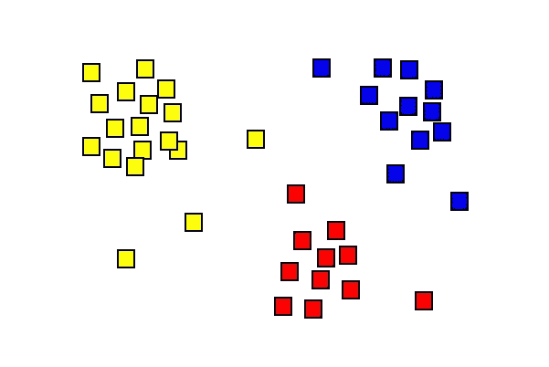
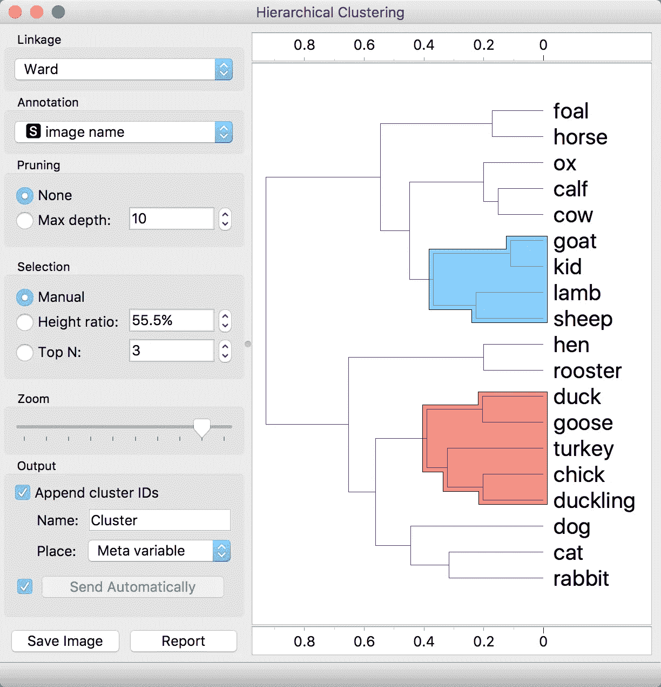
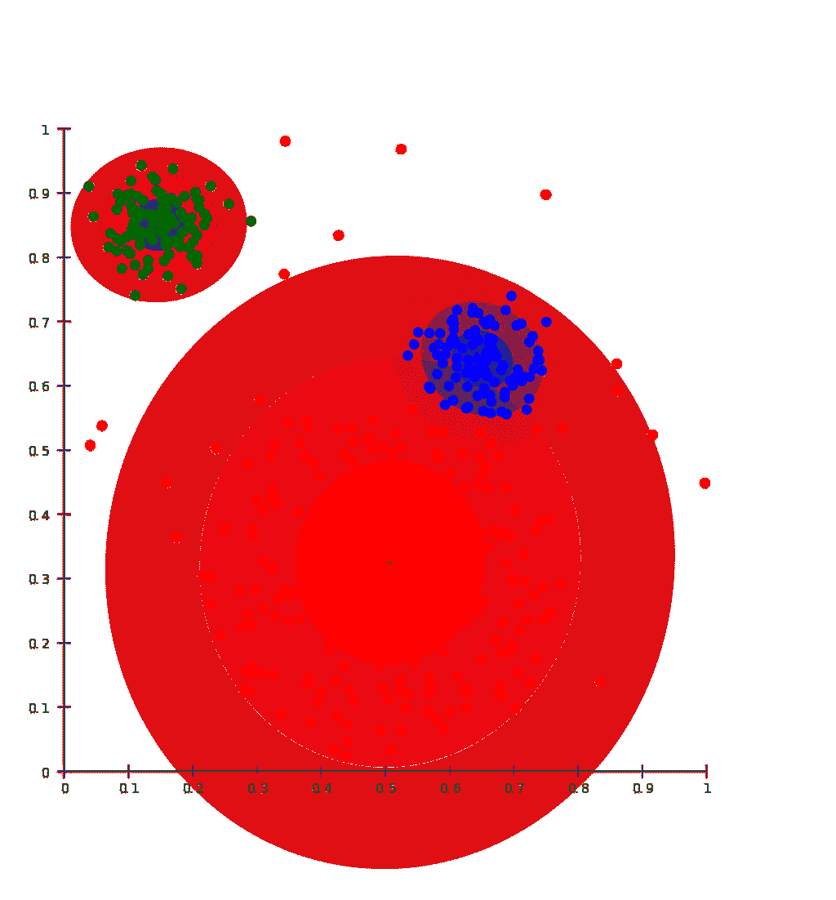
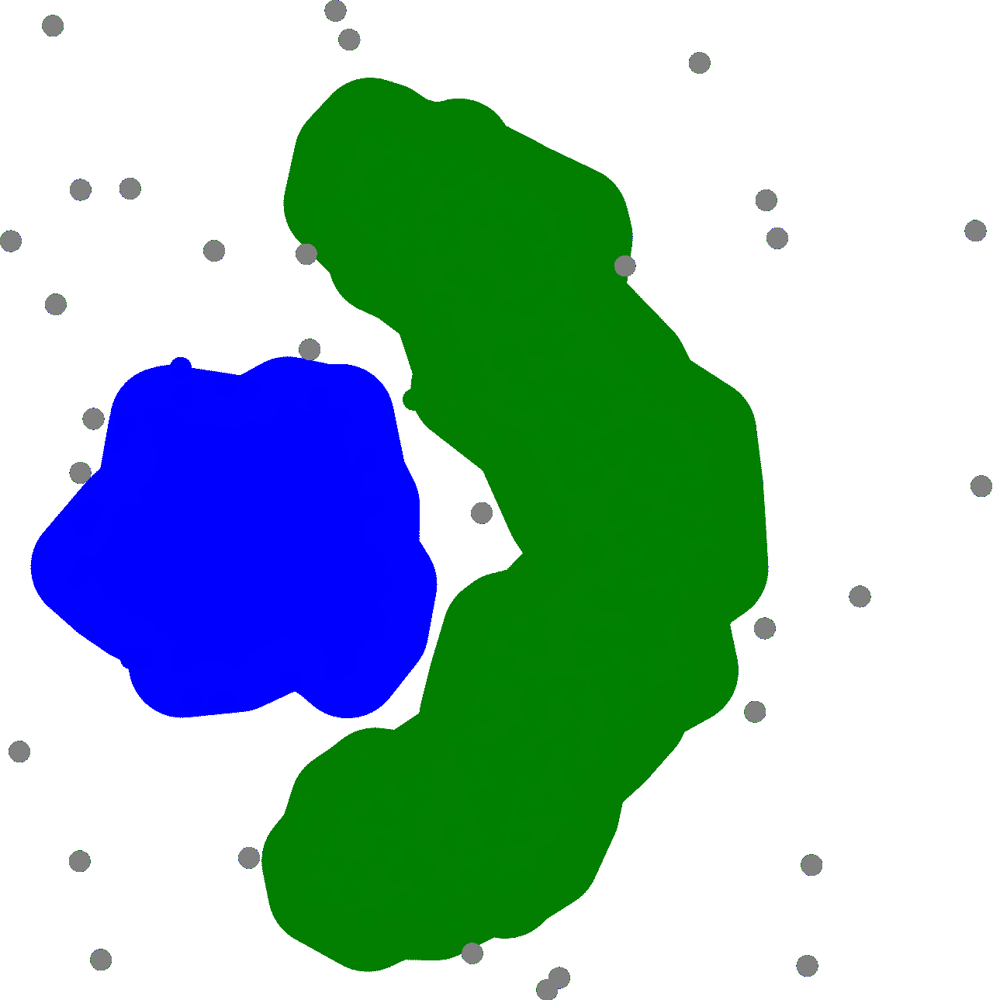

# 聚类算法基础及其 Python 实现

> 原文：<https://towardsdatascience.com/clustering-algorithm-fundamentals-and-an-implementation-in-python-31a482592b04>

## 创建包含相似元素的数据组的无监督过程

伊恩·杜利在 [Unsplash](https://unsplash.com/s/photos/assortment?utm_source=unsplash&utm_medium=referral&utm_content=creditCopyText) 上拍摄的照片

# 什么是集群？

聚类是一种可以通过创建有意义的组或簇来帮助机器学习工程师理解未标记数据的方法。这通常会揭示数据中的模式，这可能是机器学习中有用的第一步。由于您正在处理的数据是未标记的，**聚类**是一项无监督的机器学习任务。

通过一个称为**相似性度量**的度量标准，数据根据彼此的相似性被分类成组，其中用于找出数据集中对象的相似程度。为了计算这种相似性度量，使用数据集中对象的特征数据**。为每个集群提供一个**集群 ID** ，这是一个强大的集群应用。这样可以简化大型数据集，还可以将对象的整个特征集压缩到其分类 ID 中。**

**这一原则的一个简单现实例子是收集关于家庭规模和家庭收入的数据，以创建用户群，如小家庭高消费群、小家庭低消费群、大家庭高消费群和大家庭低消费群。**

# **聚类的用途**

**如今，集群被广泛应用于行业中的各种用例。其中包括搜索结果分组、社交网络分析和市场细分。聚类也用于图像分割、异常检测和医学成像。**

**扩展上面提到的集群 id 的优点，集群可以用于根据不同的特征对对象进行分组。例如，星星可以根据亮度分组，音乐可以根据流派分组。**

**在像 Google 这样的组织中，集群用于:**

*   **概化:当集群中的对象缺少要素数据时，可以从集群中的其他对象推断出它们。**
*   **数据压缩:特征数据可以完全由集群 ID 代替。这节省了存储空间并简化了特征空间。这有助于使 ML 模型训练更简单、更快速。**
*   **保护隐私:将用户分组并将他们的数据与集群 id 相关联可以防止将用户数据与特定用户相关联，从而确保用户隐私。**

****

**聚类分析的结果。来源:hellisp，公共领域，via [Wikimedia Commons](https://commons.wikimedia.org/wiki/File:Cluster-2.png)**

# **聚类算法**

**现在我们已经了解了聚类的概念，让我们看看一些常见的聚类算法。关于详尽的清单，你可以参考[这篇论文](https://link.springer.com/article/10.1007/s40745-015-0040-1)。**

## **分层聚类**

**这种方法适用于分层数据，它创建了一个聚类树。对于大多数数据集来说，标准算法太慢，因为它的时间复杂度为 O(n ),内存需求为ω(n)。然而，运行时间的减少是以内存需求为代价的，尽管内存开销在大多数情况下很难实际使用。**

****

**[Orange 数据挖掘套件](https://en.wikipedia.org/wiki/Orange_(software))中的层次聚类和交互式树状图可视化。[blazupan(橙色数据挖掘)](https://commons.wikimedia.org/wiki/File:Orange-data-mining-hierarchical-clustering.png)， [CC BY-SA 4.0](https://creativecommons.org/licenses/by-sa/4.0) ，通过维基共享**

## **基于分布的聚类**

**在这些算法中，假设数据属于不同的分布。然后，集群被定义为那些包含相似分布的对象的集群。一个缺点是基于分布的聚类容易过度拟合。因此，必须对模型的复杂性加以限制。**

**下图显示了一个示例，其中数据被聚类为三个高斯分布。较暗的颜色更接近分布的中心，条带显示数据属于某个分类的概率强度。随着到中心的距离增加，数据属于该聚类的可能性将降低。**

**如果您没有关于数据集分布类型的信息，此算法可能不是最好的。**

****

**基于高斯分布的聚类。由 Chire-Own 工作， [CC BY-SA 3.0](https://commons.wikimedia.org/w/index.php?curid=17085713) ，通过维基共享**

## **基于密度的聚类**

**这些算法通过连接包含高密度对象的区域来创建聚类。它要求密集区域是可连接的，并且根据设计，离群值不会被分配给聚类。一个缺点是基于密度的聚类算法在处理更高维度以及具有不同密度的数据时面临困难。**

****

**使用 [DBSCAN](https://en.wikipedia.org/wiki/DBSCAN) 算法对基于密度的数据集进行聚类分析。 [Chire](https://commons.wikimedia.org/wiki/File:DBSCAN-density-data.svg) ， [CC BY-SA 3.0](https://creativecommons.org/licenses/by-sa/3.0) ，通过维基共享**

## **基于质心的聚类**

**这种形式的聚类将数据分组到非分层分区中。虽然这些类型的算法是有效的，但它们对初始条件和异常值很敏感。最常用的基于质心的算法称为 k-means，其中 k 是定义聚类数量的超参数。**

**K-means 提供了一些优势，例如扩展到大型数据集的能力、易于实现以及适应新数据。另一方面， *k* 值必须费些力气手动找到，并且质心会被离群值拖动。考虑在聚类之前移除离群值是有益的。**

**给定一组 n 个数据点，k-means 算法的目标是将它们分成 k 个组，其中每个组包含相似的数据点。为了做到这一点，我们首先需要选择一个数字 k，然后我们开始随机分配每个点到它最近的聚类中心。接下来，计算每个数据点与其指定中心之间的距离。然后，我们重复上述步骤，直到没有进一步的变化发生。一旦我们完成了距离和中心的计算，我们返回到步骤 1 并重新计算聚类。这种情况一直持续到集群没有变化。此时，我们知道我们的集群是稳定的。**

# **k 均值算法的实现**

**现在，让我们实现上面讨论的算法之一，并可视化产生的集群。为此，我们将使用 k-means 算法和 scikit-learn。该代码受 [scikit-learn examples](https://scikit-learn.org/stable/auto_examples/cluster/plot_kmeans_digits.html#sphx-glr-auto-examples-cluster-plot-kmeans-digits-py) 提供的手写数字数据 K-Means 聚类演示的启发，并包含其中的代码。**

**实现 k 均值。包含来自 [scikit-learn 示例](https://scikit-learn.org/stable/auto_examples/cluster/plot_kmeans_digits.html#sphx-glr-auto-examples-cluster-plot-kmeans-digits-py) ( [BSD 许可证](https://github.com/scikit-learn/scikit-learn/blob/main/COPYING))的代码**

**输出如下图所示。**

****

**结果图是从上面的代码中产生的。**

**除了 k-means 算法之外，scikit-learn 库还提供了其他几种算法，可以根据您所拥有的数据来使用。这些算法包括:**

*   **亲和传播**
*   **凝聚聚类**
*   **桦树**
*   **基于密度的噪声应用空间聚类**
*   **k 均值**
*   **小批量 K 均值**
*   **光学**
*   **谱聚类**
*   **高斯混合**

**请记住，没有固定的算法可以提供最好的结果。您必须运行受控实验，以确定最适合您正在处理的数据集的算法。**

**如果您想更深入地研究所提供的算法，scikit-learn 集群 API 是一个很好的起点。**

# **结论**

**在本文中，我们研究了集群、其用途以及一些常用的集群算法类型。我们还研究了它们的优缺点，以及一些算法与其他算法相比的闪光点。最后，我们看了一个如何进行 k 均值聚类的编码示例。我希望这些信息对你有用。请在下面的评论区告诉我你的想法和问题。**