# 基于聚类的运行风力发电机数据预处理

> 原文：<https://towardsdatascience.com/clustering-based-data-preprocessing-for-operational-wind-turbines-268e231d90a>

## 创建资产组的有效数据科学方法

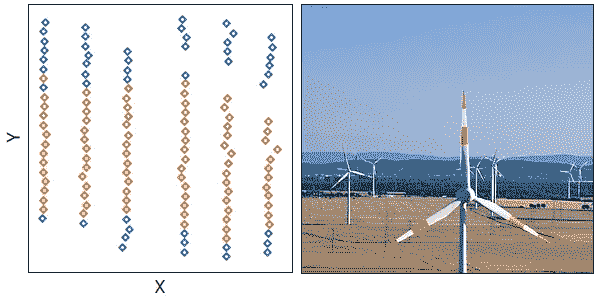

左:涡轮集群(图片由作者提供)。右图:照片由菲利普·梅(Philip May)通过[维基媒体](https://commons.wikimedia.org/wiki/File:Windpark-Wind-Farm.jpg)提供

## 介绍

运行风力涡轮机产生数据流，同时产生清洁和可再生的电力供我们日常使用。数据是环境、机械和生产变量的时间序列，使用监控和数据采集(SCADA)系统获得。

风能分析通常需要对 SCADA 数据进行预处理，包括识别哪些涡轮机可被视为“邻居”。其中邻居的概念取决于感兴趣的变量，例如涡轮机位置、风速、风向和功率输出。

例如，在地理上，如果两个或更多涡轮机的纬度和经度与其余涡轮机相比彼此更近，则两个或更多涡轮机可以被认为是邻居。从技术上讲，如果两个涡轮机在调查期间经历相似的风速，也可以基于风速将它们分组为邻居。

## 风力涡轮机集群的应用

对风电场中的涡轮机进行分组是一个有用的数据预处理步骤，需要相对频繁地执行，并且对于非地理变量，涡轮机之间的关系可能会随着时间而改变。风力涡轮机分组的一些有用应用包括:

*   **处理缺失和虚假数据:**识别代表给定涡轮机的一组涡轮机提供了用邻居传感器数据的平均值回填缺失或虚假数据的有效方式。这对于风速等变量尤其有用，因为风速计的可靠性相对较低。
*   **并排分析:**在该分析中，控制涡轮机通常根据产生的功率被选为试验涡轮机的代表。在涡轮机升级结束时，有必要通过将其生产与相邻涡轮机的生产进行比较来测量试验涡轮机的性能改进。在这种情况下，使用基于聚类的方法需要进一步探索，并与现有方法进行比较。
*   **组功率预测:**为了降低计算成本，功率预测模型可以针对风电场中的涡轮机组而不是针对单个涡轮机来构建。此外，与为整个农场建立单一模型相比，这种方法有望提供更准确的结果。
*   **组偏航控制:**通过对一组涡轮机实施最佳偏航控制策略，可以提高风力发电场的发电量，这些涡轮机在相对于风向的位置上是相邻的，而不是单独的。

虽然聚类技术已经用于风能分析的不同领域，如风电场功率预测和偏航控制，但本文建议将这种方法扩展到其他应用，如并排分析和处理缺失或虚假的 SCADA 数据。

## 基于聚类的 SCADA 数据分析

涡轮机分组的一种方法包括计算一台涡轮机和农场中其他涡轮机的测量值之间的平方差之和(SSD)。其中选择具有最小 SSD 的涡轮机作为邻居。这种方法在计算上非常昂贵，尤其是如果由非编程专家编写脚本的话。

对风电场中的涡轮机进行分组的另一种方法是基于感兴趣的变量使用不同涡轮机之间的相关系数。这种方法很简单，计算量也不大，但是对于处理缺失值这样的应用可能没什么用。

基于聚类的方法采用现有的公开可用的最新数据科学技术和工具。这种方法中最流行的是 K 均值聚类。该方法确保一个组中的涡轮机不仅具有最小的组内平方和，而且与其他组中的涡轮机具有最大的组间平方和。

虽然 K-Means 聚类类似于 SSD 方法，但它也针对聚类间的不相似性进行了优化，这有望提高其健壮性。此外，该方法适用于比相关系数法更广泛的风力涡轮机分析，并且可以优雅地处理多个变量。因此，这种方法对 SCADA 数据分析更有效。

此外，聚类技术在数据科学中得到了很好的研究，可以很容易地在几行代码中实现。可以探索的其他聚类方法包括分级、谱和基于密度的聚类方法。

## 案例研究:

**使用聚类统计识别涡轮机组并处理缺失的风速数据。**

在本例中，我们展示了一种高效而简单的数据科学方法，使用来自 [Sklearn](https://scikit-learn.org/stable/modules/generated/sklearn.cluster.KMeans.html) 库的 K-Means 聚类技术在风力发电场中创建涡轮机组。我们还比较了使用获得的聚类预测缺失风速数据的两种方法。

首先，让我们导入相关的库

```
# Import relevant libraries
import os
os.environ['OMP_NUM_THREADS'] = "1"import numpy as np
import pandas as pd
import matplotlib.pyplot as plt
import seaborn as snsfrom sklearn.cluster import KMeans
from sklearn.preprocessing import StandardScaler
from sklearn.metrics import mean_absolute_error, mean_absolute_percentage_errorfrom scada_data_analysis.modules.power_curve_preprocessing import PowerCurveFiltering
```

**数据**

数据集在 [Kaggle](https://www.kaggle.com/datasets/lxtann/kdd-cup-2022-baidu-wind-turbine-power) 上公开，并在必要的引用下使用。它由 134 个运行中的涡轮机组成，运行时间超过 245 天，分辨率为 10 分钟。还提供了每个单位的位置数据。数据加载如下:

```
# Load data
df_scada = pd.read_csv('wtbdata_245days.csv.zip')
df_loc = pd.read_csv('sdwpf_baidukddcup2022_turb_location.csv')
```

**数据探索**

让我们通过检查数据集的头部来确保数据被正确读取。

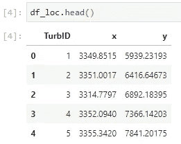

作者图片


作者图片

原始 SCADA 数据包括 470 万行和 13 列。


**数据清理**

让我们提取相关列，即涡轮机唯一标识(混浊)、天(日)、时间戳(Tmstamp)、风速(Wspd)、风向(Wdir)、机舱方向(Ndir)和功率输出(Patv)。

```
# Extract desired features
dff_scada = df_scada[['TurbID',  'Day', 'Tmstamp', 'Wspd', 'Wdir', 'Ndir', 'Patv']]
```

现在，让我们检查丢失的值并删除受影响的行。在移除缺失值之前，数据质量如下所示:

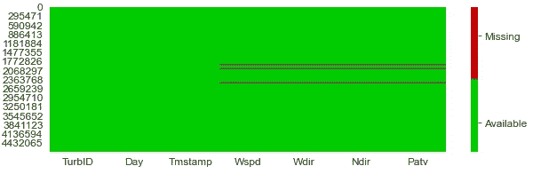

作者图片

由于缺少值，总共只有 1.05%的行被删除，新的数据质量显示如下:

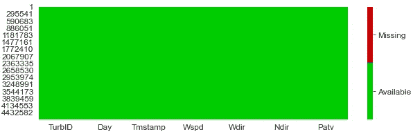

作者图片

接下来，我们创建一个唯一的日期时间字符串，用于根据需要创建变量的时间序列。

```
dff_scada['date_time'] = dff_scada[['Day', 'Tmstamp']].apply(lambda x: str(x[0]) + 'T' +str(x[1]), axis=1)
```

**数据过滤**

原始 SCADA 数据可能相当混乱，需要过滤以提取每个涡轮机的典型操作行为。我们将使用开源的 scada 数据分析库，它有一个[功率曲线过滤工具](https://pypi.org/project/scada-data-analysis/)用于这一步。这个库的 GitHub 库可以在这里找到。

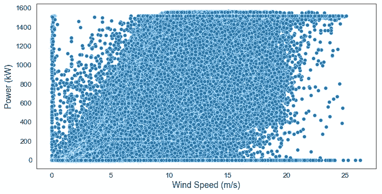

作者图片

用于数据过滤的代码和由此产生的干净的 scada 数据如下所示。首先，我们基于领域知识移除虚假数据。

```
# set parameters
cut_in_Speed = 2.85# Initial filtering of obviously spurious data
ab_ind = dff_scada[(dff_scada['Wspd'] < cut_in_speed) & (dff_scada['Patv'] > 100)].indexnorm_ind = list(set(dff_scada.index).difference(set(ab_ind)))assert len(dff_scada) == len(norm_ind) + len(ab_ind)scada_data = dff_scada.loc[norm_ind, :]
```

然后，我们使用功率曲线滤波器来去除异常运行数据。

```
# Instantiate the Power Curve Filter
pc_filter = PowerCurveFiltering(turbine_label='TurbID',                                     
windspeed_label='Wspd', power_label='Patv', data=scada_data, cut_in_speed=cut_in_speed, bin_interval=0.5, z_coeff=1.5, filter_cycle=15, return_fig=False)# Run the data filtering module
cleaned_scada_df, _ = pc_filter.process()
```

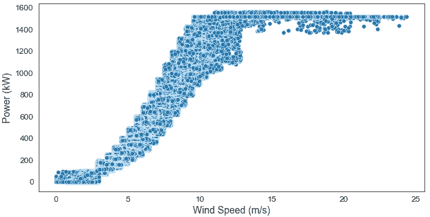

作者图片

清理后的数据有 190 万行，更能代表运行中的风力涡轮机的风速和功率输出之间的预期关系。

现在，我们创建测试数据，用于评估预测缺失值时聚类方法的性能。测试数据是从清理后的数据中随机抽取的，并且具有与原始数据集中相似的流行率(1.05 %)。

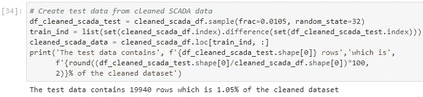

作者图片

**数据转换**

在这一步中，我们为每个期望的变量转换过滤的数据，这使它为聚类分析做好准备。风速的转换数据如下所示:

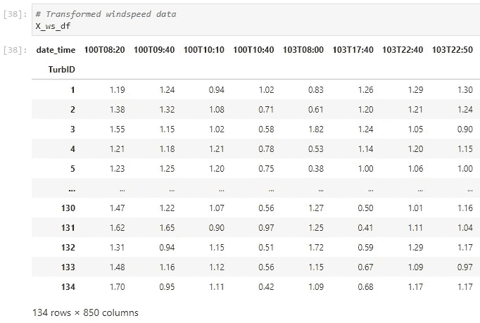

作者图片

**聚类建模**

我们希望根据风速、风向、机舱方向和功率输出对涡轮机进行分类。其思想是识别哪组涡轮机可以被认为是相邻的，并用于给定涡轮机的统计表示。

在这个例子中，我们使用 KMeans 算法。最佳聚类数的选择是建立模型的关键，为此采用了流行的肘方法。所有情况下的弯管图如下所示:

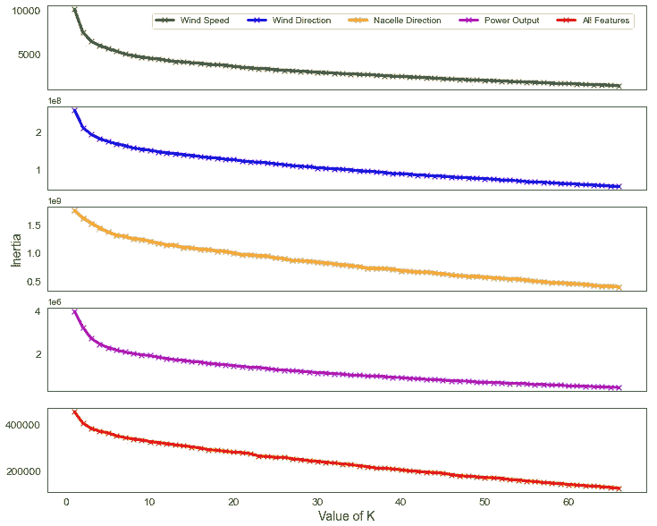

作者图片

尽管使用 4 或 5 个聚类也给出了合理的结果，但是基于单个和组合特征选择的聚类的最佳数量是 3。

我们使用 Sklearn 预处理模块中的标准缩放工具来缩放所有特征的输入数据，因为它们具有不同的数量级。

**结果**

我们创建了一个基于每个变量和所有变量组合的聚类模型，并确定了这些情况下的涡轮机组。结果如下所示:

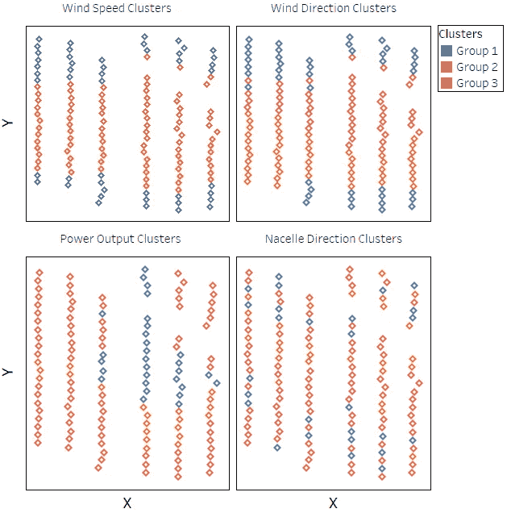

作者图片

在上面的结果中，风速和风向涡轮机集群显示出相似的模式，其中第一组中的涡轮机位于公园的边缘，这是有意义的，因为两个位置的障碍物水平都降低了，特别是如果主导风向是沿着 X 轴。此外，第 2 组和第 3 组位于公园的中间，横跨柱子(沿 X 轴)。

在功率输出聚类结果中，第 1 组涡轮机位于 X 轴的右侧，边界清晰。第 2 组涡轮机位于公园的中间，沿着 X 轴，而第 3 组涡轮机是最大的一组，主要占据公园的边缘。

机舱方向不同于其他变量，因为它很大程度上取决于应用于涡轮机的偏航逻辑，并且可能在整个现场发生变化。因此，集群没有明确的边界。然而，当结合生产数据时，这种分析可能有助于排除与偏航不对准相关的性能不佳。

使用所有特征组合的聚类结果类似于风速聚类，并显示在文章标题图片中。

**基于聚类的缺失值插补方法**

这里，我们将探讨两种基于聚类的方法来处理基于风速数据的缺失值，即朴素聚类(NC)和列敏感聚类(CSC)。这两种方法都是作者直观命名的。

*朴素聚类*

在这种方法中，给定涡轮机的缺失值被涡轮机在期望的时间戳所属的组的平均值(或中值)代替。我们将使用平均聚类值进行分析。

*对列敏感的聚类*

该方法通过仅取相同组和列中的涡轮机的平均值，扩展了朴素聚类方法。这考虑了涡轮机的地理位置的影响，并且对于诸如风速之类的变量可能尤其更准确。

**聚类模型评估**

测试数据由 19，940 行组成，包含使用聚类方法预测的缺失风速数据的地面实况。

基于训练聚类数据中的可用数据，简单聚类方法可以填充 99.7%的缺失值，而当聚类被进一步分箱成列时，由于较少的训练数据，列敏感方法只能填充 93.7%。

这两种方法都使用平均绝对误差(MAE)指标进行评估，该指标基于它们可以预测的缺失值。此外，平均绝对百分比误差(MAPE)度量用于评估非零预测。对于这两个指标，模型性能越小越好。

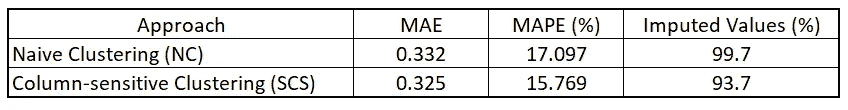

SCS 方法比基于 MAE 和 MAPE 的 NC 方法分别提高了 2%和 8%。但是，它会填充更少的缺失值。因此，两种方法的互补使用将提供更大的好处。

为了对结果进行直观的比较，我们从测试数据中随机抽取了 100 个点，如下所示:

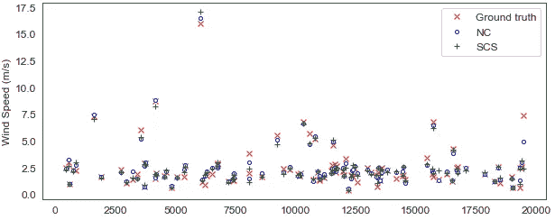

作者图片

接下来，我们设想两种方法的缺失值插补误差。插补误差是地面真实风速值和预测值之间的差值。

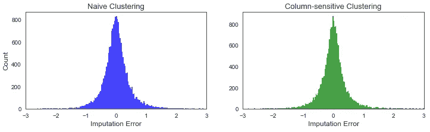

作者图片

两种方法都有良好的插补误差，插补误差关于零误差位置是对称的。

**结论**

在本文中，我们使用不同的单独变量和组合变量执行了基于聚类的 SCADA 数据预处理。此外，我们使用简单的和列敏感的聚类方法预测缺失的风速数据。最后，我们从分析中推断，这两种方法可以互补以获得更大的利益。

我希望你喜欢阅读这篇文章，直到下次。干杯！

什么更有趣？你可以通过我下面的推荐链接订阅 Medium 来获得更多我和其他作者的启发性文章，这也支持我的写作。

[](https://aolaoye.medium.com/membership)  

*不要忘了查看在可再生能源领域应用最新数据科学原理的其他故事。*

**参考文献**

周军，陆，徐，肖，苏，吕军军，马，窦，(2022)。SD wpf:2022 年 KDD 杯空间动态风力预测挑战数据集。 *arXiv* 。[https://doi.org/10.48550/arXiv.2208.04360](https://doi.org/10.48550/arXiv.2208.04360)

[风能分析工具箱:迭代功率曲线滤波器](https://medium.com/towards-data-science/wind-energy-analytics-toolbox-iterative-power-curve-filter-fec258fdb997?source=user_profile---------3----------------------------)