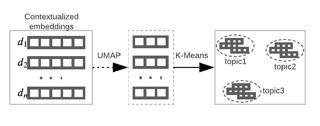
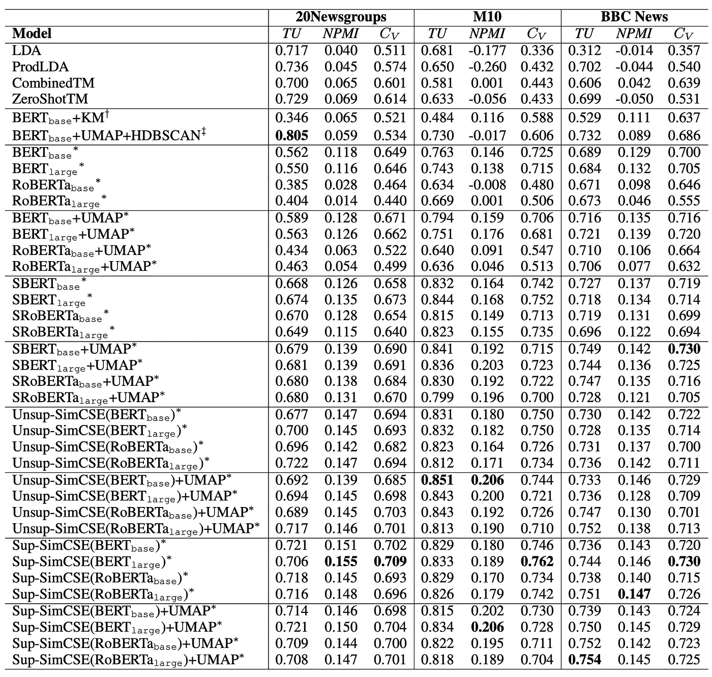
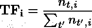
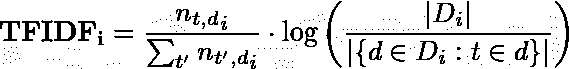
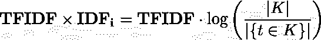
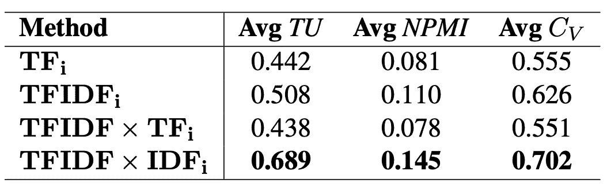

# 用于主题建模的聚类上下文嵌入

> 原文：<https://towardsdatascience.com/clustering-contextual-embeddings-for-topic-model-1fb15c45b1bd>

## 通过聚类上下文句子嵌入提取主题


在 [Unsplash](https://unsplash.com/?utm_source=unsplash&utm_medium=referral&utm_content=creditCopyText) 上由 [Luisa Denu](https://unsplash.com/@luisadenu?utm_source=unsplash&utm_medium=referral&utm_content=creditCopyText) 拍摄的照片

# TL；速度三角形定位法(dead reckoning)

我们进行了大量的实验来比较基于聚类的主题模型和传统的神经主题模型(NTMs ),展示了一种从文档中提取主题的替代方法。

查看我们的**T5 NAACL 2022论文📄" [***神经话题建模比聚类好吗？关于主题***](https://arxiv.org/abs/2204.09874)*和官方 [**Github**](https://github.com/hyintell/topicx) 的语境嵌入聚类的实证研究。***

# *范例 1:传统的主题建模*

*opic 建模是一种无监督的方法，用于提取文档中的语义主题。从传统的潜在狄利克雷分配(LDA)模型到神经网络增强的神经主题模型(NTMs ),主题建模取得了显著的进步。然而，这些主题模型通常采用词袋(BoW)作为文档表示，这限制了模型的性能。*

*后来，由各种预训练语言模型(如 BERT)产生的上下文化单词和句子嵌入出现，并在多种自然语言处理(NLP)任务中显示出最先进的结果。最近的作品如 [CombinedTM](https://aclanthology.org/2021.acl-short.96.pdf) 和 [ZeroShotTM](https://aclanthology.org/2021.eacl-main.143.pdf) ⁴将这些情境化的嵌入整合到 NTMs 中，显示出比传统 NTMs 更好的建模性能。*

*尽管结果很有希望，但是这种 NTM 遭受计算开销，并且当前将预训练的嵌入集成到 NTM 架构中是幼稚的。*

> *有了高质量的上下文化文档表示，我们真的需要复杂的 ntm 来获得连贯和可解释的主题吗？*

# *范例 2:基于聚类的主题建模*

*相反，我们探索了另一种从文档中建模主题的方法。我们使用一个简单的集群框架和上下文嵌入来进行主题建模，如下所示。*

**

*我们方法的架构。图片作者。*

*我们首先通过预先训练的语言模型对预处理的文档进行编码，以获得情境化的嵌入。之后，在应用聚类方法(例如，K-Means)来分组相似的文档之前，我们降低嵌入(例如，UMAP)的维度。每个群组将被视为一个主题。最后，我们采用加权的方法选择代表词作为主题。降低嵌入维度是可选的，但可以节省运行时间(更多细节见下文)。*

*这种基于聚类的主题建模范例并不新鲜。 [Top2vec](https://arxiv.org/abs/2008.09470) ⁵联合提取单词和文档向量，将每个密集区域的质心作为主题向量，n 个最近的单词向量作为主题词； [BERTopic](https://arxiv.org/abs/2203.05794) ⁶采用类似的方法，但是它使用提出的 c-TF-IDF 来选择每个聚类内的主题词； [Sia 等人(2020)](https://aclanthology.org/2020.emnlp-main.135/) ⁷聚类词汇级的单词嵌入，并使用加权和重新排序从每个聚类中获得顶部单词。*

*然而，上述方法忽略了最近提出的有前途的 NTMs。基于聚类的主题模型的性能还没有与传统的主题模型进行比较。*

# *我们提议的工作*

*在这里，我们介绍一下我们的 ***NAACL 2022*** 论文📄" [***神经话题建模比聚类好吗？主题***](https://arxiv.org/abs/2204.09874)*和官方 [Github](https://github.com/hyintell/topicx) 的语境嵌入聚类实证研究。据我们所知，我们是第一个使用各种基于 transformer 的模型产生的上下文嵌入来与 ntm 进行比较的。此外，我们提出了新的单词选择方法，该方法将全局单词重要性与每个聚类中的本地词频率相结合。**

**我们以`[Health News in Twitter](https://archive.ics.uci.edu/ml/datasets/Health+News+in+Twitter)` ⁰数据集(从 [UCI 机器学习库](https://archive.ics.uci.edu/ml/index.php)中检索)为例，说明 ***范式 2:基于聚类的主题建模*** 也能抽取高质量的主题。**

## **1.数据准备**

**我们首先使用 [OCTIS](https://github.com/MIND-Lab/OCTIS#datasets-and-preprocessing) 加载预处理过的数据集:**

**文档被标记化，给出了 3929 个预处理的句子:**

```
**length of documents: 3929
preprocessed documents: [
  'breast cancer risk test devised',
  'workload harming care bma poll',
  'short people heart risk greater',
  'new approach hiv promising',
  'coalition undermined nhs doctors',
  'review case nhs manager',
  'day empty going',
  'overhaul needed end life care',
  'care dying needs overhaul',
  'nhs labour tory key policies',
  ...
]**
```

## **2.把...嵌入**

**其次，我们需要将这些文档转换成矢量表示。我们可以使用任何嵌入，这里，我们使用来自 [SimCSE](https://github.com/princeton-nlp/SimCSE) 的预训练`princeton-nlp/unsup-simcse-bert-base-uncased`嵌入。**

## **3.减少和集群嵌入**

**现在，我们有了文档的嵌入表示，我们可以通过应用聚类方法将相似的文档分组在一起。减小嵌入大小可以有效地节省运行时间。**

## **4.从聚类中选择主题词**

**最后，我们可以应用加权方法从每个聚类中选择主题词:**

**推特中*健康新闻设置 5 个话题时的评价是:***

```
**num_topics: 5 td: 1.0 npmi: 0.106 cv: 0.812**
```

**示例主题包括:**

```
**Topic:
0: ['nhs', 'amp', 'care', 'hospital', 'health', 'mental']
1: ['ebola', 'vaccine', 'flu', 'liberia', 'leone', 'virus']
2: ['dementia', 'obesity', 'alzheimer', 'diabetes', 'brain', 'disabled']
3: ['cancer', 'heart', 'breast', 'surgery', 'transplant', 'lung']
4: ['cigarette', 'cigarettes', 'pollution', 'smoking', 'sugar', 'drug']**
```

**我们可以看到 ***范式 2:基于聚类的主题建模*** 发现的主题也可以是高度连贯和多样的，虽然文档的长度相对较短。尽管所有话题都是关于健康的，但我们可以区分话题 1 是关于传染性病毒和疾病的，话题 2 是关于疾病症状的，等等。**

**为了进行比较，我们还使用 [CombinedTM](https://github.com/MilaNLProc/contextualized-topic-models) ，一个 ***范例 1:基于常规主题建模*** 的模型来提取 Twitter 数据集中相同的*健康新闻。我们使用相同的`princeton-nlp/unsup-simcse-bert-base-uncased`嵌入。***

**对推特中*健康新闻的评价在设置 5 个话题时分别是:***

```
**num_topics: 5 td: 1.0 npmi: -0.267 cv: 0.401**
```

**示例主题包括:**

```
**Topic:
0: ['cancer', 'amp', 'drug', 'death', 'audio', 'test']
1: ['food', 'obesity', 'cigarette', 'smokers', 'link', 'smoking']
2: ['ebola', 'mers', 'liberia', 'vaccine', 'malaria', 'virus']
3: ['babies', 'brain', 'sperm', 'man', 'human', 'cell']
4: ['nhs', 'health', 'mental', 'care', 'staff', 'hospital']**
```

**我们可以看到，一些主题是不连贯的，例如，主题 0 和 3。**

**我们总结了基于聚类的主题建模的发现。**

## **直接聚类高质量的嵌入可以产生好的主题。**

**实验表明，高质量的嵌入对于基于聚类的主题建模至关重要。我们实验了不同的嵌入，包括伯特、[罗伯塔](https://arxiv.org/abs/1907.11692) ⁸、[辛姆塞](https://arxiv.org/abs/2104.08821) ⁹等。，基于三个不同长度的数据集。对 RoBERTa 进行聚类得到的结果与上下文化的 ntm 相似或更差，这表明嵌入质量很重要。**

> **最近的 [**DiffCSE**](https://github.com/voidism/diffcse) 在某些数据集上可以达到略高的性能！**

****

**前 10 个词的主题连贯性(NPMI 和 CV)和主题多样性(TU)的不同嵌入。图片由[纸](https://arxiv.org/abs/2204.09874)**

## **选词方法至关重要。**

**一旦我们有了一组聚类的文档，选择有代表性的主题词对于识别主题的语义是至关重要的。与以前提出的方法不同，我们捕获每个聚类中的全局词重要性和本地词频率，并比较 4 种不同的方法:**

****

**图片作者。**

****

**图片作者。**

****

**图片作者。**

****

**图片作者。**

**我们发现，在所有方法中，TFTDF × IDFᵢ取得了明显更好的结果。这表明 TFIDF 标记出整个语料库中每个文档的重要单词，而 IDFᵢ惩罚多个簇中的常见单词。相反，其他三种方法忽略了一个聚类中的频繁词也可能在其他聚类中流行，因此选择这样的词导致低主题多样性。**

****

**不同主题词选择方法的比较。图片由[论文](https://arxiv.org/abs/2204.09874)**

## **嵌入维度对主题质量的影响可以忽略不计。**

**在聚类之前，我们应用 UMAP 来降低句子嵌入的维数。我们发现，在聚类之前降低维数对性能的影响可以忽略不计，但可以节省运行时间。**

# **用法示例**

**如 [Github](https://github.com/hyintell/topicx) 中所述，你可以从`[tfidf_idfi, tfidf_tfi, tfidfi, tfi]`中选择一种选词方法。如果您不想使用 UMAP 减少嵌入维数，只需设置`dim_size=-1`。您可以训练模型，并获得评估结果和主题:**

**预期的输出应该类似于:**

# **结论**

**在这篇文章中，我们介绍了一种基于聚类的方法，只要使用高质量的上下文嵌入，就可以产生值得称赞的主题，以及一种合适的主题词选择方法。与神经主题模型相比,
基于聚类的模型更加简单、高效，并且对各种文档长度和主题数量更加鲁棒，这可以作为一种替代方案
应用于某些情况。**

**[1]:大卫·M·布雷，安德鲁·吴和迈克尔一世·乔丹。2003.潜在狄利克雷分配。机器学习研究杂志，3:993–1022。**

**[2]: Devlin，j .，Chang，M.W .，Lee，k .和 Toutanova，k .，2018。Bert:用于语言理解的深度双向转换器的预训练。 *arXiv 预印本 arXiv:1810.04805* 。**

**[3]:比安奇，女，特拉尼，s 和霍维，d，2020。预训练是一个热门话题:语境化的文档嵌入提高了主题的连贯性。arXiv 预印本 arXiv:2004.03974 。**

**[4]:比安奇，f .，特拉尼，s .，霍维，d .，诺扎，d .，费尔西尼，e .，2020。零镜头学习的跨语言语境化主题模型。arXiv 预印本 arXiv:2004.07737 。**

**[5]:安杰洛夫特区，2020 年。Top2vec:主题的分布式表示。 *arXiv 预印本 arXiv:2008.09470* 。**

**[6]:格罗腾多斯特，m，2022。BERTopic:使用基于类的 TF-IDF 过程的神经主题建模。 *arXiv 预印本 arXiv:2203.05794* 。**

**[7]: Sia，s .，Dalmia，a .和 Mielke，S.J .，2020。厌倦了话题模型？预先训练的单词嵌入集群也是快速和良好的主题！。arXiv 预印本 arXiv:2004.14914 。**

**[8]:刘，y .，奥特，m .，戈亚尔，n .，杜，j .，乔希，m .，陈，d .，列维，o .，刘易斯，m .，泽特勒莫耶，l .，斯托扬诺夫，v .，2019。Roberta:稳健优化的 bert 预训练方法。 *arXiv 预印本 arXiv:1907.11692* 。**

**[9]:高，汤，姚，陈，2021。Simcse:句子嵌入的简单对比学习。 *arXiv 预印本 arXiv:2104.08821* 。**

**[10]:卡拉米，a .，甘戈帕迪亚，a .，周，b .，&哈拉齐，H. (2017)。健康和医学语料库中的模糊方法主题发现。国际模糊系统杂志，1–12。**

**[11]: Dua，d .和 Graff，C. (2019)。UCI 机器学习知识库[http://archive . ics . UCI . edu/ml]。加州欧文:加州大学信息与计算机科学学院。**

**[12]:张，z，方，m，陈，l .，&纳马齐-拉德，M. R. (2022)。神经主题建模比聚类好吗？基于主题上下文嵌入的聚类实证研究。 *arXiv 预印本 arXiv:2204.09874* 。**