# 混合数据类型上的聚类

> 原文：<https://towardsdatascience.com/clustering-on-mixed-data-types-5fe226f9d9ca>

## 利用高尔相和 HDBSCAN

资料来源:Unsplash。

聚类是一种无监督的机器学习技术，旨在将相似的数据点分组到不同的子组中。通常，用于这种分组的距离度量对于数值数据是*欧几里德距离*，对于分类数据是*雅克卡距离*。大多数聚类算法也是为数字或分类数据显式设计的，但不是同时为两者设计的。在本文中，我将概述一种通过利用一种称为高尔相异度的距离度量来对混合数据进行聚类的方法。虽然各种聚类算法可以将预先计算的距离度量作为输入，但我将使用 HDBSCAN，因为它对异常值具有鲁棒性，并且能够识别有噪声的数据点。

# 数据集和预处理

为了说明，我使用公开可用的[泰坦尼克号测试数据集](https://www.kaggle.com/competitions/titanic/data?select=test.csv)。高基数要素(主要是每个乘客独有的要素，如 *PassengerId* 、 *Name* 和 *Cabin* )以及任何包含 nan 的行和包含超过 50% nan 的列都已从数据集中移除。为了简单和更好的可视化，只使用了 30%数据的随机部分。

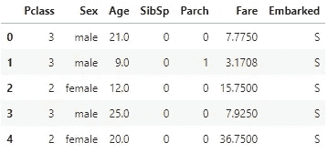

预处理的 Titanic 测试数据集的随机样本。

# 高尔不同

[高尔相异度( *GD* )](https://www.jstor.org/stable/2528823) 是表示两个样本差异程度的度量。度量范围从 0 到 1，0 表示无差异，1 表示最大差异。它是基于任意两个样本的部分相似性来计算的。部分相似性( *ps* )根据数据类型是数值型还是分类型进行不同的计算。对于分类数据，如果值相同，ps = 1，如果值不同，ps = 0。对于数值数据， *ps* 计算如下:

首先，确定特征列的范围。

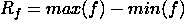

第二， *ps* 是对数据中任意两个样本计算的。

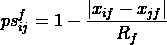

第三，高尔相似度( *GS* )是通过取所有部分相似度的算术平均值来计算的。

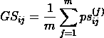

最后，通过从 1 中减去相似性度量( *GS* )来将其转换成距离度量( *GD* )。

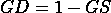

## 视觉插图

为了更好地说明，让我们再次查看预处理数据的前五行:

预处理的 Titanic 测试数据集的随机样本。

查看第 0 行和第 3 行，人们会立即意识到这两行非常相似，只有在*年龄*和*费用*上略有不同。因此，我们预计 *GD* 会非常低(接近于零)。其实准确的 *GD* 是 0.0092(见下图)。更不相似的样本，如第 0 行和第 2 行，具有更大的距离值，在本例中为 0.24。

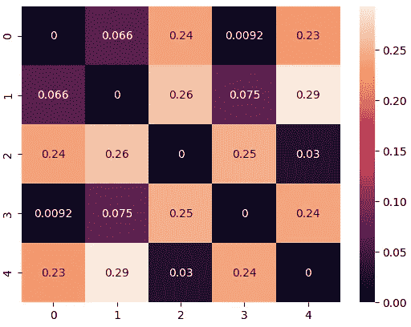

上面概述的样本的相应高尔距离矩阵。

我们整个预处理数据集的 *GD* 矩阵如下所示:

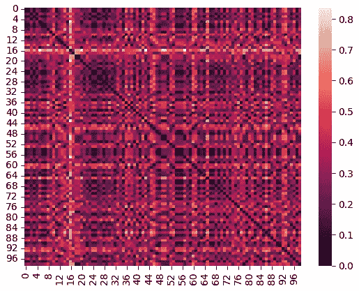

整个预处理测试数据集的高尔距离矩阵。

# 使聚集

作为聚类算法，我选择了 [HDBSCAN](https://hdbscan.readthedocs.io/en/latest/how_hdbscan_works.html) (针对有噪声的应用的基于层次密度的空间聚类)。HDBSCAN 擅长识别高密度集群，计算效率高，对异常值具有鲁棒性。

设置了两个参数来运行 HDBSCAN。影响聚类结果的主要参数是*最小聚类大小*。这是指被视为一个组或簇的最小数量的数据点。可以设置一个附加参数 *min_samples* 来控制分类为噪声的数据。该值越低，归类为噪声的数据点就越少。在该示例中，*最小聚类大小*被设置为 6，而*最小样本数*被设置为 1。

这些参数可以使用集群质量度量进一步调整，例如[基于密度的集群验证(DBCV)](https://github.com/christopherjenness/DBCV) 分数。然而，为了简洁起见，本文省略了这一点。

# 形象化

为了可视化结果，应用了 2D [t 分布随机邻居嵌入](https://scikit-learn.org/stable/modules/generated/sklearn.manifold.TSNE.html) (t-SNE)投影。

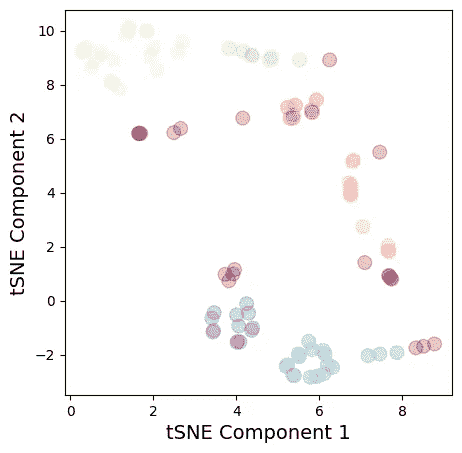

HDBSCAN 输出 6 个不同的簇和一个被视为噪声的簇(暗红色)。

让我们通过可视化其中一些集群的值来看看这些分组的质量。

**紫色集群**

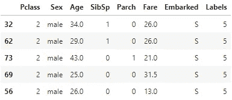

组成紫色集群的数据点样本。

**黄色集群**

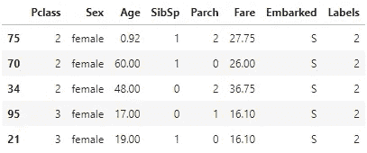

组成黄色聚类的数据点样本。

**绿色集群**

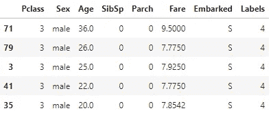

组成绿色聚类的数据点样本。

**噪声集群**

正如所料，归类为噪声的样本彼此非常不同:

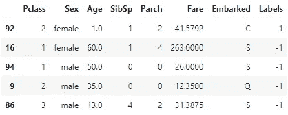

组成噪声群的数据点的样本。

# 结论

在本文中，我演示了如何对混合类型的数据进行聚类，方法是首先计算高尔距离矩阵，然后将其输入 HDBSCAN。结果表明，对于所使用的数据，该方法在将相似的数据点分组在一起方面表现得相当好。然而，这不是一个适用于所有混合数据类型的通用方法，最终使用的方法将取决于手头的数据。例如，HDBSCAN 要求集群内的密度一致，集群之间的密度下降。如果没有，就需要考虑其他方法。