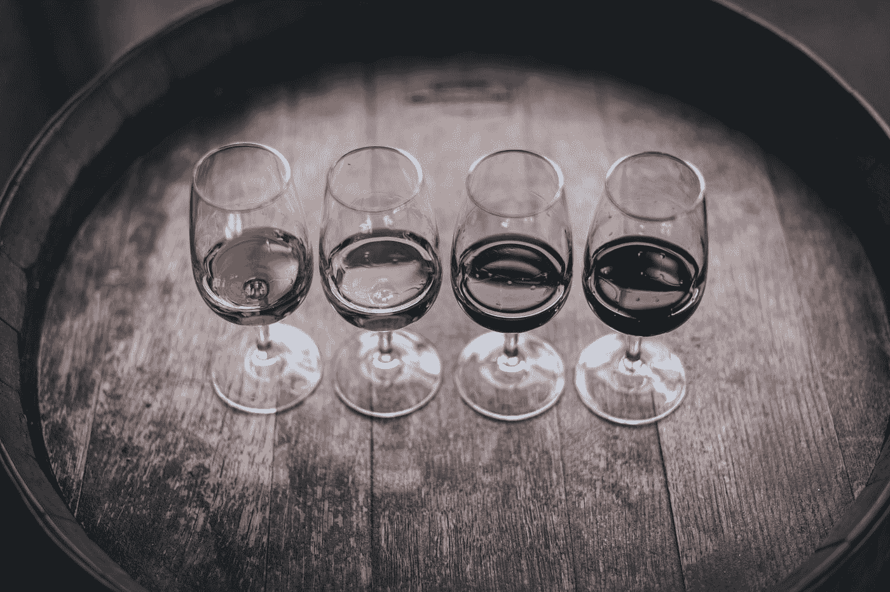
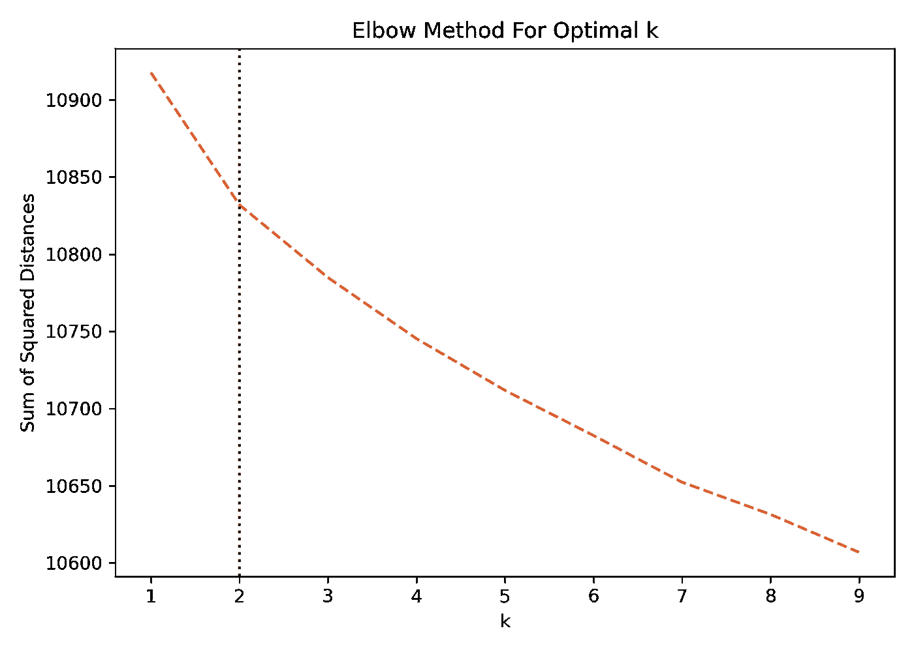

# 如何利用机器学习自动检测文本中的模式

> 原文：<https://towardsdatascience.com/clustering-text-with-k-means-c2953c8a9772>

## 用 k-Means 聚类葡萄酒评论



Maksym Kaharlytskyi 在 [Unsplash](https://unsplash.com?utm_source=medium&utm_medium=referral) 上的照片

# 什么文本聚类？

在上一篇文章中，我们谈到了[主题建模](https://medium.com/data-knows-all/topic-models-with-gensim-97f358ad4151)或者从文档语料库中识别几个主题的方法。这里使用的方法是潜在的狄利克雷分配或 LDA。在本文中，我们将执行类似的任务，但通过**无监督的机器学习**方法**聚类**。虽然方法不同，但结果是几组(或主题)彼此相关的单词。

对于这个例子，我们将使用来自 [Kaggle](https://www.kaggle.com/zynicide/wine-reviews) 的葡萄酒评论数据集。它包含了超过 100，000 种不同的全球葡萄酒评论。作为品尝笔记的葡萄酒描述是基于文本的变量，我们将使用它来聚类和解释结果。

从导入所需的库开始。

**注**:这里不打算展示文本的预处理。你可以在 [GitHub](https://github.com/broepke/TextClustering) 上看到完整的代码。还有一篇关于[文字清理](https://medium.com/data-knows-all/text-cleaning-for-nlp-in-python-2716be301d5d)的完整文章可以参考。

```
from sklearn.feature_extraction.text import TfidfVectorizer
from sklearn.cluster import KMeans
from sklearn.metrics import silhouette_score

import matplotlib.pyplot as plt
import seaborn as sns
%matplotlib inline
```

# 文本矢量化

向量化文本是将文本**文档**转换成数字表示**的过程。这有不同的版本，例如**单词袋** (BoW)，以及**术语频率-逆文档频率** (TF-IDF)，我们将在这里使用。**

*   **BoW 或 TF** :表示每个文档中每个单词的计数。在这种情况下，文档记录了我们所针对的列的数据集中的观察结果。
*   TF-IDF :它不是只计算单词的数量，而是反过来，给那些出现频率较低的单词更高的权重。常见单词具有较低的权重，而可能更特定于领域且出现较少的单词将具有较高的权重。

创建 **TF-IDF** ，创建矢量器的一个实例，然后`fit-transform`数据框的列是非常容易的。

```
vectorizer = TfidfVectorizer()
X = vectorizer.fit_transform(df['description_clean'])
```

# 确定最佳聚类数

我上面提到聚类是一种**无监督**的机器学习方法。无监督意味着我们的数据集中没有告诉我们正确答案的信息；这通常被称为**标记数据**。在我们的例子中，我们不知道文本中有多少不同类型的酒或不同的主题。然而，仅仅因为我们不知道这些信息，并不意味着我们不能找到正确的集群数。

有了聚类，我们需要初始化几个**聚类中心**。这个数字被输入到模型中，然后在结果输出后，具有数据知识的人可以解释这些结果。然而，有一些方法可以评估哪一个是正确的聚类中心数量，我将介绍两种常用的方法。

# 肘法

第一种称为**肘法**。该名称源自运行此分析后的图形外观。理想情况下，我们在寻找曲线开始变平的点。这种方法使用`inertia`来确定簇的数量。惯性是从每个点到聚类中心的距离的平方的总和。我们可以对一系列不同的聚类值进行计算，绘制它们，并寻找**弯头**。

```
Sum_of_squared_distances = []
K = range(1,10)
for k in K:
    km = KMeans(init="k-means++", n_clusters=k)
    km = km.fit(X)
    Sum_of_squared_distances.append(km.inertia_)

ax = sns.lineplot(x=K, y=Sum_of_squared_distances)
ax.lines[0].set_linestyle("--")

# Add a vertical line to show the optimum number of clusters
plt.axvline(2, color='#F26457', linestyle=':')

plt.xlabel('k')
plt.ylabel('Sum of Squared Distances')
plt.title('Elbow Method For Optimal k')
plt.show()
```

在绘制数据后，肘形并不明显，但最佳近似是在 2 个集群处，我们在曲线中看到一个*轻微扭结*。我画了一条垂直线来识别它。



作者图片

# 剪影分数

另一种计算最佳聚类中心的方法是**轮廓系数**。使用每个样本的平均聚类内距离和平均最近聚类距离来计算轮廓系数。换句话说，样本和样本不属于的最近聚类之间的距离。

最好的值是`1`，最差的是`-1`。`0`附近的值表示重叠的簇。负值通常表示样本被分配到了错误的分类，因为不同的分类与其被分配的分类更相似。让我们也为不同的聚类中心值计算这些分数。

```
def get_silhouette_score(X, k):
    for n_clusters in range(2, k):
        clusterer = KMeans(init="k-means++", n_clusters=n_clusters, random_state=42)
        y = clusterer.fit_predict(X)

        message = "For n_clusters = {} The average score is: {}"
        print(message.format(n_clusters, silhouette_score(X, y)))

get_silhouette_score(X, 10)
```

```
For n_clusters = 2 The average score is: 0.00821919113279018
For n_clusters = 3 The average score is: 0.006522933295313797
For n_clusters = 4 The average score is: 0.006237960319271207
For n_clusters = 5 The average score is: 0.006266850309331783
For n_clusters = 6 The average score is: 0.006381665959703946
For n_clusters = 7 The average score is: 0.005549433908077499
For n_clusters = 8 The average score is: 0.005962146586290015
For n_clusters = 9 The average score is: 0.00632540099660495
```

根据定义，最接近`1`的数字是最好的，在我们的例子中是`2`簇。但是，这些值接近于零，这意味着我们的聚类有很高的重叠。

虽然这两种方法都不能让我们理想地了解集群的数量，但是我们应该使用，两者都指向`2`作为最佳值。

# k-均值聚类

好吧！我们准备好构建模型并检查结果。这个过程非常简单，我们将重复上面所做的大部分工作，但是只对我们选择的集群数量进行一次运行。

对于这个例子，我们将使用 k-Means。k-Means 是最常见的聚类算法之一，如果不是最常见的话。通常，k-Means 会随机初始化聚类中心，然后迭代，直到找到理想的位置。指定`init="k-means++"`意味着我们将使用 k-means++算法来初始化集群中心，这是 2007 年提出的一种减少随机初始化问题的方法。首先，我建议使用这个工具，并稍微阅读一下它是如何工作的。

```
# Set the number of clusters
k = 2
# Vectorize the text
vectorizer = TfidfVectorizer()
X = vectorizer.fit_transform(df['description_clean'])
# Fit our Model
model = KMeans(init="k-means++", n_clusters=k, max_iter=25, n_init=1)
model.fit(X)
```

您可以将聚类分配保存为数据框中的新列，其中包含聚类编号，以供将来参考。

```
# Get the cluster labels
clust_labels = model.predict(X)
cent = model.cluster_centers_

kmeans_labels = pd.DataFrame(clust_labels)
df.insert((df.shape[1]),'clusters',kmeans_labels)
```

最后，让我们构建一个快速数据框，显示两个集群中的前`15`个单词，看看我们得到了什么。

```
order_centroids = model.cluster_centers_.argsort()[:, ::-1]
terms = vectorizer.get_feature_names_out()

results_dict = {}

for i in range(k):
    terms_list = []

    for ind in order_centroids[i, :15]:  
        terms_list.append(terms[ind])

    results_dict[f'Cluster {i}'] = terms_list

df_clusters = pd.DataFrame.from_dict(results_dict)
df_clusters
```

```
Cluster 0   Cluster 1
0   pineapple      cherry
1      flavor      flavor
2     acidity         dry
3     vanilla  blackberry
4       fruit      tannin
5         oak        cola
6       crisp   raspberry
7        pear     currant
8       apple        good
9       peach        rich
10       lime        soft
11     butter       spice
12      toast        show
13      sweet         oak
14      lemon       sweet
```

看看集群`0`，我们看到的单词通常与**白**酒相关，集群`1`与**红**酒相关。

# 预测新文档

接下来，我们可以看到该模型如何对过去没有的新葡萄酒评论进行聚类。我用白葡萄酒和红葡萄酒可能与之相关的词造了几个句子。

```
new_docs = ['Rich deep color of oak and chocolate.',
            'Light and crisp with a hint of vanilla.',
            'Hints of citrus and melon.',
            'Dark raspberry and black cherry flavors.']

pred = model.predict(vectorizer.transform(new_docs))
print(pred)
```

```
[1 0 0 1]
```

正如我们所料，红酒被归类为`1`，白酒被归类为`0`！你可以试试其他的弦，看看它的表现如何。

# 结论

第一次在这个数据集上执行聚类时，我真的被震惊了。显而易见，通过`2`聚类，算法可以识别和聚类红葡萄酒和白葡萄酒。这感觉有点像魔术，但最终，这只是数学！享受这个过程。它功能强大，可以帮助你识别文本中相关的主题组！

如果你喜欢阅读这样的故事，并想支持我成为一名作家，可以考虑报名成为一名媒体成员。一个月 5 美元，让你可以无限制地访问成千上万篇文章。如果你使用[我的链接](https://medium.com/@broepke/membership)注册，我会赚一小笔佣金，不需要你额外付费。