# CLVTools:评估客户的强大 R 包

> 原文：<https://towardsdatascience.com/clvtools-a-powerful-r-package-to-evaluate-your-customers-4fd1781811d>

## 客户的终生价值对企业来说是一种无价的战略工具

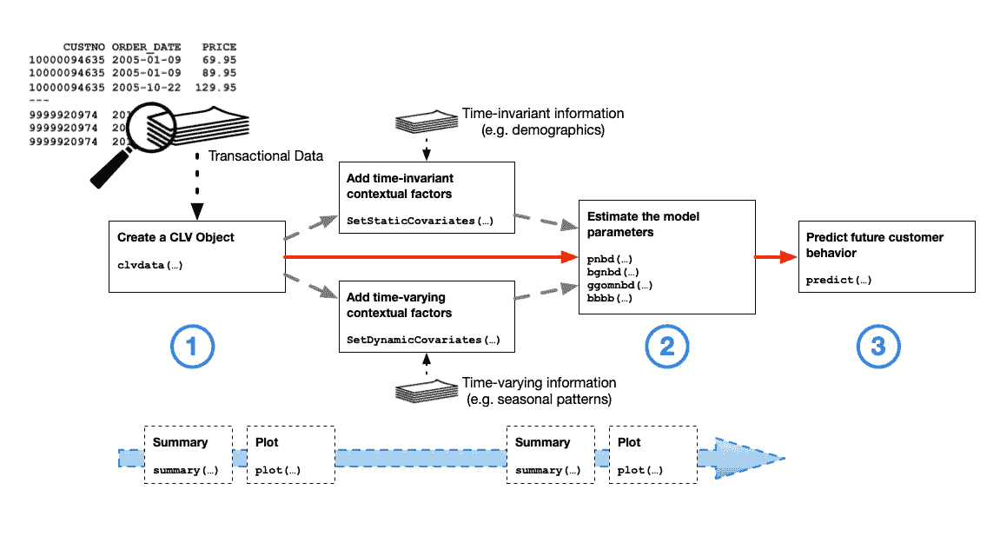

包装使用说明。来源:作者。

在这篇与 Patrick Bachmann 共同撰写的文章中，我们浏览了广泛的 R 包“CLVTools”，其中包括一些最知名的模型的便捷实现，以估计客户终身价值(CLV 或 LTV，这里以[为例介绍](https://7startupadvisory.medium.com/customer-lifetime-value-clv-and-other-startup-metrics-every-founder-must-know-17528e021f7a))。这篇文章是基于在找到的[这个包的相当详细的预排。还有一个(更老的)youtube 视频](https://www.clvtools.com/articles/CLVTools.html)[提供了进一步的解释。](https://www.youtube.com/watch?v=KJCYjjWNgLM)

我们将主要关注 ParetoNBD 模型及其扩展，在关于 LTV 的文献中，它被视为一种黄金标准。该模型假设交易以所谓的“泊松过程”发生，并且客户是(I)异质的，(ii)可以在任何时间购买，以及(iii)可以在任何时间结束他们与公司的关系。情况(iii)被认为是永久性的，一旦你失去了一个客户，他们就不会回来了。因此，除了交易或泊松过程之外，一个单独的过程被建模来表示客户的“生命周期”。这是这类模型中的一个典型主题，因此人们通常将事务过程和生命周期或损耗过程区分开来。

因为这个模型有点复杂，它的表亲 BG-NBD 模型经常被考虑，例如在这个[帖子](https://medium.com/bolt-labs/understanding-the-customer-lifetime-value-with-data-science-c14dcafa0364)中。不同之处在于，BG-NBD 模型在本质上更加离散——特别是，客户只能在交易后直接变得不活跃(而在帕雷顿 BD 模型中，他们可以在任何时候变得不活跃)。这在某些情况下可能是可取的，但在(许多)其他情况下就不那么可取了。


CLVTools 中包含的模型概述。来源:经过作者许可，此处的演练。

关于模型本身已经说得够多了，我们如何将它们与 CLVTools 结合使用呢？使用软件包进行成功的分析通常需要遵循 3 个步骤:

1.  创建“clv.data”对象，其中包含数据集和所需的元信息(使用的日期格式、列名等)。初始化之后，可以添加更多关于潜在协变量的信息。
2.  符合模型。
3.  使用估计的模型参数进行分析，即绘制、预测客户行为等。

上图也说明了这一点。我们现在用一个示例数据集来完成这些步骤。

## 第一步:初始化

```
library(CLVTools)
data("apparelTrans")
data("apparelDynCov")
```

我们使用包装中的“apparelTrans”数据，如下所示。这个截屏很重要，因为它显示了该包所需的数据格式:每个客户应该有一个唯一的 Id 号、交易日期(以某种给定的*格式*，如 *YYYY-MM-DD* )和交易价格。

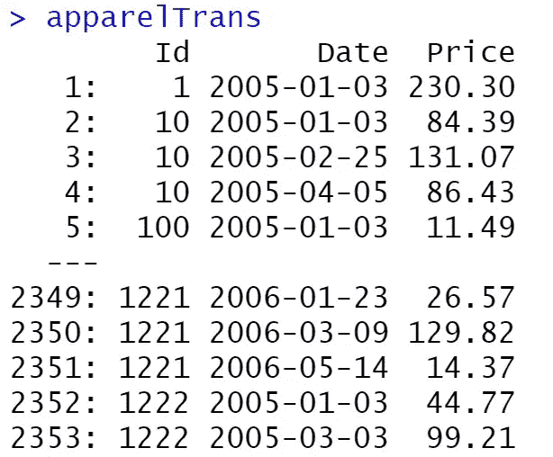

交易数据。来源:作者。

此外，我们假设客户的协变量(即属性)存储在“apparelDyncov”中。特别是公司知道客户的性别和他们的获取渠道(“线下”=0 或“线上”=1)。这些是*静态*协变量，这意味着它们可能因人而异，但随着时间的推移是恒定的。然而，也有“营销”，这表明有多少直接营销尝试在一个单一的客户。这是一个*时变*协变量，这意味着它不仅会因客户而异，还会随时间而变。软件包中只有一个(非常新的)模型目前能够处理这种时变结构，扩展的 ParetoNBD 模型在这里[开发](https://pubsonline.informs.org/doi/10.1287/mksc.2020.1254)，我们将充分利用这一点。

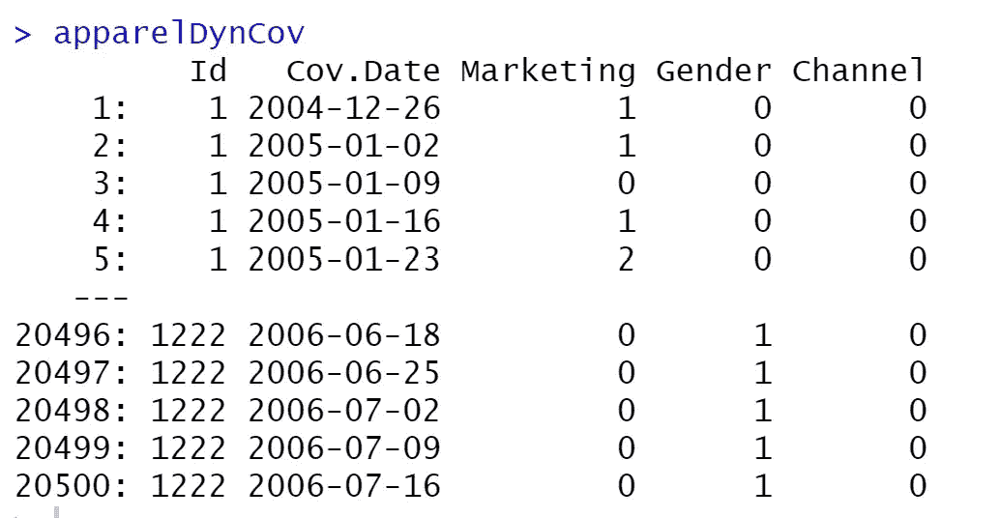

所有客户的附加协变量。来源:作者。

现在，我们采取必要的第一步，用“clvdata”命令将这些数据引入到包中，这将产生一个对象，第二步和第三步的所有函数都可以轻松地处理该对象。在这个命令中，我们需要指定数据集、我们使用的日期格式(如在“lubridate”R 包中)、时间单位以及何时(或是否)应该将数据划分为估计和验证周期。最后，我们需要指定 id、日期和价格的列名。

```
clv.apparel <- clvdata(apparelTrans,
                       date.format = "ymd",
                       time.unit= "week",
                       estimation.split=40,
                       name.id="Id",
                       name.date="Date",
                       name.price="Price")
```

这里可以看到摘要输出:

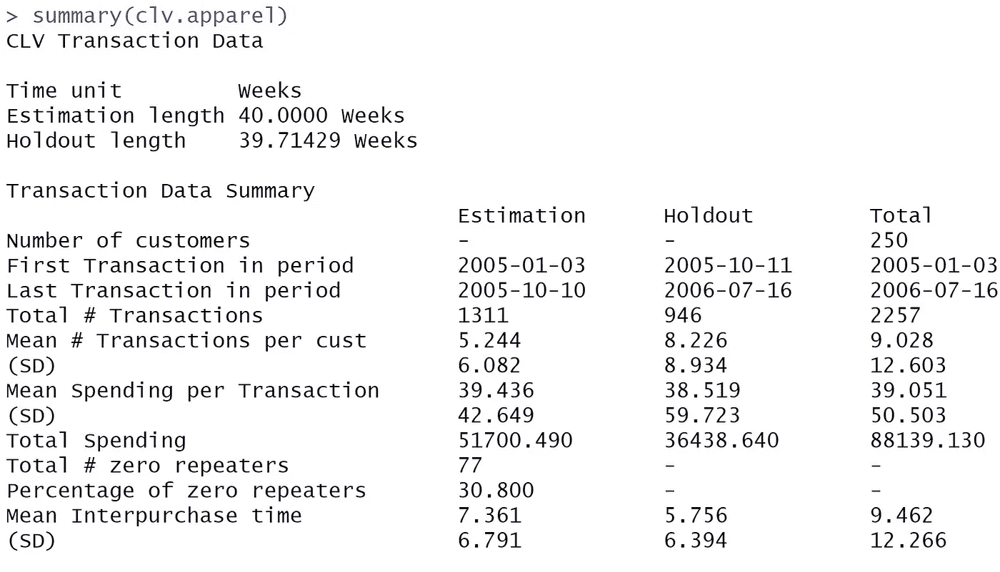

clv.apparel 对象的摘要输出。来源:作者。

## 第二步:评估

我们现在可以估计我们的上述对象的模型。有了默认选择，没有协变量，这就简单了:

```
## Estimate the PNBD model
est.pnbd<- pnbd(clv.data=clv.apparel)
## Estimate the BGNBD model
est.bgnbd <- bgnbd(clv.data=clv.apparel)
```

另一方面，对于(时变)协变量，我们需要指定更多:特别是，我们需要指定生存期或损耗过程(data.cov.life)和事务过程(data.cov.trans)的协变量数据。此外，我们需要在 names.cov.life 和 names.cov.trans 中给出这两个进程的名称。

```
clv.dyn <- SetDynamicCovariates(clv.data=clv.apparel,
                                data.cov.life = apparelDynCov,
                                data.cov.trans = apparelDynCov,
                                names.cov.life = c("Marketing", "Gender", "Channel"),
                                names.cov.trans = c("Marketing", Gender", "Channel"),
                                name.id = "Id",
                                name.date = "Cov.Date")
# Estimate the PNBD with Covariates (This takes a while (!))
est.pnbd.dyn <- pnbd(clv.dyn)
```

然后，我们可以首先检查这些模型的汇总输出。该输出类似于简单线性回归:给出了标准误差以及参数的显著性值，此外，还提供了关于优化收敛的信息，如最终似然值。请注意“est.pnbd.dyn”比 est.pnbd 多了 6 个参数。这对应于交易和流失流程的 3 个协变量(“性别”、“渠道”、“营销”)中每一个的一个协变量值。我们也可以利用这一点，限制协变量只影响两个过程中的一个，或者用相同的参数影响两个过程。

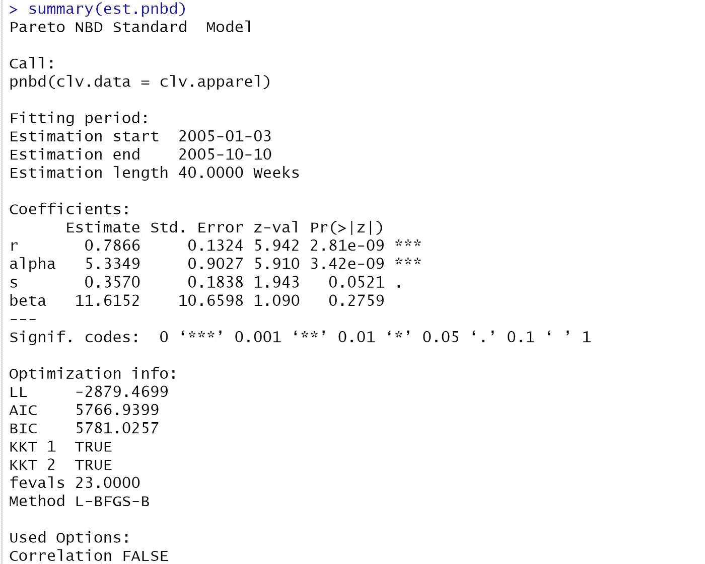

ParetoNBD 模型的摘要输出。来源:作者。

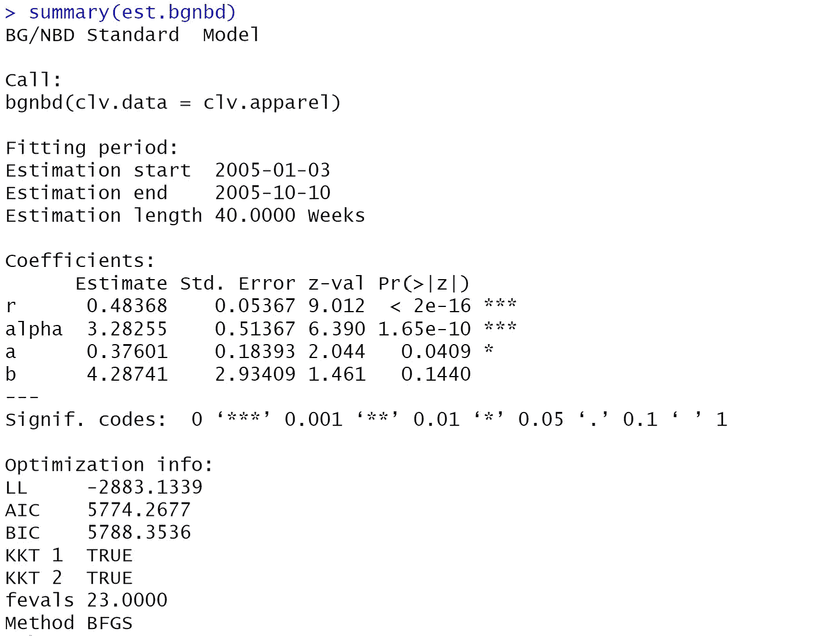

BG-NBD 模型的概要输出。来源:作者。

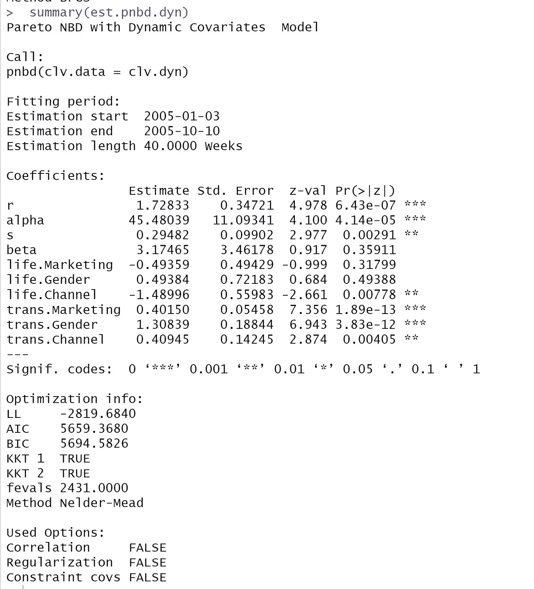

有协变量的 ParetoNBD 模型的汇总输出。来源:作者。

有趣的是，该模型暗示了直接营销努力的不同效果(假设因果解释是可能的):它似乎增加了交易频率(trans。营销是正面的)，但对一个客户的平均寿命(寿命)有负面影响。营销是负面的)。这可能意味着直接营销可能会在短期内促进销售，但会增加客户提前离开公司的机会。像往常一样，人们必须小心这种因果关系的陈述，但该模型至少提供了对影响的暗示(上面链接的原始论文详细解释了如何使用工具变量(iv)等恢复因果关系)。).

但是干输出已经足够了，让我们做一些绘图。检查样本内拟合的一个有趣的图是“跟踪图”，通常在这种情况下完成。

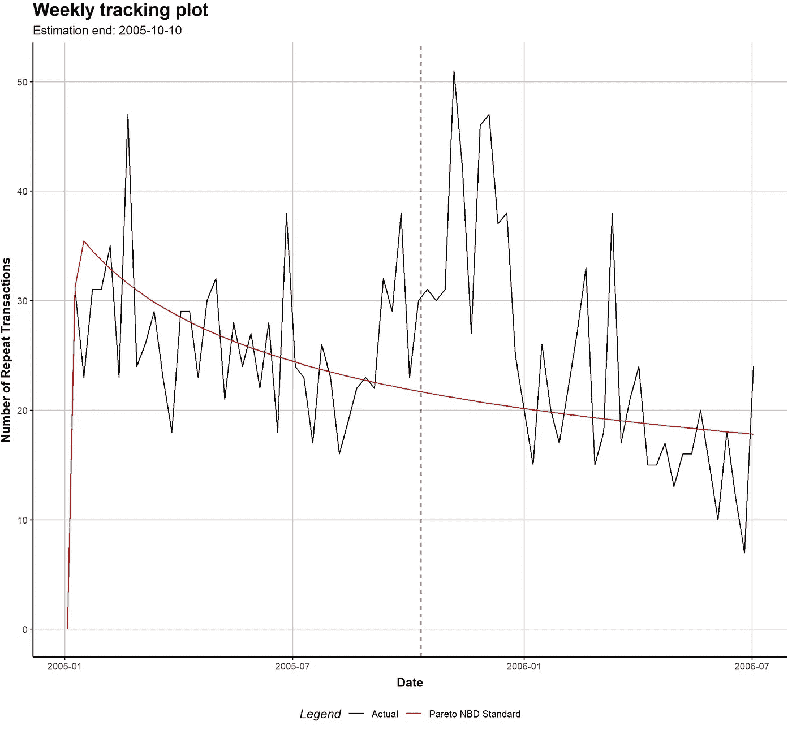

ParetoNBD 中所有客户的重复交易次数的预测值与实际值。来源:作者。

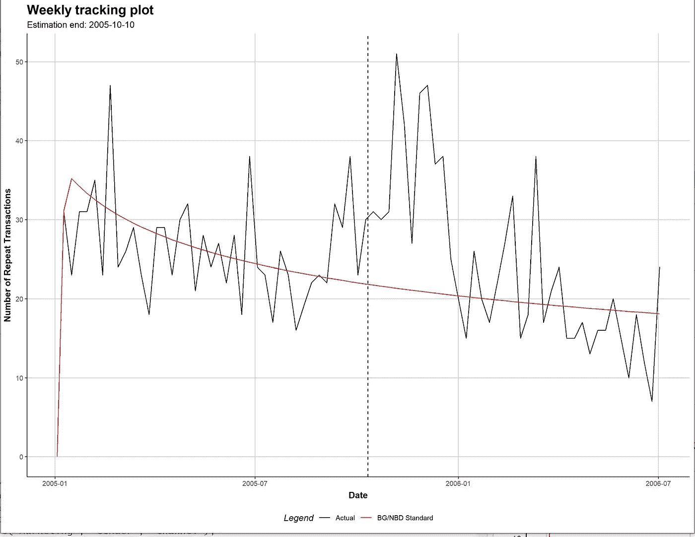

BG-NBD 预测的与实际的所有客户的重复交易数量。来源:作者。

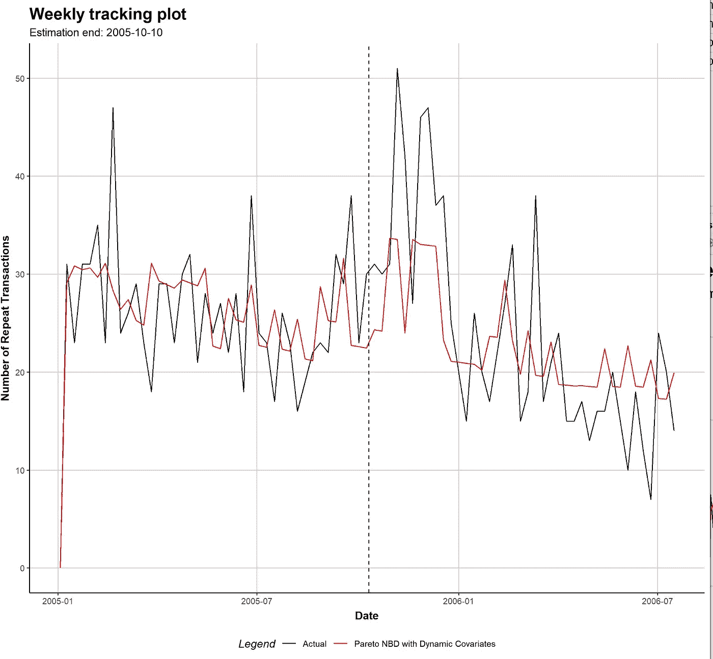

对于有协变量的 ParetoNBD，所有客户的重复交易的预测数与实际数。来源:作者。

BG-NBD 和 ParetoNBD 图看起来非常相似:它们很好地穿越了不稳定的交易，似乎也很好地捕捉到了均值。对于时变协变量，这变得更加有趣，我们突然能够匹配一些起初看起来随机的模式。这就是设计良好的时变协变量所能带来的优势。事实上，加上单独的，但时间不变的协变量，单独的预测有时可以大大改善，超出了这个聚合图中可见的。除了大量经典模型和极快且优雅的实现，这才是 CLVTools 真正与众不同的地方。

但最终我们感兴趣的是*预测*而不是良好的样本内拟合。让我们开始吧:

## 第三步:预测

从代码的角度来看，这也是非常简单的(如果我们使用默认值):

```
predict(est.pnbd)
predict(est.bgnbd)
predict(est.pnbd.dyn)
```

不幸的是，这里没有什么华而不实的东西可以展示，只有方便的表格给出了不同模型的所有预测(我们在这里省略了 est.bgnbd):

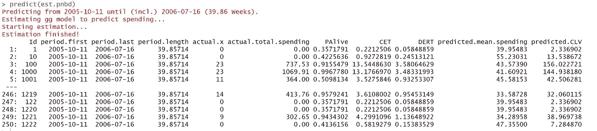

PartoNBD 模型的预测表:来源:作者。

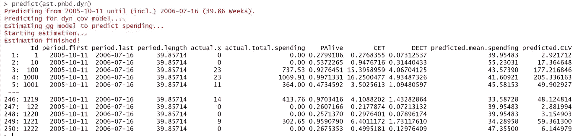

有协变量的 PartoNBD 模型预测表:来源:作者。

这里要提到一件奇怪的事情:虽然 ParetoNBD 和 BG-NBD 可以预测交易的预期数量(“CET”)和客户仍然留在公司的概率(“PAlive”)，但他们无法独自模拟*支出过程*。为此，模型的输出通常与用于支出的伽马-伽马(GG)模型相结合。这模拟了消费过程，当我们要求预测时，它会自动拟合，这就是红色部分。这不仅会导致预测的平均支出，还会导致我们期望的预测客户终身价值。每个 ID 在表格的最后一列给出。

这些预测可以用于更明智的商业决策。例如，关注 Id 为 100 和 1000 的客户可能是明智的，因为他们的 LTV 估计相当高。然而，给定参数估计，在这个例子中不清楚直接营销是否是可行的方法:至少有一个暗示，直接营销可以减少顾客在公司停留的平均时间。

## 结论

本文简要介绍了用于客户价值建模的 CLVTools 包。该软件包具有广泛的功能和优势，我们不可能在一篇文章中涵盖，但我们希望它能帮助感兴趣的读者开始使用该软件包并使用它做有用的事情。