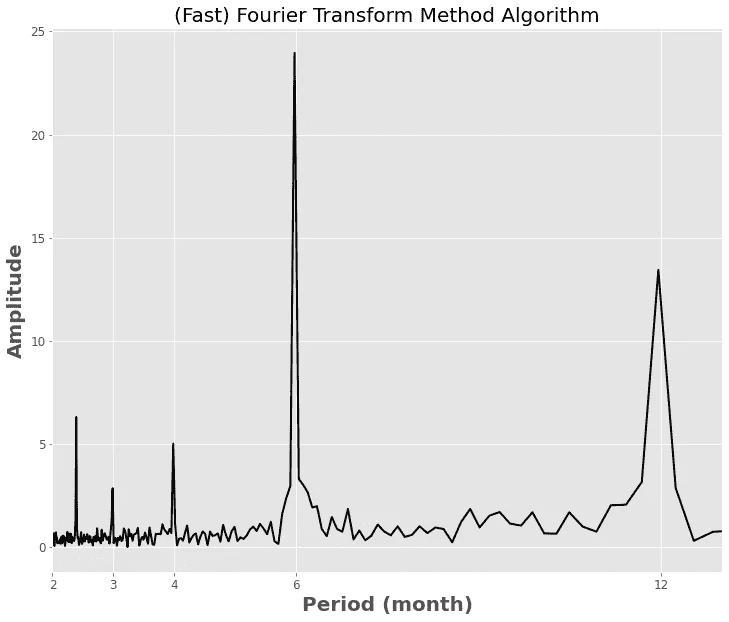
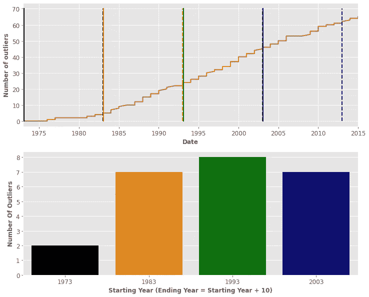

# 美国二氧化碳排放数据集:使用 Python 的统计分析

> 原文：<https://towardsdatascience.com/co2-emissions-dataset-in-usa-a-statistical-analysis-using-python-e8f2ab8eb78f>

## 从二氧化碳排放数据集中提取信息

Marek Piwnicki 在 [Unsplash](https://unsplash.com/s/photos/co2?utm_source=unsplash&utm_medium=referral&utm_content=creditCopyText) 上的照片

> 免责声明:**这个笔记本不是由气候科学家写的！**一切都由数据科学家的观点独家分析。所有的统计分析都是用来作为任何一种时间序列分析的工具。

让我们从陈述显而易见的事实开始:

> 数据科学家的工作是**提取洞察力。**

你正在使用的工具的复杂性并不真正相关。更重要的是，无论你使用什么，对你想要研究的分析都是有用的。

# 1.介绍

在我们的例子中，我们有一个**时间序列。**这一时间序列当然在 x 轴*(特别是**年**按**月**记录)上有时间，在 y 轴上有 ***上有美国燃煤发电产生的二氧化碳排放量。****

*这个数据集是公开的，没有任何版权限制( [CC0:公共领域](https://creativecommons.org/publicdomain/zero/1.0/))。可以免费下载，在 Kaggle 上，[这里](https://www.kaggle.com/datasets/soheiltehranipour/co2-dataset-in-usa)。*

*让我们来看看。首先，让我们导入库:*

*然后，让我们绘制时间序列(最后 7 个条目是 2016 年的，但这是一个截断的年份，所以我们将其截断)；*

*第一个数据点是 1973 年的第一个月，最后一个数据点是 2015 年的最后一年。没有缺失值，因此数据集的长度正好是 12x(2015–1973)。*

*现在，什么样的分析与本案相关？嗯，我认为提出三个问题是很自然的:*

****a . CO2 排放量是否普遍增加？大趋势是什么？****

****B .这个 CO2 时间序列有没有什么重现的模式？****

****C .时间序列是“稳定的”还是我们可以期待不愉快的惊喜？****

*让我们调查一下，一步一步来:*

# *2.一般趋势*

*我们感兴趣的是描绘这个时间序列的总体趋势。这并不是一种真正的回归技术，因为我们使用的是整个时间序列，这也不是一项真正的预测任务，因为……因为我们根本不是在预测的*:)**

**这只是趋势的一个侧面，以一种通用的方式对时间序列建模是有用的。如果你真的想拥有**预测**能力，使用更复杂的回归技术和/或将数据集分成训练集和测试集，可以很容易地改变代码，但这不是我们现在的情况。**

**我们对模型的预期是，从起点到峰值会有一个巨大的增长(x3 ),然后回到更合理的值，这个值仍然在初始值的 x2 附近。**

**使用至少三阶模型(它看起来不像抛物线，并且它肯定不是线:D)可以获得合理的模型(不太复杂，不太有损耗)。在我看来，degree = 4 更好，因为它捕捉到了更多的细节，但实际上并没有太大的区别。(同样，如果您想对此更加稳健，请对数据集的较小部分使用以下方法，并使用验证集来挑选误差最低的模型)。**

**所以我们来拟合一下四度模型。两步走:**

****A .拟合:****

****B .预测+绘图:****

**这看起来和我们预期的一模一样:**

1.  ****单调增加，直到 2002 年左右****
2.  ****从 2002 年到 2015 年单调(*快得多*)下降****

**我们没有更多关于具体数据来源的信息，但我们可以说，在长时间的增加后，排放量有所减少。增加看起来比减少更渐进(甚至可能更自然，与工厂的节奏有关)，也更慢。**一种猜测可能是，在达到排放的危险值后，有人故意开始减少排放**(可能有某种规定)(*我不太清楚，只是一种似是而非的猜测*)。**

# **3.循环模式**

**我们在前一章所做的考虑很有趣，但是不应该妨碍我们接下来要做的事情:让我们**去趋势**我们的时间序列。**

**现在看起来是这样的:**

**现在，正如你们所看到的,《泰晤士报》非常活跃。让我们用一个非常强大的工具来分析这种起伏:神奇的傅立叶变换。**

> **我❤傅里叶变换，我已经用了很多次了。特别是，我在几篇博客文章前[在这里](https://medium.com/towards-data-science/hands-on-signal-processing-with-python-9bda8aad39de)谈到过它。在那里，你可以找到傅立叶变换的概念，为什么它是有用的，希望你会像我一样喜欢它:)**

**让我们准备数据:**

**让我们画出傅立叶变换(振幅对周期，以月为单位)**

**为了清楚起见，让我转贴这张图片:**

****

**作者图片**

**这个其实很有意思。为了简洁起见，让我们考虑一下， *y 轴*上的**每一次选择都是一个循环模式，在正好 M 个月之后被周期性地验证，**其中 **M 是相对于该选择的 *x 轴*值。****

**一些重要的趋势得到了证实:**

1.  **大约 2.5 个月后**
2.  **三个月后**
3.  **4 个月后**
4.  **半年后**
5.  **整整一年后**

**同样，我们也不知道，但**看起来二氧化碳排放确实与雇主的休假时间有关**:通常他们在 6 个月或 12 年后休假，这是最显著的峰值。另一个提示是 2.5/3/4 个月的高峰期，因为不是所有的雇主都在准确的时间休息。**

**现在看起来很明显，等你意识到才明显:)**

# **4.稳定性**

**为了理解时间序列的稳定性，我们可以做如下(合理的)假设:**

> **时间序列是被一些高斯和白噪声“扰乱”的物理过程的结果**

**我是一个物理学家，这是我们的黄油和面包。这就是我们处理每一个问题的方式，并且有大量的关于误差“高斯性”的统计考虑。现在，让我们接受它，继续前进，就像你应该分手一样:)**

**预测物理过程产生的平均值并找到数据集的**不确定性**的一种非常有效的方法是使用著名的**高斯过程回归器(GPR)。这是另一个我非常喜欢的工具，因为它是可解释的、足够通用的并且易于使用。我也在多个博客中谈论它(比如这里的[和这里的](https://medium.com/towards-data-science/hands-on-unsupervised-outlier-detection-using-machine-learning-with-python-ec599fe5a6b5)和[和](https://medium.com/towards-data-science/using-gaussian-process-regression-as-a-generative-model-using-python-66278a154eb5))。简而言之，GPR 模型给你一个**平均值**和一个**方差**(+1.96 方差意味着在该区域找到点的概率为 95.7%)。这听起来可能令人困惑，让我们慢一点。****

**让我们考虑 60%的数据点作为训练集。**

**让我们在训练集上拟合 GPR 模型，并在整个数据集上应用拟合的模型。通过这最后一步，我们将有一个预测的时间序列，根据“平均”值及其相对不确定性。让我展示给你看:**

**它看起来有点乱，但实际上做得很好:**

**现在，为了看看它是否“稳定”，我们可以调查**有多少点**落在预测的边界之外。**

**结果如下:**

**再一次，为了清晰起见，让我给你看一下情节:**

****

**作者图片**

**这意味着:**

1.  **从 1973 年到 1983 年只有**两个**点在边界之外**
2.  ****1983 年至 1993 年 7 点**越界**
3.  **从 1993 年到 2003 年有 8 个点超出界限**
4.  ****7 分**2003-2013 年越界**

**这意味着，从 1983 年开始，时间序列的行为变得更加不规则。但是还有！时间序列应该适应行为的变化，不确定性应该增加。这意味着，即使不确定性增加，仍然有很多点超出边界:时间序列的不稳定性不断增加。它实际上是首先通过查看时间序列就可以看到的东西。**

# **5.结论**

**一些要点:**

1.  **经过几十年的增长，二氧化碳的排放量似乎已经开始下降了**
2.  **二氧化碳排放可能与雇主的休假时间有关，或者至少与公司的生产节奏有关**
3.  **时间序列越来越不稳定，在第一个十年的数据后，不稳定性发生了很大的变化**

**如果你喜欢这篇文章，你想知道更多关于机器学习的知识，或者你只是想问我一些你可以问的问题:**

**A.在 [**Linkedin**](https://www.linkedin.com/in/pieropaialunga/) 上关注我，我在那里发布我所有的故事
B .订阅我的 [**简讯**](https://piero-paialunga.medium.com/subscribe) 。这会让你了解新的故事，并给你机会发短信给我，让我收到你所有的更正或疑问。
C .成为 [**推荐会员**](https://piero-paialunga.medium.com/membership) ，这样你就不会有任何“本月最大故事数量”，你可以阅读我(以及数千名其他机器学习和数据科学顶级作家)写的任何关于现有最新技术的文章。**