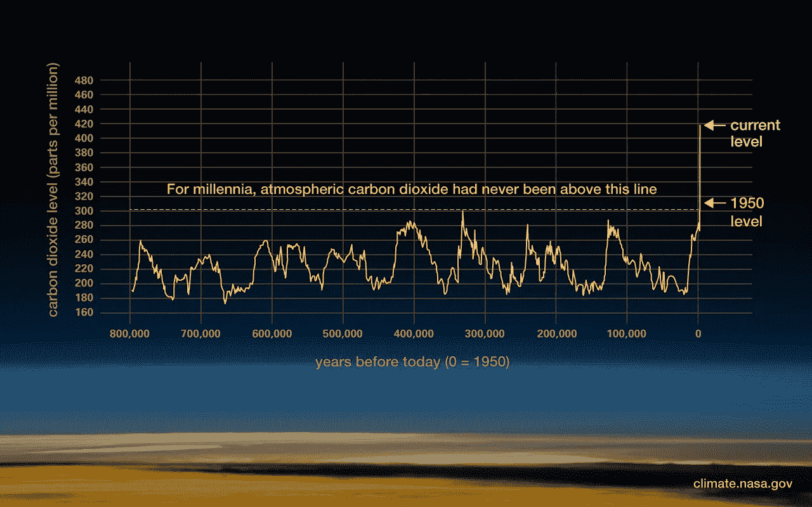
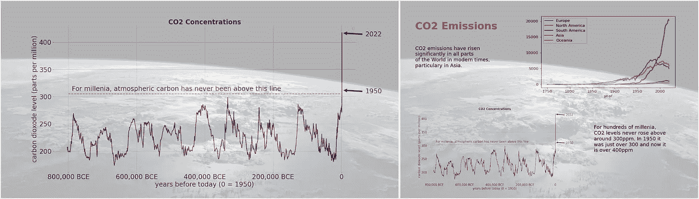
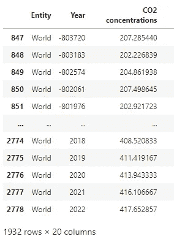
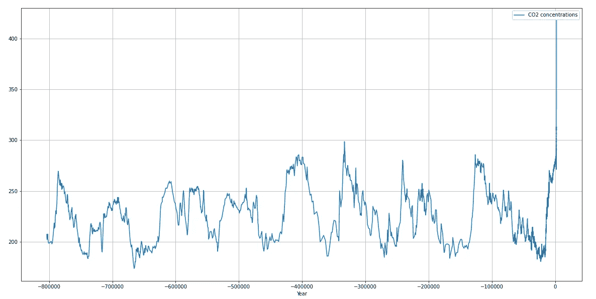
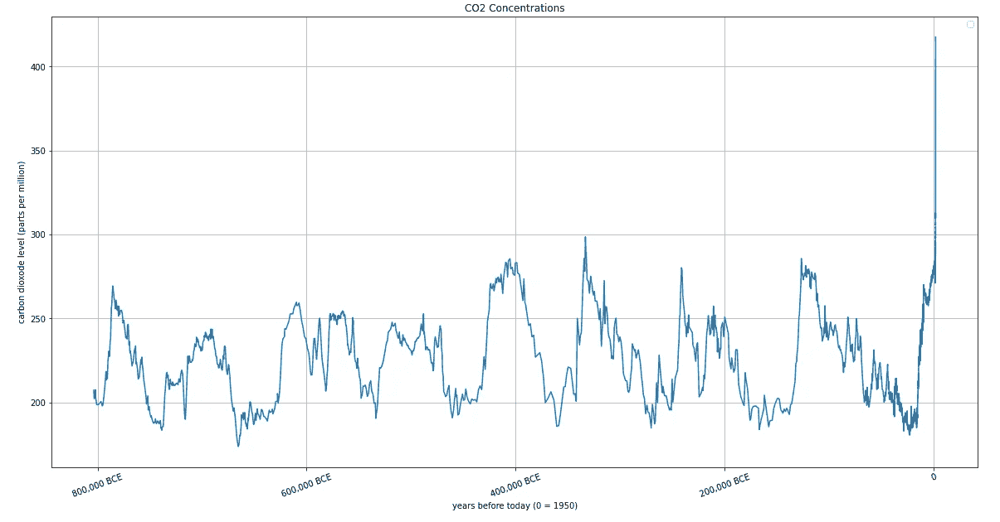
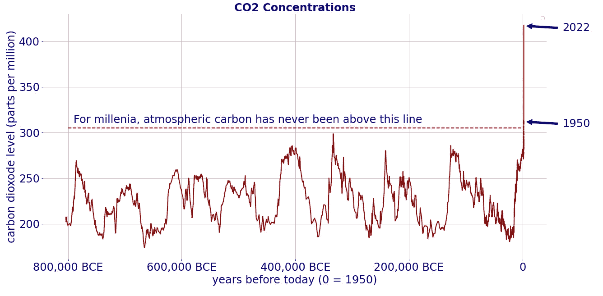
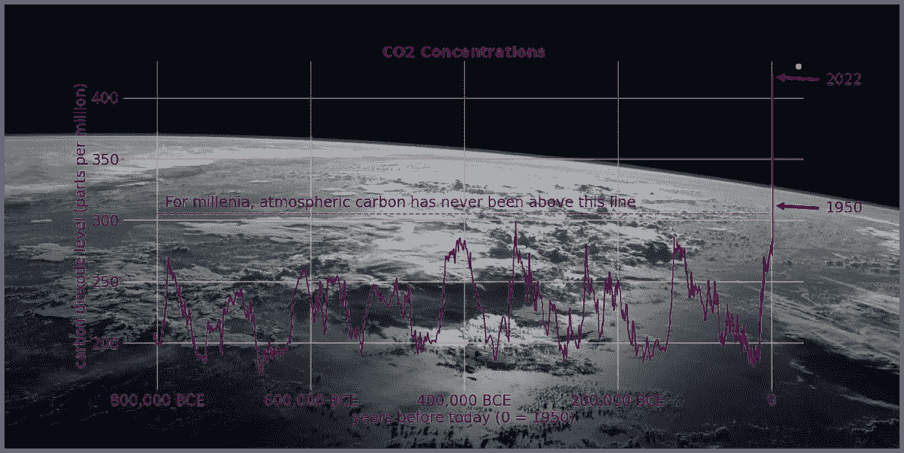
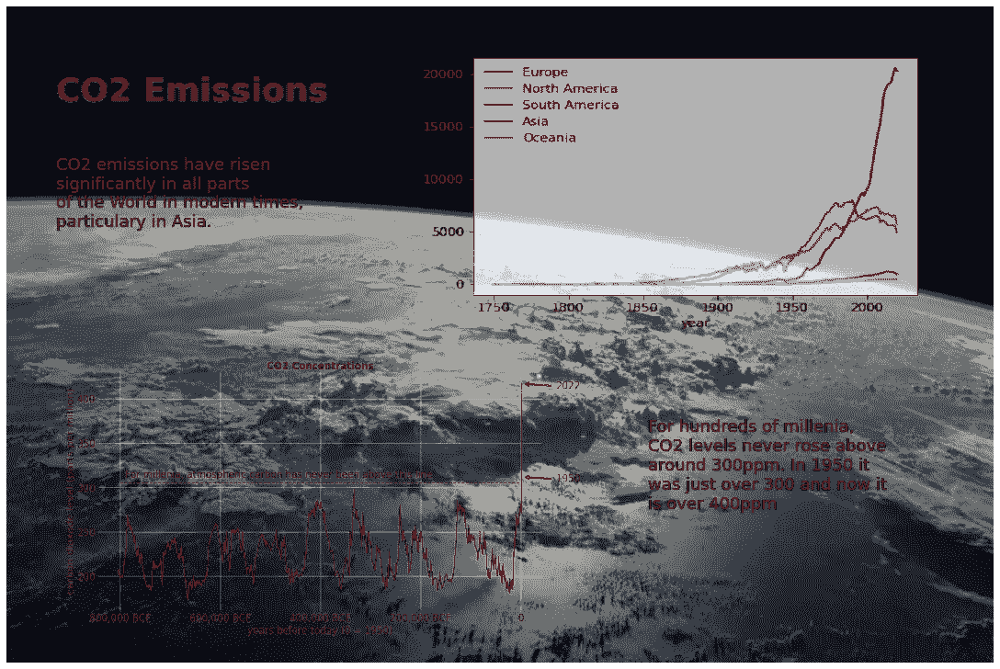

# Python 中的二氧化碳排放信息图

> 原文：<https://towardsdatascience.com/co2-emissions-infographics-in-python-369dd968eb84>

## 如何用 Python 和 Matplotlib 构建数据信息图


从国际空间站看到的地球 NASA 提供的公开图片[https://www . NASA . gov/mission _ pages/station/images/index . html](https://www.nasa.gov/mission_pages/station/images/index.html)

信息图这个词被用来描述各种可爱的图片，这些图片上有卡通人物和指向各处的箭头。

但是这里我们谈论的是传达数据信息的图形，这些数据可能会在报告或报纸文章中使用。从本质上来说，它们是一种有吸引力的数据呈现方式，带有支持性的图表和文本。

所以，让我们想象一下，我们要写一篇关于我们的大气状况和导致气候变化的二氧化碳水平的报告或文章。

我们将通过创建两个信息图表来告诉我们的读者大气中二氧化碳的水平，在过去和现在。

第一个将从 NASA 的这张图片中获得灵感:



大气中二氧化碳的历史水平——公共领域图片由美国宇航局提供[https://climate . NASA . gov/climate _ resources/24/graphic-the-renely-rise-of-carbon-CO2/](https://climate.nasa.gov/climate_resources/24/graphic-the-relentless-rise-of-carbon-dioxide/)

这张图表记录了几十万年来大气中的二氧化碳水平。它本质上是一个带注释的图，我们将使用 Pandas 和 Matplotlib 从原始数据构建我们的版本。

第二张图将包含两个图表，一个在上面，另一个显示各大洲的二氧化碳排放量。我们将把这些和一些支持文字一起放在一个背景图片上。

我会给你看我们进行的代码，但整个代码，数据和图像将可从我的网页。

我们将使用的数据全部由优秀的[我们的数据世界](https://ourworldindata.org/) (OWID)网站和 Github 页面提供。在 CC-BY 许可下，他们所有的可视化、数据和文章都是免费和开源的。

# 我们的方法

我们将使用 Matplotlib 的功能，它允许我们注释图表并在图表中定位图像。

首先，我们将数据读入 Pandas dataframes，然后我们将根据这些数据创建一个基本图表。一旦我们有了这个，我们就像你在上面的 NASA 例子中看到的那样注释图表，并把它保存为图像。

为了构建信息图，我们创建了一个新的 Matplotlib 图，并将我们保存的图表图像与背景图像(您在本文顶部看到的图像)一起放入其中。

然后，我们重复这个过程来创建另一个信息图，但这次我们有两个图表和一些说明性文本。

结果将是这样的:



我们将创建的两个信息图——作者图片

# 代码

我将一步一步地浏览代码，并在每一节的末尾包含该部分完整代码的要点。所有的代码也可以通过我的[网站](http://alanjones2.github.io)上的链接获得。

我们需要做的第一件事是导入我们将使用的 Python 库。

```
**import** pandas **as** pd
**import** matplotlib.pyplot **as** plt
```

我们将从 OWID 数据创建 Pandas 数据帧，并使用 Pandas 和 Matplotlib 创建图表和其他视觉效果。

## 获取数据

我们将使用的第一个数据集包括许多国家和地区(实体)的各种气候指标。我们将使用全球的*二氧化碳浓度*数据，因此我们将相应地过滤数据。

首先，我们将数据读入数据帧`co2`，当然，这将包含所有的数据。

接下来，我们过滤数据，只考虑其中的*实体*名称为“World ”,并将其存储在数据帧`co2world.`中

```
*# original source:* # [*https://ourworldindata.org/co2-and-other-greenhouse-gas-emissions*](https://ourworldindata.org/co2-and-other-greenhouse-gas-emissions)co2 **=** pd**.**read_csv('data/climate-change.csv')co2world **=** co2[co2['Entity']**==**'World']
co2world
```



历史二氧化碳浓度—作者图片

数据中还有其他几列，但我们只对 *CO2 浓度*数据感兴趣。

## 绘制基本图表

我们可以这样绘制这些数据:

```
co2world**.**plot(y **=** "CO2 concentrations", 
              x **=** 'Year', 
              grid **=** **True**, 
              figsize **=** (20,10))
```



历史二氧化碳浓度—作者图片

结果是一个相当令人震惊的图表，它显示，在过去的 80 万年里，地球大气中的二氧化碳浓度低于 300 ppm(百万分之一)，但在过去的几十年里，它飙升至 400 ppm 以上。

然而，除非你熟悉数据，否则解读图表并不容易。所以，让我们帮读者一个忙，让我们看到的东西更明显一点。

x 轴代表时间，但大多数年份是负值。这些值是相对于共同时代的开始，因此，例如，-800，000 意味着 800，000 BCE(在共同时代之前)，0 是我们在当前系统中开始计算世纪的位置，最后一年是 2022 年，即今年。

我们将设置记号和标签，使其更具可读性，因为标签很长，我们将旋转它们，使它们不会重叠。

```
plt**.**xticks([**-**800000, **-**600000, **-**400000, **-**200000, 0], 
           ['800,000 BCE', '600,000 BCE', '400,000 BCE',
            '200,000 BCE','0'],
             rotation**=**20)
```

我们还定义了 x 轴和 y 轴标签，移除图例(这是多余的)并添加标题。

```
plt**.**ylabel("carbon dioxide level (parts per million)")plt**.**xlabel("years before today (0 = 1950)")plt**.**legend("")plt**.**title("CO2 Concentrations")
```

然后，我们将生成的图形保存为图像。

```
plt**.**savefig('images/co2world.png')
```

以下是完整的代码:

这是结果图。



历史二氧化碳浓度，可读性更强的版本——图片由作者提供

我们这里有一个可读的图表，但它并不包含上面 NASA 图表中的所有信息。

## 给图表加注释

我们需要添加标题“几千年来，大气中的碳从未超过这条线”，并绘制标题所指的线。

```
caption = "For millennia, atmospheric carbon has never been above this line"plt**.**text(**-**790000,320, caption,
        verticalalignment**=**'top', horizontalalignment**=**'left',
        fontsize**=**fontsize, color **=** color)

plt**.**plot([**-**800000,0],[305,305], linestyle **=** 'dashed', 
          color**=**'red', linewidth **=** 2)
```

在上面的代码中，我们将标题定义为一个字符串，然后将其添加到图表中的 x/y 位置-790000，320，然后在 CO2 浓度水平为 305ppm 时从-800000，0 绘制一条水平虚线。

接下来，我们添加注释——指向 1950 年和 2022 年的标签和箭头。

```
plt**.**annotate("1950",xy **=** (0,312), xytext **=** (70000,306),
              arrowprops**=**dict(facecolor**=** color, shrink**=**0.1), 
              fontsize**=**fontsize, color **=** color)
plt**.**annotate("2022",xy **=** (0,417), xytext **=** (70000,411),
              arrowprops**=**dict(facecolor**=** color, shrink**=**0.1),
              fontsize **=** fontsize, color **=** color)
```

最后要做的事情是去掉脊骨:

```
ax**.**spines['top']**.**set_visible(**False**)
ax**.**spines['right']**.**set_visible(**False**)
ax**.**spines['bottom']**.**set_visible(**False**)
ax**.**spines['left']**.**set_visible(**False**)
```

然后将结果保存为图像文件。

```
plt**.**savefig('images/'co2.png', transparent **=** **True**)
```

结果如下:



完整的二氧化碳浓度图表—图片由作者提供

这是这个阶段的完整代码。你会注意到我已经改变了默认的颜色和字体大小，并在开始时将它们声明为变量，这样我们就可以很容易地改变它们。

## 创建信息图

该图现在看起来像美国宇航局的图像，但我们想把它放在一个背景图像。这不仅仅是向当前图表添加图像的问题。如果我们这样做，轴标签将在图像之外，我们希望将整个图表放置在背景图像内。

解决方案是创建一个新的 Matplotlib 图形，如下所示:

```
ax**.**plot([0,100],[0,100], alpha **=** 0)
```

这给了我们一个 100 乘 100 的图表，我们可以使用它作为画布来放置我们的图表图像。请注意，我已经将 alpha 值设置为零，这意味着图表将不可见。

我们现在可以将图表图像添加到这个新图形中:

```
img1 **=** plt**.**imread('images/co2.png')
ax**.**imshow(img1, aspect**=**'auto', alpha**=**1, extent**=**(1,99,1,99))
```

请注意，通过使用*范围*参数，我使图像比图形稍微小一点，但是在它的中心。

背景图像以类似的方式添加:

```
bground**=**plt**.**imread('images/ISS_earth.en.jpg')
ax**.**imshow(bground, aspect**=**'auto', alpha**=**0.3, extent**=**(0,100,0,100))
```

但是这一次，图像的范围是图形的全部。

我已经将两张图像的 alpha 值设置为图表图像为 1(这是默认值)，背景为 0.3。这意味着图表将完全不透明，但背景图像将部分透明。



完整的信息图-作者提供的图片

这是第一个信息图的代码。

## 更复杂的信息图

信息图通常包含不止一个图表和一些说明性文字，所以这是我们接下来要尝试的。

我们将使用相同的技术创建一个空白图形，并在该图形上放置图像和(这次)文本。我们将使用已经为其中一个图表和背景创建的图像，并添加另一个图表和一些文本。

从另一个 OWID 数据集，我们可以创建一个图表，表示世界各地二氧化碳排放量的增加。这是:


各大洲二氧化碳排放量—数据来源，[数据中的我们的世界](https://github.com/owid/co2-data)，图片由作者提供

创建它的代码如下。首先，我们读取数据，然后根据我们指定的大洲列表过滤结果表。然后直接遍历这些大陆的名称，并在图表中添加一个新的绘图。

我们将结果保存为图像。

现在我们有了我们需要的图像，但是我们需要指定三个字符串中的文本。

```
title **=** """
CO2 Emissions
"""text1 **=** """
CO2 emissions have risen 
significantly in all parts 
of the World in modern times,
particularly in Asia.
"""text2 **=** """
For hundreds of millennia,
CO2 levels never rose above 
around 300ppm. In 1950 it 
was just over 300 and now it 
is over 400ppm
"""
```

我不会重复放置图像，因为这几乎是我们之前所做的重复，但是使用*范围*参数来将图像放置在图的右上角和左下角。

然而，文本的定位略有不同。这里有一个例子。

```
ax**.**text(5,80, text1,
        verticalalignment**=**'top', horizontalalignment**=**'left',
        color**=**'black', fontsize**=**18)
```

在这个对 *ax.text* 的函数调用中，前两个参数是文本的位置，第三个是文本本身，其他的不言自明。

我们现在拥有了完成信息图的所有组件和技术。这是结果，代码如下。



完整的信息图-作者提供的图片

大概就是这样。感谢阅读，我希望这是有用的，并会启发你产生自己的惊人的图形。

像往常一样，在这篇文章发表后不久，完整的代码将通过我的[网站](http://alanjones2.github.io)上的链接提供——你也可以在那里看到我的其他作品。

如果你想看更多的文章，请在媒体上关注我或者订阅我偶尔发的[子栈简讯](http://technofile.substack.com)。

[](https://medium.com/membership/@alan-jones)  

## 笔记

通过下面的链接，你可以在“数据世界”和美国宇航局的图片中找到原始数据。

[](https://ourworldindata.org/co2-and-other-greenhouse-gas-emissions)  [](https://github.com/owid/co2-data)  [](https://climate.nasa.gov/climate_resources/24/graphic-the-relentless-rise-of-carbon-dioxide/)  [](https://www.nasa.gov/mission_pages/station/images/index.html) 