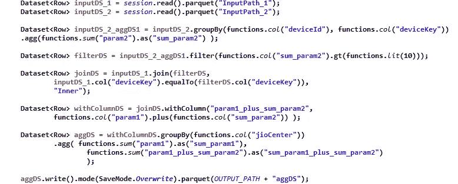
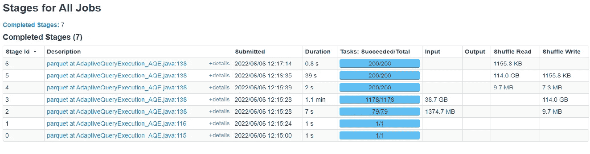
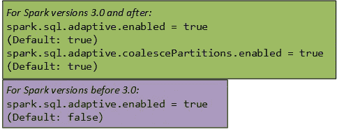
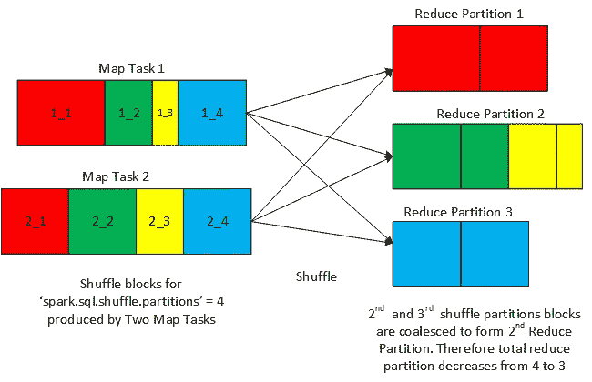
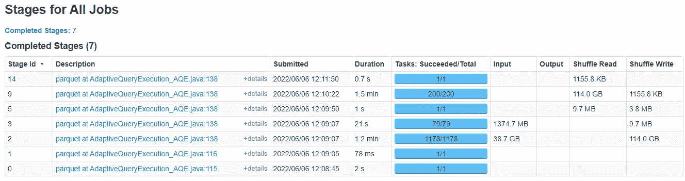

# Apache Spark 中的合并与动态合并

> 原文：<https://towardsdatascience.com/coalescing-vs-dynamic-coalescing-in-apache-spark-1d7824c8dbcb>

参考:Pixabay

## 随着 Spark 3.0 中默认启用“动态合并”，Spark 应用程序中合并的使用将会增加。现在，您不再需要手动调整分区来进行洗牌，也不会感觉受到“spark.sql.shuffle.partitions”值的限制。阅读这个故事来了解更多..

**分区的重要性**:对于 Spark 应用程序的最佳执行来说，正确的分区集就像一个圣杯。当 Spark 应用程序的每个组成阶段都以最佳方式执行时，它将实现最佳效率。这反过来意味着每个阶段都应该在最佳数量的分区上运行，这些分区的数量可能因阶段而异。最佳分区数量的差异是因为输入数据量和计算性质通常随阶段不同而不同。

太多的小分区会增加簿记和调度的开销，而大分区会导致所需并行性的损失。类似地，繁重和内存密集型计算更喜欢小尺寸的分区，而大尺寸的分区自然适合于轻型计算。如果你想了解更多关于火花分割方面的内容，可以参考[《火花分割指南》](https://www.amazon.com/Guide-Spark-Partitioning-Explained-Depth-ebook/dp/B08KJCT3XN)。

**洗牌产生阶段**:Spark 作业中的大多数阶段是由于 Spark 执行引擎插入了洗牌交换操作符而产生的。此外，每个混洗交换操作符使用配置参数"*spark . SQL . shuffle . partitions*"来决定混洗分区的数量。因此，所有混洗产生的阶段(进行混洗读取的阶段)在相似数量的分区上运行。但是，类似数量的已配置混洗分区对于所有混洗产生的级来说可能不是最优的，导致受影响的级非最优地运行。这反过来降低了 Spark 作业的整体效率。(你可以参考[揭示阿帕奇火花洗牌魔术](https://medium.com/swlh/revealing-apache-spark-shuffling-magic-b2c304306142)来了解更多关于火花洗牌的过程)

下面是一个代码片段，用于模拟当未启用动态合并时，所有 shuffle born 阶段都以分区号等于"*spark . SQL . shuffle . partitions*"的方式运行。

图 1:模拟多个洗牌诞生阶段的代码片段

以下是在 Spark 集群上执行图 1 中*所示逻辑时的阶段执行快照:*

*图 5* :图 1 的*逻辑产生的分级快照，无动态合并*

从*图 2* 中可以看出，阶段 3、5 和 6 都是混洗产生的阶段，并且每个阶段都运行在默认值“*spark . SQL . shuffle . partitions*上，该值设置为 200。

> 为了克服“*spark . SQL . shuffle . partitions*带来的限制，Spark 开发人员通常使用“*re partition”*或“ *coalesce* ”转换来手动和间接调整 shuffle 分区。调整是围绕需要数据混洗的转换进行的，例如“分组”和“连接*”*。

**重新分区和合并** : ' *重新分区'*与数据集中的原始分区数量相比，转换允许用户将数据集重新分区为更多或更少的分区。这通常是通过指定从记录的一个或多个属性派生的重新分区键来完成的。如果在 *groupby* 转换前使用“r*e partition】*，则重新分区键与分组键相同；如果在 *Join* 转换前使用“r*e partition】*，则重新分区键与 Join 键相同。

> 当开发人员想要手动增加 shuffle 分区的数量超过“spark.sql.shuffle.partitions”指定的数量时，他们通常会在 shuffle 导致转换之前求助于' r *epartition'* 。

*Coalesce’*转换允许用户将数据集重新划分为与数据集中的原始分区数量相比数量更少的分区。在这里，没有必要指定任何键。

> 与“spark.sql.shuffle.partitions”指定的分区相比，当开发人员想要手动减少洗牌分区的数量时，他们通常会在洗牌后求助于' *Coalesce'* '。

虽然可以通过'*重新分区*或'*合并*'手动调整混洗的阶段分区，但这是一个反复而繁琐的过程，需要对 Spark 的执行引擎有很好的理解。为了解决这个问题，Spark 支持将'*动态合并*'作为一个更大的运行时优化模块的特性之一，Spark 1.6 中首次引入了'*高级查询执行(AQE)* '。

> *除了*‘动态合并’，*AQE*的其他特性包括’*将连接策略切换到广播连接’和‘优化偏斜连接’。在 Spark 3.0 之前，AQE 被默认禁用，因为它仍在不断成熟，但在 Spark 3.0 中，AQE 被默认启用，以在运行时自动优化 Spark 作业。*

*要使用“动态合并”，必须将以下配置设置为“*真*”。*

**

*图 3。用于启用动态合并的配置参数。*

***了解“动态合并”:**众所周知，洗牌由两个连续的阶段组成。第一个是写入混洗块的映射阶段(对应于配置的混洗分区号)。映射阶段之后是归约阶段，该归约阶段读取相关混洗块，根据它们的混洗分区号来组合它们，然后对每个组合的数据块运行归约逻辑。*

*“动态聚结”在洗牌映射和简化阶段之间起作用。实际上，在映射阶段之后，在混洗完成之前(在写入所有混洗数据块之后)，它向 spark 执行引擎报告大量的统计数据，例如记录的数量和每个混洗分区的大小，关于产生的混洗分区(如配置"*Spark . SQL . shuffle . partitions*")的规定。*

> *当混洗分区被合并到较低的数目时，这些报告的统计信息提示执行引擎咨询“动态合并”模块来检查潜在的优化机会。*

*“动态合并”参考由洗牌的映射端产生的统计数据和一些其他可配置的参数(以提供行为的灵活性),以便计算合并分区的最佳目标大小。基于所计算的目标大小，对合并的混洗分区的数量进行估计。如果估计的数量低于由“*spark . SQL . shuffle . partitions*”指示的数量，则在运行时，“*动态合并*”模块动态地插入后续的*合并*转换，该转换具有作为合并的混洗分区的估计数量的输入参数。*

**

*图 4:动态合并的图示*

**图 4* 提供了“*动态合并*”的图示。如图所示，'*spark . SQL . shuffle . partitions*'设置为 4。因此，混洗的映射阶段中的两个映射任务(对应于 2 个分区)写入对应于所配置的混洗分区的 4 个混洗块。然而，在火花执行引擎已经使用了'*动态合并*'之后，第二和第三混洗分区被合并，因此混洗分区的总数在混洗之后的缩减器阶段(混洗产生阶段)变为 3 而不是 4。*

***配置“动态合并”:**影响“*动态合并*的决策过程的各种可配置参数如下:*

***在 Spark 3.0 之前:** 在 Spark 3.0 之前，这样的参数只有一个:*

*"*spark . SQL . adaptive . shuffle . targetpostshuffleinputsize*":控制合并后的目标大小。合并后的分区大小将接近但不会大于该目标大小。(默认值:64MB)*

****Spark 3.0 及以上***:Spark 3.0 引入了多个参数来微调“*动态合并*的行为，以保持所需并行度和合并洗牌分区的最大大小之间的平衡。所有这些参数解释如下:*

*"*spark . SQL . adaptive . advorypartitionsizeinbytes*":控制合并后的目标大小。合并后的分区大小将接近但不会大于该目标大小。(默认值:64MB)*

*"*spark . SQL . adaptive . coalesce partitions . minpartitionnum*":控制合并后的最小分区数。如果未设置，则默认为等于'*spark . default . parallelism*'。*

*"*Spark . SQL . adaptive . coalesce partitions . minpartitionsize*":这是 Spark 3.2 中新引入的参数。它控制合并后分区的最小大小。合并的分区大小不会小于该大小。(默认值:1MB)*

> *因此可以看出，在 Spark 3.2 之前，只使用“Spark . SQL . adaptive . shuffle . targetpostshuffleinputsize”为合并分区大小指定了一个固定的上限。但是，在 Spark 3.2 中，可以分别基于“Spark . SQL . adaptive . shuffle . targetpostshuffleinputsize”和“Spark . SQL . adaptive . coalesce partitions . minpartitionsize”的值为合并的分区大小指定固定的上限和下限。*

*以下是再次执行图 1 中的*逻辑时 Spark 产生的阶段快照，但“动态合并”已打开:**

**

**图 5* :图 1 逻辑产生的带有动态合并的阶段快照*

*从*图 5* 中可以看出，在启用了*动态合并*的情况下，在*图 1* 中的 *4* 和 *6* 分别对应的 *5* 和 *14* 中，洗牌分区的数量减少为 1，而对应于*阶段的 *9* 的分区数量保持为 200(*注意，启用 AQE 后，由于引入了多个跳过的阶段*，阶段编号有所改变)**

*我希望上面的故事已经让你对 Coalesce 操作有了一个很好的了解，以及“动态合并”特性背后的原因。在这种背景下，我鼓励大家通过使用手动合并操作或启用动态合并功能来探索现有 Spark 作业的优化机会。*

*关于使用“动态合并”的指导原则，我将在下一部分介绍，在此之前，如果有任何疑问、反馈或建议，你可以通过 LinkedIn 联系我@[https://www.linkedin.com/in/ajaywlan/](https://www.linkedin.com/in/ajaywlan/)。*