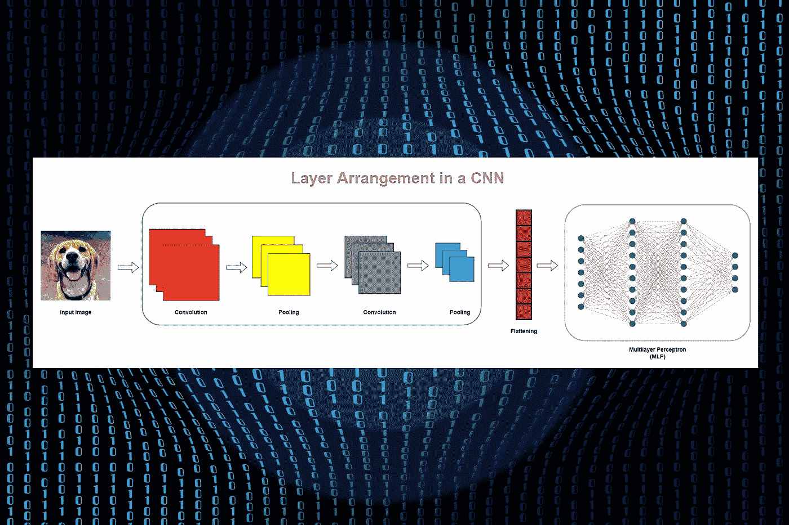
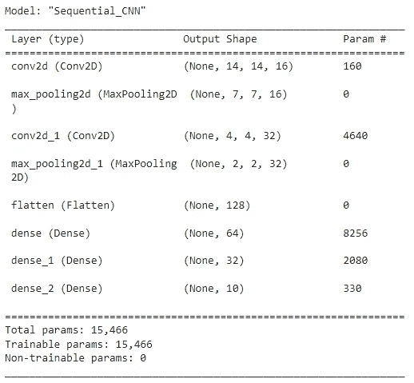
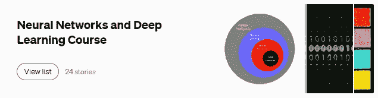

# 使用 Keras 顺序 API 编码卷积神经网络(CNN)

> 原文：<https://towardsdatascience.com/coding-a-convolutional-neural-network-cnn-using-keras-sequential-api-ec5211126875>

## 神经网络和深度学习课程:第 24 部分



由作者编辑的来自 [Pixabay](https://pixabay.com/?utm_source=link-attribution&utm_medium=referral&utm_campaign=image&utm_content=7255440) 的 [Gerd Altmann](https://pixabay.com/users/geralt-9301/?utm_source=link-attribution&utm_medium=referral&utm_campaign=image&utm_content=7255440) 的原始图像

> **先决条件:** [用简单的图表用简单的英语解释卷积神经网络(CNN)架构](/convolutional-neural-network-cnn-architecture-explained-in-plain-english-using-simple-diagrams-e5de17eacc8f)(强烈推荐)

在第 23 部分中，我详细讨论了卷积神经网络(CNN)中的层和操作。如果你读过那本书，现在你就明白 CNN 是如何在幕后工作的了。

今天，我们将讨论如何使用 Keras 顺序 API 构建 CNN。我们将详细讨论如何使用`Sequential()`类实例化顺序模型，如何使用`add()`方法添加卷积、池化和密集层，如何使用`Conv2D()`、`MaxPooling2D()`和`Dense()`类构建卷积、池化和密集层。

最后，我们将使用`summary()`方法得到整个 CNN 架构的概要，并统计网络中总参数的数量。该信息可用于在**“参数效率”**方面比较 CNN 和等效 MLP。

# Keras 顺序 API

Keras 中有两种类型的 API:**顺序**和**功能**。今天，我们将使用顺序 API 来构建一个 CNN。在顺序 API 中，我们将层一层一层地添加到模型中(因此得名 ***顺序*** )。使用顺序 API 很容易。然而，顺序 API 对于分支层并不太灵活，并且它不允许网络中有多个输入和输出。

# 顺序模型

在 Keras 中，可以通过使用`Sequential()`类来构建顺序模型。在这里，我们使用`add()`方法给模型添加层。根据 Keras 文件，

> 一个`Sequential`模型适用于**一个简单的层叠**，其中每一层都有**一个输入张量和一个输出张量**——来源:[https://keras.io/guides/sequential_model/](https://keras.io/guides/sequential_model/)

CNN 可以被实例化为一个序列模型，因为每一层只有一个输入和输出，并且堆叠在一起形成整个网络。

```
from tensorflow.keras.models import Sequential**CNN = Sequential()**
```

在第 16 部分中，我们使用相同的`Sequential()`类创建了一个多层感知器(MLP)。MLP 中的每一层都只有一个输入和输出，并且堆叠在一起形成整个网络。因此，MLP 可以被实例化为序列模型。

# CNN 中的层排列

在我们讨论 CNN 层之前，总结一下 CNN 中的层排列是很有用的。更多详情可在[这里](/convolutional-neural-network-cnn-architecture-explained-in-plain-english-using-simple-diagrams-e5de17eacc8f#e962)找到。

典型地，CNN 中的层被堆叠为，

**卷积池对→卷积池对→一个平坦层→多个密集层**


**CNN 中的图层排列**(图片由作者提供，用 draw.io 制作)

# Keras Conv2D 类

CNN 中的每个卷积层都是使用简单地在二维空间中执行卷积运算的`Conv2D()`类创建的。换句话说，核(过滤器)的移动发生在输入图像上，跨越二维空间。

在 Keras 中，卷积层被称为 Conv2D 层。

```
from tensorflow.keras.layers import Conv2D**Conv2D(****filters, kernel_size,
       strides, padding,
       activation,** **input_shape)**
```

## Conv2D 中的重要参数

*   **滤镜:**滤镜数量(内核)。这也被称为特征图的深度。接受整数。我们通常将每个卷积层中的滤波器数量增加为 16、32、64、128 等等。
*   **kernel_size:** 指定内核(卷积)窗口的高度和宽度。这需要一个整数或两个整数的元组，如(3，3)。在大多数情况下，窗口是一个高度和宽度相同的正方形。方形窗口的大小可以指定为整数，例如，3 表示(3，3)窗口。
*   **步数:**我们在输入图像上移动滤镜的步数(像素)。这需要沿着高度和宽度的步幅的元组。如果高度和宽度相同，我们可以使用整数。默认值设置为(1，1)。
*   **填充:**有两种选择:`"valid"`或`"same"`。“有效”意味着没有填充。“相同”导致用零填充，使得当`strides=1`时，特征图的大小与输入的大小相同。
*   **激活:**卷积层中使用的激活函数类型。默认情况下，没有激活等同于线性或身份激活。我们通常在每个卷积层使用`'relu'`激活函数。
*   **input_shape:** 将输入的高度、宽度和深度指定为一个整数元组。换句话说，这是输入图像的大小。如果第一个卷积层是模型中紧接在输入层之后的第一层，则必须在第一个卷积层中指定此参数。其他中间卷积层不包含这个参数。

> 当`input_shape`被传递到第一个卷积层时，Keras 为场景后面的模型添加一个输入层，我们不需要明确指定输入层。

# Keras MaxPooling2D 类

创建卷积层后，下一步是创建池层。卷积层和池层成对使用。共有两种拼版操作:**最大拼版**和**平均拼版**。这里，我们使用最大池。

CNN 中的每个池层都是使用`MaxPooling2D()`类创建的，该类只是在二维空间中执行最大池操作。

在 Keras 中，最大池层被称为 MaxPooling2D 层。

```
from tensorflow.keras.layers import MaxPooling2D**MaxPooling2D(****pool_size, strides, padding****)**
```

## MaxPooling2D 中的重要参数

*   **pool_size:** 池窗口的大小。默认值为(2，2)。这需要一个整数或一个元组。如果我们使用整数，相同的窗口长度将用于两个维度。
*   **步数:**我们在特征图上为每个合并步骤移动合并窗口的步数(像素)。这需要沿着高度和宽度的步幅的元组。如果高度和宽度相同，我们可以使用整数。默认设置为`None`，采用`pool_size`的值。
*   **填充:**有两种选择:`"valid"`或`"same"`。“有效”意味着没有填充。“相同”会导致以零填充，使得合并的要素地图的大小与输入的大小相同。

# Keras 稠密类

CNN 中的最后几层是完全(密集)连接的层。在 Keras 中，这些层是使用`Dense()`类创建的。

CNN 中的多层感知器(MLP)部分是使用多个完全连接的层创建的。

在 Keras 中，完全连接的层称为密集层。

```
from tensorflow.keras.layers import Dense**Dense(****units, activation,** **input_shape)**
```

## 密集中的重要参数

*   **单元:**层中节点(单元)的数量。这是一个必需的参数，接受一个正整数。
*   **激活:**在层中使用的激活函数的类型。默认值为`None`，表示无激活(即线性或身份激活)。
*   我们不需要包括这个参数，因为任何密集层都不是 CNN 中的第一层。

# Keras 展平类

在 CNN 中，在最终汇集层和第一密集层之间有一个平坦层。展平层是一个单列，用于保存 CNN 中 MLP 部分的输入数据。

在 Keras 中，展平过程是通过使用`flatten()`类来完成的。

# 设计 CNN 架构

我们将在下面的场景中使用上述类型的层来构建 CNN。

**假设我们有 MNIST 数据集，该数据集包含 10 个类别(0 到 9)下的大量手写数字灰度图像。我们需要创建一个 CNN，它应该能够准确地对这些图像进行分类。每个灰度(单通道)图像的大小为 28 x 28。所以，输入的形状是(28，28，1)。**

我们将 CNN 的架构定义如下。

*   **卷积层数:**两层，第一层 16 个滤波器，第二层 32 个滤波器，每层 ReLU 激活
*   **池层数:**两层，使用最大池
*   **展平层:**在最终汇集层和第一致密层之间
*   **密集层数:**三层，第一层 64 单位，第二层 32 单位，最后一层 10 单位，前两层 ReLU 激活，最后一层 Softmax 激活

下面的代码块可以用来在 Keras 中定义上面的 CNN 架构。

(作者代码)



CNN 输出摘要(图片由作者提供)

# 读取输出

`Sequential()`类的`summary()`方法给出了输出摘要，其中包含了关于神经网络架构的非常有用的信息。

在上面的输出中，图层信息按从上到下的顺序列在左侧。第一层在顶部，最后一层在底部。请注意，这里没有显示输入层。

在中间的列中，您可以看到每个层的输出形状。例如，第一 Conv2D 层具有**(无，14，14，16)** 的输出，其指示在执行第一卷积运算之后特征图的维度。特征图的大小是 14×14，深度是 16，因为使用了 16 个过滤器。元组中的第一个值是 **None** ，它表示训练实例的数量(批量大小)。一旦输入数据输入到模型中，就可以确定这一点的确切值。就目前而言，它注定**无**。

右栏包括每层中涉及的参数数量。请注意，池化层和展平层没有参数！

展平层的形状为(无，128)。这意味着 MLP 部分的输入层形状是(128，)。

输出的底部显示了网络中所有参数的数量。

# 比较模型

*   在第 16 部分中，我们创建了一个多层感知器(MLP)模型来分类 MNIST 手写数字。在那里，我们得到了 269，322 个参数，这对于那种小型分类任务来说是一个巨大的数字。当处理图像数据时，MLP 不是参数有效的。
*   作为该问题的解决方案，在[第 17 部分](/using-pca-to-reduce-number-of-parameters-in-a-neural-network-by-30x-times-fcc737159282)中，我们将主成分分析(PCA)应用于图像数据，并构建了相同的 MLP 模型。在那里，我们只有 8874 个参数。我们能够将参数数量减少 30 倍，同时还能获得更好的性能。
*   今天，我们使用了不同的神经网络架构(CNN)而不是 MLP。我们只有 15466 个参数！因此，CNN 是参数有效的。

# 你喜欢哪种型号？

MLP 用 PCA 模型还是 CNN 模型？我的答案是 CNN。当处理图像数据时，CNN 是比 MLP 更好的选择。这是因为，

*   它可以减少参数的数量，同时保持图像的空间信息(相邻像素之间的关系)。需要空间信息来保持图像中的某些模式。
*   如果对 RGB 图像使用 MLP，您将获得大量参数。此外，将 PCA 应用于 RGB 图像是复杂的，并且不太实用。

今天的帖子到此结束。

如果您有任何问题或反馈，请告诉我。

我希望你喜欢阅读这篇文章。如果你愿意支持我成为一名作家，请考虑 [***注册会员***](https://rukshanpramoditha.medium.com/membership) *以获得无限制的媒体访问权限。它只需要每月 5 美元，我会收到你的会员费的一部分。*

<https://rukshanpramoditha.medium.com/membership>  

非常感谢你一直以来的支持！下一篇文章再见。祝大家学习愉快！

## 阅读下一篇(推荐)

阅读我的 [**神经网络与深度学习课程**](https://rukshanpramoditha.medium.com/list/neural-networks-and-deep-learning-course-a2779b9c3f75) 中的所有其他文章。

[](https://rukshanpramoditha.medium.com/list/neural-networks-and-deep-learning-course-a2779b9c3f75)

**点击此图片进入我的神经网络和深度学习课程**(作者截图)

[鲁克山普拉莫迪塔](https://medium.com/u/f90a3bb1d400?source=post_page-----ec5211126875--------------------------------)
**2022–06–27**