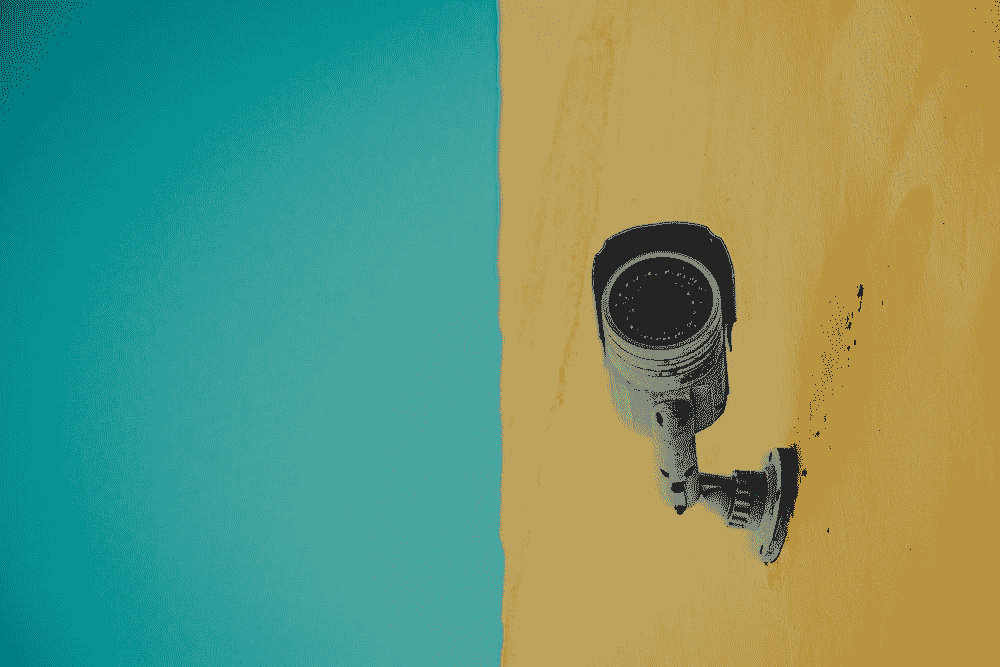
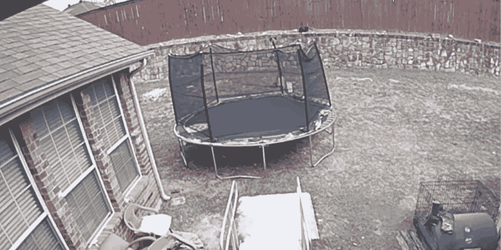
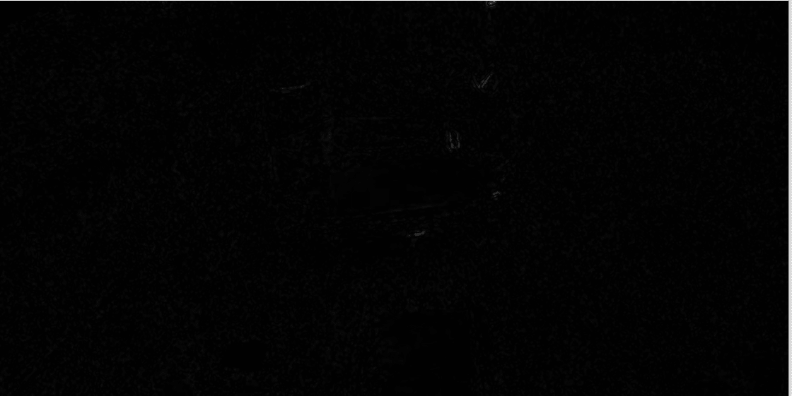

# 用 Python 编写家庭入侵系统/运动探测器

> 原文：<https://towardsdatascience.com/coding-a-home-intruder-system-motion-detector-with-python-22f5ba8bcca0>

## 通过编写您自己的安全摄像机，了解如何检测运动、处理和分析图像



(图片由[阿尔伯托·罗德里格斯桑塔纳](https://unsplash.com/@a13ert)上[未拉车](https://unsplash.com/photos/i_nIoSCdHv4)

在许多情况下，分析和挖掘图像和视频流中的数据非常有用。在这篇文章中，我们将关注一个非常基本的技术:检测流中的运动，以便我们可以隔离运动的东西，并应用进一步的分析和/或检测。

**的目标**是**学习运动检测如何工作，并学习如何应用所需的技术**，这样你就可以在自己的项目中使用它们；想想检测运动的图像处理和在视频流中显示运动的方法。本文的最终结果将是一些代码，例如，可以应用于家庭入侵系统或野生动物摄像机。我们来编码吧！

## 在开始之前

当然，在处理视频流时，可能会涉及到数据。始终考虑处理清晰可见人物图像的潜在风险。查看以下文章，了解如何降低处理此类数据的潜在风险:

<https://mikehuls.medium.com/image-analysis-for-beginners-detect-and-blur-faces-with-a-simple-function-60ba60753487>  

## 结果呢

让我们先看看我们的目标是什么:



最终结果(作者提供的 gif)

如您所见，我们能够检测视频中是否检测到运动，甚至隔离运动(绿色矩形)。请注意，像改变灯光或摇摆草地这样非常小的动作会被忽略。在接下来的部分中，我们将探索这是如何实现的。

</why-is-python-so-slow-and-how-to-speed-it-up-485b5a84154e>  

# 战略

我们将每 10 秒创建一个截图，并将每一帧与该截图进行比较。如果有任何差异，我们将通过在检测到移动的区域周围画一个大的绿色矩形来显示它们。此外，我们将添加一个红色的大文本，上面写着“检测到移动！”。

该过程可以用以下步骤来描述:

1.  获取摄像机记录的画面
2.  设置**比较框**；我们将把后面的每一帧与这一帧进行比较，这样我们就可以检测到变化(即运动)
3.  分析每一帧:获得与比较帧的差异
4.  过滤差异:只考虑足够大的区域
5.  在差异周围画绿色矩形
6.  搞定了。

</applying-python-multiprocessing-in-2-lines-of-code-3ced521bac8f>  

## 第一步。阅读视频

我们将使用 Python 和一个名为 OpenCV 和 PIL (Python Image Lib)的包。像这样安装它们:

```
pip install opencv-python pillow
```

现在让我们设置一些允许我们读取帧的代码。因为我想创建一个好看的例子，所以我选择录制我的屏幕的一部分，显示一个 Youtube 视频，显示入侵者如何进入某人的后院。如果你想使用你的网络摄像头或其他摄像头，我会给你介绍下面的文章。

</image-analysis-for-beginners-how-to-read-images-video-webcam-and-screen-3778e26760e2>  

因为我只录制我的屏幕的一部分，所以我需要屏幕顶部，屏幕机器人等。参数，以便我可以很好地“抓取”(截图)它们:

我们将跳到 X 行，在那里我们读取帧。前面的代码将在接下来的部分中变得清晰。我们启动一个无限 while 循环，并使用 ImageGrab 创建一个屏幕截图，我们将把它转换成一个 Numpy-array。这是一个保存截图中每个像素的 RGB 值的数组。

</keep-your-code-secure-by-using-environment-variables-and-env-files-4688a70ea286>  

## 第 2 部分:预处理

在这一部分中，我们将准备用于检测运动的图像。

OpenCV 默认支持 BGR(查看上面的文章)，所以我们需要将 BGR 转换成 RGB。我们稍后将需要`img_rgb`，因为我们想要显示它。接下来的两行涉及到将 RGB 图像转换成黑白图像。这是因为像素阵列现在只需要“保持”一个值(黑度),而不是三个值(红、绿和蓝)。最后，我们将图像模糊一点，这样非常小的差异就不那么明显了。

</create-a-fast-auto-documented-maintainable-and-easy-to-use-python-api-in-5-lines-of-code-with-4e574c00f70e>  

## 第三部分。比较图像

首先我们必须设置**比较框架**，因为我们需要一些东西来比较我们的框架。我们每隔 10 秒钟就会这样做(这就是第 1 部分中的`strt_time`的用途。

接下来我们使用一个名为`absdiff`的 cv2 函数。这将从比较帧中减去当前帧的像素值(“黑度”)。结果看起来像这样:



我们的视频与对比框架有何不同(作者提供的 gif)

与比较框架不同的值变成白色；剩下的是黑色。

## 第四部分。过滤

也许有时候树枝会动，云会在太阳前面移动，或者一片垃圾会吹过街道。我们不希望每一个微小的差异都会触发我们的警报系统。

在这个代码中，确定了每个像素的色差必须至少为 20(255 分)。满足该阈值的每个像素将变成 100%白色，其余的将变成 100%黑色。

</image-analysis-for-beginners-destroying-duck-hunt-with-opencv-e19a27fd8b6>  

## 第五部分。视觉反馈

这是最精彩的部分。我们已经分析了我们的图像，现在是时候*得出*的结论了(双关语)。

首先，我们将找到所有的轮廓，这些是可以组合在一起的阈值框架的区域。将轮廓想象成 MS paint 中的填充桶。

接下来，我们将遍历每个轮廓，如果面积足够大，我们将计算轮廓周围的外接矩形。我们将使用它在轮廓周围绘制绿色矩形。如果至少有一个轮廓足够大，我们也插入一个文本。注意，我们在之前保存的`img_rgb`帧上绘制了矩形和文本。

最后一部分是展示结果。


(作者 gif)

# 结论

通过这篇文章，我希望已经展示了一些准备、处理和分析图像的方法，以便您从图像中提取和分析数据。你可以在这里找到这篇文章 [**的完整代码**](https://gist.github.com/mike-huls/110d9e1850364793e18d739ef6c6742c) 。

我希望这篇文章像我希望的那样清楚，但如果不是这样，请让我知道我能做些什么来进一步澄清。同时，请查看我的关于各种编程相关主题的其他文章:

*   绝对初学者的 Git:借助视频游戏理解 Git
*   [创建并发布自己的 Python 包](https://mikehuls.medium.com/create-and-publish-your-own-python-package-ea45bee41cdc)
*   [绝对初学者的虚拟环境——什么是虚拟环境，如何创建虚拟环境(+示例)](https://mikehuls.medium.com/virtual-environments-for-absolute-beginners-what-is-it-and-how-to-create-one-examples-a48da8982d4b)

编码快乐！

—迈克

喜欢我正在做的事情吗？ [*跟我来！*](https://mikehuls.medium.com/membership)

<https://mikehuls.medium.com/membership> 