# 在 NumPy 中从头开始编写神经网络

> 原文：<https://towardsdatascience.com/coding-a-neural-network-from-scratch-in-numpy-31f04e4d605>

## 通过从零开始实现人工智能来加深您对人工智能的理解


[附身摄影](https://unsplash.com/@possessedphotography?utm_source=medium&utm_medium=referral)在 [Unsplash](https://unsplash.com?utm_source=medium&utm_medium=referral) 上拍照

# 介绍

在本文中，我将使用 NumPy 从头开始介绍人工神经网络的开发。这个模型的结构是所有人工神经网络中最基本的——一个简单的前馈网络。我还将展示这个模型的 [Keras](https://keras.io/) 等价物，因为我试图让我的实现‘Keras-esque’。虽然与变压器等其他神经网络相比，前馈体系结构是基本的，但这些核心概念可以推广到构建更复杂的神经网络。这些话题本质上是技术性的。关于人工智能更概念性的文章，请查看我的另一篇文章，[揭开人工智能的神秘面纱](https://medium.com/geekculture/demystifying-artificial-intelligence-bdd9a117d4a6)。

## 目录

*   **架构概述**
    —正向传递
    —反向传递
*   **NumPy 实现** —数据
    —构建层
    —构建网络
    — **网络** : *正向传递*
    — **层** : *正向传递
    —执行正向传递/完整性检查
    —* **网络** : *反向传递
    —*
*   ****结论****

## **术语词汇表**

*   **X =输入**
*   **y =标签**
*   **W =重量**
*   **b =偏差**
*   **Z =和 W 加上 b 的点积**
*   **A =激活(Z)**
*   **k =类别数**
*   **小写字母表示向量，大写字母表示矩阵**

# **体系结构**

## **前进传球**

> **点积**

**首先，我们计算输入和权重的点积，并添加一个偏差项。**

**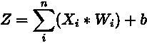**

**点积+偏差。图片作者。**

**第二，我们将第一步中获得的加权和通过一个激活函数。**

**这两种操作都是基于元素的，并且简单明了。所以，我就不深入了。更多关于点积和激活函数的信息，请点击[点积](https://www.mathsisfun.com/algebra/vectors-dot-product.html)、[激活函数](https://www.mygreatlearning.com/blog/activation-functions/)。这些计算发生在每个隐藏层的每个神经元中。**

****

**神经元计算概述。图片作者。**

****

**函数符号—模型预测。图片作者。**

> **激活功能**

**在我的实现中，我们在隐藏层使用 ReLU 激活，因为这很容易区分，而在输出层使用 Softmax 激活(下面将详细介绍)。在未来的版本中，我将把它构建得更加健壮，并启用这些激活功能中的任何一个。**

*****常用激活功能:*****

**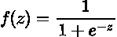**

**乙状结肠激活功能。图片作者。**

**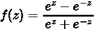**

**Tanh 激活函数。图片作者。**

**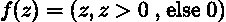**

**ReLU 激活功能。图片作者。**

## **偶数道次**

> **损失函数**

**我们首先计算损耗，也称为误差。这是衡量模型有多不正确的标准。**

**损失是一个微分目标函数，我们将训练模型使其最小化。根据您尝试执行的任务，您可以选择不同的损失函数。在我的实现中，我们使用分类交叉熵损失，因为这是一个多分类任务，如下所示。对于二元分类任务，可以使用二元交叉熵损失，对于回归任务，可以使用均方误差。**

**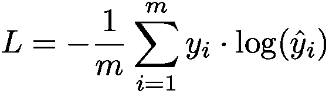**

**分类交叉熵损失。图片作者。**

**这给我造成了一些困惑，所以我想详细说明一下这里发生了什么。上面的公式暗示标签是[一键编码](https://en.wikipedia.org/wiki/One-hot)。Keras 希望标签是一次性的，但是我的实现不希望如此。这里有一个计算交叉熵损失的例子，以及为什么**没有必要对标签**进行一次性编码的例子。**

**给定来自单个样本的以下数据，独热编码标签(y)和我们的模型预测(yhat)，我们计算交叉熵损失。**

**y = [1，0，0]**

**ŷ = [3.01929735e-07，7.83961013e-09，9.9999690 e-01]**

****

**计算带有独热编码标签的交叉熵损失。图片作者。**

**正如您所看到的，这个示例中正确的类是零，由 y 数组的零索引中的 1 表示。我们将输出概率的负对数乘以该类别的相应标签，然后对所有类别求和。**

**你可能已经注意到了，除了零索引，我们得到零，因为任何乘以零的东西都是零。**这归结起来就是我们在正确类别的相应索引处的概率的负对数。这里正确的分类是零，所以我们取零索引处概率的负对数。****

**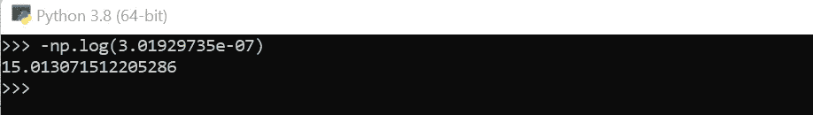**

**零索引处概率的负对数。图片作者。**

**总损耗是所有样本的平均值，在等式中用 **m** 表示。为了得到这个数字，我们对每个样本重复上述计算，计算总和并除以样本总数。**

> **随机梯度下降**

**现在我们已经计算出了损失，是时候把它降到最低了。我们首先计算相对于输入参数的输出概率的[梯度](https://betterexplained.com/articles/vector-calculus-understanding-the-gradient/)，并将梯度反向传播到每一层的参数。**

**在每一层，我们执行与正向传递类似的计算，除了不是只对 Z 和 A 进行计算，我们必须对每个参数(dZ，dW，db，d A)执行计算，如下所示。**

***隐藏层***

****

**隐藏层 dZ。图片作者。**

**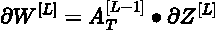**

**当前层的权重渐变。图片作者。**

****

**当前层的偏置梯度-样本之和。图片作者。**

****

**激活梯度—这是下一层的 dA[L]。图片作者。**

**在输出层有一个 dZ 的特例，因为我们使用的是 softmax 激活。本文稍后将对此进行深入解释。**

# **NumPy 实现**

## **数据**

**我将为这个模型使用简单的虹膜数据集。**

```
from sklearn.preprocessing import LabelEncoderdef get_data(path):
    data = pd.read_csv(path, index_col=0) cols = list(data.columns)
    target = cols.pop() X = data[cols].copy()
    y = data[target].copy() y = LabelEncoder().fit_transform(y) return np.array(X), np.array(y)X, y = get_data("<path_to_iris_csv>")
```

## **初始化图层**

**密集层类**

## **初始化网络**

**ANN 类**

# **网络——向前传递**

## **体系结构**

**让我们从动态初始化网络架构开始。这意味着我们可以为任意数量的层和神经元初始化我们的网络架构。**

**人工神经网络架构**

**我们首先创建一个矩阵，将我们的维度(特征数量)映射到输入层的神经元数量。从这一点来看，它非常简单——新层的输入维度是前一层中神经元的数量，输出维度是当前层中神经元的数量。**

```
model = Network()
model.add(DenseLayer(6))
model.add(DenseLayer(8))
model.add(DenseLayer(10))
model.add(DenseLayer(3))model._compile(X)print(model.architecture)**Out -->**[{'input_dim': 4, 'output_dim': 6, 'activation': 'relu'},
 {'input_dim': 6, 'output_dim': 8, 'activation': 'relu'},
 {'input_dim': 8, 'output_dim': 10, 'activation': 'relu'},
 {'input_dim': 10, 'output_dim': 3, 'activation': 'softmax'}]
```

## **因素**

**现在我们已经创建了一个网络，我们需要再次动态初始化我们的可训练参数(W，b ),用于任意数量的层/神经元。**

**初始化人工神经网络参数**

**如您所见，我们在每一层都创建了一个权重矩阵。**

**该矩阵包含每个神经元的向量和每个输入特征的维度。**

**一层中的每个神经元都有一个具有维度的偏置向量。**

**还要注意，我们设置了一个 np.random.seed()，以便每次都能获得一致的结果。试着注释掉这行代码，看看它对你的结果有什么影响。**

```
model = Network()
model.add(DenseLayer(6))
model.add(DenseLayer(8))
model.add(DenseLayer(10))
model.add(DenseLayer(3))model._init_weights(X)
print(model.params[0]['W'].shape, model.params[0]['b'].shape)
print(model.params[1]['W'].shape, model.params[1]['b'].shape)
print(model.params[2]['W'].shape, model.params[2]['b'].shape)
print(model.params[3]['W'].shape, model.params[3]['b'].shape)**Out -->**(6, 4) (1, 6)
(8, 6) (1, 8)
(10, 8) (1, 10)
(3, 10) (1, 3)
```

## **正向传播**

**在网络中执行一次全转发的功能。**

**网络正向传播**

**我们将前一层的输出作为输入传递给下一层，用 **A_prev** 表示。**

**我们将输入和加权和存储在模型存储器中。这是执行向后传递所需要的。**

# **层—向前传递**

## **激活功能**

**正向传递层方法**

****记住这些是基于元素的函数。****

> **热卢**

**用于隐藏层。概述部分提到了函数和图形。下面是我们调用 np.maximum()时发生的情况。**

```
if input > 0:
 return input
else:
 return 0
```

> **Softmax**

**用于最后一层。该函数获取 k 个实数值的输入向量，并将其转换为 k 个概率的向量，其总和为 1。**

**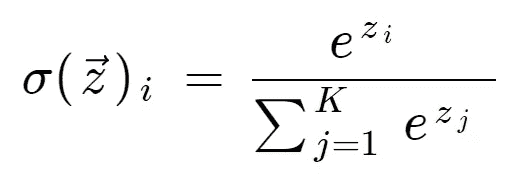**

**函数符号。图片作者。**

***其中:***

**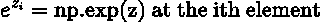**

**获取非标准化值。图片作者。**

**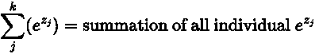**

**对每个元素进行归一化，以获得概率分布。图片作者。**

***单样本示例:***

**输入向量= [ 8.97399717，-4.76946857，-5.33537056]**

**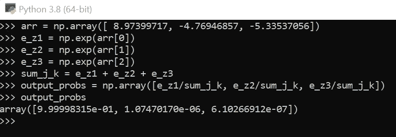**

**Softmax 计算如下公式。图片作者。**

## **单层正向传播**

**层向前传播**

***其中:***

*   **输入= A_prev**
*   **权重=当前层的权重矩阵**
*   **偏置=当前层的偏置向量**
*   **激活=当前层的激活功能**

**我们在网络的 **_forwardprop** 方法中调用这个函数，并将网络的参数作为输入传递。**

# **执行向前传球**

```
model = Network()
model.add(DenseLayer(6))
model.add(DenseLayer(8))
model.add(DenseLayer(10))
model.add(DenseLayer(3))model._init_weights(X)
out = model._forwardprop(X)print('SHAPE:', out.shape)
print('Probabilties at idx 0:', out[0])
print('SUM:', sum(out[0]))**Out -->**
SHAPE: (150, 3)Probabilties at idx 0: [9.99998315e-01, 1.07470169e-06, 6.10266912e-07]SUM: 1.0
```

**完美。一切都在一起了！我们有 150 个实例映射到我们的 3 个类，每个实例的概率分布总和为 1。**

# **网络——后向通道**

## **反向传播**

**在网络中执行一次完整的反向传递的功能。**

**网络反向传播**

**我们从计算分数的梯度开始。用 dscores 表示。这是概述部分提到的 dZ 的特例。**

**根据 [CS231n](http://cs231n.stanford.edu/) :**

> **我们现在希望了解 z 内部的计算值应该如何改变，以减少本示例对完全目标有贡献的损耗 Li。换句话说，我们想得到梯度∂Li/∂zk.**
> 
> **损耗 Li 是从 p 计算的，而 p 又取决于 z。对于读者来说，使用链式法则来推导梯度是一个有趣的练习，但在很多东西相互抵消之后，最终证明它非常简单且易于理解:“**

**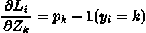**

**根据 Stanfords CS231n 推导 dscores。来源:[斯坦福 CS231n](http://cs231n.stanford.edu/)**

***其中:***

**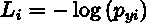**

**引入术语 Li 来表示损失。在概述部分对此进行了深入探讨。来源:[斯坦福 CS231n](http://cs231n.stanford.edu/)**

**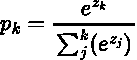**

**引入术语 pk 来表示归一化概率(softmax 输出)。来源:[斯坦福 CS231n](http://cs231n.stanford.edu/)**

***单样本示例:***

**对于每个样本，我们找到正确类别的索引并减去 1。相当简单！这是上面代码块中的第 9 行。由于 dscores 是一个矩阵，我们可以使用样本和相应的类标签进行双重索引。**

**输入向量= [9.99998315e-01，1.07470169e-06，6.10266912e-07]**

**输出向量= [-1.68496861e-06，1.07470169e-06，6.10266912e-07]**

**这里正确的索引是零，所以我们从零索引中减去 1。**

****注意，我们从输出层开始，然后转移到输入层。****

# **层—向后传递**

## **活化导数**

**ReLU 导数函数**

**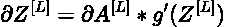**

**ReLU 导数的函数符号。图片作者。**

## **单层反向传播**

**该函数将梯度反向传播到层中的每个参数。**

**层后退法**

**再次展示这些，因为它们非常重要。这些是反向传递计算。**

**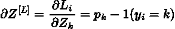**

**dZ-soft max 层的特例。图片作者。**

****

**隐藏层 dZ。图片作者。**

****

**dW —在所有层中保持一致。图片作者。**

****

**db —在所有层中保持一致。图片作者。**

**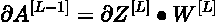**

**dA[L-1] —在所有层中保持一致。图片作者。**

**大家可以看到，除了 dZ 的计算，每一层的步骤都是一样的。**

# **执行向后传递**

```
model = Network()
model.add(DenseLayer(6))
model.add(DenseLayer(8))
model.add(DenseLayer(10))
model.add(DenseLayer(3))model._init_weights(X)
out = model._forwardprop(X)
model._backprop(predicted=out, actual=y)print(model.gradients[0]['dW'].shape, model.params[3]['W'].shape)
print(model.gradients[1]['dW'].shape, model.params[2]['W'].shape)
print(model.gradients[2]['dW'].shape, model.params[1]['W'].shape)
print(model.gradients[3]['dW'].shape, model.params[0]['W'].shape)**Out -->** (10, 3) (3, 10)
(8, 10) (10, 8)
(6, 8) (8, 6)
(4, 6) (6, 4)
```

**哇，太美了。请记住，渐变是从输出图层开始计算的，向后移动到输入图层。**

# **火车模型**

**准确性/损失方法**

**要理解这里发生了什么，请重新访问概述部分，在那里我深入讨论了损失的计算并给出了一个例子。**

**现在是在每次迭代(历元)之后执行参数更新的时候了。让我们实现 **_update** 方法。**

**更新参数**

**终于到了把所有的东西放在一起并训练模型的时候了！**

**训练模型方法**

## **数字模型**

```
model = Network()
model.add(DenseLayer(6))
model.add(DenseLayer(8))
model.add(DenseLayer(10))
model.add(DenseLayer(3))model.train(X, y, 200)**Out -->** EPOCH: 0, ACCURACY: 0.3333333333333333, LOSS: 8.40744716505373
EPOCH: 20, ACCURACY: 0.4, LOSS: 0.9217739285797661
EPOCH: 40, ACCURACY: 0.43333333333333335, LOSS: 0.7513140371257646
EPOCH: 60, ACCURACY: 0.42, LOSS: 0.6686109548451099
EPOCH: 80, ACCURACY: 0.41333333333333333, LOSS: 0.6527102403575207
EPOCH: 100, ACCURACY: 0.6666666666666666, LOSS: 0.5264810434939678
EPOCH: 120, ACCURACY: 0.6666666666666666, LOSS: 0.4708499275871513
EPOCH: 140, ACCURACY: 0.6666666666666666, LOSS: 0.5035542867669844
EPOCH: 160, ACCURACY: 0.47333333333333333, LOSS: 1.0115020349485782
EPOCH: 180, ACCURACY: 0.82, LOSS: 0.49134888468425214
```

> **检查结果**

**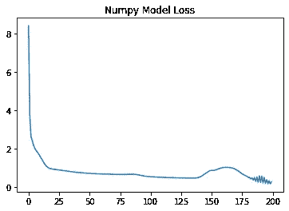****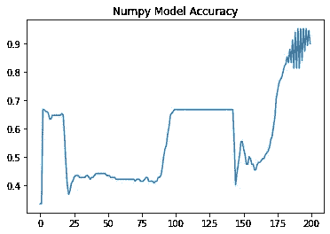

图片作者。** 

> **尝试不同的架构**

```
model = Network()
model.add(DenseLayer(6))
model.add(DenseLayer(8))
# model.add(DenseLayer(10))
model.add(DenseLayer(3))model.train(X, y, 200)
```

**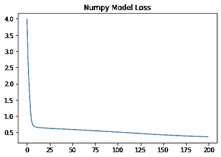****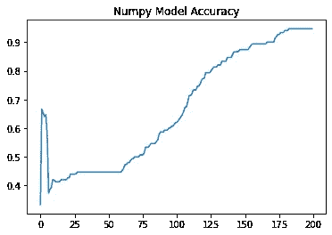

图片作者。** 

## **喀拉斯当量**

```
from keras.models import Sequential
from keras.layers import Dense
import tensorflow as tf
from tensorflow.keras.optimizers import SGDohy = tf.keras.utils.to_categorical(y, num_classes=3)model2 = Sequential()
model2.add(Dense(6, activation='relu'))
model2.add(Dense(10, activation='relu'))
model2.add(Dense(8, activation='relu'))
model2.add(Dense(3, activation='softmax'))model2.compile(SGD(learning_rate=0.01), loss='categorical_crossentropy', metrics=['accuracy'])model2.fit(x=X, y=ohy, epochs=30)
```

> **检查结果**

**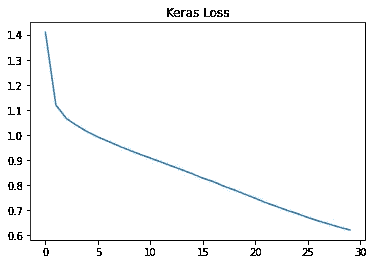****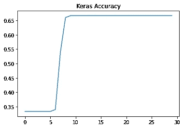

图片作者。** 

**Keras 不设置 random.seed()，所以每次运行之间会得到不同的结果。如果从 **_init_weights** 方法中删除这一行，NumPy 网络的行为是一样的。**

# **结论**

**如果你已经走到这一步，那么恭喜你。这些都是令人费解的话题——这也是为什么我必须把这篇文章放在一起的原因。来验证我自己对神经网络的理解，并希望将这些知识传递给其他开发者！**

**完整代码在此: [NumPy-NN/GitHub](https://github.com/j0sephsasson/numpy-NN/blob/main/model/model.py)**

**我的 LinkedIn: [约瑟夫·萨森| LinkedIn](https://www.linkedin.com/in/joseph-sasson23/)**

**我的邮箱:sassonjoe66@gmail.com**

**请不要犹豫，取得联系，并呼吁任何错误/错误，你可能会遇到的代码或数学！**

*****感谢阅读。*****