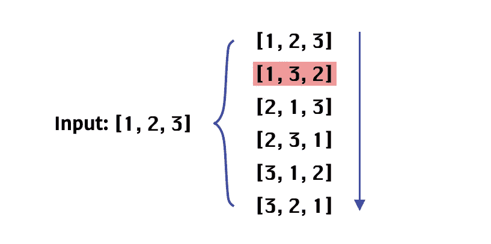
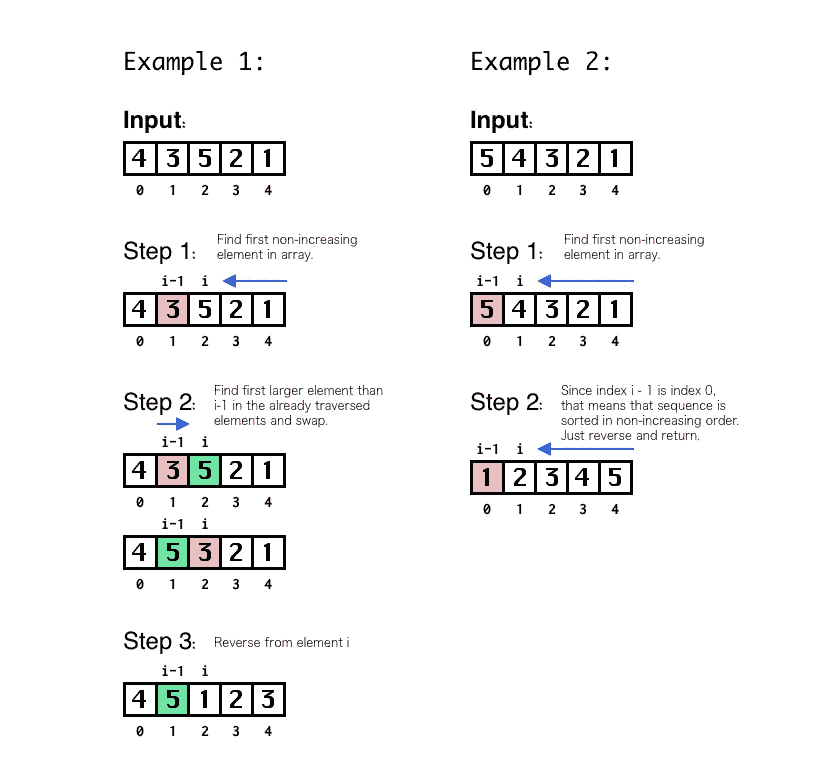

# 编码面试:下一次置换

> 原文：<https://towardsdatascience.com/coding-interview-next-permutation-1cd07dcb20db>

## 一个在编码面试中经常出现的排列问题的教程。


图一。下一个排列|图标由 [JungSa](https://www.flaticon.com/authors/jungsa)

排列(和组合)问题在代码面试中经常出现，并且由于有效解决问题所需的基础知识而具有挑战性。

在这篇博文中，我们将看到一些解决*下一个排列*问题的方法和技术，从基于蛮力的方法开始，以找到更有效的解决方案。

我们开始吧！

# 问题陈述

让我们来看看问题的定义:

> 整数数组的下一个排列是其整数的下一个更大的排列。更正式的说法是，如果数组的所有排列都在一个容器中按照它们的字典顺序排序，那么该数组的下一个排列就是排序容器中它后面的排列。[ [1](https://leetcode.com/problems/next-permutation/) ]

例如:

```
**Case 1**
**Input**: nums = [1,2,3]
**Output**: [1,3,2]**Case 2**
**Input:** nums = [3,2,1]
**Output:** [1,2,3]**Case 3
Input**: nums = [2,0,2,2]
**Output**: [2,2,0,2]
```

简而言之，该问题需要以下排列作为输入，给定从给定排列开始的升序。如果没有更大的排列，则返回具有最小字典序值的排列。在图 2 中，我们看到了从按字典顺序排列的`[1,2,3]`生成的排列的表示。



图二。从[1，2，3]开始的所有字典序排列的表示。作者用红色|图像表示输入的下一个排列。

一旦明确了问题的定义和范围，让我们继续解决方案，从基于蛮力的方法开始，然后应用一种技术来获得更有效的解决方案。让我们去吧！

# 方法 1:暴力

强力方法的关键思想是生成所有排列，按字典顺序排序，并提取由`input`确定的下一个排列。在代码片段 1 中，我们可以看到暴力方法的实现。

代码片段 1。下一个排列问题的强力解决方案

给定一组`n`元素的排列数为`n!`，那么运行时复杂度为 O(N！)和 O(N)表示内存使用情况。值得一提的是，在代码片段 1 中展示的基于暴力的方法中，主要的运行时复杂度是 O(N！).尽管实现最小堆的复杂度为 O(N Log N ),并且寻找下一个排列的复杂度为 O(N ),但是最终的主要复杂度为 O(N！).

从这个问题衍生出的一个对代码面试非常有用的重要话题是使用特定的递归技术(比如`backtracking`)生成排列，对此我将写一整篇博客。与此同时，您可以看看第 10 行的代码片段 1，其中 función `backtrack()`是以一种高效而优雅的方式为置换生成而定义的。

继续问题，不生成所有的排列，怎么找到下一个排列？好吧，让我们在下一节详细看看。

# 方法 2:诀窍

下一个排列问题，乍一看，似乎有很高的复杂程度。然而，它比看起来要简单。事实上，在最简单的形式中，问题可以一次解决。“诀窍”是知道、推断或以这种方式找出解决问题的步骤。

步骤描述如下:
1。从后向前遍历数组`nums`，直到找到序列中的第一个非递增元素，比如说`nums[i-1]`。
2。如果索引`i-1`不为零，则找到并交换大于元素`nums[i-1]`的第一个元素。如果索引`i-1`是零，这意味着该序列是按降序排列的，因此它是可以形成的最大序列，因此，该过程通过返回相反的序列而结束。
3。从索引`i`开始的元素被反转。

在图 3 中，我们可以看到解决下一个排列问题时两种情况的可视化表示。



图 3。下一个排列示例。|图片作者

在代码片段 2 中，我们可以看到有效解决下一个置换问题的函数的定义。

代码片段 2。下一个排列，最佳方法。

由于`nums`数组最多被遍历两次，运行时复杂度是线性的 O(N ),内存使用保持恒定 O(1 ),因为不需要额外的内存来解决问题。

太好了，如果你在代码面试中遇到下一个排列问题，现在你有了一个解决它的选择。

# 结论

排列和组合问题需要特定的技术来有效地解决它们(例如回溯)。然而，这个特殊的问题可以用另一种方法解决。解决这个问题变得有争议，因为它可以被视为“知道诀窍与否”，这是可以理解的，但这不是我们(那些在面试中解决这类问题的人)可以做出的决定。控制。

# 参考

[1][https://leetcode.com/problems/next-permutation/](https://leetcode.com/problems/next-permutation/)