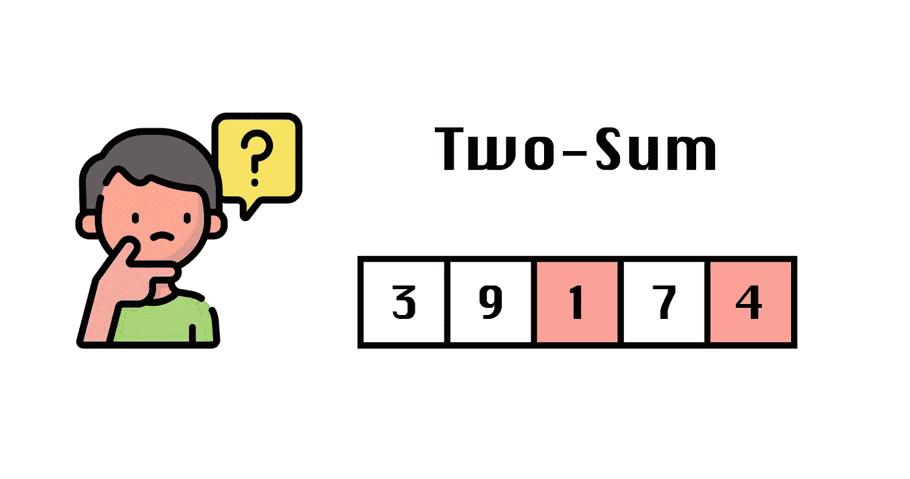

# 编码面试:两个总和

> 原文：<https://towardsdatascience.com/coding-interview-two-sum-bbc615c0e952>

## 一个博客教程来理解二和问题，它的变种，以及一些有效解决它的方法



图一。两笔加总|作者图片|图标

在技术面试中，最常出现的问题之一就是`Two-Sum`。在这篇博客教程中，我们将看到如何解决`Two-Sum`问题，它的变体以及用`Big(O)`符号表示的时间和空间复杂性。

我们开始吧！

# 问题陈述

让我们来看看这个问题的基本定义:

> 给定一个整数数组`nums`和一个`target`，如果有任何一对数字的总和为`target`，则返回`true`，否则返回`false`。

例如:

```
**Case 1**
**Input**: nums = [3,1,5,2,9] target = 7
**Output**: True**Case 2**
**Input**: nums = [3,1,5,2,9] target = 1
**Output**: False
```

值得一提的是，结果的类型可以是`boolean`(如上例所示)，或者可能需要返回总计为`target`的一对数字的索引。

> 在开始处理和解决问题的一些方法之前，**强烈建议**澄清疑问并确定问题的范围。你可以问面试官一些问题来帮助你定义问题的范围:
> -数组排序了吗？
> -内存使用有什么限制吗？
> -运行时是否有任何约束？

出于实际目的，我们假设现在数组`nums`将是未排序的，并且没有内存和运行时约束。

那么，我们怎么解决呢？一步一步来，首先，我们会看到如何以最不优化的方式解决它，然后我们可以如何改善它，让我们去做吧！

# 方法 1:暴力

有时候，为了更接近最优解，建议先用一种*蛮力*的方法，这种方法显然不会是最优的，但会为理解问题提供基础，为优化让路。

第一种方法是比较从`nums`可能形成的所有可能的对，如果我们找到总计为`target`的对，我们完成该过程。该函数如代码片段 1 所示。

代码片段 1。二和:暴力解决方案

尽管这种方法找到了解决方案，但是由于为了得到解决方案而必须进行的比较的数量，它不是最佳的解决方案，也就是说，对于`nums`、`n-1`中的每个`n`元素，进行比较，这产生了二次 O(N)执行时间。存储器使用保持恒定 O(1 ),因为不需要额外的存储器来执行比较。

优化这种暴力方法的一种方法是使用额外的内存，这将导致运行时和内存中的 O(N)复杂度，让我们看看如何做到这一点。

# 方法 2:使用 Set()进行优化

这种方法的目的是通过利用额外的内存来避免二次比较的次数，在这种情况下，通过利用 Python 中的 set 或`set()`。

使用`set()`允许我们在常数时间 O(1)内插入或查询，唯一要考虑的方面是`set()`将需要 O(N)顺序的内存，如果是问题范围内的约束，就必须考虑。

这种方法的思想是将`nums`的所有元素放入`set()`。然后遍历`nums`的每个元素，检查`set()`中是否存在`target — num`，如果存在，返回`true`。代码片段 2 显示了函数定义。

代码片段 2。两和:使用 set()的解决方案

将 N 个元素插入到`n`需要 O(N) x O(1 ),结果是 O(N)。循环遍历`nums`中的每个`num`以验证`set()`中是否存在补码`target — num`也需要 O(N)，结果是 O(N) + O(N)最终在运行时接近 O(N)，在内存中接近 O(N)。

值得一提的是，使用`set()`的方法只有在返回值为`boolean`时才有效，也就是说，不需要返回额外的信息。如果我们需要返回总计为`target`的数字的索引，我们可以使用`hashmap`来代替。我们来看看怎么做。

# 方法 3:使用 HashMap()进行优化

这种方法解决了这样一种变化，即需要返回相加到`target`的一对数字的索引，而不仅仅是返回`true`或`false`。

例如:

```
**Case 1**
**Input**: nums = [3,1,5,2,9] target = 7
**Output**: [2, 3]**Case 2**
**Input**: nums = [3,1,5,2,9] target = 1
**Output**: []
```

对于这种变化，`hashmap()`帮助我们跟踪指数。接下来，我们只需要检查`target — nums[i]`的补码是否存在于`hashmap()`中，如果存在，返回`current`和`complement`索引。该函数如代码片段 3 所示。

代码片段 3。Two-Sum:使用 hashmap()的解决方案

在一个`hashmap()`中插入和查询键需要恒定的 O(1)时间，所以用`n`元素填充`hashmap()`需要恒定的时间 O(N)，这也导致线性顺序内存使用 O(N)。遍历`nums`的每个元素以检查`target — nums[i]`是否存在于`hashmap()`中需要 O(N)个常数时间，结果是执行时间和内存使用的总时间为 O(N)。

虽然利用`hashmap()`有助于我们验证`target — nums[i]`是否作为键存在，但是我们仍然可以更有效地使用它。请注意，在第 8 行，我们完全循环通过`nums`来填充`hashmap()`，然后循环通过第 12 行的`nums`来验证补数，这导致遍历 2 次`nums`。让我们看看如何通过仅循环一次`nums`来使这种方法更有效。

# 方法 4:使用 HashMap() II 进行优化

这种方法的思想是只遍历`nums`一次，以验证`target — nums[i]`是否作为键存在于`hashmap()`中。这将使执行时间更有效，尽管它仍然是线性的，而不是在`nums`上迭代两次，现在我们将只做一次。代码片段 4 显示了函数的定义。

代码片段 4。Two-Sum:使用 hashmap() II 的解决方案

由于我们在这种情况下循环通过`nums`，执行时间也是线性的 O(N)，并且由于我们使用了`hashmap()`，内存使用也是线性的 O(N)。通过避免在`nums`上迭代两次并且只做一次来进行优化。

回到原来的问题，我们只需要返回`true`或`false`，如果`nums`已经排序了，我们将如何处理这个问题？我们来看看怎么做。

# 方法 5:排序数组的优化

假设不是`nums`不排序，而是发现`nums`按非降序排序。

例如:

```
**Case 1**
**Input**: nums = [1,2,3,5,9] target = 7
**Output**: True**Case 2**
**Input**: nums = [1,2,3,5,9] target = 1
**Output**: False
```

在这种情况下，问题条件是合适的，因此不再需要使用额外的内存来跟踪已经访问过的号码。在这种情况下，通过实现**两个指针**的技术，我们可以确定是否有一对总计为`target`。代码片段 5 展示了该函数的实现。

代码片段 5。Two-Sum(排序数组):使用双指针技术的解决方案

这种方法的执行时间是线性的 O(N ),因为在最坏的情况下，我们只遍历每个 nums 元素一次。空间使用是恒定的，因为不需要额外的内存使用。

# 结论

两和问题可以有不同的变化和条件，总是建议尽可能澄清，以避免误解，并选择正确的路径。在这篇博客中，我们看到了一些变化，以及如何处理它们，从基于蛮力的方法到寻找更优化的方法。

如果你有具体的变化或任何其他问题，我们可以在博客中分解，请留下你的评论。

# 参考

[1][https://leetcode.com/problems/two-sum/](https://leetcode.com/problems/two-sum/)

[https://leetcode.com/ferneutron/](https://leetcode.com/ferneutron/)