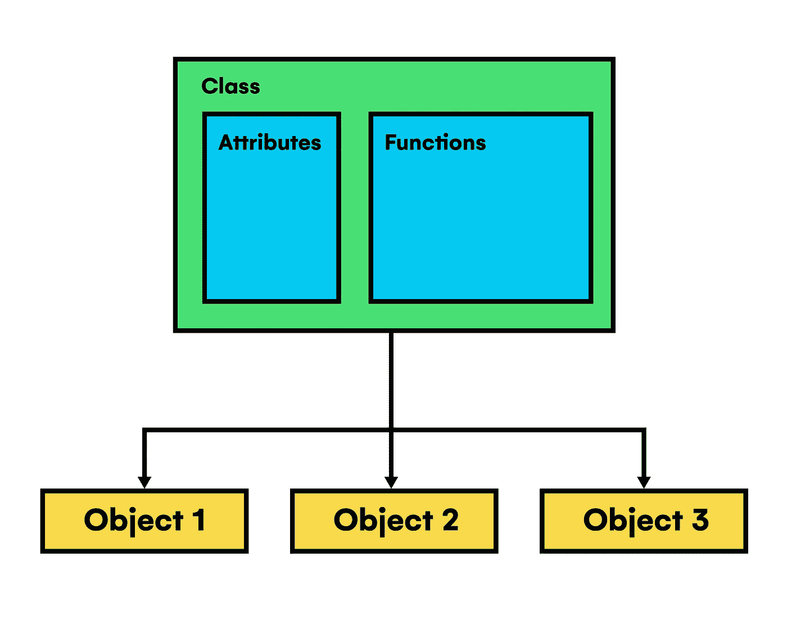
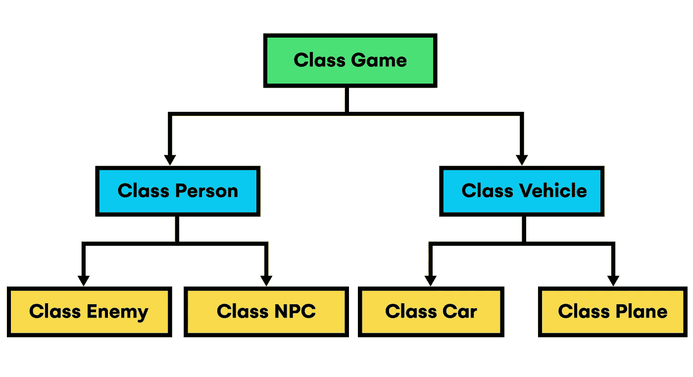
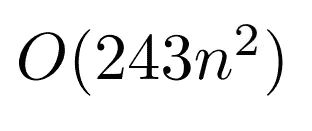
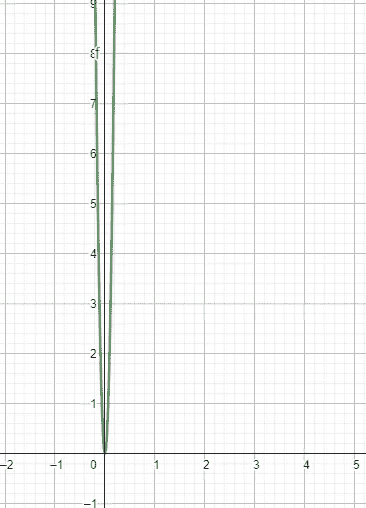
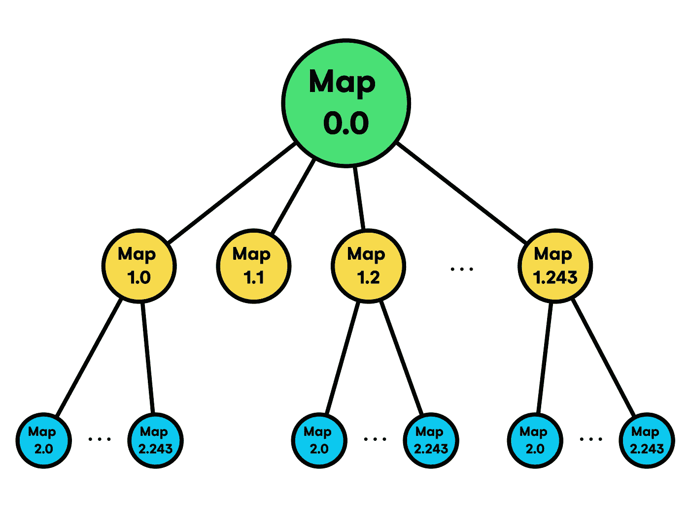

# 编写 Smart Wordle Solver Python 版本的代码(第 2 部分)

> 原文：<https://towardsdatascience.com/coding-the-smart-wordle-solver-python-version-part-2-a0ed4d127225>

## 智能单词解算器的 Java 和 Python 实现之间的广泛比较


照片由[耶鲁安穴獭](https://unsplash.com/@jeroendenotter?utm_source=medium&utm_medium=referral)在 [Unsplash](https://unsplash.com?utm_source=medium&utm_medium=referral)

## 介绍

继续上一篇文章 [***用 Java***](https://medium.com/towards-data-science/building-a-smart-wordle-solver-with-java-cb734d4a9635) 构建一个智能 Wordle 解算器，这篇文章*(第二部分)*将用两种语言中可用的相同工具介绍它的 Python 实现，以及对两种替代方案的性能、可读性和总体优势的分析。

作为快速回顾，前一篇文章描述了解决构建 wordle 解算器问题的最佳方法，并定义了解决方案的算法，最终用 Java 编码。此外，它还对依赖机器学习或启发式过程等多种技术的某些替代解决方案的可行性进行了深入解释。确切地说，它揭示了使用像*这样简单的策略的缺点，这导致了在整个游戏中不必要的尝试，以及 ***人工智能*** 提供准确解决方案的潜力。然而，尽管在算法中引入 ***机器学习*** 过程带来了对早期基本解决方案的改进，但它并没有作为最终版本的正确方法。最后，通过使用 ***香农*** 熵公式，我们得出了一个过程，这个过程被证明对于给定的问题是最优的，优于其他任何方法，然后用 Java 编码，并用合适的语言工具进一步优化。*

*因此，在部署了功能性 Java 代码之后，我们可以使用字典或输入单词长度等自定义参数来测试它的性能，当将它转换为应用程序、产品或程序时，可以方便地考虑其他可能性，以便在生产中达到最佳版本。因此，我们通常执行连续的细化，以检测内存泄漏、不准确或任何其他干扰其正确操作的错误。然而，在这种情况下，我们将使用另一种语言 *(Python)* 对其进行编码，以探索可能出现的问题以及我们可能利用的改进机会。此外，除了增强我们提出的解决方案，将*【翻译】*代码翻译成不同的语言，这些语言的属性与我们将要使用的不同，这种练习开发了我们的计算思维，并增加了我们对用于创建软件的资源的内部工作方式的了解。*

## *为什么是 Python？*

*选择 ***Python*** 作为重写程序的第二语言并没有单一的原因。事实上，Java 甚至没有一个被选为首选的理由。在所有现有技术中，Java 被认为是在学习如何编码方面最好的技术之一，也就是说，它与众不同的特性，例如具有 ***强类型*** 或 ***多参数*** ，促进了软件开发领域新人的学习过程，因为语法相对简单，作为一种*【编译】*语言，它的学习曲线是合理的，并且它在其程序中提供了某些可移植性/兼容性选项，使其独一无二。*

*起初，Python 是一种语法非常简单的语言，是全球市场上最需要的工具之一，在前面提到的 ***【人工智能】*** 、数据科学甚至云计算等领域非常有用。为了了解它与自然语言有多接近，在某些情况下，我们只需要看看它已经包含的用于执行基本操作的替代方法，而在其他语言中，这需要几十行甚至几百行代码。例如，要遍历某个范围的值并检查某个特定属性*(或一系列属性)*中 范围内的每个值 ***，我们可以根据我们正在处理的数据结构，在 [***列表理解***](https://www.w3schools.com/python/python_lists_comprehension.asp)*或 [***字典理解***](https://www.geeksforgeeks.org/python-dictionary-comprehension/) 中压缩操作，然后结束*****

```
*>>> print([i for i in range(0, 9) if i%2==0])
[0, 2, 4, 6, 8]
>>> print({i:i%2==0 for i in range(0, 9)})
{0: True, 1: False, 2: True, 3: False, 4: True, 5: False, 6: True, 7: False, 8: True}*
```

*你可以观察到，在 Python 自己的操作符中，我们可以清楚地注意到其语法与英文的相似性，比如在中的 ***，*** 主要用于检查一个数据结构中某个元素的包含性，遍历生成器对象。此外，Python 在代码中处理布尔条件的方式表现出了显著的直观性，以与英语完全相同的方式表示基本逻辑门 ***NOT、*** 和 ***或*** 。*

```
*>>> print(not True and False)
False
>>> print(not (True and False))
True*
```

*然后，如果我们想在任何编译语言中构建与上面所示代码等价的代码，比如 ***Java*** 或 ***C++*** ，我们就不会有相同的工具来增加算法的可读性。结果，它将花费更多的代码行，虽然它不应该是我们编写的代码质量的唯一或明确的指标，但在阅读其他人的代码或处理大型软件项目时，这一点尤其有影响。*

*因此，到目前为止，我们可以得出结论，Python 是一个明智的选择，因为它的语法。然而，不仅有更多的 Python 特性使它以自己的方式变得有用，而且理解起来非常简单的优势也产生了其他值得考虑的问题。第一个也是最决定性的一个是执行时间的减慢。因为如前所述，这种语言是解释型的，这赋予了它简单的能力，但同时，由于本文后面将解释的原因，执行起来非常昂贵。*

*最后，关于在这个项目中使用 Python，值得强调的最后一个重要特性是它对库和模块的支持。basic 语言版本本身不能做很多事情，它需要一系列具有预编程功能的模块来扩展 Python 在尽可能多的领域中的潜在应用。简而言之，模块是在 Python 程序中组织和重用代码的强大工具。它们允许开发人员在一个自包含的单元中定义函数、类和其他代码结构，然后可以将其导入并用于程序的其他部分。这种模块化的代码组织方法有许多优点，包括代码重用、可维护性、改进的名称空间管理、可读性和组织，允许开发人员以逻辑的、分层的结构组织代码，这使得查找和理解程序的特定部分变得更加容易。*

*总的来说，使用 Python 模块可以大大提高 Python 程序的效率和可维护性。这是一个关键的语言特性，有助于它成为开发人员的热门选择。*

# *语言属性*

*在这一节中，我们将学习更多关于这两种语言*(尤其是 Python)* 的知识，以充分利用我们所拥有的工具来高质量地实现我们的算法。*

*Python 和 Java 是世界上最流行的两种编程语言，有许多相似之处和不同之处。两者都是面向对象的语言，这意味着它们被设计成将代码组织成代表现实世界实体的“对象”。这使得构建复杂的程序更加容易，并有助于确保代码的可重用性和可维护性。Python 和 Java 的另一个区别是它们的执行方式。就性能而言，Java 通常比 Python 快，但这取决于具体的程序和运行它的硬件。Python 还以拥有庞大而活跃的用户群体而闻名，这意味着有大量的资源和库可用来帮助开发人员构建应用程序。虽然 Java 也很受欢迎，但是它的社区要小一些，但是它仍然受到许多组织和公司的支持。*

## *程序执行*

*关于执行过程，有必要对计算机如何处理用于具体软件项目的语言有一个坚实的理解，即，对编码指令执行的完整过程有一个广阔的视野不仅仅是一个选项，而是节省开发和生产成本的先决条件。*

*一方面，我们有 Java 的例子，之前我们称之为编译语言。简单来说，一个 ***编译语言*** 就是翻译成可以被计算机的处理器 ***(CPU)*** 直接执行的机器代码的一类语言。编译过程包括把用高级编程语言编写的源代码翻译成 CPU 能够*理解的低级语言。这是由编译器完成的，编译器是一个读取源代码并产生其机器可读版本的程序。**

**具体来说，如果我们处理 Java，我们不能肯定地将其归类为完全编译的语言，因为当编写 Java 程序时，它必须首先被编译成 ***字节码*** ，这是一种独立于平台的机器代码形式，可以在任何具有 ***Java 虚拟机(JVM)*** 的设备上运行。JVM 是一个解释字节码并在设备处理器上执行指令的程序。**

> **你可以在这里找到更多关于 Java 执行 [***的信息。***](https://medium.com/@cardstdani/proceso-de-ejecución-en-java-3a8c96e557f7)**

****

**作者图片**

**相比之下，Python 是一种解释型语言。因此，当 Python 程序运行时，解释器读取源代码并逐行执行指令。这意味着代码在运行之前不需要编译成机器码，这使得用 Python 开发和测试程序更加容易，因为可以立即进行更改和测试。解释语言的一个缺点是它们通常比编译语言执行得慢，因为代码必须在运行时解释，这给执行过程增加了一个额外的步骤。然而，它们可能更容易使用，因为它们通常具有更简单的语法。**

## **支持的范例**

**另一个要考虑的关键方面是每种语言支持的编程范式，即，如果我们要创建一个视频游戏，使用支持 ***事件驱动范式*** 的语言将是合乎逻辑的，例如，如果我们要构建一个机器人的软件，我们将需要 ***命令性范式*** 。在这个 Wordle Solver 项目中，Java 和 Python 都是多范式的，所以我们不用太担心它们是否支持任何一个特定的。**

**尽管如此，其中一些可能对我们算法的实现特别有用，比如*，它主要强调使用函数来解决问题*(例如λ函数)*。函数式编程在 Python 中很有帮助，原因有很多:***

1.  **它促进了代码 ***的复用性:*** 函数可以一次定义多次调用，减少了重复代码的需要。**
2.  **促进 ***推理:*** 通过将一个问题分解成更小的、独立的函数，就更容易理解代码是如何运行的。**
3.  **它支持 ***并行性:*** 因为函数是独立的，不依赖于程序的状态，所以可以很容易地并行运行，使得函数式编程非常适合 ***并行计算*** 。**

**以范例结束，提到面向对象的范例是必要的，因为它是正确理解高级编程的关键。基于*“对象”*的概念，它们是数据和行为的自包含单元，在 ***OOP*** 中，你定义了代表真实世界对象的类，以及它们所具有的属性和行为。然后，您可以创建这些类的实例，并在代码中操作对象。**

****

**作者图片**

**此外，这种范式有一套指导原则，可以帮助开发人员以一种有组织和有效的方式设计和构造他们的代码。这些原则包括封装、抽象、继承或多态。**

****

**作者图片**

> **你可以在这里看到更多关于 OOP [***的信息。***](https://youtu.be/Ej_02ICOIgs)**

## **强/弱打字**

**在计算机科学中，术语“类型化”指的是编程语言处理数据类型的方式。一种语言 *(Java)* 如果要求显式声明变量并在编译时检查类型错误，则被视为*“强类型”。这意味着如果一个变量应该是一个整数，当你试图给它赋值一个字符串时，编译器会产生一个错误。强类型有助于防止与类型相关的错误，并且更容易在早期发现错误。***

```
***import java.util.HashMap;

HashMap<String, Integer> mapVariable = new HashMap<String, Integer>();***
```

***另一方面，一种语言 *(Python)* 被认为是 ***【弱类型】*** ，如果它允许变量在数据类型之间隐式转换，并且直到运行时才检查类型错误。这意味着如果一个变量应该是一个整数，如果你给它赋值一个字符串，程序不会产生错误。相反，程序会尝试将字符串转换为整数，如果无法转换，可能会产生意外的结果。弱类型会使捕捉与类型相关的错误变得更加困难，并且会导致不可预知的行为。***

```
**mapVariable = {}**
```

**总的来说，Python 和 Java 都是功能强大的编程语言，各有优缺点。Python 是快速原型化和开发的好选择，而 Java 更适合更大、更复杂的项目和需要高性能的应用程序。最终，Python 和 Java 之间的选择将取决于项目的特定需求和开发人员的偏好。**

# **Python 实现**

**之前，我们已经在上一篇文章中用 Java 编写了 Wordle Solver，甚至 Python 也被用来快速生成某些数据，比如字典单词或输入组合。因此，在这一章中，我们将回顾一个完整的 Python 版本的代码及其相应的更新、改进、奇点和缺陷。**

## **Main 方法和 __main__**

**在 Java 中，我们创建的每个程序都需要有一个 ***main*** 方法，因为它是代码*的启动块(由****JVM****)*调用，我们的其余代码稍后将从这里被访问。打个比方，它类似于游戏开发中的 ***Start*** 方法，在一个程序生命周期的开始，共享几乎相同的独特执行特性。**

**相反，在 Python 中工作时，我们没有主方法，除非我们想定义一个。相反，我们可以直接将指令写入我们的脚本，这是可行的，但这不是用 Python 编写任何东西的正确方式，因为其他脚本可能会导入 *"main"* 指令，并且会有一些指令不必要地执行，甚至会导致错误。因此，为了解决这个问题，总是建议添加一个 if 条件，检查我们脚本中的指令是要在 *"main"* 方法上执行，还是属于模块/脚本本身用于外部计算。**

**具体来说，通过使用包含相应模块标识符的内置变量 ***__name__*** ，我们可以检测代码是否从*“main”*方法运行，只需将名称与 Python 提供给我们从终端首先运行的脚本的默认值 ***__main__，*** 进行比较。这样，每一个其他的脚本*(模块)*都有自己的名字，而不是一个单数的[***_ _ main _ _***](https://realpython.com/if-name-main-python/)***。*****

**乍一看，由于这种语言处理列表很容易，我们可以看到在这个版本中，包含单词的字典是如何像在 Java 中一样从 URL 加载的。但是，它支持借助于[***NumPy***](https://numpy.org/)*库，动态地选择其中的一定数量用于程序的其余执行。此外，***' s’***变量声明下的注释行为 NumPy 伪随机数生成器设置了一个新种子，根据它所采用的输入整数参数产生一个确定的行为。然后，在整个代码中不再使用 NumPy，尽管它提供了函数和数据结构来有效地运行大型数值数据数组和矩阵的数学和统计运算。***

**如上所述，我们不需要明确指定每个变量的类型，因为它可以在运行时改变*(尽管大多数变量的类型保持不变)。因此，在复杂的数据结构中，如字典或多维列表，我们避免了冗长的变量声明，实现了更简洁的代码。但是，需要注意的是，如果数据处理不当，这种灵活性也会导致潜在的问题。在像 Python 这样的弱类型语言中，由程序员来确保数据以有意义的方式使用，并处理任何可能发生的潜在类型错误，这需要仔细规划和调试，这种情况借鉴了上一个 Java 版本。***

**另一个需要考虑的有益组件是 Python 标准包含的大量内置 功能。根据上面的代码，第一个也是最臭名昭著的是列表和字典数据结构管理。除了它的底层实现，我们不需要像在 Java 中那样导入任何库或特殊模块来使用这些关键结构，例如 ***ArrayList*** 或 ***LinkedHashMap、*** 需要在相应的。java 文件。此外，python 通过其语法非常直观地解决了列表和映射上的一些特定操作。例如，只使用 ***[::]*** 操作符，就可以访问、分割列表中的元素，甚至只使用一个操作符和适当的数字索引就可以反转整个结构。**

**最后，第二个 ***内置*** Python 组件是它所包含的多用途函数的集合。例如，在 Java 中，我们不得不使用***Java . lang . math***库来执行 max/min 比较，同时，在 Python 中，我们可以直接使用 ***max()*** 和 ***min()*** 来获得相同的结果。在其他情况下，我们可能要用各自的*参数或 Java 中的***【length()***函数来计算数据结构、字符串或类似的长度。尽管如此，Python 已经实现了 ***len()*** 函数来简化这种计算*(只能用定义的 __len__ name 构造)*。此外，Python 的标准库也在不断更新和改进，为该语言增加了更多的功能。***

> **注意，我们在 for 循环内部添加了一个 ***break*** 语句，只是为了让赢/输逻辑暂时工作，这不是一个好的编程实践，将在单独的 GitHub 版本中进行纠正。**

## **正则表达式模式生成**

**继续从*“main”*方法调用函数，我们进入输入/输出管理部分，在这里程序处理用户在每次迭代中插入的 0、1 和 2 的组合。为此，我们在数据处理方面使用了 Java 代码中使用的相同技术。因此，一方面，我们将使用 ***正则表达式*** 来生成匹配模式，这将帮助我们验证 ***字典*** 中的特定单词是否可以由游戏期间获得的单词和条目的序列形成，并且还验证玩家输入其数据的一致性，即，他没有作弊或试图破坏算法的执行流程。另一方面，我们稍后将需要多重处理来根据各自的 ***Regex*** 模式有效地更新字典单词分数。**

**就像我们在 Java 版本中看到的那样，模式的创建被封装在一个函数***generate pattern()***中，该函数将用户组合及其对应迭代的单词作为输入，并提供正则表达式作为输出，该表达式包含有关某个字符是在单词的特定位置、肯定位于某个位置还是在整个单词中找不到的信息。**

**在前面介绍了正则表达式的基础和实用程序之后，这里我们将只关注自 Java 版本以来的变化。通过简单的概述，我们看到 IntStreams 已经被内置的 list comprehensions 所取代，使得代码不容易在库中(甚至在外部模块中)出现错误，并且增加了可维护性。通过这样做，我们的主要兴趣是在遍历列表结构时有一个快速和安全的方法来执行*“if conditions”*，在这种情况下，它将是函数的输入参数。另一个值得注意的变化是使用 Python 的[***f-strings***](https://www.geeksforgeeks.org/formatted-string-literals-f-strings-python/)将 regex 模式编码在字符串中的方式，这也是内置的，使用起来比 Java 的***string . format()***函数舒服得多。**

**同样，利用简单的 Python 语法，我们将深入研究验证用户输入的函数***【validarEntrada()***。**

**首先，注意 Python 不像 Java 那样有 switch 语句，所以我们必须将条件编码在一个 ***if-elif*** 结构中，假设这是使用这种语言的一个轻微缺点。通过上面的函数，除了 regex 模式(这一次是玩家之前尝试形成的全局模式)之外，使用与***generate pattern()***几乎相同的输入参数，我们得到一个布尔值，帮助我们检测输入中的不一致。例如，正如您在函数的 if 条件中看到的，如果用户在先前标记为 2 *(肯定在所选位置)*的字符中输入了 0，函数将返回值 ***False、*** ，并且将增加一次尝试，因为不可能确切知道玩家是否作弊或只是犯了一个错误。**

**这样，考虑到所有可能发生错误的情况，我们也避免了一个只有在用正则表达式实现 Wordle 解算器时才会出现的错误。为了清楚地理解它，让我们想象在一次尝试中，程序启动单词***【ARCAS】***，用户将字符标记为***【01210】***。在这种特殊情况下，第一次出现的 A 被标记为 0，第二次出现的 A 被标记为 1，根据 Wordle 规则*(否则就是正确的)*，这是不允许的。然而，除了破坏游戏规则之外，在与单词相关的模式中还会有矛盾的正则表达式，导致严重的异常并使程序崩溃。**

```
**>>>generatePattern([0,1,2,1,0], "ARCAS") #Previous case pattern
^(?=[^A]*$)(?!.{1}R)(?=.*R)(?=.{2}C)(?=[^S]*$).*$**
```

## **字典更新过程**

**随后，我们还没有提到的其余函数处理每个游戏尝试的字典更新过程。 ***Regex*** 模式匹配和新字典的每个元素的熵值计算都是计算密集型操作，因此我们必须提供尽可能高质量的解决方案。换句话说，除了编写干净的、结构良好的、有序的代码之外，我们还必须关心我们的实现的时间效率和内存消耗，这样它就不需要整个服务器来运行而不会出现任何问题。但在解释这是如何用 Python 编码的之前，我们必须了解什么是并行 ***多处理******。*****

**根据官方定义，****并行*** *是同时执行多个任务的能力。*不过，通过下面的类比，你可以对这个概念有更清晰的理解；如果你想在地板上挖一条沟，你告诉 32 个人同时工作*(并行)*这项工作比只告诉 16 个人完成要快得多，因为单位时间内完成的总工作量与工人数量成正比。***

> **假设每个人都不干涉另一个人的工作，也不超过一个人试图在同一个地方挖掘，这在计算机中会转化为处理错误和中断程序的异常。**

**所以，在计算机科学中我们的工作人员是 ***CPU/GPU/TPU*** 内核，工作就是完成 ***进程*** 执行。进程只是一个程序的实例，它带有一组由 CPU 执行的特定指令。它有自己的内存空间，独立于其他进程运行。这意味着每个进程都有自己的变量和数据结构，除非明确允许，否则不能访问其他进程的内存。在大多数操作系统中，进程是在程序执行时创建的，并在程序结束运行时终止。一个程序可以产生多个进程，通过创建多个进程，可以在一台计算机上同时运行多个程序。**

**进程可以通过各种方式相互通信和共享数据，例如共享内存、消息传递或 ***管道。*** 虽然，在这种情况下，它是不需要的，因为我们将为每个进程预先分配它整个执行所需的数据。**

**现在，我们已经准备好理解上述 ***updateDict()*** 函数的内部工作原理，它类似于 Java 代码，使用 ***Regex*** 和 ***Parallelism*** 来丢弃在未来游戏迭代中不能使用的单词。**

**首先，它将输入的正则表达式模式与每个条目进行匹配，剩余的映射被分成与 ***CPU*** 内核一样多的块，然后在熵值计算之后进行连接，这是最昂贵的步骤。**

**最后，Java 和 Python 实现之间唯一显著的区别是在 ***并行中使用的助手结构。*** 而在 Java 中，我们有一个继承自 ***Callable*** 接口的类，这里我们只需要一个函数负责调用 ***scoreWord()*** 并返回相应的字典块和所有计算出的熵值。**

# **进一步预计算的可能性**

**尽管使用了 ***并行*** ，但拥有与 Java 版本中使用的一样多的单词的字典只能在高端 CPU 上工作，这不是一个合适的最终解决方案。关注于时间复杂度，我们的算法*(每次迭代)*现在必须遍历整个字典来计算熵，向总复杂度添加一个 ***O(n)*** 项。然后，它必须按照输入组合的次数对每个元素 再次遍历整个数据结构 ***，在这种情况下，它是一个常数 243 值，从而创建另一个项 ***O(243 n)。*** 因此，函数中时间复杂度的决定性度量将是 ***O(243nxn)。********

**

*作者图片*

**

*作者图片*

*由于我们不能在所有设备上运行这个版本，所以我们必须为最终版本提供一个最佳解决方案。*

*在尝试了各种各样的替代方案后，我们可以得出结论，降低复杂图增长率的唯一简单方法是 ***预先计算*** 数据。*

*正如你在上面的代码中看到的，我们用来优化这个过程的技术是建立在预先计算所有可能的字典的基础上的，这些字典来自游戏的第一次迭代，由于有大量的初始单词，所以计算起来是最昂贵的。为了避免在游戏执行过程中加载大量数据，我们只计算长度大于 100 的字典。其余的可以很容易地在本地机器上在合理的时间内生成。*

**

*作者图片*

*最后，在计算了各自的字典文件并使用一个 ***树形数据结构*** 来组织它们之后，就像上面显示的*(有一些修剪过的分支，因为它们从来没有到达过)*，其中每一层都代表一种可能的尝试，我们必须在我们认为最终的版本中加载它们。*

*最后，通过所有这些改进，我们在最昂贵的计算中实现了 ***O(1)*** 恒定的时间复杂度，假设验证和模式生成函数的计算成本可以忽略，假定单词只有 5 个字符长，尽管也应该考虑 ***n 长度*** 单词的一般化。现在，我们的算法已经可以部署在几乎所有运行 Python 的设备上。*

*你可以在下面的 [***资源***](https://github.com/cardstdani/practica-java) 中看到整个 Google Colab 笔记本:*

*<https://github.com/cardstdani/practica-java> *