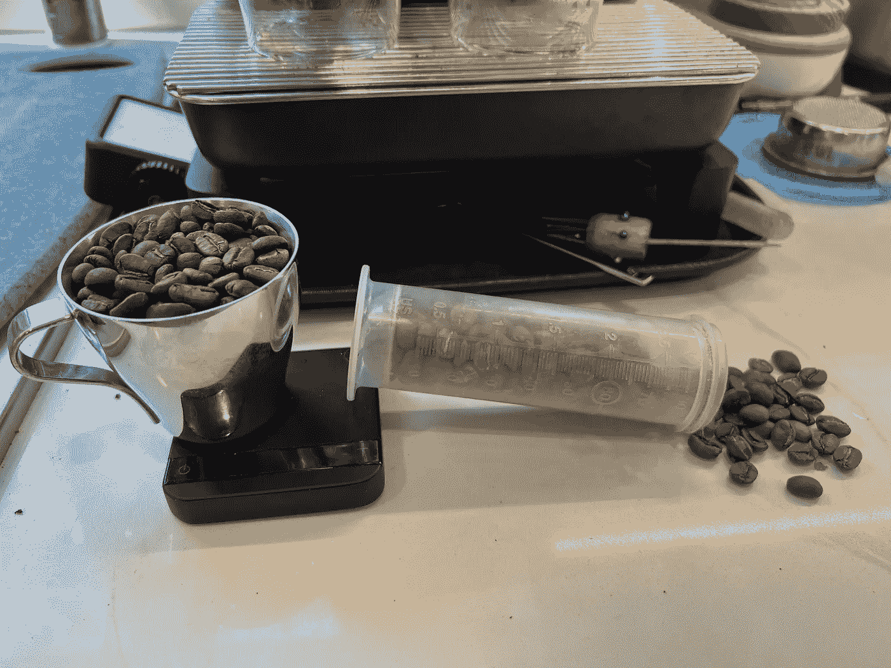
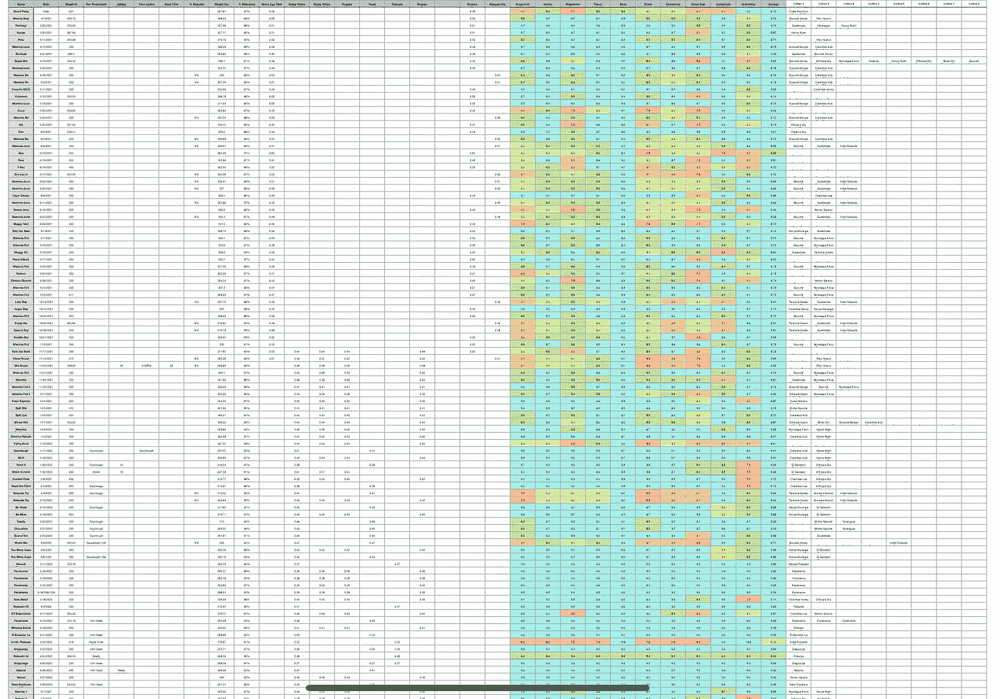
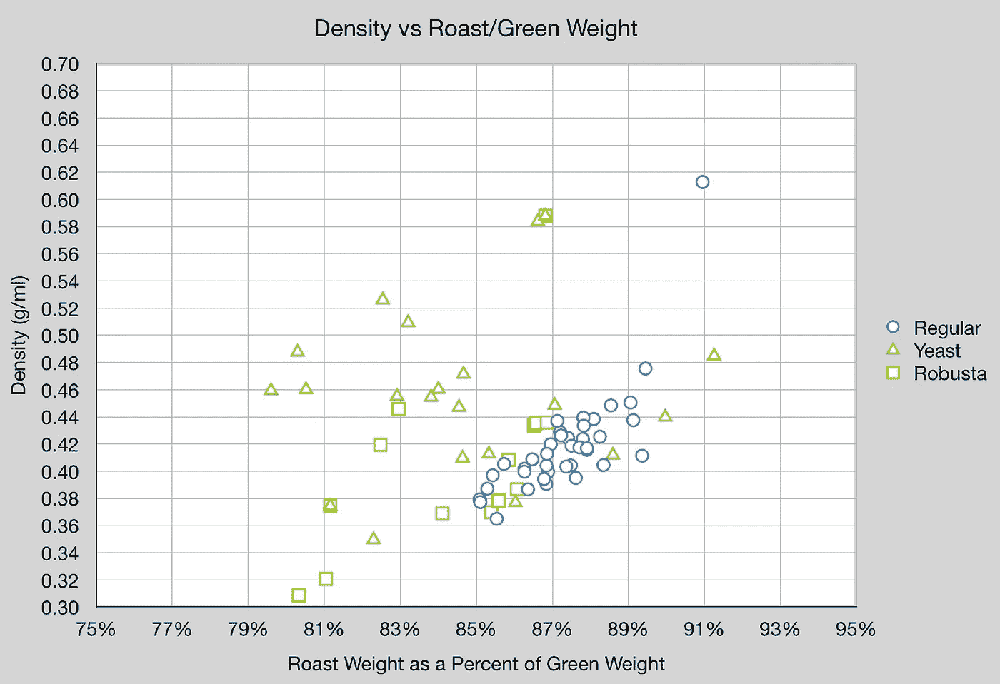
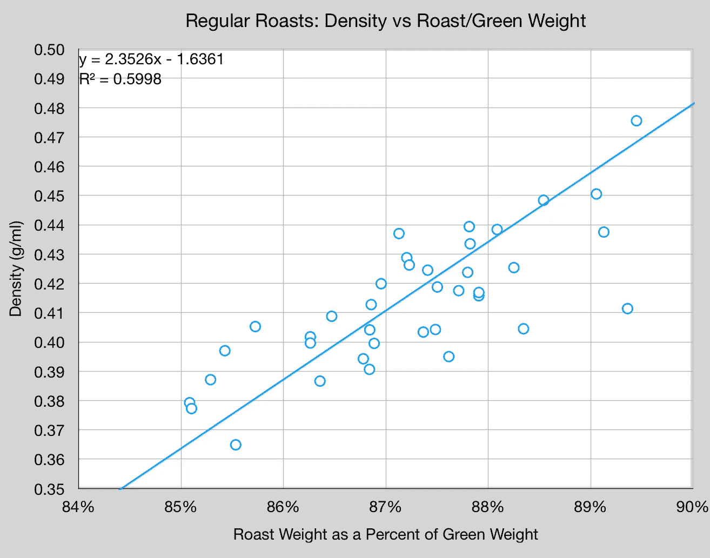
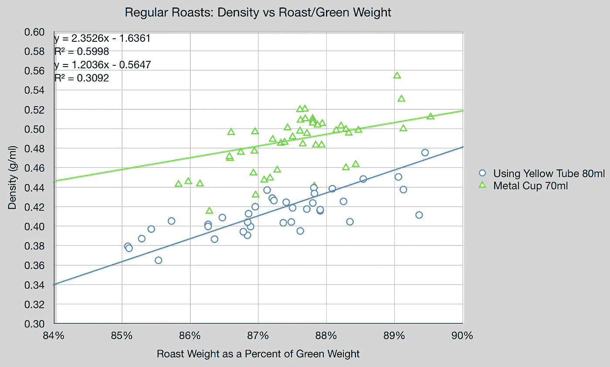
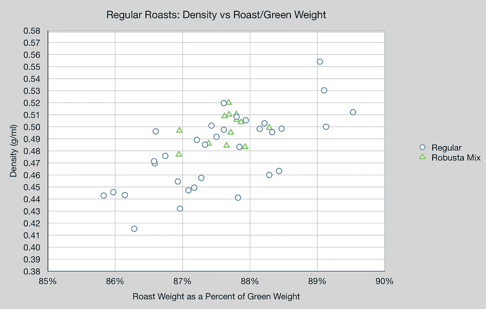

# 烘焙过程中的咖啡密度和重量损失

> 原文：<https://towardsdatascience.com/coffee-density-and-weight-loss-in-roasting-28376ae8ca03>

## 咖啡数据科学

## 偶然数据探索

我收集烤统计数据已经有几年了，但是还没有用在任何事情上。直到现在我才觉得我有足够的数据来绘制它。所以我有了烘焙生咖啡的密度和重量损失的初步数据。所有这些数据都应该被认为是探索性的数据，我希望它们能启发你和我更好地收集关于烘焙的数据。

所有图片由作者提供

我的大部分烘焙是两种咖啡豆的混合，所以目前不值得通过烘焙来分割数据。

所有的烘烤都是在一个热炉上用相同的曲线完成的。我唯一改变的是结束时间。我通常在第一次破裂后的 1 到 2 分钟内保持烘烤。

# 尺寸

我收集了一些关于时间和环境温度的测量数据，但密度和重量损失似乎比其他数据点更重要。

此外，我有平均 Q-分数的基础上，从甜玛丽亚的分数

对于密度，我使用了一个简单的 80 毫升量筒。我把它装满，摇匀，如果需要的话再装满。然后我加权了一下(密度=质量/体积)。这种方法本来可以做得更准确，但我接受了这个错误，只要我在所有的烘烤中使用相同的技术。

为了减肥，我用精确到 0.1 克的秤测量了烘烤前后的重量，每次烘烤的重量从 200 克到 350 克不等。

# 数据

我绘制了常规烘焙、酵母和罗布斯塔的数据。普通的意思是阿拉比卡咖啡。然后我有任何使用酵母加工咖啡豆和罗布斯塔。

酵母似乎是百搭牌，robusta 没有足够的数据。所以让我们只关注普通的阿拉比卡咖啡豆:

有一个相当不错的线性拟合，在测量中肯定会有一些误差。

我还回顾了使用金属杯收集的数据，这项技术似乎很适合自己，但它相对于黄色管有一个误差。

回头看看测量用的金属杯，我有一些 9%左右的罗布斯塔烘烤。所以我绘制了这些混合烘焙，它们与趋势相当吻合，可能是因为它们大多是阿拉比卡咖啡。

使用金属杯(70 毫升)

# 准确(性)

为了检查测量的准确性，我进行了一次烘烤，并对密度进行了十次单独测量。重量的标准偏差(STD)比预期的要大，大约为 4 到 5 个豆子，但这对密度没有太大影响，因为试管足够大。

还有其他方法可以提供更好的测量。就我的目的而言，只要我在不同的漫游中保持相同的技术，从数据的角度来看就足够有用了。

这个长期的实验让我很感兴趣。我希望继续，我希望有一天这些信息在杯赛中对我更有用。

未来的实验应包括:

1.  绿豆密度
2.  生坯和烘烤硬度
3.  湿度计读数
4.  校准的颜色读数

我也对任何人拥有的关于自己烘焙的数据感兴趣，尤其是如果他们有大量每天烘焙咖啡的数据。

如果你愿意，可以在推特、 [YouTube](https://m.youtube.com/channel/UClgcmAtBMTmVVGANjtntXTw?source=post_page---------------------------) 和 [Instagram](https://www.instagram.com/espressofun/) 上关注我，我会在那里发布不同机器上的浓缩咖啡照片和浓缩咖啡相关的视频。你也可以在 [LinkedIn](https://www.linkedin.com/in/dr-robert-mckeon-aloe-01581595) 上找到我。也可以关注我在[中](https://towardsdatascience.com/@rmckeon/follow)和[订阅](https://rmckeon.medium.com/subscribe)。

# [我的进一步阅读](https://rmckeon.medium.com/story-collection-splash-page-e15025710347):

[我未来的书](https://www.kickstarter.com/projects/espressofun/engineering-better-espresso-data-driven-coffee)

[我的链接](https://rmckeon.medium.com/my-links-5de9eb69c26b?source=your_stories_page----------------------------------------)

[浓缩咖啡系列文章](https://rmckeon.medium.com/a-collection-of-espresso-articles-de8a3abf9917?postPublishedType=repub)

工作和学校故事集