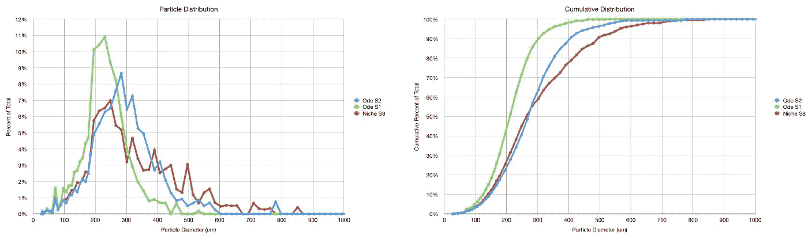
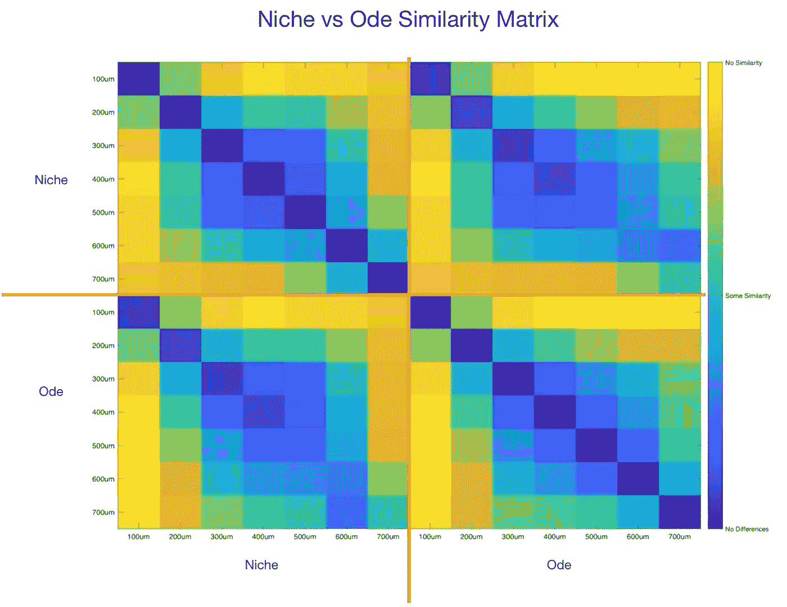
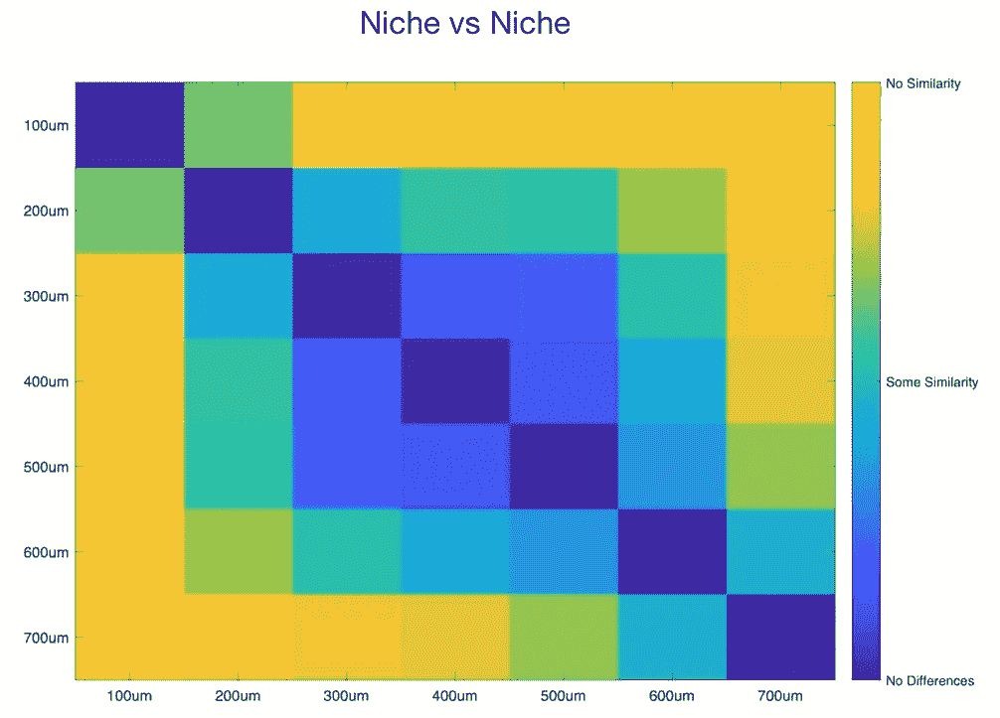
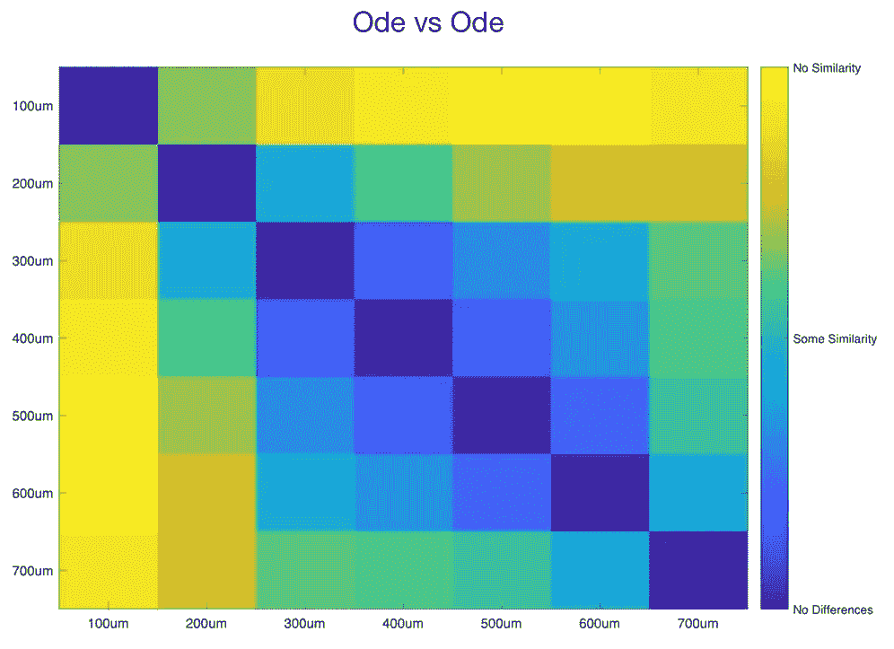
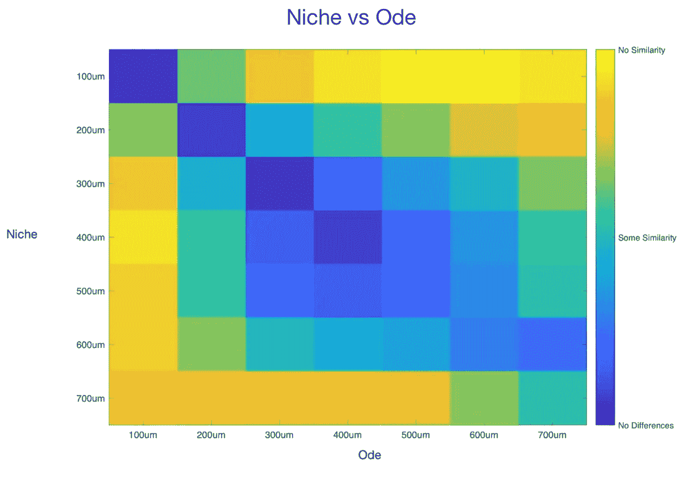
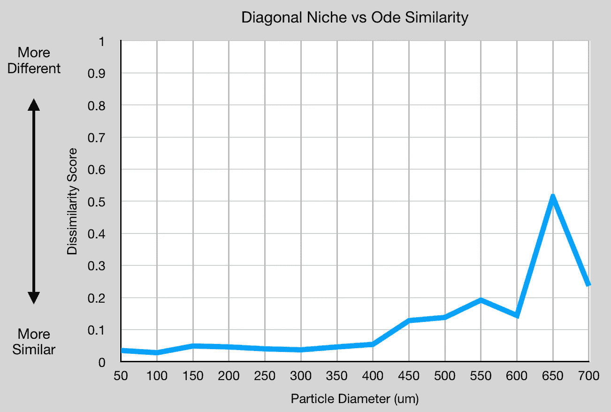
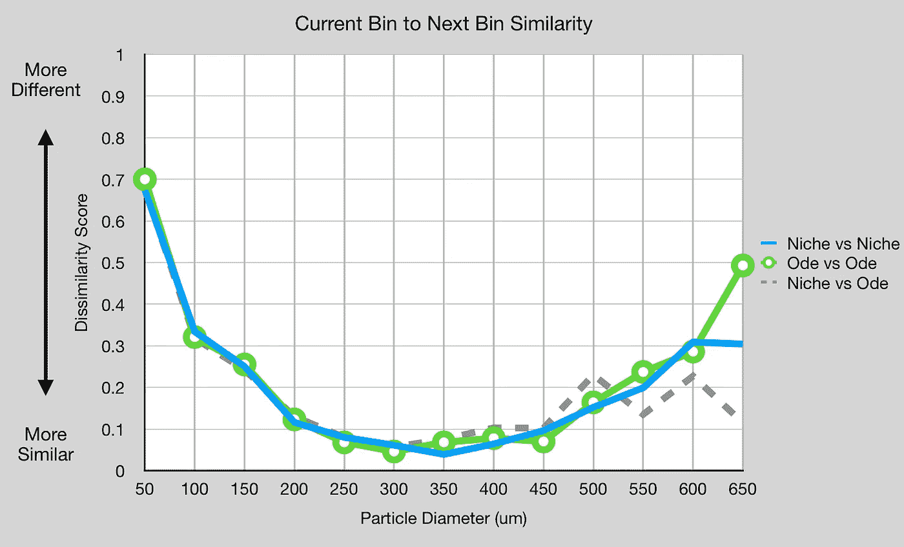
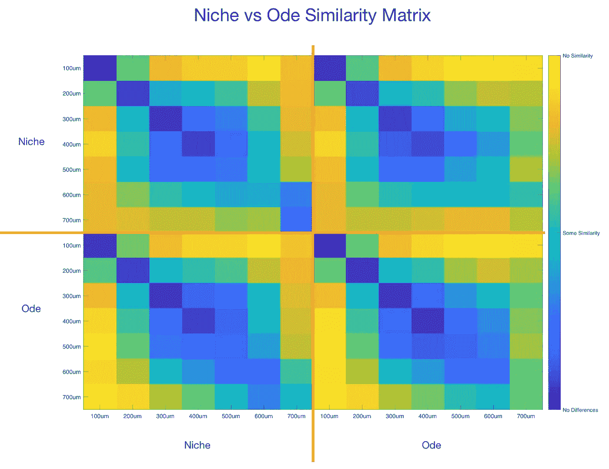
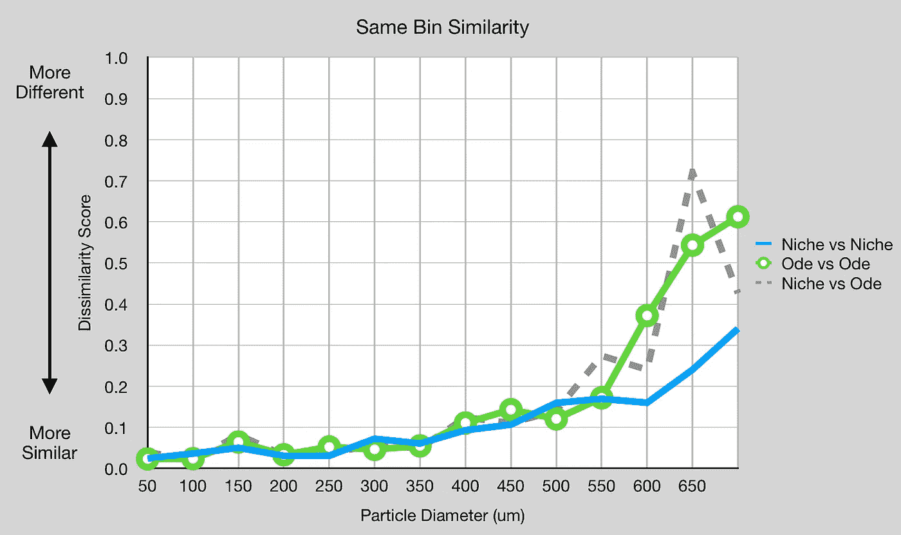

# 基于模式识别的小生境和 Ode 研磨机的咖啡颗粒相似性

> 原文：<https://towardsdatascience.com/coffee-particle-similarity-between-the-niche-and-ode-grinders-using-pattern-recognition-714c4a92ded0>

## 咖啡数据科学

## 使用模式识别分析形状以更好地理解基本粒子形状

为了更好地理解锥形和扁平毛刺之间的区别，我想更好地理解它们是如何切割咖啡豆的。我的目标是在粒子上使用[模式识别](/comparing-coffee-grounds-with-lbp-and-k-means-clustering-f7181dbdea67)，看看它们的形状有什么不同。

[之前的努力](https://medium.com/nerd-for-tech/rok-beats-niche-a-summary-of-a-coffee-grinder-comparison-ffcca38d0753)在显示小生和 Rok 的较粗颗粒之间的差异方面很有用，所以我拿出了一些小生和 Ode 的图像数据，然后我就去工作了。主要的警告是，这是在单一研磨环境下从单一咖啡豆中取样的。两台研磨机都被调至产生相似的颗粒分布。对于其他 beans 和设置，结果可能会有所不同；更多的数据和研究是必要的。

# 设备/技术

[意式咖啡机](/taxonomy-of-lever-espresso-machines-f32d111688f1) : [像样的意式咖啡机](/developing-a-decent-profile-for-espresso-c2750bed053f)

[咖啡研磨机](/rok-beats-niche-zero-part-1-7957ec49840d) : [小生零](https://youtu.be/2F_0bPW7ZPw)和[带](https://fellowproducts.com/products/ode-brew-grinder) [SPP 毛刺的同杆针](http://www.sspgrind.com/)

# 原始数据

首先，让我们画出分布图。我查看了颂歌上的两个设置，以找到最接近利基的设置。这些分布略有不同，但对于 300 微米以下的颗粒直径，它们有许多共同之处。

所有图片由作者提供

# 分析

然后我使用[线性二元模式](/the-shape-of-coffee-fa87d3a67752) (LBP)对每个粒子进行分类，然后我使用 K-means 对所有粒子进行聚类，以查看它们如何对齐。

首先，我们可以看看有百分之多少的粒子被分组到哪个簇中。集群对齐有一点点移动，但不多。

然后，我们可以使用簇排列作为模式向量来计算不同大小的粒子与其他粒子的平均差异。这将一个组中所有粒子的聚类与另一个组中所有粒子的聚类进行比较。

大小相似的粒子更相似并不意外，但要梳理出其中的差异却有点棘手。让我们仔细看看:

小生境的颗粒尺寸比 Ode 的颗粒尺寸更不相似。当比较这两者时，同样大小的粒子非常相似。

我们可以更仔细地看看相同的颗粒大小与不同的分数。分数越低，两者越相似。分数一直稳定到 400um。

我们还可以将当前箱与下一个箱的颗粒尺寸进行比较，以将小生境与小生境进行比较，并理解这些差异如何与 Ode 进行比较。同样，在 650um 之前，利基和颂歌之间没有太大的区别。

# 随机集合

让我们将每种颗粒尺寸的颗粒分成两组，这样我们可以更好地比较每台研磨机的颗粒箱。在比较中，每个颗粒尺寸箱被分成两组，x 轴使用一组，y 轴使用另一组。

当我们看这条对角线时，主要的差别在 550 微米左右。

在检查和比较粒子后，我没有找到足够的证据证明这两种毛刺集产生了根本不同的粒子形状。因此，对于这种咖啡和研磨设置，毛刺设置对味道的主要影响来自颗粒分布，而不是颗粒形状。

如果你愿意，可以在推特、 [YouTube](https://m.youtube.com/channel/UClgcmAtBMTmVVGANjtntXTw?source=post_page---------------------------) 和 [Instagram](https://www.instagram.com/espressofun/) 上关注我，我会在那里发布不同机器上的浓缩咖啡照片和浓缩咖啡相关的视频。你也可以在 [LinkedIn](https://www.linkedin.com/in/dr-robert-mckeon-aloe-01581595) 上找到我。也可以关注我在[中](https://towardsdatascience.com/@rmckeon/follow)和[订阅](https://rmckeon.medium.com/subscribe)。

# [我的进一步阅读](https://rmckeon.medium.com/story-collection-splash-page-e15025710347):

[我未来的书](https://www.kickstarter.com/projects/espressofun/engineering-better-espresso-data-driven-coffee)

[我的链接](https://rmckeon.medium.com/my-links-5de9eb69c26b?source=your_stories_page----------------------------------------)

[浓缩咖啡系列文章](https://rmckeon.medium.com/a-collection-of-espresso-articles-de8a3abf9917?postPublishedType=repub)

[工作和学校故事集](https://rmckeon.medium.com/a-collection-of-work-and-school-stories-6b7ca5a58318?source=your_stories_page-------------------------------------)