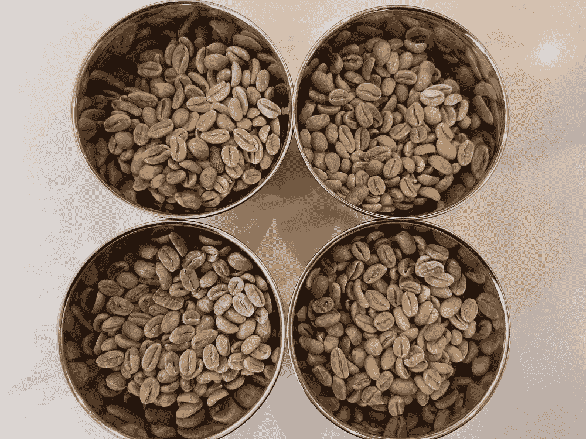
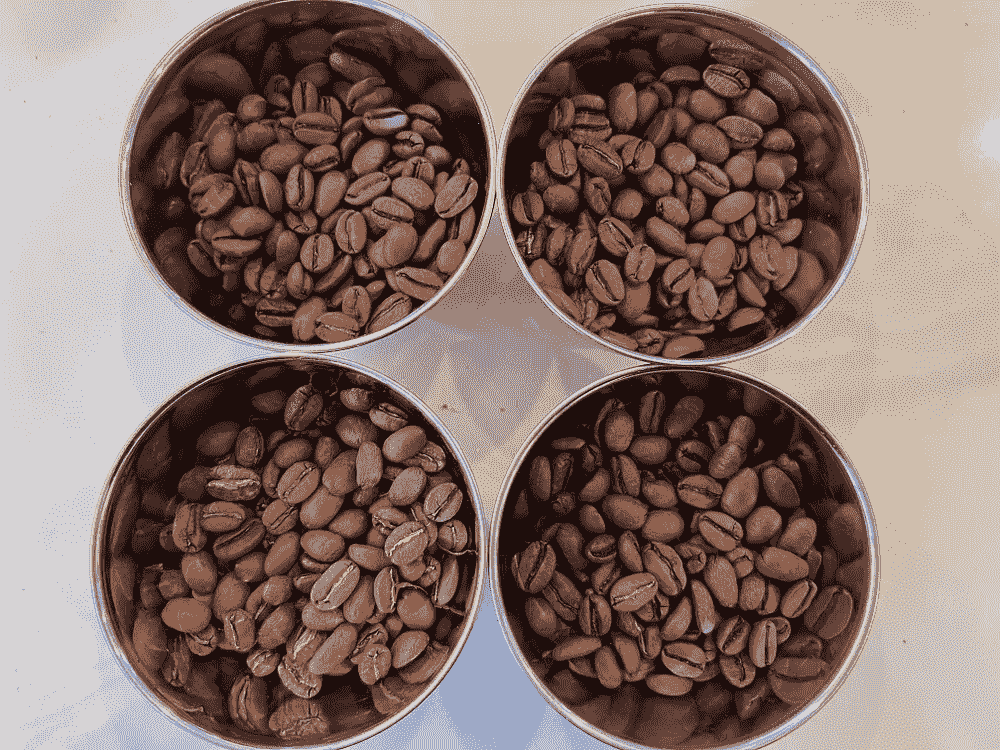
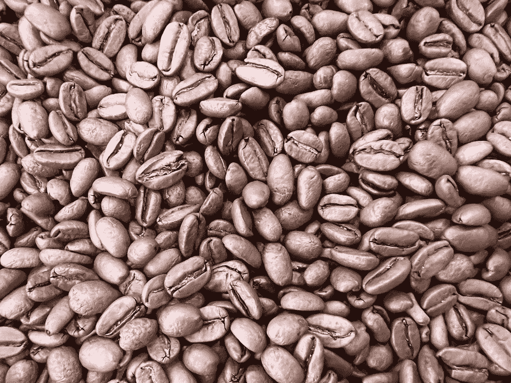
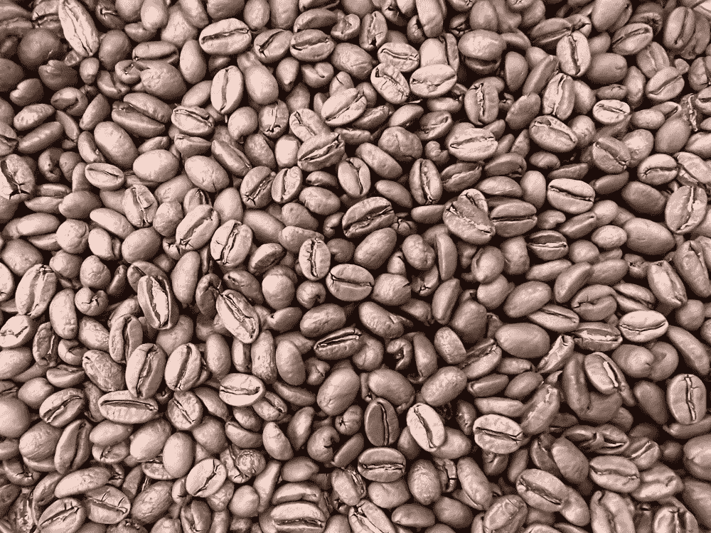
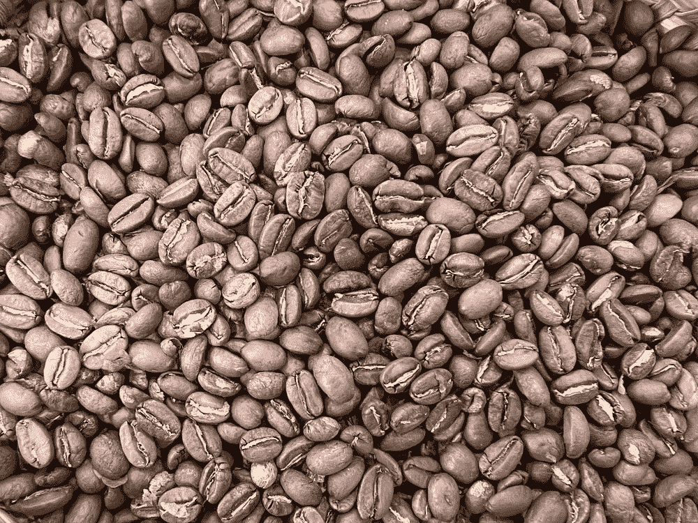
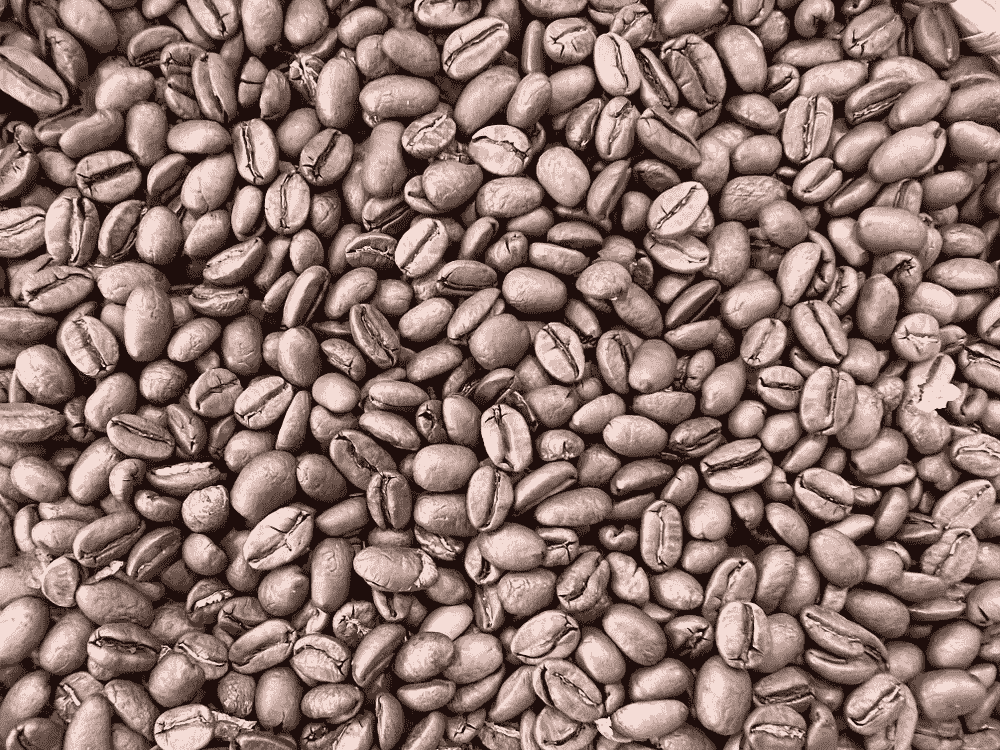
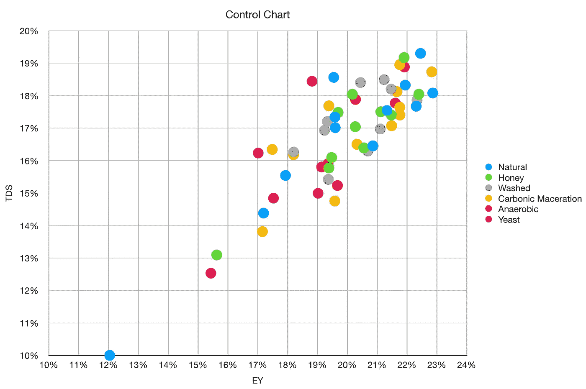
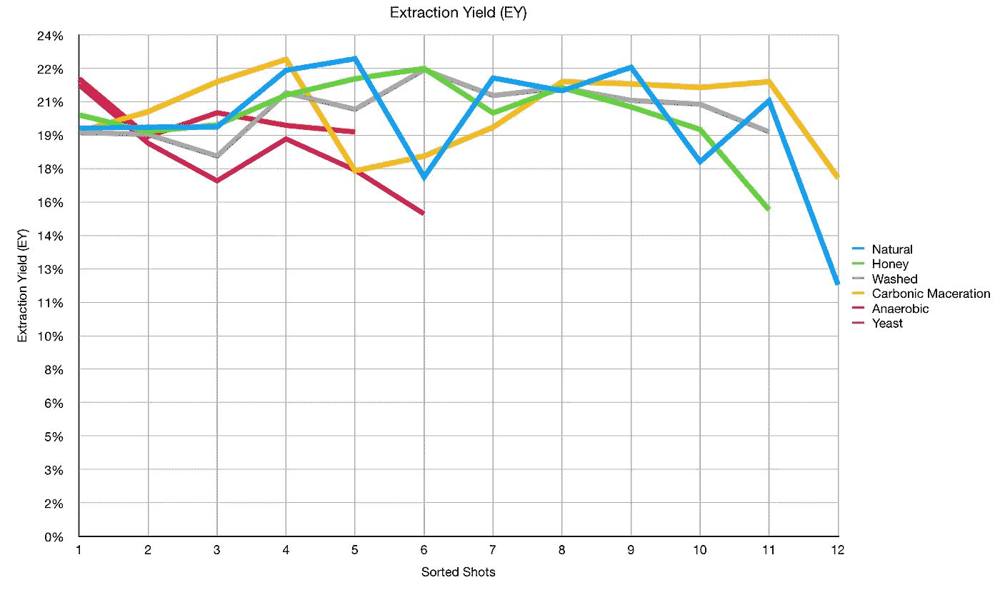
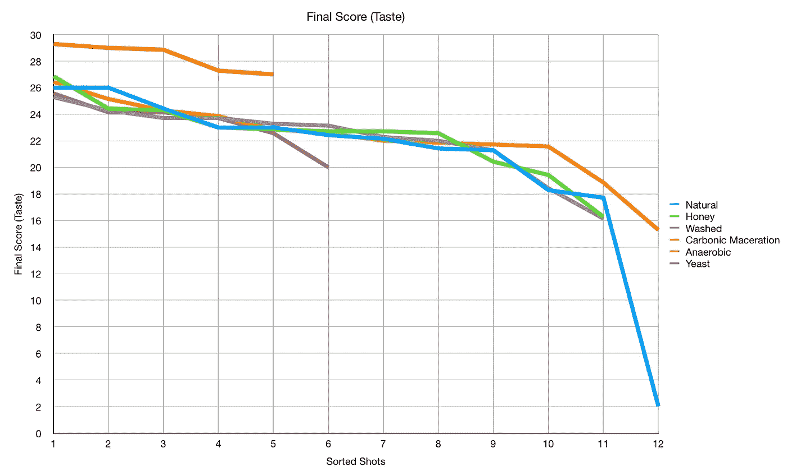
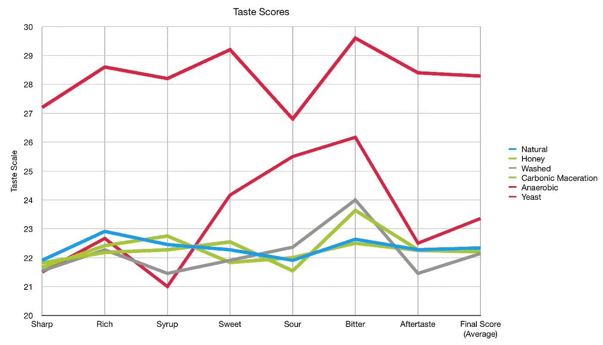

# 浓缩咖啡有六种不同的加工方法

> 原文：<https://towardsdatascience.com/coffee-processed-six-ways-for-espresso-49399319ba9f>

## 咖啡数据科学

## 天然，蜂蜜，湿，碳浸渍，酵母和厌氧

我一直很好奇[咖啡果加工](https://dailycoffeenews.com/2020/12/10/coffee-processing-styles-and-terminology-plus-flowchart/)如何影响烘焙咖啡的味道。然而，我认为不与咖啡农交朋友是不可能进行实验的。幸运的是，我在[彩色咖啡](https://www.chromaticcoffee.com/)和 Hiver van Geenhoven 成为朋友，我们开始聊天。

Hiver 已经在一个农场工作了很多年，生产 Parainema 咖啡。他碰巧有同一种咖啡果的多种加工变体，他给了我一些样品。一开始，他给我天然的，蜂蜜的，水洗的，还有碳酸浸渍的。我把剩下的青豆混合在一起，在[酸面团](/sourdough-green-coffee-fermentation-6217b1b8e9f4)中发酵。后来他给了我一个厌氧加工豆子的样品。

左(绿色)，右(烤)。在每张图片中，左上(天然)，右上(蜂蜜)，左下(水洗)，右下(碳浸渍)。所有图片由作者提供。

都烤的差不多，我也是在差不多的发育时间掉的。烘焙后，它们的密度范围为 0.365 克/毫升至 0.387 克/毫升，因此就密度而言，它们具有大致相同的密度。

天然、蜂蜜、水洗、碳浸渍

# 设备/技术

[意式咖啡机](/taxonomy-of-lever-espresso-machines-f32d111688f1) : [像样的意式咖啡机](/developing-a-decent-profile-for-espresso-c2750bed053f)

[咖啡研磨机](/rok-beats-niche-zero-part-1-7957ec49840d) : [小生零](https://youtu.be/2F_0bPW7ZPw)和[带](https://fellowproducts.com/products/ode-brew-grinder) [SPP 毛刺的同杆针](http://www.sspgrind.com/)

咖啡:[家庭烘焙咖啡](https://rmckeon.medium.com/coffee-roasting-splash-page-780b0c3242ea)，中杯(第一口+ 1 分钟)

镜头准备:[断奏夯实](/staccato-tamping-improving-espresso-without-a-sifter-b22de5db28f6)和[断奏](https://medium.com/overthinking-life/staccato-espresso-leveling-up-espresso-70b68144f94)

[预输注](/pre-infusion-for-espresso-visual-cues-for-better-espresso-c23b2542152e):长，约 25 秒

输液:[压力脉动](/pressure-pulsing-for-better-espresso-62f09362211d)

[过滤篮](https://rmckeon.medium.com/espresso-baskets-and-related-topics-splash-page-ff10f690a738) : 20g VST

其他设备: [Atago TDS 计](/affordable-coffee-solubility-tools-tds-for-espresso-brix-vs-atago-f8367efb5aa4)、 [Acaia Pyxis 秤](/data-review-acaia-scale-pyxis-for-espresso-457782bafa5d)

# 绩效指标

我使用两个[指标](/metrics-of-performance-espresso-1ef8af75ce9a)来评估技术之间的差异:最终得分和咖啡萃取。

[**最终得分**](https://towardsdatascience.com/@rmckeon/coffee-data-sheet-d95fd241e7f6) 是评分卡上 7 个指标(辛辣、浓郁、糖浆、甜味、酸味、苦味和回味)的平均值。当然，这些分数是主观的，但它们符合我的口味，帮助我提高了我的拍摄水平。分数有一些变化。我的目标是保持每个指标的一致性，但有时粒度很难确定。

**用折射仪测量总溶解固体量(TDS)，这个数字结合咖啡的输出重量和输入重量用来确定提取到杯中的咖啡的百分比，称为**提取率(EY)** 。**

# **表演**

**我惊讶地发现前四种(天然、蜂蜜、水洗和碳浸渍)的表现相似。就 TDS/EY 而言，没有突出的，好的或坏的。有一个自然处理的镜头，我磨得太粗糙了，我认为这是一个离群值。**

****

**我按照拍摄方法和口味评分对不同时间拍摄的照片进行了分类。EY 没有这种趋势。厌氧和酵母注射较少。**

****

**在口味上，除了厌氧是明显的赢家之外，也没有其他趋势。**

****

**我用另一种方式来削减这些分数，即对一个类别中所有镜头的个人品味指标进行平均。这显示了更多的细微差别，特别是，被加工的酵母在甜味、酸味和苦味方面得分更高。我怀疑如果我有更多关于酵母的数据，它会比其他的更容易区分。**

****

**此外，蜂蜜和水洗咖啡在苦味方面比天然咖啡和碳酸浸渍咖啡稍好。**

**我确信我会看到不同技术之间更大的差异，也许在受过训练的品酒师的拔罐评分中会有细微的差别。我可以肯定地说，厌氧是这些镜头中最好的处理技术。**

**我也很惊讶，当我确定我更喜欢天然的时候，我喜欢洗干净的咖啡豆。因为果味，我的目标是更多的天然豆子，但在这些豆子中，这似乎并不重要。**

**如果你愿意，可以在推特、 [YouTube](https://m.youtube.com/channel/UClgcmAtBMTmVVGANjtntXTw?source=post_page---------------------------) 和 [Instagram](https://www.instagram.com/espressofun/) 上关注我，我会在那里发布不同机器上的浓缩咖啡照片和浓缩咖啡相关的视频。你也可以在 [LinkedIn](https://www.linkedin.com/in/dr-robert-mckeon-aloe-01581595) 上找到我。也可以关注我在[中](https://towardsdatascience.com/@rmckeon/follow)和[订阅](https://rmckeon.medium.com/subscribe)。**

# **[我的进一步阅读](https://rmckeon.medium.com/story-collection-splash-page-e15025710347):**

**[我未来的书](https://www.kickstarter.com/projects/espressofun/engineering-better-espresso-data-driven-coffee)**

**[我的链接](https://rmckeon.medium.com/my-links-5de9eb69c26b?source=your_stories_page----------------------------------------)**

**[浓缩咖啡系列文章](https://rmckeon.medium.com/a-collection-of-espresso-articles-de8a3abf9917?postPublishedType=repub)**

**工作和学校故事集**