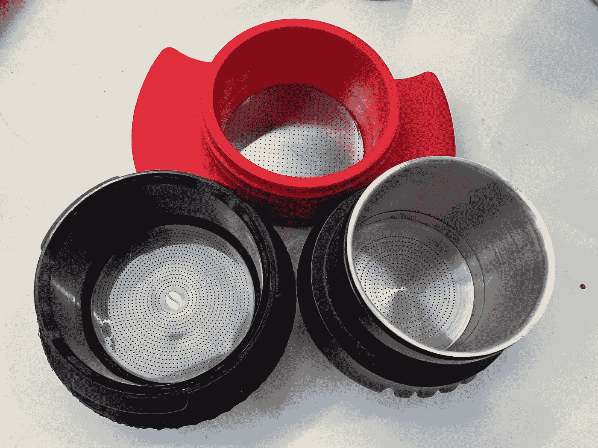
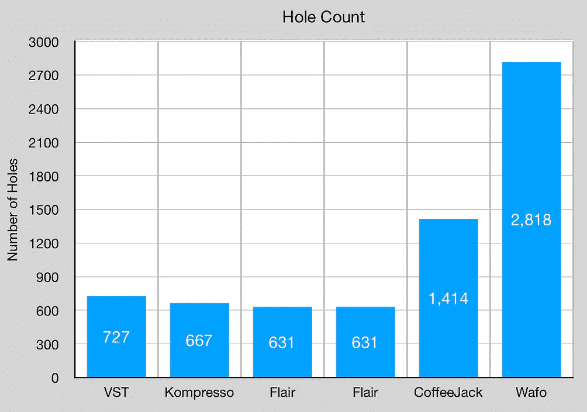
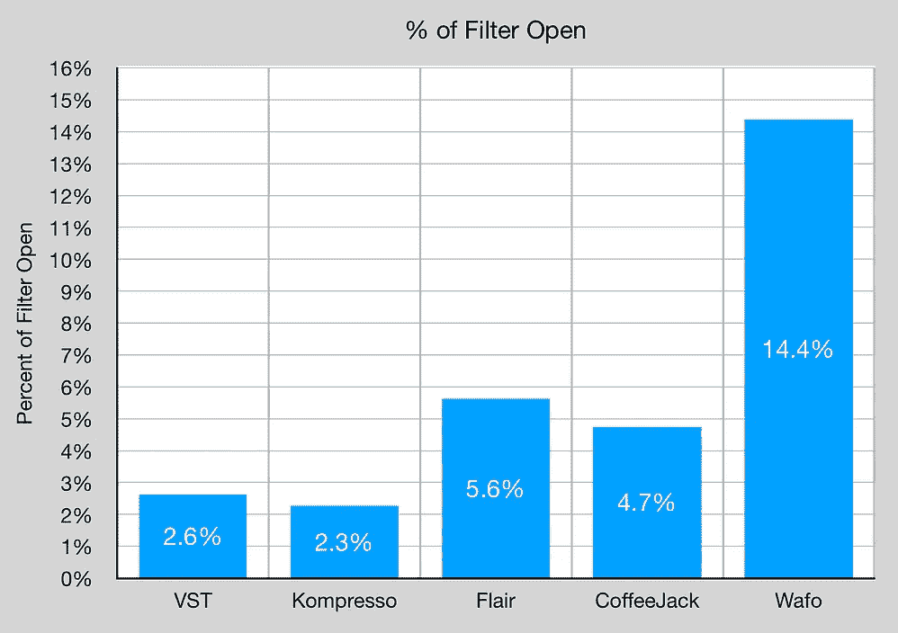
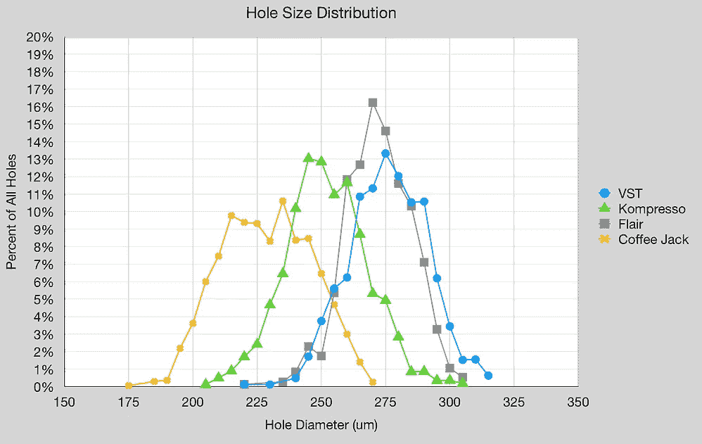
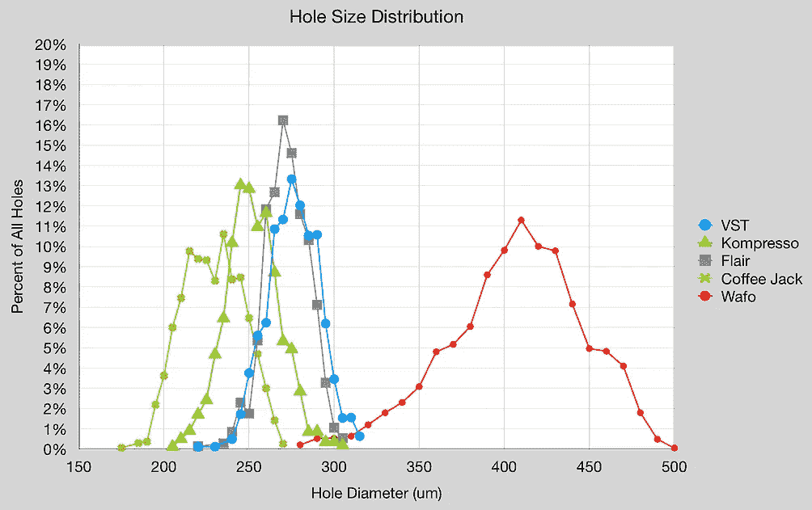
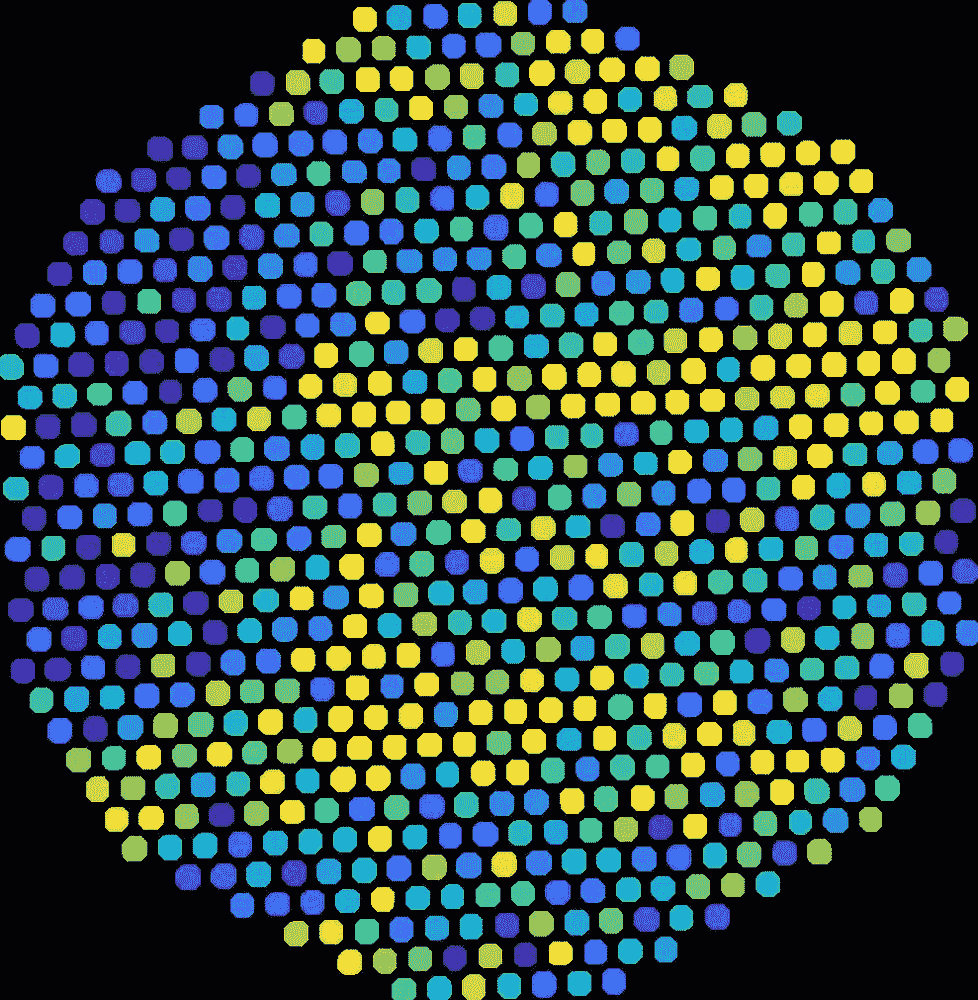
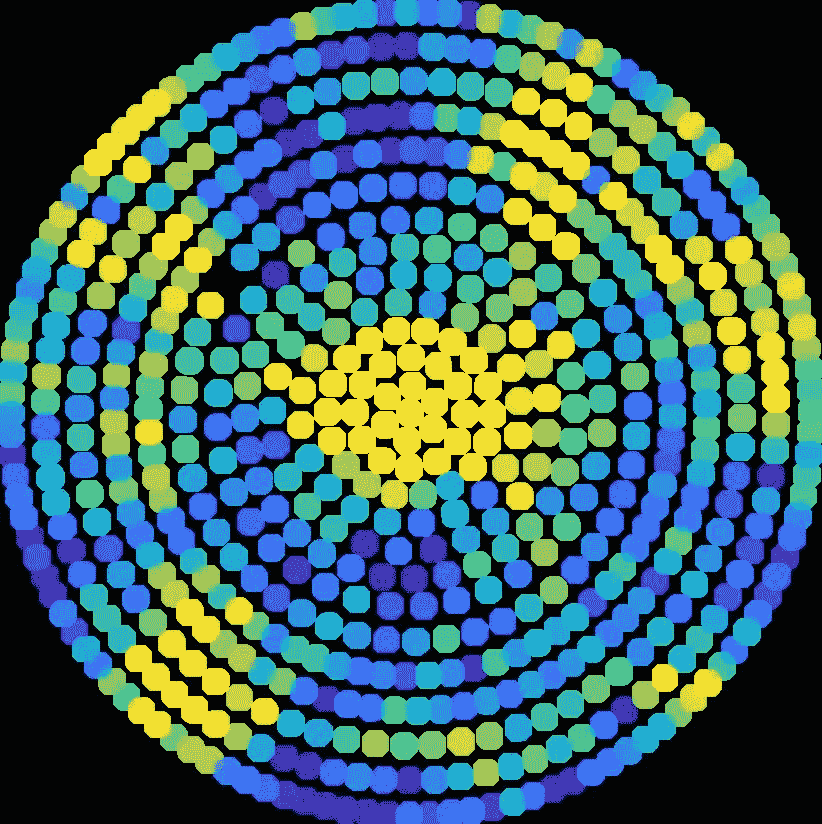
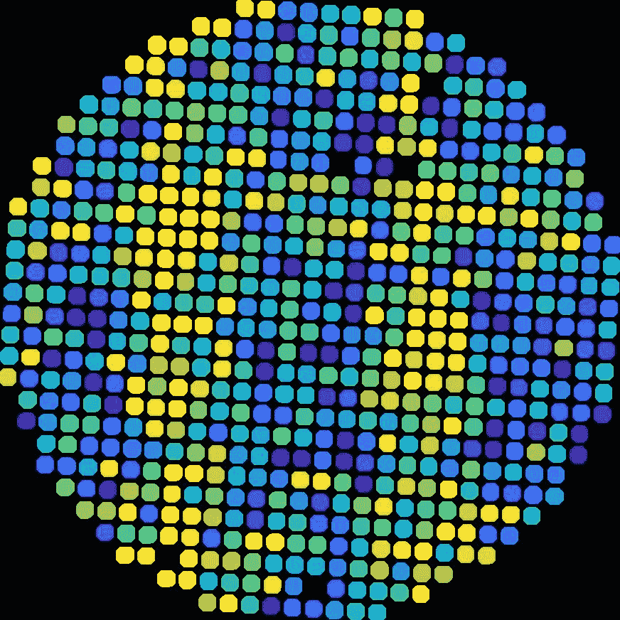
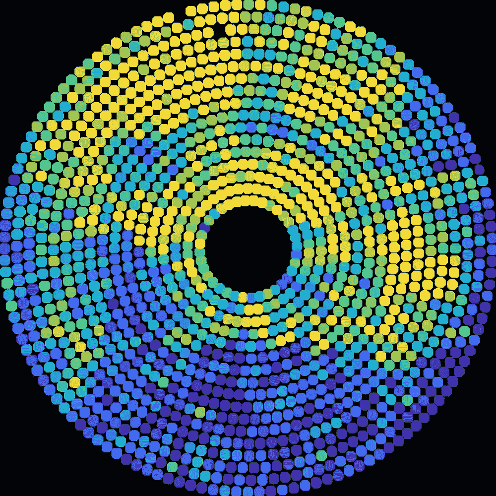
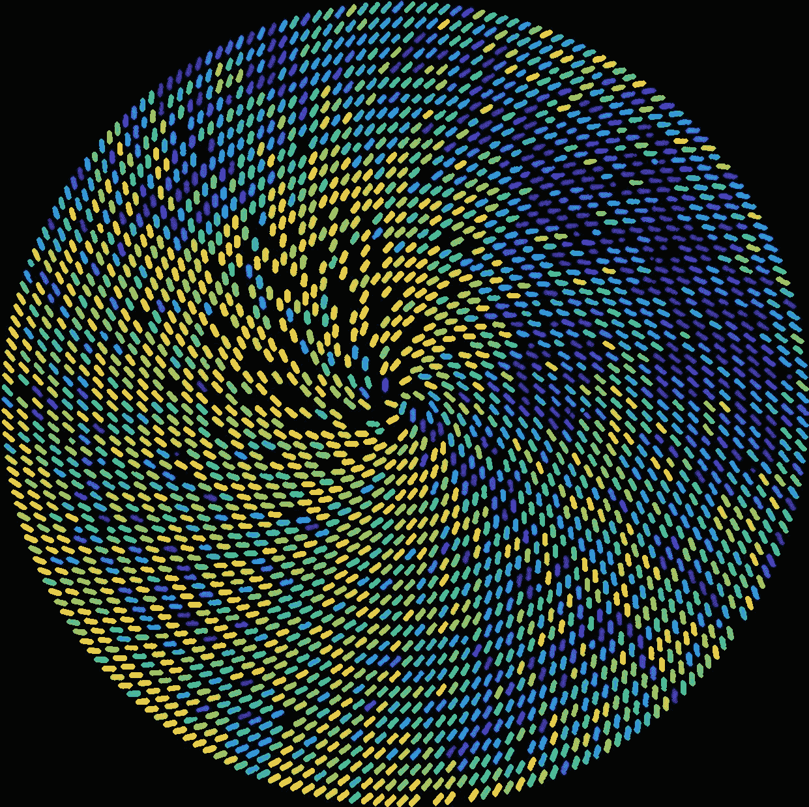

# CoffeeJack 和 Wafo vs VST、Flair 和 Kompresso 浓缩咖啡过滤篮

> 原文：<https://towardsdatascience.com/coffeejack-and-wafo-vs-vst-flair-and-kompresso-espresso-filter-basket-2991314b224e>

## 咖啡数据科学

## 过滤篮的图像分析

几年前我开始研究过滤篮，我观察随机的极大或极小的孔是如何在空间上排列的。我想知道这是否可以用来解释为什么有些篮子比其他篮子表现得更好。

所以当我得到一个[咖啡插座](https://www.indiegogo.com/projects/coffeejack-the-pocket-sized-barista/x/25170595#/)时，我采取了同样的方法。我将它与 Kompresso 相比较，因为 Kompresso 实际上已经成为[旅行机器](https://medium.com/geekculture/portable-espresso-a-guide-5fb32185621)三年了。我很惊讶，对于同样的研磨、水和预浸泡，CoffeeJack 在味道和提取方面优于 Kompresso(结果在另一个讨论中)。我认为它与过滤篮的关系比其他因素更大，因为 Kompresso 是最简单的便携式咖啡机。它相当于一个便携式杠杆机器，而 CoffeeJack 是一个泵。

所有图片由作者提供。上面是 Kompresso，左边是 CoffeeJack，右边是 Flair Signature。

所以，我收集了一些数据。我还收集了 Flair Signature 上的图片，因为这是我的另一个旅行机器，也是一个 VST 篮子。有趣的外卡是 Wafo 篮子，他们发给我一个很好的图像来做这个分析。

坦白说，CoffeeJack 的 Ashley 给了我一个单元，因为他需要技术反馈。所以我们已经谈过了，但是在这篇文章发表之前，他是不会看到的。我的一个批评很受欢迎，那就是中间的咖啡豆标志。这个标志改变了淋浴帘和过滤篮的水流。他的回答很简单，他们喜欢它的外观，但这并不意味着它不会在未来的迭代中改变。

# 数据

让我们从孔数和过滤器打开的百分比开始。CoffeeJack 的球洞数量是竞争对手的两倍。Wafo 处于不同的联盟，我认为它抢了我在 CoffeeJack 中试图讨论的话题的风头。就过滤器打开的百分比而言，Flair、CoffeeJack 和 Wafo 是最好的。

但是等等，也许不是。就天赋而言，球洞不会一直延伸到边缘。如果在计算中还考虑了边缘(以 1.8 的因子增加过滤器面积)，Flair 具有与 VST 相同的过滤器打开百分比，如下所示:

Wafo 离大规模销售还有几个月的时间，CoffeeJack 似乎是目前可用的篮子中最大的一个。在与 Ashley 的交谈中，团队反复讨论了基于保持泵背压以维持流量的设计。他们的目标不是推出市场上最开放的过滤篮之一。愉快的意外？

在孔径方面，CoffeeJack 在孔径平均值和标准偏差方面与 VST、Kompresso 和 Flair 一致。咖啡插孔略小，但更多。Wafo 有大得多的洞，但我的算法试图计算假设圆形洞，Wafo 有矩形，所以我不确定影响。

我们可以看到球洞的分布，CoffeeJack 和 VST 和 Flair 的 Kompresso 都发生了变化。

# 空间分布

这些图像显示了相对孔径。所以黄色越多代表洞越大，深蓝色代表洞越小。希望这些洞的大小不会一成不变。不幸的是，他们有，这种模式在提取过程中被看到。我已经能够根据咖啡的流动方式和它们的孔洞模式来区分我的两个 Flair 签名篮子。即使是 VST 也没有这种理想的分布，虽然比以前的篮子要好。

左:VST，右:天赋

Kompresso 和 CoffeeJack 都有自己的。然而，CoffeeJack 不是无底洞，所以我不能说这种模式发挥了多大作用。在咖啡杰克的情况下，可能会有一个轻微的偏离角度的相机，因为大孔在顶部，小孔在底部。Kompresso 热点在拍摄过程中非常明显。

左:Kompresso，右:CoffeeJack

从 CoffeeJack 用过的冰球底部，我没有看到一个特定的模式，表明除了中心的深蓝色区域外，由于徽标而导致的非常低的流量。

Wafo 就是好玩！这可能在相机中有类似的角度问题。我没有拍摄图像，所以我只是展示我所拥有的。我为他们的过滤篮感到非常兴奋。

由于成像问题，Wafo 有几个孔

CoffeeJack 恰好出现在未来咖啡篮的浪潮中。几年前我对精确篮子的批评和现在一样:它们在屏幕上的分布不够精确，因为有热点和冷点。

我希望对有更多孔的过滤篮进行更多的研究，因为我怀疑它们会允许更精细的研磨，我相信这是获得更高萃取率和更好咖啡的关键。

如果你愿意，可以在推特、 [YouTube](https://m.youtube.com/channel/UClgcmAtBMTmVVGANjtntXTw?source=post_page---------------------------) 和 [Instagram](https://www.instagram.com/espressofun/) 上关注我，我会在那里发布不同机器上的浓缩咖啡照片和浓缩咖啡相关的视频。你也可以在 [LinkedIn](https://www.linkedin.com/in/dr-robert-mckeon-aloe-01581595) 上找到我。也可以关注我在[中](https://towardsdatascience.com/@rmckeon/follow)和[订阅](https://rmckeon.medium.com/subscribe)。

# [我的进一步阅读](https://rmckeon.medium.com/story-collection-splash-page-e15025710347):

[我未来的书](https://www.kickstarter.com/projects/espressofun/engineering-better-espresso-data-driven-coffee)

[我的链接](https://rmckeon.medium.com/my-links-5de9eb69c26b?source=your_stories_page----------------------------------------)

[浓缩咖啡系列文章](https://rmckeon.medium.com/a-collection-of-espresso-articles-de8a3abf9917?postPublishedType=repub)

工作和学校故事集