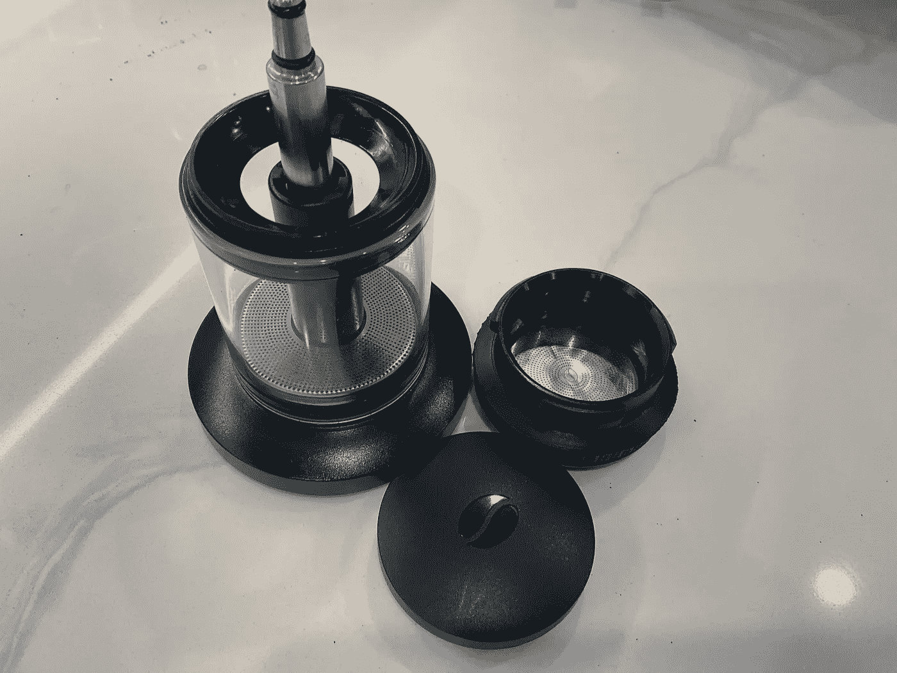
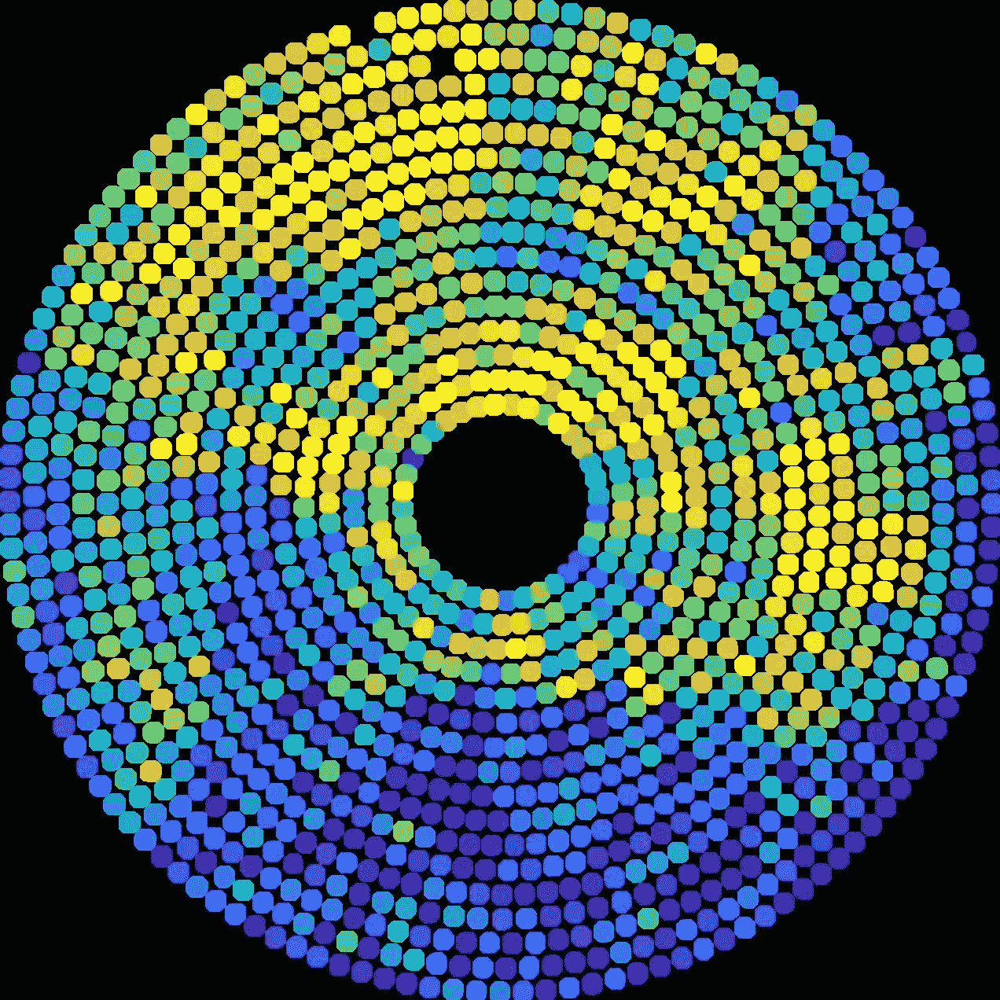
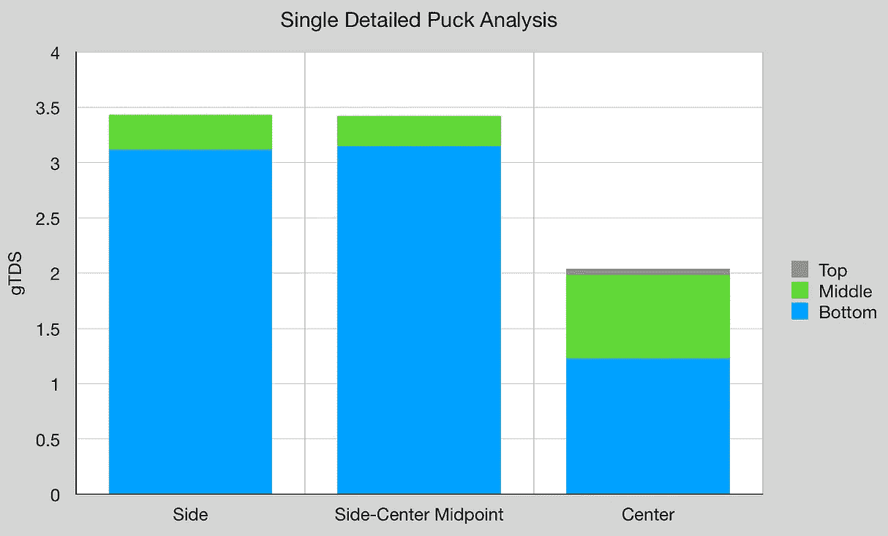
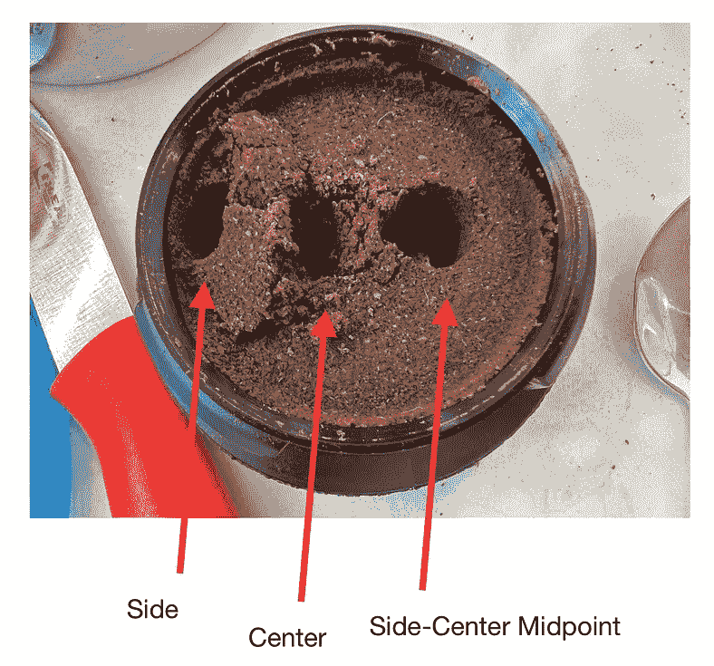
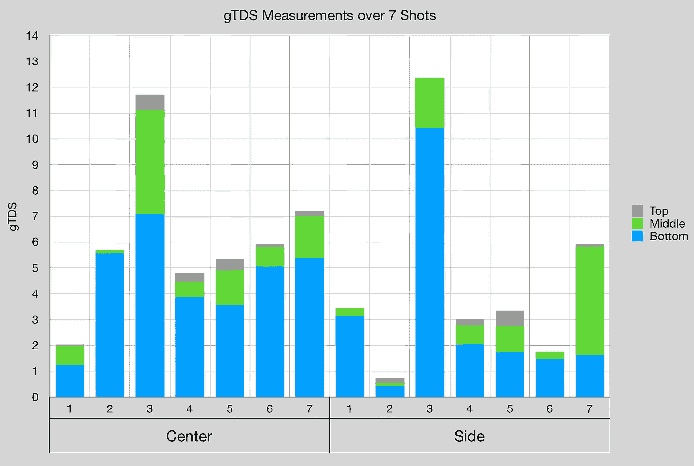
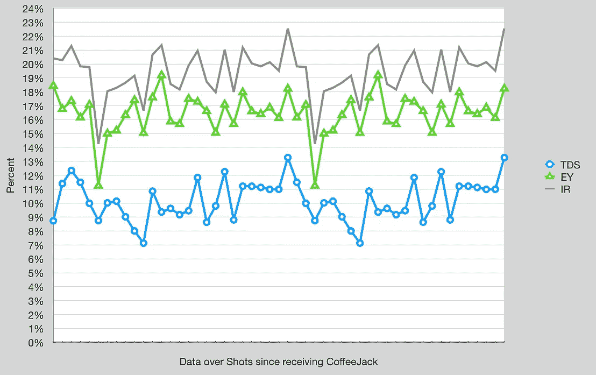
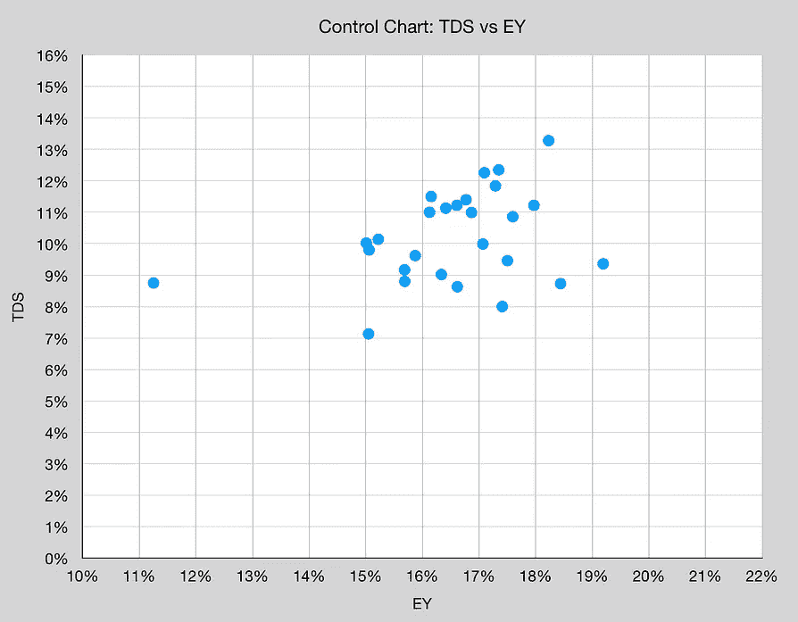
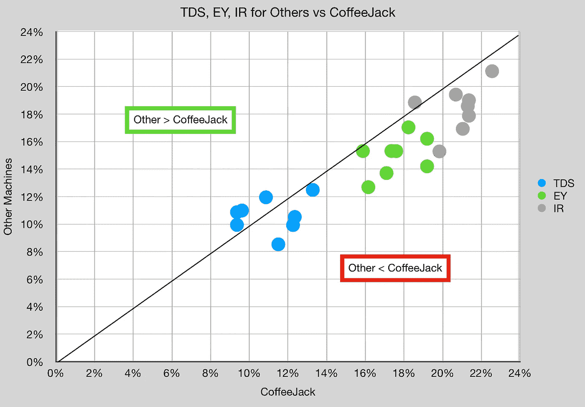
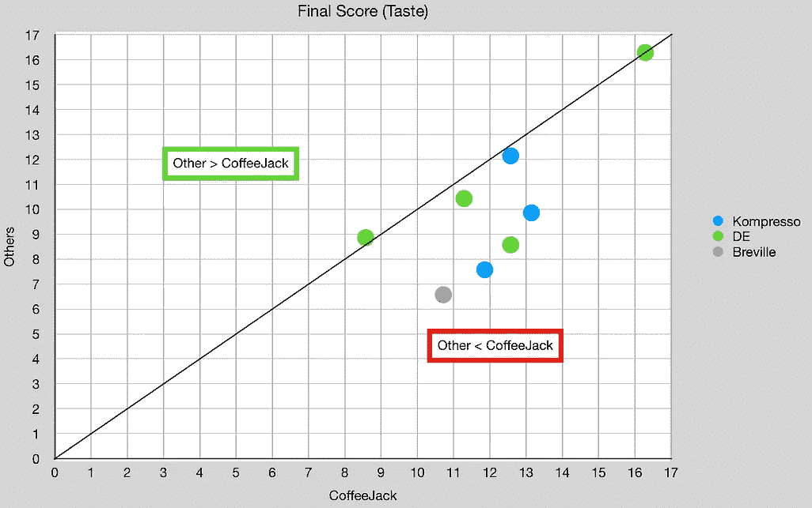
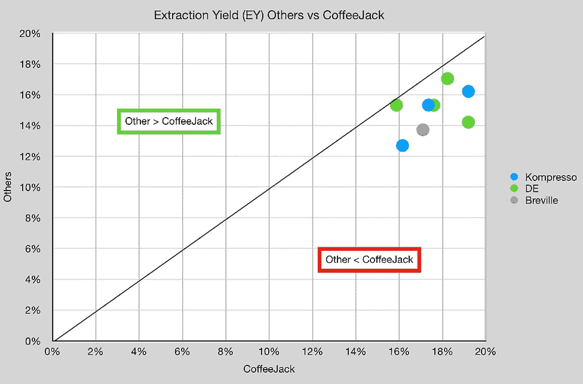

# 一个月后的浓缩咖啡:回顾

> 原文：<https://towardsdatascience.com/coffeejack-for-espresso-after-a-month-cf6253ed77b6>

## 咖啡数据科学

## 原始数据

收到 [CoffeeJack](https://www.indiegogo.com/projects/coffeejack-the-pocket-sized-barista/x/25170595?fbclid=IwAR2BL8ba5SEbzBKdy8TTCoPC564q9UG7tnYjidnw5KgkD-23vgMSzC6CDv4#/updates/all) 后，我开始将它与其他机器进行比较，特别是 Kompresso，因为我的目标是将其与我的标准旅行浓缩咖啡机进行比较。我对 CoffeeJack 的表现感到惊喜。因此，我想详细介绍一下这款设备的一些机制，以及使用它时获得的一些数据。

**披露**:coffee jack 的 Ashley 送了我一个设备，因为他对我做技术评论的专长感兴趣。在我发表之前，CoffeeJack 的人不会看到这篇评论，但我在这里分享了我对 CoffeeJack 的评论以及我的经历。Ashley 对设计讨论非常积极和开放，所以我对 CoffeeJack 公司充满希望。

这是我拍摄的一段视频，这是我使用这台机器的典型方式:

作者提供的所有图片和视频

快速总结:我喜欢 CoffeeJack 足以取代 Kompresso 作为我的旅行机器，尽管有一些设计缺陷，但由于创新的设计，它的性能得到了克服。

# 机器

CoffeeJack 应该是一台便携式浓缩咖啡机，这样任何人都可以在各种环境下制作浓缩咖啡。在收集进一步数据以寻找任何缺陷之前，我首先评估了设备的子单元。

**压力**:coffee jack 的目标是能够为浓缩咖啡或一些人认为合适的浓缩咖啡建立 9 巴的压力。我不像数据显示的那样在高压下工作压力越低，提取效果越好。所以咖啡杰克对我来说很有能力。因此，我没有做工作来验证压力能力，我只按了两次机械压力限制器。

**温度:**我用开水做了实验，发现放入小室后温度会降到 84C 到 88C 之间。然而，即使用蒸汽预热设备，一旦加入水，水几乎不超过 88℃。我通过更长时间的预输注进行补偿，通常，我在我的[杠杆机器](/water-temperature-for-espresso-1abe656b54d3)上使用 100C 或更高的温度。

**淋浴帘:**水泵直接进入淋浴帘，使水通过淋浴帘的中心，直到室内压力增大。这是我最关心的，我很惊讶没有更多的中心通灵。我怀疑在水泵和淋浴屏之间安装一个分散屏会有所帮助。

[**滤篮**](/coffeejack-and-wafo-vs-vst-flair-and-kompresso-espresso-filter-basket-2991314b224e) :第一个瑕疵是豆标正中央。这中断了流动。但是过滤篮的主要优点是它的孔数是普通浓缩咖啡篮的两倍。淋浴屏也是如此。我认为这种设计选择可以让 CoffeeJack 在性能方面克服其他问题。

分析表明过滤网在孔的数量和分布上是有趣的。

**移动式过滤器**:它有一个阀门，但是你可以把阀门拿掉。所以你可以让它不受压。然而，它不是无底洞。这使得从屏幕底部进行某些类型的故障分析成为不可能。然而，他们可以为人们设计一个无底的篮子，而不必改变机器本身。我解决了这个问题，对于大多数人来说，我认为这不是问题。

# 设备/技术

[浓缩咖啡机](/taxonomy-of-lever-espresso-machines-f32d111688f1):咖啡插孔

[咖啡研磨机](/rok-beats-niche-zero-part-1-7957ec49840d) : [小生零](https://youtu.be/2F_0bPW7ZPw) & VSSL

咖啡:[家庭烘焙咖啡](https://rmckeon.medium.com/coffee-roasting-splash-page-780b0c3242ea)，中杯(第一口+ 1 分钟)

镜头准备:常规镜头和[断奏夯实](/staccato-tamping-improving-espresso-without-a-sifter-b22de5db28f6)

[预灌注](/pre-infusion-for-espresso-visual-cues-for-better-espresso-c23b2542152e):长，约 60 秒

注入:低压

其他设备: [Atago TDS 计](/affordable-coffee-solubility-tools-tds-for-espresso-brix-vs-atago-f8367efb5aa4)、 [Acaia Pyxis 秤](/data-review-acaia-scale-pyxis-for-espresso-457782bafa5d)

# 绩效指标

我使用了几组[指标](/metrics-of-performance-espresso-1ef8af75ce9a)来评估技术之间的差异:

[**最终得分**](https://towardsdatascience.com/@rmckeon/coffee-data-sheet-d95fd241e7f6) 是评分卡上 7 个指标(辛辣、浓郁、糖浆、甜味、酸味、苦味和回味)的平均值。当然，这些分数是主观的，但它们符合我的口味，帮助我提高了我的拍摄水平。分数有一些变化。我的目标是保持每个指标的一致性，但有时粒度很难确定。

****强度半径定义为 TDS vs EY 的控制图上从原点开始的半径，所以 IR = sqrt( TDS + EY)。这一指标有助于标准化产量或酿造比的击球性能。****

****[在浓缩咖啡过程中，较高的萃取率导致较低的 gTDS 读数。](/grounds-tds-across-the-espresso-puck-1581825ddcac)****

# ****单圆盘分析****

****我从一个镜头开始，取了一些核心样本。我用这些来确定咖啡的哪些部分没有被提取。在这种情况下，中心没有被很好地提取，但与其他数据相比，这是一个异常值。****

****************

## ****多张照片****

****我通过多次拍摄收集了这些数据，侧面比中心提取得更多。这台机器仍然像其他咖啡机一样有侧沟。****

********

****随着时间的推移，我看着我的 CoffeeJack espresso 镜头，我能够从最初的几个镜头中提取出很好的内容。这需要 1 分钟的预注入，这也是 Kompresso 或 Flair 的典型做法。****

****************

## ****与其他人相比****

****我的目标不是做配对拍摄，相比三个机器，我只有 8 对拍摄。这是一个探索性的数据，表明 CoffeeJack 与其他浓缩咖啡机处于同一领域。就 TDS 而言，其他机器略有优势。****

********

****然而，就口味而言，CoffeeJack 略胜一筹。我怀疑这是由于在预灌注阶段水温冷却导致拍摄结束时不那么刺耳。****

****************

# ****冷酿造****

****这种机器最大的优点之一就是你可以制作冷煮浓缩咖啡。目的是使用室温或更冷的水，你可以用水填充冰球。然后静置一到五分钟或更长时间，慢慢提取咖啡。****

****我用 CoffeeJack 做过这个，结果和 Kompresso 非常相似。当没有热水时，这是一个有用的工具。****

****我喜欢探索 CoffeeJack 上的数据，我的目标是继续优化性能，以利用我所拥有的数据。****

****如果你愿意，可以在推特、 [YouTube](https://m.youtube.com/channel/UClgcmAtBMTmVVGANjtntXTw?source=post_page---------------------------) 和 [Instagram](https://www.instagram.com/espressofun/) 上关注我，我会在那里发布不同机器上的浓缩咖啡照片和浓缩咖啡相关的视频。你也可以在 [LinkedIn](https://www.linkedin.com/in/dr-robert-mckeon-aloe-01581595) 上找到我。也可以关注我在[中](https://towardsdatascience.com/@rmckeon/follow)和[订阅](https://rmckeon.medium.com/subscribe)。****

# ****[我的进一步阅读](https://rmckeon.medium.com/story-collection-splash-page-e15025710347):****

****[我的书](https://www.kickstarter.com/projects/espressofun/engineering-better-espresso-data-driven-coffee)****

****[我的链接](https://rmckeon.medium.com/my-links-5de9eb69c26b?source=your_stories_page----------------------------------------)****

****[浓缩咖啡系列文章](https://rmckeon.medium.com/a-collection-of-espresso-articles-de8a3abf9917?postPublishedType=repub)****

****工作和学校故事集****