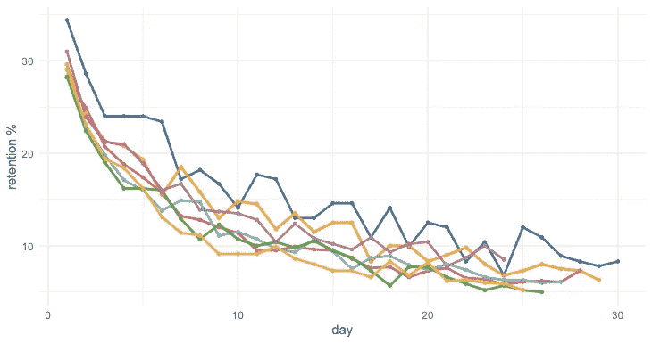
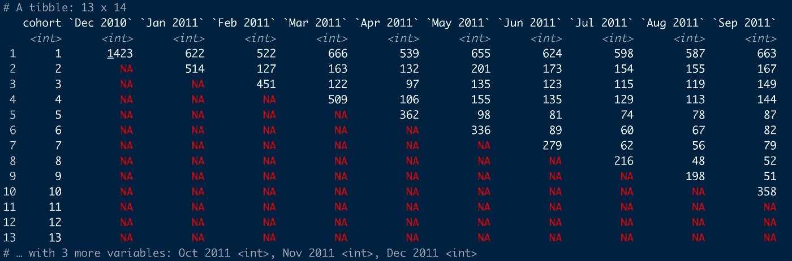
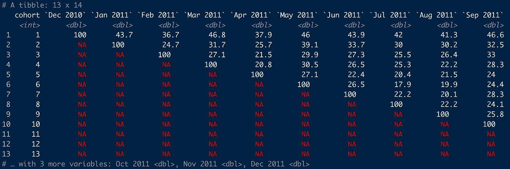
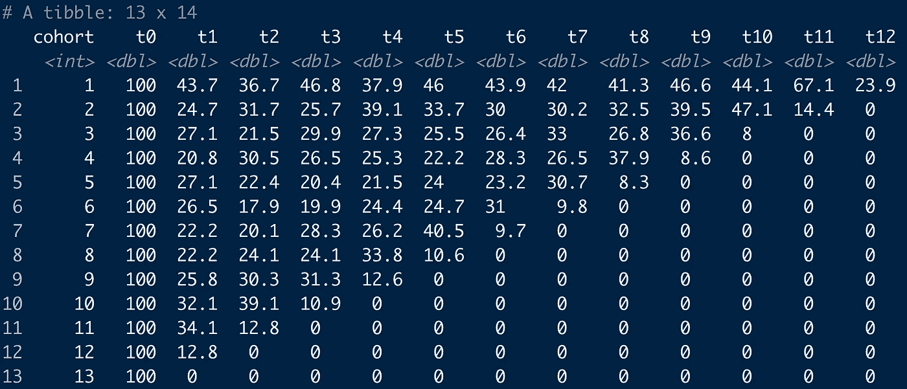
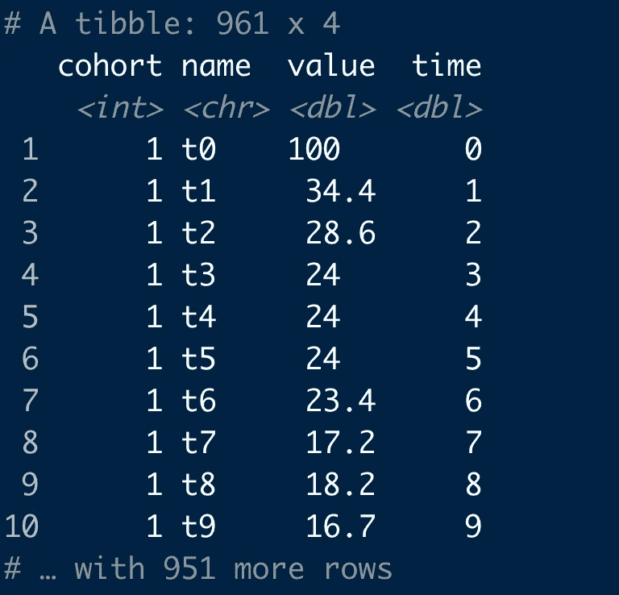
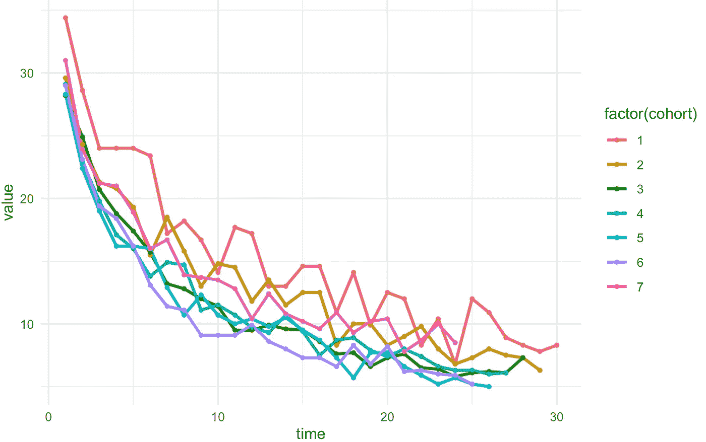
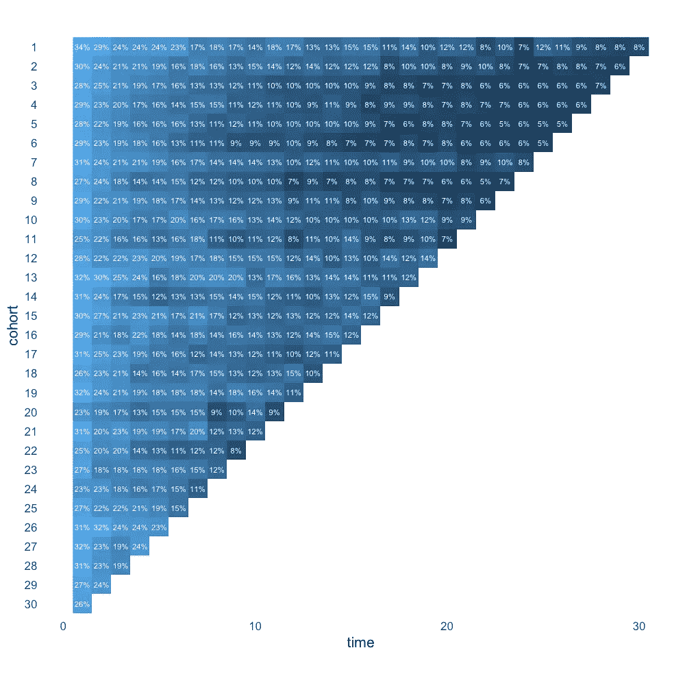

# 简单方法中的队列分析

> 原文：<https://towardsdatascience.com/cohort-analysis-in-r-the-easy-way-424f19a37d18>



作者图片

# 简单方法中的队列分析

## 使用群组软件包更快地分析客户保持率

对于零售和订阅业务来说，可视化客户和用户保持率是一种有用的方法，可以跟踪客户和用户倾向于与他们呆在一起的时间，并发现群组规模随时间变化的差异。虽然有各种各样的方法来留住客户，但考虑客户最初注册或第一次购买的时间可能会有所帮助。这基本上就是群组分析所要完成的。在本教程中，我们将探索一些处理队列分析数据的简单快捷方式，并可视化结果。

虽然描述性群组分析在概念上很简单，而且大多数人可能会发现很容易破译最常见的可视化保持时间的方法，但我个人发现编写实际的代码来准备可视化群组分析结果的数据却非常困难。

我已经花了太多时间在网上搜索和浏览 StackOverflow 上这个问题的答案，希望找到简单的解决方案。最后，我确实设法解决了这个问题，但只是通过一些相当复杂的代码，这些代码很难理解，也几乎不可能记住。因此，为了避免不得不一遍又一遍地复制许多行代码，我决定创建一个名为[【群组】](https://github.com/PeerChristensen/cohorts)的小 R 包，提供一些易于使用的功能来简化我自己的工作，并希望能够简化其他正在进行群组分析的人的工作。

## 数据要求

公司通常存储交易或事件数据，详细说明给定客户或用户何时购买、更新他们的订阅或以其他方式与他们的产品和服务进行交互。作为后者的一个例子，移动游戏提供商可以在每次消费者玩所讨论的游戏时进行记录。本质上，在典型的场景中，我们需要分析数据中的两列:一列包含唯一的用户 id，另一列包含日期。

群组包附带了两个样本数据集，我们将在本教程中使用。名为`online_cohorts`的第一个数据集是来自 Chen，Sain & Guo (2012)的[在线零售数据集](https://archive.ics.uci.edu/ml/datasets/Online+Retail)的精简版本，仅包含两个关键列:`CustomerID`和`InvoiceDate`。

另一个数据集，我称之为`gamelaunch,`,包含了一款手机游戏发布后第一个月的模拟事件数据，过滤后只包含“gameStarted”事件类型。出于我们的目的，关键列将是`userid`和`eventDate`。下面显示了前几行。

```
head(gamelaunch) %>% 
   mutate(userid=abbreviate(userid))# A tibble: 6 x 3
  userid eventDate           eventName  
  <chr>  <dttm>              <chr>      
1 7479   2016-05-24 00:00:00 gameStarted
2 1852   2016-05-24 00:00:00 gameStarted
3 b719   2016-05-24 00:00:00 gameStarted
4 2919   2016-05-24 00:00:00 gameStarted
5 b495   2016-05-24 00:00:00 gameStarted
6 3615   2016-05-24 00:00:00 gameStarted
```

## 入门指南

我们可以安装并加载群组包，并使用下面几行代码查看`online_cohorts`数据集。因为我们将使用 ggplot2 和其他几个 tidyverse 包中的函数，所以我们也加载 tidyverse(如果需要的话，安装它)。

```
install.packages("cohorts")library(tidyverse)
library(cohorts)head(online_cohorts)# A tibble: 6 x 2
  CustomerID InvoiceDate
       <dbl> <date>     
1      17850 2010-12-01 
2      13047 2010-12-01 
3      12583 2010-12-01 
4      13748 2010-12-01 
5      15100 2010-12-01 
6      15291 2010-12-01
```

## 创建一个广泛的群组表

群组包目前允许用户按月和日进行聚合。继续使用`online_cohorts`数据集，我们将按月汇总客户订单。

作为第一步，我们将创建一个宽群组表，并用`id_var`和`date`参数指定适当的变量名。

```
online_cohorts %>% 
   cohort_table_month(id_var = CustomerID, date = InvoiceDate)
```

这将产生如下图所示的输出，其中行代表群组，列代表月份。在本例中，属于群组 1 的客户在 2010 年 12 月进行了第一次购买，属于群组 2 的客户在 2021 年 1 月下了第一笔订单，依此类推。



作者图片

在发动机罩下，`cohort_table_month()`和`cohort_table_day()` 功能执行以下按键操作:

1.  通过`id_var`对数据进行分组
2.  如果使用`cohort_table_month()`将日期转换为年和月
3.  为每个客户创建一个定义为第一个月或第一天的`cohort`变量
4.  按群组和月/日重新分组输出
5.  计算每个群组和月/日对的客户数量
6.  转换为宽格式，其中列表示月/日，值表示客户数量

## 获取百分比

如果我们希望将上述值显示为百分比，我们可以将前面的代码输入到`cohort_table_month_pct()`函数中。

```
online_cohorts %>% 
   cohort_table_month(id_var = CustomerID, date = InvoiceDate) %>%
   cohort_table_pct()
```

从下面的输出可以明显看出，根据定义，群组在第一个月完成，这当然需要 100 %的起始值。随着时间的推移，我们应该会看到越来越少的相同客户在最初订单后的几个月内下新订单。



作者图片

## 群组表左移

对于某些用例，上述结果可能是我们真正想要的。但是，为了生成有意义的图，需要将值向左移动，作为中间步骤。这可以通过简单地将上面显示的代码块放入`shift_left()`函数来实现。

```
online_cohorts %>% 
   cohort_table_month(id_var = CustomerID, 
                      date   = InvoiceDate) %>%
   cohort_table_pct() %>%
   shift_left()
```

甚至可以少调用一个函数来执行相同的处理步骤。下面的代码块涉及与前面的代码示例相同的基础操作，只是顺序不同。但是，这并不影响输出。

```
online_cohorts %>% 
   cohort_table_month(id_var = CustomerID,
                      date   = InvoiceDate) %>%
   shift_left_pct()
```

从这些代码块中的任何一个，将创建以下输出:



作者图片

正如我们所看到的，该操作保留了先前输出中的行数和列数，但是现在每一列都代表一个相对的时间点，即`t0`是每个群组的第一个月，而不是将具体的年份和月份作为列。

这种格式不仅在我们想要制作情节时更容易使用。以这种方式排列群组使得检查结果和比较单个群组之间的趋势更加容易。

## 转换为长格式和绘图友好的格式

作为绘制结果之前的最后一步，我们需要将数据转换为长格式。我们可以通过“tidyr”包中的`pivot_longer()`来实现这一点。作为这种转换的结果，前面的列名已经变成了一个名为`name`的变量。我们还创建了一个名为`time`的新变量，方法是从`name`列的每个值中删除“t ”,并将变量类型改为 numeric。

到目前为止，我们一直使用`online_cohorts`数据集。对于其余的例子，我们将使用`gamelaunch`数据集，按天而不是按月进行聚合。

```
gamelaunch_long <- gamelaunch %>%
   cohort_table_day(userid, eventDate) %>%
   shift_left_pct() %>%
   pivot_longer(-cohort) %>%
   mutate(time = as.numeric(str_remove(name,"t")))
```

检查我们称为`gamelaunch_long`的新数据帧，我们应该看到下面的输出。



作者图片

最后，我们可以探索绘制结果的方法！

## 创建线形图

首先，我们做一个线图，展示活跃用户数是如何逐日减少的。为了清楚起见，我们将仅绘制数据的子集，仅包括编号小于或等于 7 的群组。

一个群体当然首先是完整的。因此，当`time`等于 0(即第一个月或第一天)时，`value`将始终为 100 (%)。为了消除这种冗余，我们对数据进行过滤，使其只包含`time` >为 0 的行。

因为我们在前面的阶段将数据左移，所以我们用值 0 填充了数据帧的右下角三角形。将这些值表示为 NA 会更合适，因为只有第一个群组被完全观察到，并且随后的群组随着时间的推移将具有越来越少的观察值。例如，最后一组将只有一个实际观察值。对此，一个简单的解决方案是通过运行以下代码行将所有 0 值设置为 NA:

```
gamelaunch_long[gamelaunch_long == 0] <- NA
```

另一个解决方案是包括一个过滤标准，规定`value`必须大于 0。在下面的代码中，我们在过滤步骤中应用了这个逻辑以及上面讨论的另外两个标准。

请记住，如果数据中存在真 0 值，这些值也将在建议的解决方案中被忽略。在未来版本的队列包中，我计划包含一个可选参数，将 0 值设置为 n a，同时确保仅替换“假”0 值。

让我们保持我们的设置最小化，创建我们的第一个情节！

```
gamelaunch_long %>%
  filter(cohort <= 7, time > 0, value > 0) %>%
  ggplot(aes(time, value, colour = factor(cohort), group = cohort)) +
  geom_line(size = 1) +
  geom_point(size = 1) +
  theme_minimal()
```



作者图片

在图中，我们可以看到大约 30 %的用户在 t1 时刻活跃，也就是玩新游戏的第二天，三天的留存率从大约 19 %到 24 %不等。我们还可以观察到，群组 1 的总体保留率要高得多。

## 创建表格可视化

我们可以用另一种方式来说明我们的结果，那就是再现左移队列表的左上角三角形。我们应用相同的过滤，除了我们将保留所有的群组，并使用`geom_raster()`来创建由保留率着色的图块，并添加一个`geom_text()`层来显示实际的百分比。

```
gamelaunch_long %>%
   filter(time > 0, value > 0) %>%
   ggplot(aes(time, reorder(cohort, desc(cohort)))) +
   geom_raster(aes(fill = log(value))) +
   coord_equal(ratio = 1) +
   geom_text(aes(label = glue::glue("{round(value,0)}%")), 
                 size  = 3, 
                 colour = "snow") +
  scale_fill_gradient(guide = "none") +
  theme_minimal(base_size = 16) +
  theme(panel.grid   = element_blank(),
        panel.border = element_blank()) +
  labs(y = "cohort")
```



作者图片

## 摘要

在本教程中，我们探讨了许多易于使用的函数，这些函数使群组分析变得简单明了。借助这些功能，我们可以通过计算不同时间点的保留率来处理事件和事务数据，并根据使用案例和下游任务将其转换为有用的数据格式。最后，我们看到了数据是如何绘制的。

我希望本教程中使用的队列包对其他人有用，并为用户节省一点时间，还可能避免一些麻烦！

## 参考

1.  陈大庆、赛梁赛恩和郭昆，“在线零售业的数据挖掘:使用数据挖掘进行基于 RFM 模型的客户细分的案例研究”，《数据库营销和客户战略管理杂志》，第 19 卷第 3 期，第 197-208 页，2012 年(印刷前在线出版:2012 年 8 月 27 日)。doi: 10.1057/dbm.2012.17)。
2.  Dua d .和 Graff c .(2019 年)。UCI 机器学习知识库[http://archive . ics . UCI . edu/ml]。加州欧文:加州大学信息与计算机科学学院。