# 协整时间序列和差异可能是坏的时候

> 原文：<https://towardsdatascience.com/cointegrated-time-series-and-when-differencing-might-be-bad-f4e2a9132a0c>

## 你听说过整合的时间序列数据，但协整呢？

迈克尔·贾斯蒙德在 Unsplash[上的照片](https://unsplash.com/s/photos/two-lines?utm_source=unsplash&utm_medium=referral&utm_content=creditCopyText)

# 介绍

时序分析工具包中的一个标准方法是[差分变换或*差分*](https://machinelearningmastery.com/remove-trends-seasonality-difference-transform-python/) 。尽管非常简单，差异却非常强大。[事实上，它允许我们用几乎是一个裸露的白噪音过程超越复杂的时间序列模型](https://www.sarem-seitz.com/facebook-prophet-covid-and-why-i-dont-trust-the-prophet/)。

由于它的简单性，每当单位根检验有意义时，差分法就很流行。虽然这在单变量情况下是相当安全的，但对于多变量时间序列来说，情况就不同了。

让我们用一个简单的例子来说明这一点:

# 一个激励人心的时间序列例子

为了举例说明潜在的问题，我创建了一个人工的二维线性时间序列:

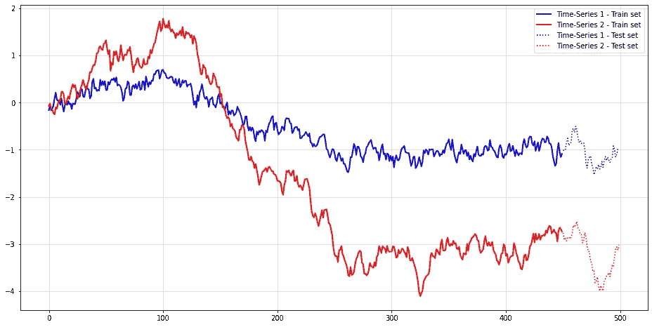

简单的二维时间序列。(图片由作者提供)

这两个时间序列之间似乎有一些联系，但随着时间的推移，这可能显然只是一个虚假的[。在这种情况下，你经常看到的下一步是测试两个时间序列的单位根。](https://en.wikipedia.org/wiki/Spurious_relationship)

来自 statsmodels 的[增广 Dickey Fuller 测试显示显著性得分为 0.8171 和 0.8512。这突出了两个时间序列中可见的单位根。因此，差异转换似乎是合乎逻辑的下一步。让我们对训练集这样做，以预测未来的测试集:](https://www.statsmodels.org/dev/generated/statsmodels.tsa.stattools.adfuller.html)

时间序列训练集的第一差异。(图片由作者提供)

接下来，我们可以检查两个 VAR(1)模型的预测性能——一个根据原始时间序列训练，另一个根据转换后的时间序列训练:

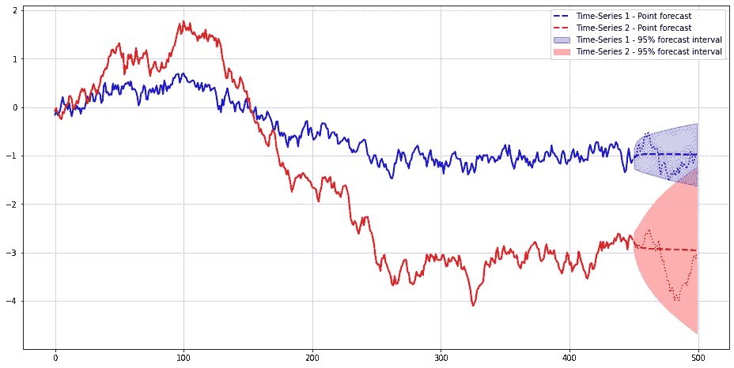

没有差异的点预测和 95%区间预测**。(图片由作者提供)**

两个时间序列预测的总 MSE 在`0.3463`。显然，具有训练数据差异的模型应该执行得更好:

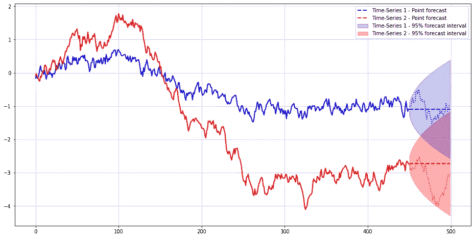

使用差异进行点预测和 95%区间预测**。(图片由作者提供)**

这一次，总的 MSE 是`0.5105` -大约高出 50%。此外，时间序列 1 的预测间隔比没有任何差异时大得多。流行的差异转换似乎出了点问题。

# 为什么协整很重要

现在，你可能——理所当然地——认为差异模型的表现不佳纯粹是因为偶然。事实上，我们需要更广泛的实验来从经验上验证我们最初的主张。

然而，实际上有可能证明为什么差分对多变量时间序列分析不利。要做到这一点，让我们后退一步，回到单变量时间序列模型，以及为什么差异转换在这里工作。

为了简单起见，我们只看一下 **AR(1)** 和 **VAR(1)** 时间序列。所有结果都可以证明对高阶 AR/VAR 也成立。

# 单位根 AR(1)时间序列—差分可能安全时

在数学上，AR(1)时间序列看起来如下:

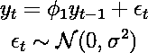

(图片由作者提供)

为了使差分有意义，我们需要时间序列有一个单位根。这是特征多项式解的情况

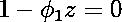

(图片由作者提供)

位于单位圆上，即

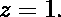

(图片由作者提供)

因此，AR 参数的唯一选择是

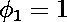

(图片由作者提供)

因此

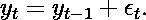

(图片由作者提供)

为了使这个方程稳定，我们从两边减去滞后变量:

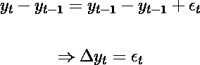

(图片由作者提供)

显然，现在最好的预测是预测白噪声。请记住，我们同样可以很好地拟合未转换变量的模型。然而，差分时间序列直接揭示了缺乏任何真正的自回归成分。

一方面，差分法在有单位根的单变量时间序列中显然是一个好的选择。然而，对于多元时间序列来说，事情就不那么简单了。

# 多元时间序列协整

现在考虑一个 VAR(1)时间，其中我们用向量(粗体，小写)和向量(大写)替换 AR(1)模型中的标量:

(图片由作者提供)

与 AR(1)情况类似，VAR(1)时间序列的单位根意味着

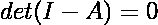

(图片由作者提供)

在一般情况下，自回归参数是单位矩阵。这意味着在我们的 VAR(1)时间序列的边际都是独立的和单位根的。如果我们排除这种情况，继续 AR(1)，我们得到

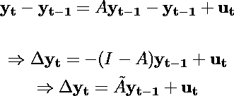

(图片由作者提供)

最后一行也被称为 VAR 时间序列的[向量误差校正表示](https://en.wikipedia.org/wiki/Error_correction_model)。如果你回到我们的模拟，这就是用来产生时间序列的精确公式。

如 [Lütkepohl](https://www.google.com/books/edition/New_Introduction_to_Multiple_Time_Series/muorJ6FHIiEC?hl=de&gbpv=1&dq=l%C3%BCtkepohl&pg=PA249&printsec=frontcover) 所解释的，通过使 Atilde 秩亏，时间序列变得协整。还有另一个更广泛的协整定义，但我们今天不会讨论它。

显然，协整的 VAR(1)时间序列不同于单变量 AR(1)的情况。即使在差分之后，变换后的值也取决于原始时间序列的过去。因此，如果我们不再考虑原始的时间序列，我们就会丢失重要的信息。

如果你正在处理多元数据，你不应该盲目地应用差分。

# 如何处理协整

上述结果回避了我们应该如何处理协整的问题。典型地，时间序列分析要么与预测有关，要么与推断有关。因此，我想到了两种不同的方法:

**交叉验证和回溯测试**——实用的“数据科学”方法。如果我们的目标主要是建立最准确的预测，我们不一定需要检测协整。只要生成的模型是高性能的和可靠的，几乎什么都可以。

通常，可以基于交叉验证和样本外性能测试来选择“最佳”模型。协整的主要含义是小心地应用差分。

另一方面，上述结果也表明，添加原始时间序列作为一个特征一般来说可能是一个好主意。

**统计测试** —经典的统计方式。显然，协整对于计量经济学家和统计学家来说并不新鲜。如果您有兴趣了解生成过程本身，这种方法可能更方便。

幸运的是，詹姆斯·麦金农的工作为协整检验提供了广泛的见解。其他流行的协整检验是由 Engle 和 Granger 以及 Soren Johansen 开发的。

在 Python 中，可以在 [statsmodels 库](https://www.statsmodels.org/dev/generated/statsmodels.tsa.stattools.coint.html)中找到 MacKinnon 测试。对于上述时间序列，测试得出的 p 值几乎为零。

# 结论

希望这篇文章能让你大开眼界，不仅仅是直接比较每个时间序列。你现在应该知道协整是多元时间序列的一个特性，需要小心对待。

请记住，标准的协整只与线性时间序列有关。一旦出现非线性动态，事情可能会变得更加混乱，差异可能会更加不合适。

的确，存在一些[最近关于非线性协整的研究](https://www.tandfonline.com/doi/full/10.1080/07474938.2020.1771900)。你可能想看看它的更多细节。

# 参考

**【1】**恩格尔，罗伯特·f；克莱夫·WJ·格兰杰。协整和误差修正:表示、估计和检验。计量经济学:计量经济学学会杂志，1987 年，第 251-276 页。

**【2】**汉密尔顿，詹姆斯道格拉斯。*时间序列分析*。普林斯顿大学出版社，2020 年。

**【3】**吕特克波尔，赫尔穆特。多重时间序列分析的新介绍。斯普林格科学&商业媒体，2005。

*原载于 2022 年 8 月 25 日 https://www.sarem-seitz.com*<https://www.sarem-seitz.com/cointegrated-time-series-and-when-difference-transformations-might-be-bad/>**。**