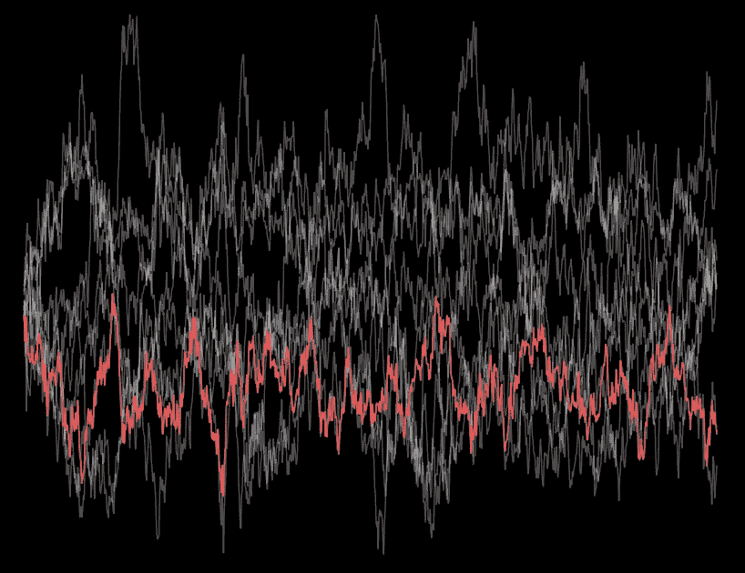
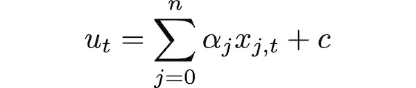
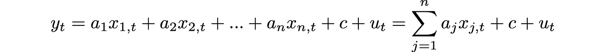
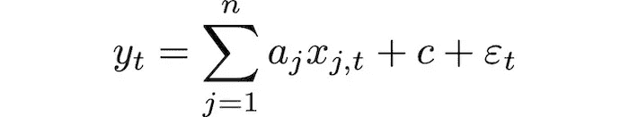
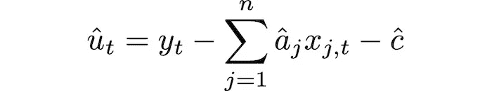
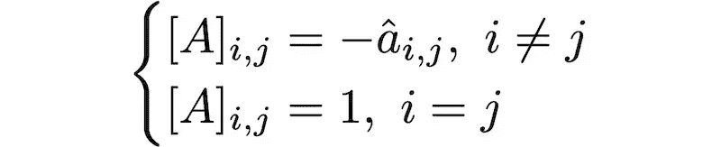
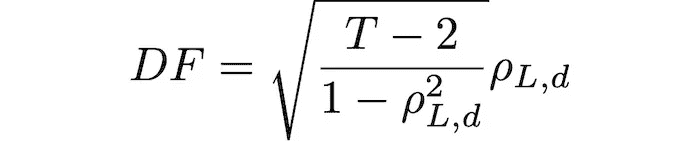
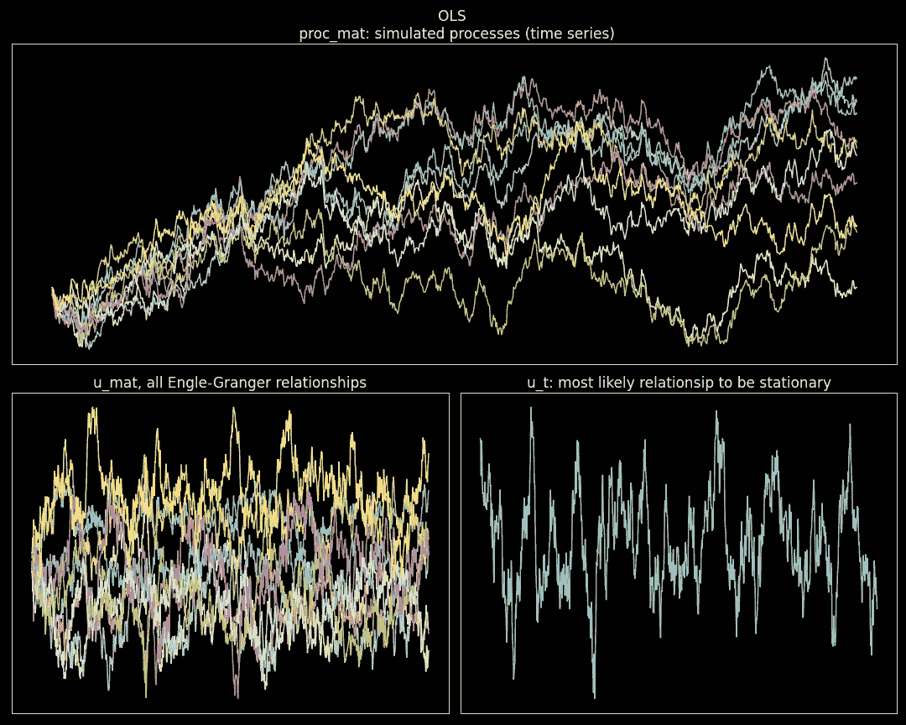
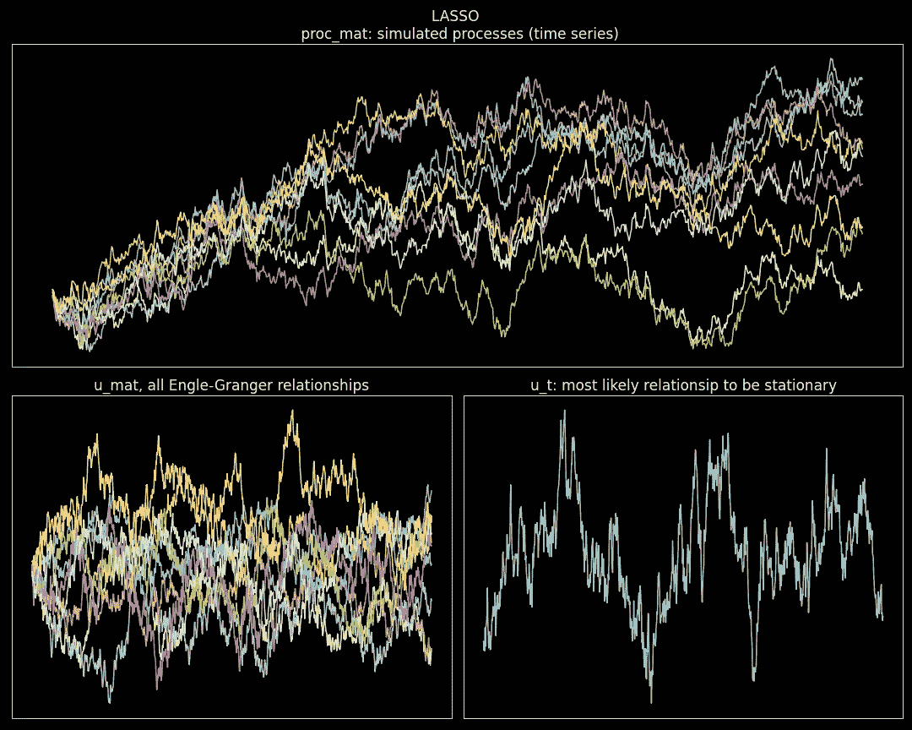

# 协整流行方法[1/2]:恩格尔-格兰杰方法

> 原文：<https://towardsdatascience.com/cointegration-popular-methods-1-2-the-engle-granger-approach-82b6d270ddf2>

## Python 中的简单协整方法。恩格尔-格兰杰方法，最直观的方法。

图片作者。

大多数协整方法的数学和概念并不总是很简单。通常，复杂的数学工具模糊了方法的意图和步骤。这种复杂性也影响了对这一主题的进一步探索。

恩格尔-格兰杰的协整方法不受此影响。它可能不是最可靠的方法，也不是最稳定的方法，但它简单而直观。对于更稳健的协整方法，参见 [BTCD](/canonical-decomposition-a-forgotten-method-for-time-series-cointegration-and-beyond-4d1213396da1) 或[迪基-富勒直接优化](/dickey-fuller-optimization-tackle-time-series-cointegration-head-on-f924f7c51477)。

在这个故事中，我们将用简单的数学来介绍 Engle-Granger 方法，并且我们将编写一个迷你库来在未来的项目中使用这个方法。

## 故事结构

*   协整，阶 1
*   从向量和矩阵构建 1D 时间序列
*   普通最小二乘残差
*   确定最合适的关系
*   合成数据示例
*   代码摘要
*   最后的话

## 协整，阶 1

当提到协整时，我们通常是指一阶时间序列的协整。这意味着我们寻求原始时间序列(不是差异)的线性组合，它是稳定的。有时我们找到它；有时候，它不在那里。数学上，我们寻求系数 *α* 和可能的常数 *c* ，使得

是静止的。

需要注意的是，如果 *u* 是静止的，那么无论常数 *c* 的值是多少，它都是静止的。该常数仅用于重新确定时间序列值的中心。

## 从向量和矩阵构建 1D 时间序列

在我们深入研究 Engle-Granger 方法之前，我们需要开发一些工具来简化我们未来的工作。

给定一个系数向量*和一个进程矩阵(时间序列)，每列一个进程，列的索引对应于向量*的索引；以下代码的函数“get_u_t”创建了这些条件的线性组合。此外，函数“get_u_mat”从系数矩阵(也按列索引)创建 u 个时间序列的矩阵(每列一个)，即 ***a*** 向量的向量。**

**您可以看到，我们将在 NumPy 数组中使用的约定是，每一列都是一个时间序列，非常类似于 pandas 数据帧的工作方式。**

## **普通最小二乘残差**

**让我们回到 *u* 的等式，稍微改写一下。**

****

**这里 *x_0* 变成了 *y* ，求和不是从零开始，而是从一开始。**

**现在是恩格尔-格兰杰方法的本质。他们推测使用 **OLS 回归规范**:**

****

**其中 *y* 是多个时间序列中的一个， *x* 是所有其他时间序列。那么因为ε是同分布正态的，因此是平稳的，即使来自实际回归的残差 *u* 不是同分布正态的，它们也会**接近平稳性**。**

**那么我们的系列 *u* 就是:**

****

**其中使用 OLS 估计系数和常数。**

**请注意，如果我们有 *n+1* 时间序列，就有 *n+1* 种方法来选择 *y* 和*x*s。因此，从使用 OLS 的 Engle-Granger 方法中，我们找到了系数矩阵，而不是单个向量。**

**换句话说，给定一个矩阵，其中每一列都是时间序列 *x_j，*我们将 OLS 应用于以下每个规格*。***

****

**则每个 u_j 时间序列为:**

****

**构建 *u_j* 矩阵的系数矩阵定义为:**

****

**注意负号；这是因为在回归规范中，线性组合在等号的另一边，我们需要考虑这一点。**

**下面的代码找到了这样一个矩阵，其中每一列对应于一个系数向量。我们已经为线性回归模型定义了一个[接口](/python-interfaces-why-should-a-data-scientist-care-2ed7ff80f225)(所有 scikit-learn 回归都实现了这个接口)，这样我们就可以测试原始 OLS 之外的其他模型。使用一个[接口](/python-interfaces-why-should-a-data-scientist-care-2ed7ff80f225)，我们注入回归模型的依赖性，而不是硬编码它，从而能够在不重写代码的情况下切换模型。**

**到目前为止，一切都很好；然而，我们需要解决一个问题；我们应该找到的是 ***a*** 向量(带有线性组合系数的向量)，而不是*n*+1****a***向量(系数矩阵)。我们需要决定如何在所有可能的选择中做出选择。***

## **确定最合适的关系**

**我们使用 Dickey-Fuller 平稳性测试来寻找更可能是平稳的关系。我们估计所有关系的检验统计量，并选择具有最小值的一个。简单。**

**为了快速和简单起见，我们使用直接估计 Dickey-Fuller 检验统计量的方法:**

****

**其中时间序列样本量为 *T* +1， *ρ* 为滞后序列和差分序列之间的相关性。**

**如果你想查看这个结果的完整数学证明，我推荐阅读[这个故事](/dickey-fuller-direct-estimation-speed-up-to-50x-test-statistic-computation-af3cb28b9803)。**

**实现它的代码:**

**我们将前一节中编码的函数“get_engle_granger_coint_mat”包装在另一个函数中，该函数对线性模型使用相同的接口，并选择具有最低 Dickey-Fuller 统计值的向量。**

**当我们想要一个简单的解决方案来寻找一个带有系数的矢量**来产生一个潜在的稳定时间序列 *u* 时，我们就调用这个函数。这里的关键是**潜在地静止**。有些情况下，恩格尔-格兰杰方法无法找到平稳的时间序列，所以要谨慎使用。再一次，为了更健壮，尽管更复杂的方法，看看 [BTCD](/canonical-decomposition-a-forgotten-method-for-time-series-cointegration-and-beyond-4d1213396da1) 或[直接迪基-富勒优化](/dickey-fuller-optimization-tackle-time-series-cointegration-head-on-f924f7c51477)。****

## **合成数据示例**

**为了测试我们刚刚编写的代码，我们将使用离散采样相关布朗运动形式的单位根过程。查看前面关于生成这种过程的故事，因为我们将使用那里讨论的代码来生成相关的布朗路径。我们将这样的代码保存为“brownian_motion.py ”,并将其放在运行以下代码的同一个文件夹中。**

**最后，我们使用 OLS，注入来自 sklearn 的“线性回归”模型，测试 Engle-Granger 方法:**

****

**图片作者。**

**我们用一个接口对回归进行编码，因为我们想要在不重写代码的情况下自由地改变模型。因此，如果我们现在希望使用套索，我们注入一个来自 sklearn 的套索模型。**

****

**图片作者。**

**能这么轻松的换型号真好。尽管在这个特殊的例子中，OLS 似乎产生了一个更好的结果，但不要低估惩罚回归的力量。由于使用 LASSO 的模型复杂度较低，因此它可以产生更稳定的结果。由您决定哪种回归模型更适合您。**

## **代码摘要**

**最后，为了完整起见，这里是前面几节中的所有代码。这一次，代码没有那么广泛；不过，文档字符串比代码多。**

## **最后的话**

**这个故事的目的仅仅是教学，直观地探索协整。使用恩格尔-格兰杰方法有助于探索时间序列之间的关系。每种关系产生不同的时间序列；有些比其他的更可能是静止的。调查为什么会发生这种情况是很有趣的。为什么有些时间序列更适合回归模型？这些问题可以创造有价值的数据洞察力。**

**然而，Engle-Granger 方法在实际中很少用于计算协整向量。为此，我会建议 BTCD 或者 T2 进行迪基-富勒直接优化。**

## **参考**

**[1] R. F. Engle 和 C. W. J. Granger，[协整和误差修正:表示、估计和检验](http://...) (1987)，《计量经济学》第 55 卷，第 2 期，第 251-276 页**

**我希望这个故事对你有用。请继续关注协整流行方法迷你系列的第 2 部分。订阅以便在第 2 部分发布后立即收到通知。**

**<https://medium.com/subscribe/@diego-barba> ** 

**喜欢这个故事吗？通过我下面的推荐链接成为一个媒体成员来支持我的写作。无限制地访问我的故事和许多其他内容。**

**<https://medium.com/@diego-barba/membership> **