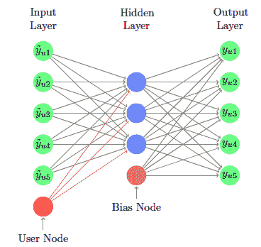
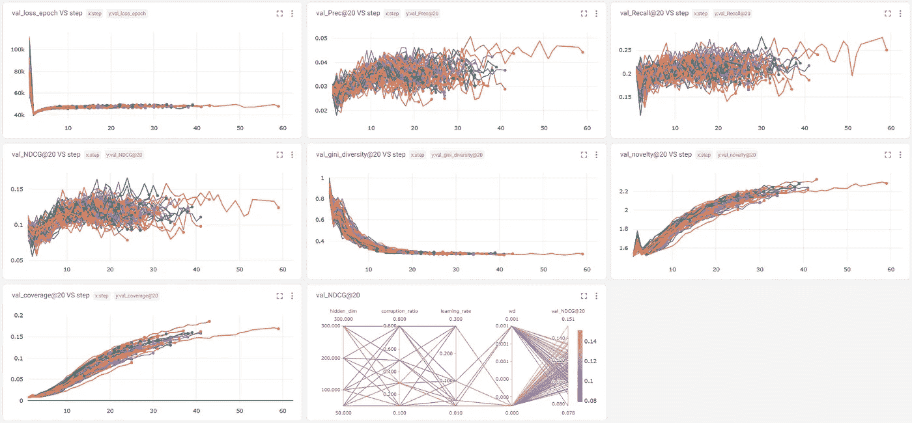

# PyTorch Lightning 上的协作去噪自动编码器

> 原文：<https://towardsdatascience.com/collaborative-denoising-autoencoders-on-pytorch-lightning-bc79f38f0f7a>

## 自动编码器是一种简单的神经网络推荐方法

推荐系统在我们的数字生活中无处不在。为了提高推荐项目的质量，研究者们对现有的文献提出了数百种算法。许多人已经找到了进入大型生产系统的方法，同时新的算法也一直在开发和测试中。


今晚我应该看什么？维多利亚·希思在 [Unsplash](https://unsplash.com?utm_source=medium&utm_medium=referral) 拍摄的照片。

在这篇文章中，我将介绍姚等人的[协同去噪自动编码器。CDAE 是自动编码器的变体，非常适合推荐器领域。让我们先处理一些预备工作:](https://dl.acm.org/doi/10.1145/2835776.2835837)

*   自动编码器是试图从输入中学习压缩映射的神经网络。它首先将输入强制到一个信息瓶颈(编码器)，然后尝试从压缩的表示(解码器)重新创建原始输入。
*   瓶颈有多种形式，例如隐藏层中的节点少得多、输入中添加了噪声、损失函数中有正则项，或者多种技术的组合。
*   通常，自动编码器用于预先训练大型网络，因为它不需要来自数据的额外标签。它使用数据本身进行训练，这就是所谓的自我监督学习。

自动编码器非常值得推荐，因为它们可以从输入中学习有效的低维表示。这与矩阵分解非常相关，它从评级矩阵中学习用户和项目的潜在表示。矩阵分解是许多推荐系统的主力，对研究人员和工程师来说，改进、概括、重构甚至重新发明这个轮子的努力非常有吸引力。在推荐中，输入非常稀疏(长尾问题)，CDAE 可能是解决稀疏性的一种方法。

CDAE 有以下建筑。输入层有一个用户节点(红色)，它使用户个性化的信息能够在网络中流动。隐藏层的节点比输入和输出少得多。这类似于矩阵分解和主成分分析中的潜在维数的思想。训练网络包括在一定程度上破坏输入，并通过网络将其转发。即使存在信息瓶颈和损坏的数据，输出层也必须接近输入。这使得网络创建了评级的有效低维映射。为了推断，用户评级向量没有被破坏，并且在网络中正向传递。n 个最高输出构成了前 n 个推荐项目。



吴耀等人 2016 年。前 N 名推荐系统的协同去噪自动编码器。【https://doi.org/10.1145/2835776.2835837】()

# 履行

对于我的实现，我非常感谢 James Le 的[代码](https://github.com/khanhnamle1994/MetaRec)和他的[文章](/recommendation-system-series-part-6-the-6-variants-of-autoencoders-for-collaborative-filtering-bd7b9eae2ec7)的工作。我也推荐 [RecBole](https://github.com/RUCAIBox/RecBole) 供读者研究。我将使用 2003 年发布的拥有 6000 个用户和 4000 个项目的 [MovieLens 1M 数据集](https://grouplens.org/datasets/movielens/1m/) [1]。

我使用 [Pytorch Lightning](https://pytorch-lightning.readthedocs.io/) 来构建我的代码。[光线调节](https://www.ray.io/ray-tune)用于超参数优化。 [CometML](https://www.comet.ml/) 用于记录我的结果。你可以在这里上我的 [Kaggle 笔记本，在这里](https://www.kaggle.com/code/krsnewwave/collaborative-denoising-autoencoder-movielens)[上 CometML 实验](https://www.comet.ml/krsnewwave/movielens/view/QkBV0zpW5czYyMFxmX5hADAU6/panels)。

# 数据及其数据加载器

该数据集包含 100 万电影评级，因此得名。在本练习中，我们仅保留评分≥4 的评分。评分低于 5 的所有项目和用户将被反复删除。它产生了以下评级矩阵。它很小，但对于演示来说已经足够好了。

```
Starting interactions info
Number of rows: 6038
Number of cols: 3533
Density: 2.697%
Ending interactions info
Number of rows: 6034
Number of columns: 3125
Number of ratings: 574376
Density: 3.046%
```

对于数据分割，我做了以下工作:至少有 5 个评级的用户有 20%的评级成为验证集的一部分。我对测试集重复这个过程。

数据准备完毕后，我开始为 PyTorch 安装数据加载器。我们有三个版本——训练、测试和推理。训练加载器包含用于训练的稀疏矩阵。测试加载器包含训练矩阵和目标矩阵。推理加载器包含用于推理的用户 id。如果我们不这样做，那么我们的用户 id 索引将从提供的行为稀疏矩阵中计算，而不是从原始输入空间中计算。

# 模型

PyTorch Lightning 需要一些简单的面向对象编程规则来构建训练循环。好处是巨大的:一个完整的框架可以依靠各种回调、记录器、调度策略、多 GPU 支持等等。我有以下要点供你检查，但请在这里检查整个课程的[。](https://www.kaggle.com/code/krsnewwave/collaborative-denoising-autoencoder-steam?cellIds=15&kernelSessionId=94166783)

为了训练，我们使用 CometML & Ray Tune duo。前者通过`CometLoggerCallback`收集指标。后者只需添加几行代码即可完成超参数调整。在本练习中，将通过网格搜索彻底使用这些参数。如果你需要更智能的东西，那么还有其他搜索算法可以尝试，如果需要的话，还有时间预算来限制成本。

# 模型结果

CometML 产生了一些我在机器学习中见过的最漂亮的面板。您可以将您的参数绘制成图表，通过 notes 与其他人协作，并且为您的团队拥有一个模型注册表。值得一试。下面这个仪表盘是不是很神奇？这是我们在上面做的超参数调整。



图片由作者使用 CometML 制作。每个图表都是训练过程中每一步的指标。

右下角的平行坐标图显示了超参数搜索如何获得最佳模型。我以下面的超参数结束。在本练习中，隐藏节点的数量和损坏率是最终指标的最关键影响因素。

```
{'hidden_dim': 100, 'corruption_ratio': 0.3, 'learning_rate': 0.3, 'wd': 0, 'activation_fun': 'tanh'}
```

对于这些指标，有些应该是熟悉的。这些指标被参数化为@ k，这是前 k 个推荐的项目。精度和召回率类似于分类设置中的精度和召回率。NDCG 是衡量排名质量的一个标准。以下是一些“超出”准确性的指标。虽然需要一个好的 NDCG，但该数据集相当密集，因此推荐可能会非常重复和枯燥。

*   基尼系数——衡量用户间推荐项目差异的指标。越低，推荐越独特。
*   覆盖率——在训练集中的所有项目中，推荐了多少个项目
*   新鲜感——衡量前 k 个推荐有多受欢迎的指标。越低，推荐就越“不足为奇”。

# 我们将何去何从？

此时，您可能对自动编码器如何在推荐设置中工作有了很好的理解。这可以说是这个领域中最简单的算法之一，但是你也应该尝试变分自动编码器和序列自动编码器。

您还可以将您的工作从笔记本升级到 MLOps 管道。MLOps 是关于在机器学习中创造可持续性的。考虑到你有十几个项目，模型，训练循环，服务管道…很明显，需要一个框架来组织事情。Kedro 是管理所有这些的一种方式。

[最后，我还写了一个项目](/deploying-a-recommendation-system-the-kedro-way-7aed36db7cef)，在那里我实现了一个从数据工程到培训、测试和部署的推荐管道。这是一个漫长的过程，但让你的 ML 可持续发展是值得的。

感谢阅读！

[1] F .麦克斯韦·哈珀和约瑟夫·康斯坦。2015.电影镜头数据集:历史和背景。美国计算机学会交互式智能系统汇刊 5，4:19:1–19:19。

请到 http://itstherealdyl.com<https://itstherealdyl.com/2022/04/28/collaborative-denoising-autoencoders-on-steam-games/>**查看我的博客，了解更多我的作品。**