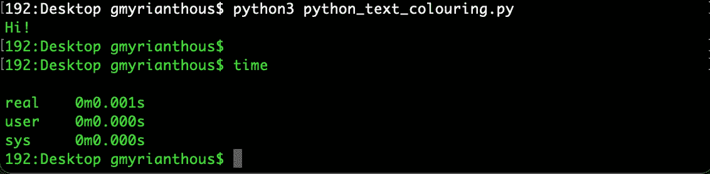

# 如何使用 Python 在终端中打印彩色文本

> 原文：<https://towardsdatascience.com/coloured-text-terminal-python-dc5692ee6319>

## 用 Python 打印彩色文本到标准输出和错误


照片由 [Levi Guzman](https://unsplash.com/@homeschool?utm_source=unsplash&utm_medium=referral&utm_content=creditCopyText) 在 [Unsplash](https://unsplash.com/s/photos/smoke-grenade?utm_source=unsplash&utm_medium=referral&utm_content=creditCopyText) 上拍摄

打印标准输出或标准错误是开发人员在记录有用信息甚至调试部分源代码时需要执行的最常见的操作之一。

在许多情况下，从冗长的角度来看，被报告的信息量可能是相当大的。因此，重要的是要确保打印的任何信息都是一致的，并且对用户来说是可读的。为了达到这个目标，你可以使用的一个技巧是在标准输出/错误上给打印出来的文本着色。

在今天的文章中，我们将探讨两种不同的方法，在使用 Python 编写应用程序时，您可以利用这两种方法在终端上打印彩色文本。

## 使用 ANSI 转义序列打印彩色文本

ANSI 转义序列是一种标准，用于定义和控制终端选项，如颜色、字体样式和光标位置。

这些序列由字节序列组成，以一个 ASCII 转义字符(即八进制的`\033`)和一个括号字符(因此，类似于`\033[`)开始，这些字符被嵌入到文本和序列需要有效的特定位置。

请注意，使用 ANSI 转义序列，您甚至可以对文本应用进一步的格式，包括下划线、粗体等。

现在让我们创建一个由一些 ANSI 转义序列组成的简单类，这些转义序列可用于指定不同类型的文本格式和样式。

```
class TextFormatter:
    """
    Contains numerous ANSI escape sequences used to apply
    formatting and styling to text.
    """
    # Blue colouring
    BLUE_COL = '\033[94m' # Red Colouring
    RED_COL = '\033[91m' # Green colouring
    GREEN_COL = '\033[92m'

    # Reset formatting and styling
    RESET = '\033[0m' # Underlined text
    UNDERLINE = '\033[4m' # Yellow colouring
    YELLOW_COL = '\033[93m'
```

现在你所需要做的就是简单地将这些序列添加到你想要格式化或样式化的文本的开头。

```
print(
  f'{TextFormatter.BLUE_COL}This is a text in blue'
  f'{TextFormatter.RESET}'
 )
 print(
  f'{TextFormatter.RED_COL}This is a text in red'
  f'{TextFormatter.RESET}'
 )
 print(
  f'{TextFormatter.GREEN_COL}This is a text in green'
  f'{TextFormatter.RESET}'
 )
 print(
  f'{TextFormatter.UNDERLINE}This is an underlined text'
  f'{TextFormatter.RESET}'
 )
 print(
  f'{TextFormatter.YELLOW_COL}This is a text in yellow'
  f'{TextFormatter.RESET}'
 )
```

标准输出(终端)上的输出应该与下面的屏幕截图中所示的相同:


Python 标准输出中的彩色文本—来源:作者

值得一提的是，无论何时使用 ANSI 转义序列，都必须重新设置格式。否则，应用的样式和格式将继续使用。这就是为什么我们在我们的`TextFormatter`类下定义了`RESET`序列的原因，只要你想终止先前样式/格式的效果，就应该使用这个序列。

例如，假设我们想打印绿色文本，但是我们忽略了`RESET`序列:

```
print(TextFormatter.GREEN_COL + 'Hi!')
```

这将对输出文本进行着色，但是即使我们的应用程序结束，着色仍然有效，如



来源:作者

在启用和禁用 ANSI 转义序列时，您甚至可以创建一个函数来简化您的工作。例如，下面的函数将完成这个任务，您将不再需要关心重置应用的样式:

```
def print_formatted_text(ansi_seq: str, text: str) -> None:
    print(f'{ansi_seq}{text}{TextFormatter.RESET}')
```

你可以像下面这样调用它:

```
print_formatted_text(TextFormatter.GREEN_COL, 'Hello, World!')
```

还有一点很重要，那就是 ANSI 转义序列并不能在所有平台上开箱即用。如果您在 Windows 计算机上运行 Python 应用程序，您可能需要运行额外的命令才能使格式和样式有效。这通常可以通过一个简单的命令来实现:

```
import os os.system('color')
```

## 使用 Colorama 进行跨平台着色

如果您想避免使用 ANSI 转义序列定义格式和样式的手动过程，您可以利用 PyPI 上提供的第三方 Python 包`[Colorama](https://pypi.org/project/colorama/)`。

该软件包提供了跨平台的文本着色，这意味着 ANSI 转义字符序列可以在 MS Windows 上开箱即用。

你可以通过`pip`在 PyPI 上安装包:

```
$ pip install Colorama
```

您可以用与我们在本文前一节中讨论的自定义方法非常相似的方式来使用它:

```
from colorama import Fore
from colorama import Styleprint(f'Text in {Fore.GREEN}green{Style.RESET_ALL} color!')
```

终端上的输出将是:


Python 和 Colorama 标准输出上的彩色文本—来源:作者

## 其他选择

`[termcolor](https://pypi.org/project/termcolor/)`软件包实现了让用户在终端上打印彩色文本的功能。但是请注意，在后台，`termcolor`会发出 ANSI 代码，因此它可能无法在开箱即用的 Windows 上工作。例如，为了让 ANSI 转义序列工作，您可能必须运行`os.system('color')`。

## 最后的想法

在今天的教程中，我们讨论了以一致和可读的方式打印标准输出和错误信息的重要性。有一种技术可以帮助你朝着这个方向前进，那就是在向终端报告这个信息的时候加入颜色。

有几种不同的方法可以帮助你实现这个目标。从简单的 ANSI 转义序列到第三方 Python 包，如`Colorama`或`termcolor`。但是请注意，正如我们在本文中讨论和展示的那样，除非您在源代码中运行一些额外的命令，否则这些方法中的一些并不能在所有平台上开箱即用。

[**成为会员**](https://gmyrianthous.medium.com/membership) **阅读介质上的每一个故事。你的会员费直接支持我和你看的其他作家。你也可以在媒体上看到所有的故事。**

<https://gmyrianthous.medium.com/membership>  

**相关文章你可能也喜欢**

</requirements-vs-setuptools-python-ae3ee66e28af>  </args-kwargs-python-d9c71b220970>  </how-to-merge-pandas-dataframes-221e49c41bec> 