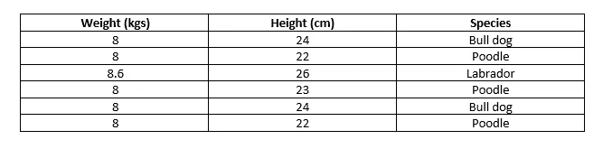

# 对抗维度的诅咒

> 原文：<https://towardsdatascience.com/combating-the-curse-of-dimensionality-62b0c2bf3472>

## 方法来减少数据集的维数，以减少过度拟合并加速该过程

照片由[莫仁·许](https://unsplash.com/@moren?utm_source=unsplash&utm_medium=referral&utm_content=creditCopyText)在 [Unsplash](https://unsplash.com/s/photos/minimalist?utm_source=unsplash&utm_medium=referral&utm_content=creditCopyText) 上拍摄

当您处理高维数据时，您很可能会遇到过拟合、较长的计算时间和/或模糊的见解等问题。在本文中，我们将探讨一些高维数据的降维方法。但在此之前，我们先说几件在深入降维之前需要了解的重要事情。

降维有两种方式，即特征选择和特征提取。 ***特征选择*** 是指从数据集中选取最重要的原始形式的特征进行建模。而 ***特征提取*** 是指在不丢失任何重要信息的情况下，从现有特征中创建新特征。

数据集中要素的数量必须小于记录的总数，如果要增加要素，观测值的数量应呈指数增长。具有更多特征和更少记录的数据集将导致模型过度拟合，这是我们一直想要避免的。因此，我们丢弃对决策没有太大帮助的不重要的特征，只保留重要的特征。但是，我们如何知道哪些特性对我们来说是重要的呢？幸运的是，Python 库使降维过程变得更加容易。那么，让我们来了解一下降低数据维数的不同方法，以及如何在 Python 中实现它们。

## 具有方差阈值的特征选择

顾名思义，方差代表数据集中的可变性，表明分布有多分散。如果一个特征的方差很低，那么这个特征就不那么重要。假设我们有一个狗的健康数据集，它具有不同的特征，指示狗的体重、身高、身体质量指数等。如果权重特性始终只有一个或两个值，则权重的方差为零，因此对我们来说不重要。由于所有记录中的权重都是相同的，因此很明显，该特征对于我们产生未知见解或对预测模型的训练没有太多帮助。

作者创建的样本数据集

Python 的 scikit-learn 库提供了一种使用*variance threshold*估算器删除低方差特性的简单方法。我们可以将阈值参数设置为等于我们想要设置的任何方差阈值。方差低于阈值的要素会被自动丢弃。

## 方差阈值的 Python 实现

在第 1 行和第 2 行中，我们导入并定义了阈值等于 1 的估计量。在第 5 行中，我们将估计量与数据集相匹配。在第 8 行中，我们创建了一个具有方差等于 1 或更大的特征的变量掩码，在第 9 行中，我们通过将掩码应用于原始数据集来获得缩减的数据集。

## 具有成对相关性的特征选择

相关性定义了两个特征之间的关系。正相关意味着如果一个特性增加，另一个也会增加，负相关意味着如果一个特性增加，另一个会减少。为了清楚地理解，假设相同的狗物种数据集，但这次我们将着眼于两个特征，即体重和身高。如果这两个变量之间的相关性为 0.99，则它们具有很强的正相关意义，如果狗的体重增加，其高度也增加，反之亦然。因此，使用这两个特征进行建模只会导致过度拟合和资源/时间开销，因为一个特征足以映射特征和目标之间的关系。

## 成对关联的 Python 实现

在第 1 行中，我们计算数据集中所有要素的相关性。在第 4 行和第 5 行，我们创建了一个相关矩阵的布尔掩码，以消除重复的相关值，并将该掩码应用于原始的相关矩阵。在第 8、9 和 10 行中，我们对简化的矩阵列运行一个循环，以获得相关性大于 0.9 的列，并打印出我们需要删除的列名。

## 递归特征消除

递归特征消除或 RFE 是一种使用监督机器学习算法的特征选择技术。该算法帮助它获得每个特征的系数，并在每次迭代中消除具有最低有效系数的特征，直到它达到期望的特征数量。

## RFE 的 Python 实现

在第 1 行和第 2 行，我们导入了决策树分类器和 RFE。在第 5–7 行，我们将决策树定义为 dt，将 RFE 定义为 rfe，其中 estimator 设置为等于 dt，n_features_to_select 设置为 5，这意味着我们希望从数据集中获得 5 个最重要的特征。在第 10 行，我们将重要的特性定义为 selected_features，在第 11 行，我们打印 selected_features 来查看我们最重要的特性。

## 用主成分分析或 PCA 进行特征提取

PCA 使用线性代数在协方差矩阵、特征值和特征向量的帮助下将原始变量转换成新变量。它从寻找协方差矩阵的特征值和特征向量开始，并使用特征值和特征向量来计算主分量。较高的特征值是重要的，其形成主分量，并且通过在其中存储具有重要信息的变量来获得特征矩阵。通过将原始数据集的转置与所获得的特征向量的转置相乘，获得最终的数据矩阵。

## PCA 的 Python 实现

在第 1 行，我们导入 PCA。在第 4 行中，我们将 pca 定义为 PCA，并传递了等于 5 的 n_components，表示我们需要 5 个提取的特征。在第 7 行和第 8 行，我们创建了一个新的数据集，包含我们新提取的特征。

## 结论

在本文中，我们讨论了维数灾难，并理解了特征选择和特征提取之间的区别。然后，我们学习了四种降维技术以及如何在 Python 中实现它们。

我真的希望，这有助于你学习新的技能或消除对降维的疑虑。如果你有任何问题，请在评论中联系我。点击拍手，分享文章，如果你喜欢它。感谢您的阅读！