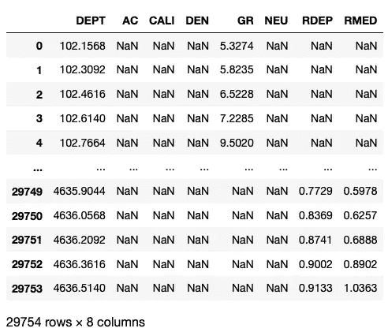
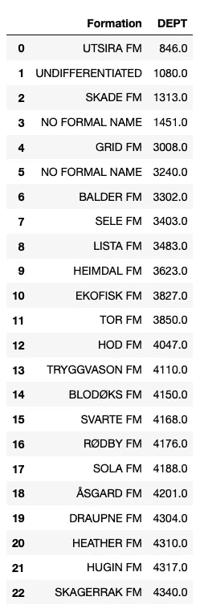
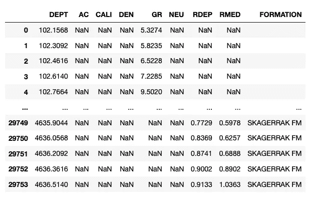
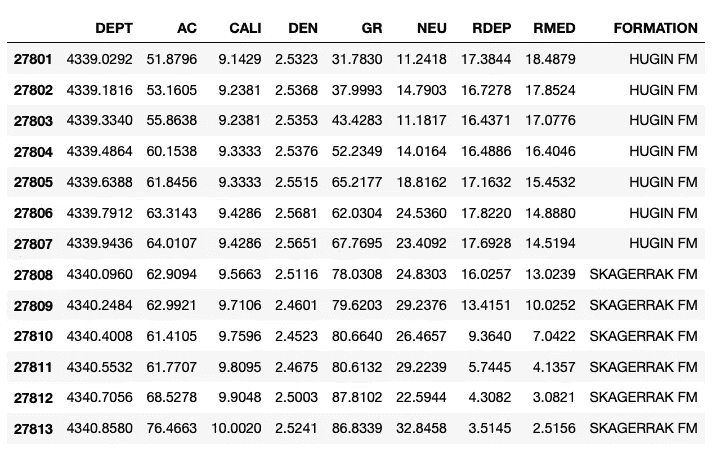

# 在熊猫中将地层数据与测井测量相结合

> 原文：<https://towardsdatascience.com/combining-formation-data-with-well-log-measurements-in-pandas-8c29589ec132>

## PYTHON 和岩石物理学

## 用 Python 集成地下测量


马丁斯·克拉斯廷斯摄影:[https://www.pexels.com/photo/cracked-stone-wall-838981/](https://www.pexels.com/photo/cracked-stone-wall-838981/)

当处理地下数据时，我们经常处理以不同方式采样的数据集。例如，以规则的增量在地下的间隔上连续记录测井测量值(例如，每 0.1 米的测量值)，而地层顶部是单个深度点。


测井和地质构造数据的不同采样率。图片由作者提供。

在本文中，我们将介绍一种将地质地层顶部数据与测井测量相结合的方法。这将允许我们将这些数据用于未来的机器学习过程和数据可视化。

## 视频教程

这个教程的视频版本可以在我的 YouTube 频道上找到，链接如下。

## 本教程中使用的数据

本教程中使用的数据是 Equinor 在 2018 年发布的 Volve 数据集的子集。数据集的全部细节，包括许可证，可以在下面的链接中找到。

[](https://www.equinor.com/energy/volve-data-sharing) [## Volve 现场数据集

### Equinor 已经正式发布了一套完整的北海油田数据，供研究、学习和应用

www.equinor.com](https://www.equinor.com/energy/volve-data-sharing) 

Volve 数据许可证基于 CC BY 4.0 许可证。许可协议的全部细节可以在这里找到:

[https://cdn . sanity . io/files/h 61 q 9 gi 9/global/de 6532 f 6134 b 9 a 953 f 6 c 41 BAC 47 a 0 c 055 a 3712d 3 . pdf？equinor-hrs-条款和条件-许可-数据-volve.pdf](https://cdn.sanity.io/files/h61q9gi9/global/de6532f6134b9a953f6c41bac47a0c055a3712d3.pdf?equinor-hrs-terms-and-conditions-for-licence-to-data-volve.pdf)

# 导入库和数据

本教程的第一步是导入我们将要使用的库。在本例中，我们将结合使用 [pandas](http://pandas.pydata.org/) 来加载和存储我们的地层数据，以及 [lasio](https://github.com/kinverarity1/lasio) 来从 las 文件加载我们的测井数据。

```
import lasio
import pandas as pd
```

接下来，我们将开始导入我们的测井数据。为此，我们需要调用`lasio.read()`并传入。las 文件。

由于我们将在 pandas 中工作，我们需要将 [lasio](https://github.com/kinverarity1/lasio) 对象转换为 dataframe，然后重置索引。这将获取设置为深度的当前索引，并将其作为新列放入 dataframe 中。

```
df_19SR = lasio.read('Data/15-9-19_SR_COMP.las').df()
df_19SR.reset_index(inplace=True)
```



从 las 文件中加载后，Volve 井 15/9–19-SR 的 Pandas 数据帧。图片由作者提供。

## 装载地层数据

地层数据通常存储在 csv 文件的简单表格中，带有地层名称和相关深度。因此，我们可以通过使用`pd.read_csv()`并传入文件名来使用 pandas 加载 csv。

在这个例子中，文件没有标题行，所以需要添加一个标题行，我们可以通过使用`names`参数来指定名称。

```
df_19SR_formations = pd.read_csv('Data/Volve/15_9_19_SR_TOPS_NPD.csv', header=None, names=['Formation', 'DEPT'])df_19SR_formations['DEPT'] = df_19SR_formations['DEPT'].astype(float)df_19SR_formations
```

一旦地层数据被加载到数据帧中，我们就可以通过调用其名称:`df_19SR_formations`来查看该数据帧，这将返回以下内容:



Volve 油田 15/9–19-SR 井内地质构造的名称和深度。图片由作者提供。

# 合并数据

现在有了两个包含我们想要处理的数据的数据帧，我们需要将它们组合起来。我们可以通过创建一个函数来实现这一点，然后使用`.apply()`方法来检查每个深度值，并查看在该深度级别应该出现什么样的地层。

在下面的函数中，我们首先创建地层深度和名称的列表。

然后，我们逐一循环，检查三个条件:

1.  如果我们在列表中的最后一个编队(项目)
2.  如果我们位于列表中第一个地层(项目)之前的深度
3.  如果我们在两个地层深度之间

```
def add_formations_to_df(depth_value:float) -> str:
    formation_depths = df_19SR_formations['DEPT'].to_list()
    formation_names = df_19SR_formations['Formation'].to_list()

    for i, depth in enumerate(formation_depths):
        # Check if we are at last formation
        if i == len(formation_depths)-1:
            return formation_names[i]

        # Check if we are before first formation
        elif depth_value <= formation_depths[i]:
            return ''

        # Check if current depth between current and next formation
        elif depth_value >= formation_depths[i] and depth_value <= formation_depths[i+1]:
            return formation_names[i]
```

一旦编写了函数，我们就可以在数据帧中创建一个名为 FORMATION 的新列，并将这个新函数应用到`DEPT`列。

```
df_19SR['FORMATION'] = df_19SR['DEPT'].apply(add_formations_to_df)df_19SR
```

当我们调用 dataframe 时，我们可以看到我们的新列中有地层数据。



结合地层数据和测井数据后的数据帧。图片由作者提供。

我们可以仔细看看一个具体的深度范围:4339 到 4341 米，看看地层名称的变化。

```
df_19SR.loc[(df_19SR['DEPT'] >= 4339) & (df_19SR['DEPT'] <= 4341)]
```



使用将测井数据和地层顶部合并在一起后的数据帧。在熊猫中应用()方法。图片由作者提供。

正如我们在上面看到的，斯卡格拉克调频在 4340 米后开始，在此之前，我们有胡金调频。

# 摘要

将地质地层信息集成到测井数据集中是一个相对简单的过程。一旦我们在主数据框架中有了这些信息，我们就可以使用它来可视化我们关于地质的数据，并且在我们进行机器学习过程时也可以利用这些信息。

如果您想了解如何将地层顶部与测井测量结果结合起来进行可视化，请查看这篇文章:

[](/adding-formation-data-to-a-well-log-plot-3897b96a3967) [## 将地层数据添加到测井曲线中

### 使用 Python 和 matplotlib 进一步绘制测井曲线

towardsdatascience.com](/adding-formation-data-to-a-well-log-plot-3897b96a3967) 

*感谢阅读。在你走之前，你一定要订阅我的内容，把我的文章放到你的收件箱里。* [***你可以在这里做！***](https://andymcdonaldgeo.medium.com/subscribe)**或者，您也可以* [***注册我的简讯***](https://fabulous-founder-2965.ck.page/2ca286e572) *免费将更多内容直接发送到您的收件箱。**

*其次，通过注册会员，你可以获得完整的媒介体验，并支持我和其他成千上万的作家。每月只需花费你 5 美元，你就可以接触到所有精彩的媒体文章，也有机会通过写作赚钱。*

**如果你用* [***我的链接***](https://andymcdonaldgeo.medium.com/membership)**报名，你直接用你的一部分费用支持我，不会多花你多少钱。如果你这样做了，非常感谢你的支持！***