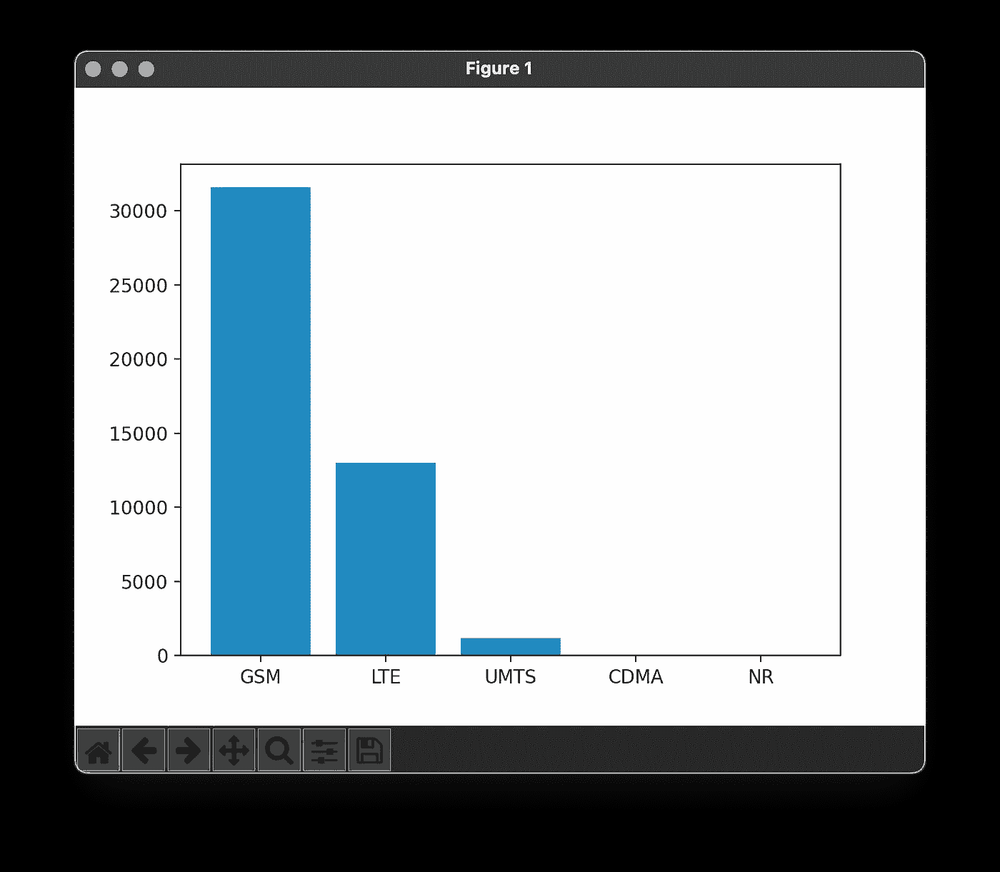

# 命令行数据分析变得简单

> 原文：<https://towardsdatascience.com/command-line-data-analytics-b2ac88f912d1>

## 使用 Python 支持的 SQL


由[加布里埃尔·海因策](https://unsplash.com/@6heinz3r?utm_source=unsplash&utm_medium=referral&utm_content=creditCopyText)在 [Unsplash](https://unsplash.com/?utm_source=unsplash&utm_medium=referral&utm_content=creditCopyText) 拍摄的照片

当涉及到数据处理时，命令行非常强大。尽管如此，我们中的许多人并没有利用数据。我能想到一些原因:

*   可读性差:重点是尽量减少您需要键入的内容，而不是一系列命令的可读性；
*   陡峭的学习曲线:许多命令，有许多选项；
*   看起来过时了:这些工具中的一些是从 70 年代开始的，目标是分隔文本文件(而不是像 JSON 和 YAML 这样的现代格式)。

这些促使我编写一个命令行工具，它注重可读性、易学性和现代数据格式，同时利用命令行生态系统。最重要的是，它还利用了 Python 生态系统！遇见 [SPyQL —中间有 Python 的 SQL](https://github.com/dcmoura/spyql):

```
**SELECT** date.fromtimestamp(purchase_ts) **AS** purchase_date,
  sum_agg(price * quantity) **AS** total
**FROM** csv('*my_purchases.csv*')
**WHERE** department.upper() == 'IT' and purchase_ts is not Null
**GROUP** BY 1
**ORDER** BY 1
**TO** json
```

# SPyQL 在行动

我认为了解 SPyQL 并熟悉命令行的最佳方式是打开终端并解决问题。在这种情况下，我们将尝试了解手机信号塔的地理分布。开始吧！

## 设置

让我们从安装 SPyQL 开始:

```
$ pip3 install -U spyql
```

并检查其版本:

```
$ spyql --version
spyql, version 0.8.0
```

让我们也安装 [MatplotCLI](https://github.com/dcmoura/matplotcli) ，这是一个利用 [Matplotlib](https://github.com/matplotlib/matplotlib) 从命令行创建绘图的实用程序:

```
$ pip3 install -U matplotcli
```

最后，我们将下载一些示例数据(您也可以将 URL 复制粘贴到您的浏览器，并从那里下载文件):

```
$ wget [https://raw.githubusercontent.com/dcmoura/blogposts/master/spyql_cell_towers/sample.csv](https://raw.githubusercontent.com/dcmoura/blogposts/master/spyql_cell_towers/sample.csv)
```

该 CSV 文件包含 2022 年 9 月 10 日添加到 [OpenCellid 数据库](https://www.opencellid.org/)的手机信号塔数据。( [OpenCellid](https://www.opencellid.org/) 项目的`OCID-diff-cell-export-2022–09–10-T000000.csv`文件，根据[知识共享署名-类似共享 4.0 国际许可](https://creativecommons.org/licenses/by-sa/4.0/)未经修改进行再分发)。

## 检查数据

让我们通过获取文件的前 3 行来查看数据:

```
$ head -3 *sample.csv*radio,mcc,net,area,cell,unit,lon,lat,range,samples,changeable,created,updated,averageSignal
GSM,262,2,852,2521,0,10.948628,50.170324,15762,200,1,1294561074,1662692508,0
GSM,262,2,852,2501,0,10.940241,50.174076,10591,200,1,1294561074,1662692508,0
```

您可以用 SPyQL 做同样的操作:

```
$ spyql "**SELECT** * **FROM** csv **LIMIT** 2" < *sample.csv*
```

或者

```
$ spyql "**SELECT** * **FROM** csv('*sample.csv*') **LIMIT** 2"
```

请注意，我们告诉获取 2 行数据，而不是 3 行文件(其中第一行是标题)。SPyQL 的一个优点是我们可以很容易地改变输出格式。让我们将输出更改为 JSON，并查看第一条记录:

```
$ spyql "**SELECT** * **FROM** csv('*sample.csv*') **LIMIT** 1 **TO** json(indent=2)"{
  "radio": "GSM",
  "mcc": 262,
  "net": 2,
  "area": 852,
  "cell": 2521,
  "unit": 0,
  "lon": 10.948628,
  "lat": 50.170324,
  "range": 15762,
  "samples": 200,
  "changeable": 1,
  "created": 1294561074,
  "updated": 1662692508,
  "averageSignal": 0
}
```

## 查询数据

让我们先数一数我们有多少记录:

```
$ spyql "**SELECT** count_agg(*) **AS** n **FROM** csv('*sample.csv*')"n
45745
```

注意，聚合函数有后缀`_agg`，以避免与 Python 的函数冲突，如`min`、`max`和`sum`。

现在，让我们按类型数一数我们有多少个手机信号塔:

```
$ spyql "**SELECT** radio, count_agg(*) **AS** n **FROM** csv('*sample.csv*') **GROUP BY** 1 **ORDER BY** 2 DESC **TO** pretty"radio        n
-------  -----
GSM      31549
LTE      12996
UMTS      1182
CDMA        16
NR           2
```

注意漂亮的打印输出。我们可以通过将输出格式设置为 JSON 并将结果传送到 [MatplotCLI](https://github.com/dcmoura/matplotcli) 来绘制上述结果:

```
$ spyql "**SELECT** radio, count_agg(*) **AS** n **FROM** csv('*sample.csv*') **GROUP BY** 1 **ORDER BY** 2 DESC **TO** json" | plt "**bar**(radio, n)"
```



由 MatplotCLI 使用 SPyQL 查询的输出创建的 Matplolib 图

有多简单？:-)

## 查询数据:一个更复杂的例子

现在，让我们来看看当天新增手机基站最多的前 5 个国家:

```
$ spyql "**SELECT** mcc, count_agg(*) **AS** n **FROM** csv('*sample.csv*') **GROUP** **BY** 1 **ORDER** **BY** 2 DESC **LIMIT** 5 **TO** pretty" mcc      n
-----  -----
  262  24979
  440   5085
  208   4573
  310   2084
  311    799
```

MCC 代表移动国家代码(262 是德国的代码)。MCC 的第一个数字标识区域。这里有一段来自维基百科的摘录:

```
0: Test networks
2: Europe
3: North America and the Caribbean
4: Asia and the Middle East
5: Australia and Oceania
6: Africa
7: South and Central America
9: Worldwide
```

让我们复制粘贴上述地区列表，并创建一个新的文件名`mcc_geo.txt`。在 mac 上，这和`$ pbpaste > mcc_geo.txt`一样简单，但是你也可以将它粘贴到文本编辑器中并保存。现在，让我们要求 SPyQL 以 CSV 格式打开该文件并打印其内容:

```
$ spyql "**SELECT** * **FROM** csv('*mcc_geo.txt*') **TO** pretty" col1  col2
------  -------------------------------
     0  Test networks
     2  Europe
     3  North America and the Caribbean
     4  Asia and the Middle East
     5  Australia and Oceania
     6  Africa
     7  South and Central America
     9  Worldwide
```

SPyQL 检测到分隔符是冒号，并且文件没有标题。我们可以使用 *colN* 语法来寻址第*n*列。现在，让我们创建一个 JSON 对象，它具有与输入行一样多的键值对。让输入的第一列为*键*，第二列为*值*，并将结果保存到一个新文件中:

```
$ spyql "**SELECT** dict_agg(col1,col2) **AS** json **FROM** csv('*mcc_geo.txt*') **TO** json('*mcc_geo.json*', indent=2)"
```

我们可以使用`cat`来检查输出文件:

```
$ cat *mcc_geo.json* {
  "0": "Test networks",
  "2": "Europe",
  "3": "North America and the Caribbean",
  "4": "Asia and the Middle East",
  "5": "Australia and Oceania",
  "6": "Africa",
  "7": "South and Central America",
  "9": "Worldwide "
}
```

基本上，我们已经将所有输入行聚合到一个 Python 字典中，然后将其保存为一个 JSON 文件。尝试从`SELECT`中移除`AS json`别名，以理解我们为什么需要它:-)

现在，让我们按地区而不是按 MCC 来获取统计数据。为此，我们将加载刚刚创建的 JSON 文件(使用`-J`选项)并进行字典查找:

```
$ spyql -Jgeo=*mcc_geo.json* "**SELECT** geo[mcc//100] **AS** region, count_agg(*) **AS** n **FROM** csv('*sample.csv*') **GROUP** **BY** 1 **ORDER** **BY** 2 DESC **TO** pretty"region                               n
-------------------------------  -----
Europe                           35601
Asia and the Middle East          5621
North America and the Caribbean   3247
Australia and Oceania              894
Africa                             381
South and Central America            1
```

我们将整数除以 100，得到 MCC 的第一个数字，然后在我们刚刚创建的 JSON(作为 Python 字典加载)上查找这个数字。这就是我们在 SPyQL 中通过字典查找进行连接的方式:-)

## 在查询中利用 Python 库

SPyQL 的另一个优势是我们可以利用 Python 生态系统。让我们试着做更多的地理统计。让我们来数一数欧洲 H3 单元(分辨率为 5)的塔。首先，我们需要安装 [H3 库](https://github.com/uber/h3-py):

```
$ pip3 install -U h3
```

然后，我们可以将经纬度对转换为 H3 单元，通过 H3 单元计算我们有多少座塔，并将结果保存到 CSV 中:

```
$ spyql "**IMPORT** h3 **SELECT** h3.geo_to_h3(lat, lon, 5) **AS** cell, count_agg(*) **AS** n **FROM** csv('*sample.csv*') **WHERE** mcc//100==2 **GROUP** **BY** 1 **TO** csv('*towers_by_h3_res5.csv*')"
```

借助开普勒，可视化这些结果相当简单。只要去 kepler.gl/demo 的[打开上面的文件。您应该会看到类似这样的内容:](https://kepler.gl/demo)


通过 SPyQL 的 H3 池(分辨率 5)对聚集进行开普勒可视化

# 最后的话

我希望您喜欢 SPyQL，并且我可以向您展示从命令行查询数据是多么简单。在这篇关于 SPyQL 的第一篇文章中，我们只是触及了皮毛。我们能做的还有很多。在本文中，我们几乎没有利用 Shell 和 Python 生态系统。我们使用了一个小文件(SPyQL 可以处理 GB 大小的文件，而不会影响系统资源)。所以，敬请期待！

试用 SPyQL，然后将您的想法反馈给我。谢谢大家！

# 资源

SPyQL 回购:【github.com/dcmoura/spyql 

SPyQL 文档: [spyql.readthedocs.io](https://spyql.readthedocs.io)

MatplotCLI 回购:[github.com/dcmoura/matplotcli](https://github.com/dcmoura/matplotcli)

你可以在 [Tweeter](https://twitter.com/daniel_c_moura) 、 [LinkedIn](https://www.linkedin.com/in/dmoura/) 和 [Vimeo](https://vimeo.com/danielcmoura) 上找到我！

文章最初发表于 danielcmoura.com。