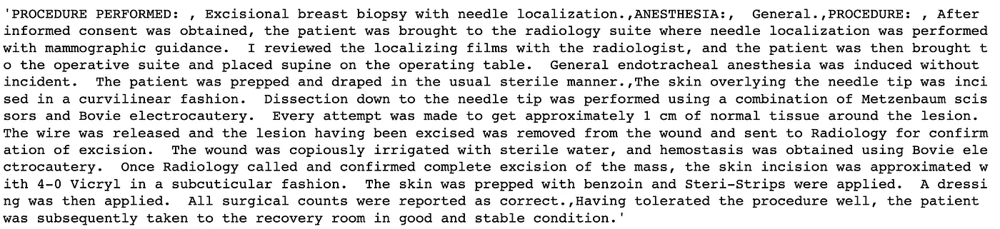
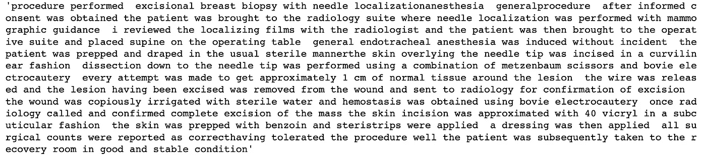
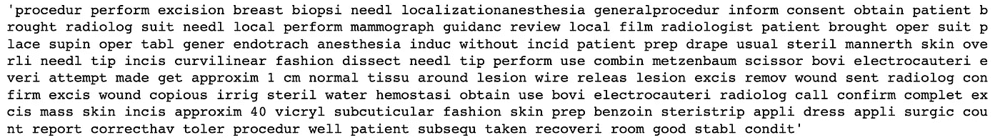
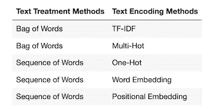
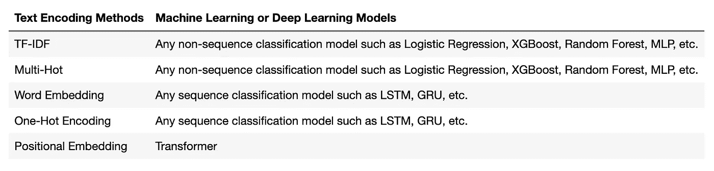
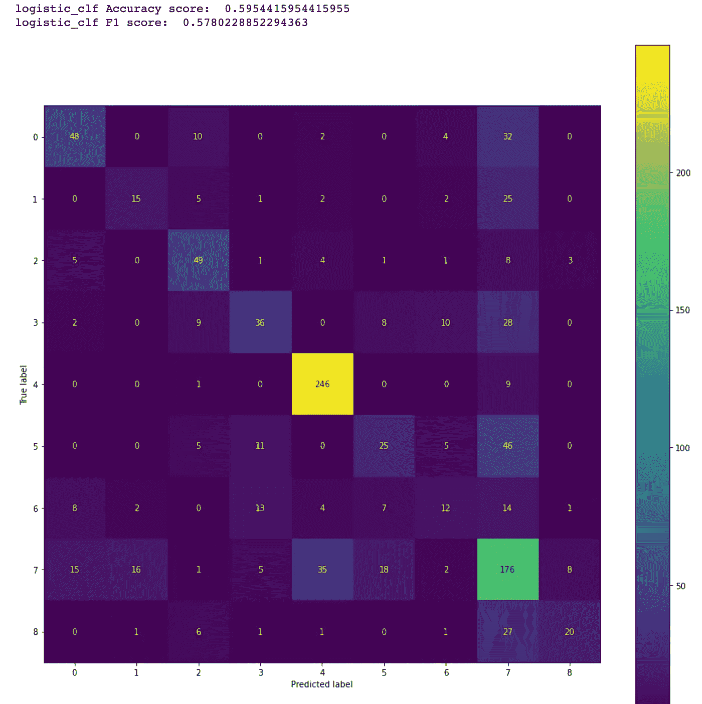
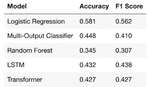

# 用于临床文本分类的常见机器学习和深度学习方法

> 原文：<https://towardsdatascience.com/common-machine-learning-and-deep-learning-methods-for-clinical-text-classification-188473477a32>

## 面向医疗保健的自然语言处理(NLP ),使用 NLTK、spaCy、TF-IDF、单词嵌入以及非序列和序列建模，如 LSTM 和 Transformer


作者照片

随着机器学习和深度学习算法的进步，自然语言处理( [NLP](https://en.wikipedia.org/wiki/Natural_language_processing) )成为人工智能研究和应用的热门话题，因为文本(例如，英语句子)是自然语言数据的主要类型。例如，文本经常出现在医疗保健数据集中，如电子健康记录( [EHR](https://en.wikipedia.org/wiki/Electronic_health_record) )。医疗领域的文本数据有很多人工智能方法，如临床命名实体识别()、临床文本分类等。

在本文中，我使用开源临床文本数据集[1][7][8]来介绍一些常见的机器学习和深度学习方法，用于临床文本分类。

与 [CRISP-DM](https://en.wikipedia.org/wiki/Cross-industry_standard_process_for_data_mining) 类似，NLP 的机器学习过程包括以下常见步骤:

*   商业理解
*   数据理解
*   数据准备
*   建模
*   模型评估
*   模型部署

# 1.商业理解

对于任何一个数据科学项目来说，了解要解决的问题是什么是非常重要的。

本文要解决的问题是如何从医学文本中预测医学专业。

# 2.数据理解

为了解决确定的问题，我们需要收集和理解数据。

如前所述，我使用来自 Kaggle 的开源临床文本数据集[1]。下载数据集 *mtsamples.csv* 文件后，以下代码将数据集作为 Pandas DataFrame 加载到内存中:

```
data = pd.read_csv('./medical-nlp/data/mtsamples.csv', index_col=0)
data.head()
```


如上表所示，特征列*转录*为英文句子，而目标/标签列*医疗 _ 专业*为分类。该信息表明要解决的问题是临床文本分类问题。

有 40 个独特的医学专业类别。数据集严重失衡。不同类别的数据样本数量从 6 到 1，103 不等。

# 3.数据准备

如前所述，数据集非常不平衡。

## 3.1 不平衡数据的处理

为了缓解数据不平衡问题，下面的代码删除了数据样本少于 100 或者不是医学专业的类别。

```
filtered_data = data[['transcription', 'medical_specialty']]
filtered_data.loc[:, 'medical_specialty'] = filtered_data['medical_specialty'].apply(lambda x:str.strip(x))
mask = (filtered_data['medical_specialty'] == 'SOAP / Chart / Progress Notes') | \
       (filtered_data['medical_specialty'] == 'Office Notes') | \
       (filtered_data['medical_specialty'] == 'Consult - History and Phy.') | \
       (filtered_data['medical_specialty'] == 'Emergency Room Reports') | \
       (filtered_data['medical_specialty'] == 'Discharge Summary') | \
       (filtered_data['medical_specialty'] == 'Letters')filtered_data = filtered_data[~mask]data_categories  = filtered_data.groupby(filtered_data['medical_specialty'])
filtered_data_categories = data_categories.filter(lambda x:x.shape[0] > 100)
filtered_data_categories['medical_specialty'].value_counts()
```

生成的数据集包含以下 9 类医学专业:


数据集按照如下方式进行混洗，以避免任何人为的数据模式。

```
data = filtered_data_categories.sample(frac=1.0)
```

此外，与[1]类似， [SMOTE](https://pypi.org/project/imbalanced-learn/) 算法也用于自动上采样少数数据样本，以改善文本编码后的数据平衡。

## 3.2 数据预处理

正常数据集和 NLP 数据集之间的主要区别在于，NLP 数据集包含文本特征，例如医疗转录。文本特征由一系列句子组成(在 NLP 术语中称为文本或文档语料库)。就功能类型而言，区别如下:

普通数据集中有两种类型的要素:

*   数字特征(如温度)
*   分类特征(例如，诸如“IL”、“WA”等状态。)

但是，NLP 数据集中有三种类型的要素:

*   数字特征(如温度)
*   分类特征(如特征*医疗 _ 专业*，如上表所示)
*   文本特征(例如上表中的特征*转录*

为了处理缺失数据，并减少词汇和训练数据的大小，除了提取医疗实体之外，以下数据预处理步骤通常应用于文本特征(例如，*转录*特征)以进行文本分类:

*   处理丢失的数据
*   提取医疗实体(仅用于临床文本分类)
*   标准化文本
*   标记文本
*   删除停用词
*   堵塞物
*   把…按屈折变化形式进行归类

## 处理缺失数据

机器学习不允许缺失数据。如果丢失条目的数量相对较少，可以简单地丢弃丢失的数据。NLP 中处理缺失数据的另一种常用方法是从数据集中的其他相关要素复制信息。例如，NLP 特征“转录”中缺少的条目可以通过从特征“描述”中复制相应的条目来填充，因为描述是转录的概要。

在本文中，feature *transcription* 列中的缺失条目被简单地删除，而不会显著损害模型预测的准确性，因为只有 33 个缺失条目。

```
df = data.dropna(subset=['transcription'])
```

## 3.2.2 提取医疗实体

特征栏*转录*中最重要的内容是医学笔记。如[1]所述，提取医疗实体用于临床文本分类被证明是非常有用的。这是通过使用 spaCy [3]库实现的，如下所示:

```
import spacy
import en_ner_bionlp13cg_mdnlp = en_ner_bionlp13cg_md.load()def medical_entities( text):
    entities = []
    doc = nlp(text)
    for ent in doc.ents:
        entities.append(ent.text)
    return ' '.join(entities)df['transcription'] = df['transcription'].apply(medical_entities)
```

## 标准化文本

标准化文本有两个常见步骤:

*   将文本改为小写:这有助于避免机器学习模型学习字符的大小写。
*   去掉标点符号:这有助于减少词汇量



例如，给定上面的文本字符串，标准化文本的两个步骤可以在一条语句中完成，如下所示:

```
text = text.lower().translate(str.maketrans('', '', string.punctuation))
```

以下是生成的文本:



## 3.2.4 标记文本

这有助于把一篇文章分成词汇的各个部分。如果文本被视为单词序列，则通常使用单词级(1-gram)标记化。单词级标记化还支持删除停用词、词干和词汇化的活动。

N 元语法(通常 N = 2 或 3)标记化通常用于将文本视为一个单词包(单词的原始有序序列丢失)的情况。

例如，下面的代码使用 scikit-learn 库将文本字符串标记为单个单词/标记。

```
from nltk.tokenize import word_tokenize
tokens = word_tokenize(text)
```

## 移除停用字词

这有助于在不损害模型预测准确性的情况下减少词汇表的大小。以下代码使用 NLTK 库从标记化单词中移除英语停用词。

```
from nltk.corpus import stopwords
english_stopwords = set(stopwords.words('english'))clean_tokens = []
for tok in tokens:
    tok = tok.strip() # remove space
    if tok not in english_stopwords:
        clean_tokens.append(tok)
```

## 堵塞

这有助于减少词汇量。以下代码使用 NLTK [4]库对单词/标记进行词干分析。

```
from nltk.stem import PorterStemmer
stemmer = PorterStemmer()
stemming_word = stemmer.stem(‘being’) 
```

## 词汇化

这有助于减少词汇量。下面的代码使用 NLTK 库对单词/令牌进行词汇化。

```
from nltk.stem import WordNetLemmatizer
lemmatizer = WordNetLemmatizer()
root_word = lemmatizer.lemmatize('words')
```

上述数据预处理步骤可以合并成一个函数来清理文本字符串:

```
def clean_text(text):
    # get English stopwords
    english_stopwords = set(stopwords.words('english'))

    # change to lower case and remove punctuation
    text = text.lower().translate(str.maketrans('', '', string.punctuation))

    # divide string into individual words
    tokens = word_tokenize(text)

    stemmer = PorterStemmer()
    lemmatizer = WordNetLemmatizer() clean_tokens = []
    for tok in tokens:
        tok = tok.strip() # remove space
        if tok not in english_stopwords:
            clean_tok = lemmatizer.lemmatize(tok) # lemmatizition
            clean_tok = stemmer.stem(clean_tok) # Stemming
            clean_tokens.append(clean_tok) return " ".join(clean_tokens)
```

以下是通过调用 clean_text()函数生成的干净文本示例。



请注意，步骤 3.2.3 和 3.2.5 通常是有用的，但对于本文中的临床文本分类不是必需的，因为这两个步骤已经在步骤 3.2.2 中完成了。

## 3.3.特征工程

一旦对文本特征进行预处理，就需要将每个文本(文档)编码为数字向量(称为矢量化)，因为机器学习和深度学习模型只理解数字。编码方法的选择取决于如何解释文本。在文本分类中，文本串(文档)通常被视为一个单词包或一个单词序列。以下是一些常见的文本编码/矢量化方法。

如果一个文本被视为一个单词包，那么我们通常使用下面的方法将一个文本/文档转换为一个数字向量:

*   [TF-IDF](https://en.wikipedia.org/wiki/Tf%E2%80%93idf) 矢量化
*   多重热编码

## TF-IDF 矢量化

Multi-Hot [2]编码方法将一个文本/文档编码为具有 0 和 1 的值的词汇长度的稀疏向量，其中 1 指示词汇中相应单词/标记的存在。

与 Multi-Hot 类似，TF-IDF 矢量化也将一个文本/文档编码为词汇长度的稀疏向量。主要区别在于，TF-IDF 编码向量不仅包含词汇表中相应单词/标记的存在信息，还包含由反向文档频率(IDF)加权的标记频率(TF)。因此，TF-IDF 编码的矢量比 multi-Hot 编码的矢量具有更大的预测能力。

像 Multi-Hot 一样，TF-IDF 编码向量的长度可以与整个词汇表的长度相同。典型的截断长度是 20，000。类似于[1]，应用 [PCA](https://en.wikipedia.org/wiki/Principal_component_analysis#:~:text=Principal%20component%20analysis%20(PCA)%20is,components%20and%20ignoring%20the%20rest.) 算法来降低维数。

以下函数将分类标签转换为整数，并使用 3-gram TF-IDF 和 PCA 将*转录*特征编码为稀疏向量:

```
from sklearn.preprocessing import LabelEncoder
from sklearn.decomposition import PCA
from imblearn.over_sampling import SMOTEdef tfidf_pca(X_feature, y_label):
    '''
    X_feature = df['transcription'].values
    y_label = df['medical_specialty'].values
    '''

    le = LabelEncoder()
    y_int = le.fit_transform(y_label) tfidf = TfidfVectorizer(tokenizer=clean_text, ngram_range=(1,3))
    pca = PCA(n_components=0.95)
    X_tfidf = tfidf.fit_transform(X_feature)
    X_pca = pca.fit_transform(X_tfidf.toarray()) smote_over_sample = SMOTE(sampling_strategy='minority') X, y = smote_over_sample.fit_resample(X_pca, y_int.tolist()) X = np.array(X)
    y = np.array(y)

    return X, y
```

## 单词嵌入

如果一个文本被视为一个单词序列，那么我们可以使用以下常用方法将文本/文档中的每个单词转换为一个向量，并将整个文本/文档转换为一个向量数组:

*   [一键式](https://en.wikipedia.org/wiki/One-hot)编码:将每个单词编码成一个词汇长度的向量(一般是几万或几十万)
*   [单词嵌入](https://en.wikipedia.org/wiki/Word_embedding#:~:text=In%20natural%20language%20processing%20(NLP,to%20be%20similar%20in%20meaning.):将每个单词编码为一个更短长度的密集向量(例如 100、250、500)

除了更短的长度之外，单词嵌入相对于一键编码的另一大优势是单词嵌入以这样一种方式编码单词的含义，使得在向量空间中更接近的单词在含义上是相似的。

给定一个文本/文档，有两个步骤将其映射到给定大小的密集向量:

*   步骤 1:将文本转换成词汇表中单词/标记索引的向量
*   步骤 2:使用定制的训练或预训练的单词嵌入算法(例如，Word2Vec 和 GloVe)将每个单词索引转换成浮点数的密集向量

下面的函数将分类标签转换成整数，将*转录*特性转换成词汇表中单词/标记索引的向量。

```
from tensorflow.keras import layersdef indecies_vectorize(X_feature, y_label, max_length = 1500, max_tokens = MAX_TOKENS):
    '''
    X_feature: df['transcription'].values
    max_length: maximum number of words in one text/document
    max_tokens: the length of vocabulary
    '''

    le = LabelEncoder()
    y_int = le.fit_transform(y_label)

    text_vectorization = layers.TextVectorization(
        max_tokens=max_tokens,
        output_mode="int",
        output_sequence_length=max_length,
    ) # training the text vectorization object
    text_vectorization.adapt(X_feature)    # convert preprocessed training text into anrray of integers/indecies
    indecies_array = text_vectorization(X_feature) 

    smote_over_sample = SMOTE(sampling_strategy='minority')
    X, y = smote_over_sample.fit_resample(indecies_array, y_int)

    X = np.array(X)
    y = np.array(y) return X, y
```

下面的代码显示了如何使用 Keras 的自定义训练单词嵌入层将单词索引矢量编码为长度为 256 的密集矢量序列。

```
import keras
inputs = keras.Input(shape=(None,), dtype="int64")
embedded = layers.Embedding(input_dim=max_tokens, output_dim=256, mask_zero=True)(inputs)
```

## 位置嵌入

如[2]所述，词序信息在文本分类中起着重要作用。[2]中的以下代码是将词序信息添加到单词嵌入中，以提高使用[Transformer](https://en.wikipedia.org/wiki/Transformer_(machine_learning_model))【2】进行文本分类的性能。

```
class PositionalEmbedding(layers.Layer):
    def __init__(self, sequence_length, input_dim, output_dim, **kwargs):
        super().__init__(**kwargs)
        self.token_embeddings = layers.Embedding(
            input_dim=input_dim, output_dim=output_dim)

        self.position_embeddings = layers.Embedding(
            input_dim=sequence_length, output_dim=output_dim)

        self.sequence_length = sequence_length
        self.input_dim = input_dim
        self.output_dim = output_dim def call(self, inputs):
        length = tf.shape(inputs)[-1]
        positions = tf.range(start=0, limit=length, delta=1)
        embedded_tokens = self.token_embeddings(inputs)
        embedded_positions = self.position_embeddings(positions)
        return embedded_tokens + embedded_positions def compute_mask(self, inputs, mask=None):
        return tf.math.not_equal(inputs, 0) def get_config(self):
        config = super().get_config()
        config.update({
            "output_dim": self.output_dim,
            "sequence_length": self.sequence_length,
            "input_dim": self.input_dim,
        })
        return config
```

下表总结了不同文本编码方法的选择。



# 4.建模

一旦数据集为建模做好准备，我们需要选择一个机器学习/深度学习模型，并用准备好的数据对其进行训练。

## 4.1 型号选择

与选择文本编码方法类似，选择用于文本分类的机器学习或深度学习模型取决于如何对文本进行编码。具体来说，我们可以选择下表所示的型号:



下面来自[2]的 TransformerEncoder 类实现了一个多头基于注意力的转换器，用于本文中的临床文本分类。

```
import tensorflow as tf
from tensorflow import keras
from tensorflow.keras import layersclass TransformerEncoder(layers.Layer):
    def __init__(self, embed_dim, dense_dim, num_heads, **kwargs):
        super().__init__(**kwargs)
        self.embed_dim = embed_dim
        self.dense_dim = dense_dim
        self.num_heads = num_heads
        self.attention = layers.MultiHeadAttention(
            num_heads=num_heads, key_dim=embed_dim)
        self.dense_proj = keras.Sequential(
            [layers.Dense(dense_dim, activation="relu"),
             layers.Dense(embed_dim),]
        )
        self.layernorm_1 = layers.LayerNormalization()
        self.layernorm_2 = layers.LayerNormalization() def call(self, inputs, mask=None):
        if mask is not None:
            mask = mask[:, tf.newaxis, :]
        attention_output = self.attention(
            inputs, inputs, attention_mask=mask)
        proj_input = self.layernorm_1(inputs + attention_output)
        proj_output = self.dense_proj(proj_input)
        return self.layernorm_2(proj_input + proj_output) def get_config(self):
        config = super().get_config()
        config.update({
            "embed_dim": self.embed_dim,
            "num_heads": self.num_heads,
            "dense_dim": self.dense_dim,
        })
        return config
```

本文选择了以下模型:

TF-IDF 编码的非序列模型:

*   逻辑回归
*   随机森林
*   [多输出分类器](https://scikit-learn.org/stable/modules/generated/sklearn.multioutput.MultiOutputClassifier.html)与 [k-NN](https://en.wikipedia.org/wiki/K-nearest_neighbors_algorithm)

单词嵌入的序列模型:

*   LSTM

位置嵌入的序列模型:

*   Transformer(即 TransformerEncoder 类)

## 4.2.模特培训

通常，在模型训练开始之前，我们需要将数据集分成训练、验证和测试子集。为了简单起见，在本文中数据集只分成两个子集:一个用于模型训练，另一个用于模型测试/评估。

```
from sklearn.model_selection import train_test_splitX_feature = df['transcription'].values
y_label = df['medical_specialty'].valuesif SEQUENCE_MODEL:
    X, y = indecies_vectorize(X_feature, y_label)
else:   
    X, y = tfidf_pca(X_feature, y_label)X_train, X_test, y_train, y_test = train_test_split(X, y, test_size=0.25, random_state=42)
X_train.shape, X_test.shape, y_train.shape, y_test.shape
```

## 4.2.1 使用 TF-IDF 的非序列建模

如前所述，本文中使用了以下 TF-IDF 编码的非序列模型:

*   逻辑回归
*   随机森林
*   [多输出分类器](https://scikit-learn.org/stable/modules/generated/sklearn.multioutput.MultiOutputClassifier.html)与 [k-NN](https://en.wikipedia.org/wiki/K-nearest_neighbors_algorithm)

例如，下面的代码创建并训练一个多输出分类器。

```
from sklearn.multioutput import MultiOutputClassifier
from sklearn.neighbors import KNeighborsClassifierif not SEQUENCE_MODEL:
    multi_class_clf = MultiOutputClassifier(KNeighborsClassifier())
    y_train = y_train.reshape(-1, 1)
    multi_class_clf.fit(X_train, y_train)
```

## 4.2.2 使用具有单词嵌入的 LSTM 的序列建模

在本文中，我使用带有自定义单词嵌入的双向 LSTM 来演示如何为文本分类执行序列建模(参见下面的代码)。

```
import kerasdef create_lstm_model(embedding_layer = None):
    # create input layer
    inputs = keras.Input(shape=(None,), dtype="int64") # add word embedding layer
    if embedding_layer is not None:
        embedded = embedding_layer(inputs)
    else:
        embedded = layers.Embedding(input_dim=MAX_TOKENS, output_dim=256, mask_zero=True)(inputs) # add LSTM layer
    x = layers.Bidirectional(layers.LSTM(32))(embedded) # add dropout layer
    x = layers.Dropout(0.5)(x) # add output layer
    outputs = layers.Dense(9, activation="softmax")(x) # combine all layers into one model
    lstm_model = keras.Model(inputs, outputs) # specifiy optimizer, loss, and metrics for the model
    lstm_model.compile(optimizer="rmsprop",
                  loss="sparse_categorical_crossentropy",
                  metrics=["accuracy"]) # print the summay of the model architecture
    lstm_model.summary()

    return lstm_modelif SEQUENCE_MODEL:
    if USE_GROVE:
        lstm_model = create_lstm_model(embedding_layer)
    else:
        lstm_model = create_lstm_model()

    # define callback function
    callbacks = [
        keras.callbacks.ModelCheckpoint("embeddings_bidir_gru_with_masking.keras",
                                        save_best_only=False)
    ] # train model
    lstm_model.fit(X_train, y_train, epochs=10, callbacks=callbacks)
```

## 4.2.3 使用变压器的序列建模

最近，基于注意力的变换算法成为序列建模中优于 LSTM 的算法。下面的代码使用具有位置嵌入的多头注意力转移算法进行临床文本分类。

```
def create_transformer(): vocab_size = 20000
    sequence_length = 1500
    embed_dim = 256
    num_heads = 2
    dense_dim = 32 inputs = keras.Input(shape=(None,), dtype="int64")
    x = PositionalEmbedding(sequence_length, vocab_size, embed_dim)(inputs)
    x = TransformerEncoder(embed_dim, dense_dim, num_heads)(x)
    x = layers.GlobalMaxPooling1D()(x)
    x = layers.Dropout(0.5)(x)
    outputs = layers.Dense(9, activation="softmax")(x)
    transformer_model = keras.Model(inputs, outputs)
    transformer_model.compile(optimizer="rmsprop",
                  loss="sparse_categorical_crossentropy",
                  metrics=["accuracy"])
    transformer_model.summary()

    return transformer_modelif SEQUENCE_MODEL:
    transformer_model = create_transformer() callbacks = [
        keras.callbacks.ModelCheckpoint("full_transformer_encoder.keras",
                                        save_best_only=False)
    ] transformer_model.fit(X_train, y_train, epochs=10, callbacks=callbacks)
```

# 5.模型评估

评估分类模型的常用指标有:

*   准确性(对于平衡数据)
*   精确度和召回率
*   [F1 得分](https://en.wikipedia.org/wiki/F-score)
*   [AUC](https://en.wikipedia.org/wiki/Receiver_operating_characteristic) (仅用于二元分类)
*   [混淆矩阵](https://en.wikipedia.org/wiki/Confusion_matrix)

作为一个例子，下面的代码计算准确度和 F1 分数，并为本文中的多类临床文本分类创建一个混淆矩阵图。

```
from sklearn.metrics import confusion_matrix, ConfusionMatrixDisplaydef plot_confusion_matrix(y_test, y_pred, labels):
    cm = confusion_matrix(y_test, y_pred, labels=rf_clf.classes_)
    disp = ConfusionMatrixDisplay(confusion_matrix=cm, display_labels=rf_clf.classes_) 
    fig, ax = plt.subplots(figsize=(15,15))
    disp.plot(ax=ax)if not SEQUENCE_MODEL:
    y_pred = logistic_clf.predict(X_test) acc_score = accuracy_score(y_test, y_pred)
    print('logistic_clf Accuracy score: ', acc_score) f1 = f1_score(y_test, y_pred, average='weighted')
    print('logistic_clf F1 score: ', f1)

    plot_confusion_matrix(y_test, y_pred,   labels=logistic_clf.classes_)
```



下表总结了模型评估结果。



# 6.模型部署

一旦在部署的模型评估中确定了文本分类的最佳模型，下一步就是将确定的模型部署到生产系统中。一种常见的方法是将模型作为 Web 服务部署在服务器上，目标生产系统中的其他组件可以调用它来获得文本分类结果。

为此，选定的训练模型(如逻辑回归)和相关的编码对象都应保存到文件中(如 Python pickle 文件)。然后，可以将这些保存的编码对象和模型加载回内存，以便在部署环境中进行预测。

# 7.结论

在本文中，我使用了一个开源的临床文本数据集[1][7][8]来演示一些常见的文本/文档编码方法以及相关的机器学习和深度学习算法，用于临床文本分类。

有许多不同类型的文本编码方法和机器学习/深度学习算法可用于文本分类。本文提供了不同文本编码方法和相应的适用机器学习/深度学习模型之间的映射的总结。

除了使用自定义数据集训练单词嵌入，我还使用预训练的单词嵌入手套[5]进行了实验，并注意到使用自定义数据训练单词嵌入在准确性方面具有更好的模型性能。

模型评估结果表明，在临床文本分类中，使用 spaCy 提取医学实体并使用 SMOTE 算法平衡数据对于提高模型的准确性非常重要。

# 参考

[1]临床文本分类:[https://www . ka ggle . com/ritheshreenivasan/Clinical-Text-class ification](https://www.kaggle.com/ritheshsreenivasan/clinical-text-classification)

[2] F. Chollet，用 Python 进行深度学习，第二版，Manning，2021

[3]空间:https://allenai.github.io/scispacy/

[4]NLTK:【https://www.nltk.org/】T4

[5]手套:[https://nlp.stanford.edu/projects/glove/](https://nlp.stanford.edu/projects/glove/)

[6] Y. Huang，[Github 中的 Jupyter 笔记本](https://github.com/yuhuang3/machine-learning/tree/master/clinical_text_classification)

[7]MTS 示例:[https://www.mtsamples.com](https://www.mtsamples.com/)

[8] T .波义耳，[https://www.kaggle.com/tboyle10/medicaltranscriptions](https://www.kaggle.com/tboyle10/medicaltranscriptions)

鸣谢:我要感谢 MTSamples 和 Kaggle 提供的数据集。