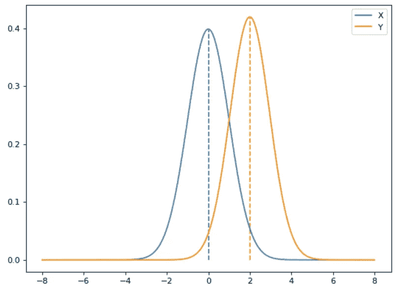
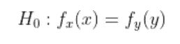
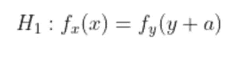
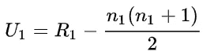
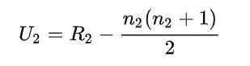
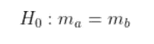
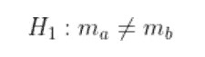
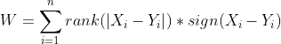
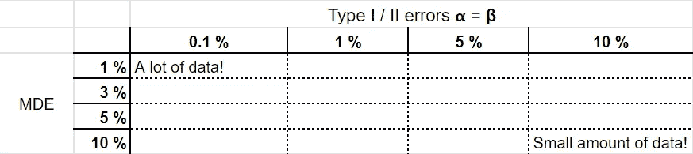

# A/B 测试中的常见错误

> 原文：<https://towardsdatascience.com/common-mistakes-during-a-b-testing-bdb9eefdc7f0>

## 我们通往卓越的道路布满了错误。让我们来做吧！

在过去的几年里，我目睹了人们在 A/B 测试设计和后期分析中犯的许多错误。我想在这里讨论三个这样的错误以及如何克服它们。

# **使用曼-惠特尼方法比较中位数**

第一个错误是曼-惠特尼检验的使用不当。这种方法被大量误解和误用，因为大多数人使用这种检验，假设它是中位数的近似非参数“t 检验”。实际上，我们只能使用曼-惠特尼检验来检查我们的分布是否有变化。

在这个图中，我们可以看到分布 X 和 Y 有相同的分布，只是有一个位移。作者图片

当我们应用曼-惠特尼检验时，我们设定我们的假设如下:

无效假设。作者图片

另一个假设。作者图片

**我们应该总是考虑假设，对于这个测试只有两个:**

1.  我们的观察是独立的
2.  我们的分布有相同的形状

**如何计算曼-惠特尼统计:**

1.  按数量级排列所有的观察结果
2.  为所有观察分配数字等级
3.  计算两组的 U 统计值

R —样本 1 的所有等级的总和，n—1 个样本的观察次数。作者图片

R —样本 2 的所有等级的总和，n —样本 2 的观察次数。作者图片

4.从这两个值中选择最小值

5.使用曼-惠特尼 U 检验的统计表，找出观察到 U 值或更低值的概率。

## 所以我们发现不能用它来比较中位数，我们应该用什么来代替呢？

幸运的是，统计学家弗兰克·威尔科克森在 1945 年发明了有符号秩检验。现在它的正式名称是“威尔科克森符号秩检验”。

我们对测试的假设与开始时的预期一样:

零假设，m-中位数。作者图片

另一个假设，m-中位数。作者图片

**如何计算 Wilcoxon 符号秩检验统计量:**

1.  对于每一对观测值，计算差值，并保留其绝对值和符号
2.  将绝对值从最小到最大排序，并按顺序排列。
3.  最后，计算测试统计数据:

作者图片

4.w 具有已知的分布。如果 n 大于 20，那么它就是近似正态分布的。因此，我们可以测量在零假设下观察到它的概率，从而获得显著性水平。

> 公式背后的一点直觉:
> 
> 如果中值差是 0，那么一半符号应该是正的，一半应该是负的，并且符号不应该与等级相关。如果中值差不为零，那么 W 会很大。

# 对所有案例和每个数据集使用引导。

第二个错误是一直使用自举。我见过很多次，为了确保我们可以在这种情况下使用自举，人们甚至不需要一些初步的操作就可以将自举应用于每个数据集。

应用引导的主要假设是:

> **样本应代表从中抽取样本的人群**

如果我们的数据样本有偏差，不能很好地代表我们的总体，我们的自举统计也会受到影响，也会有偏差。这就是为什么我们应该衡量不同人群和细分市场的比例。

如果在我们的数据样本中只有女性，但是在我们的整个客户数据库中，性别是平均分布的，我们不能在这里应用 bootstrapping。

> ***好的做法是比较我们整个人群和数据集之间的所有主要细分市场。***

# 对于 I 类和 II 类错误，请始终使用默认值。

最后，但并非最不重要的是为实验选择正确的参数。在 95%的情况下，95%的数据分析师/科学家，95%的公司使用默认值=> 5 %的 I 型错误率和 20%的 II 型错误率(或 80%的检验功效)。

为什么我们不能选择 0%的 I 类错误率和 0%的 II 类错误率呢？

> 这不可避免地导致我们必须收集无限量的样本，我们的实验将永远持续下去。

这肯定不是我们要找的。这就是为什么我们必须在我们需要获得的样本数量和我们的错误率之间进行妥协。

我鼓励人们考虑你的产品的所有可能的规格。最方便的方法是创建下表，并与产品经理和产品负责人讨论。

典型的决策表。MDE——最小可检测效应。作者图片

对于网飞来说，即使 1%的 MDE 也能带来可观的利润，但对于小型创业公司来说，情况并非如此。对于谷歌来说，涉及数千万人的实验活动绝对是轻而易举的事情，因此最好将你的打字错误率设置为 0.1 %，并对你的结果更有信心。

# 感谢你的阅读，不要害怕犯错和学习。这是进步的必由之路！