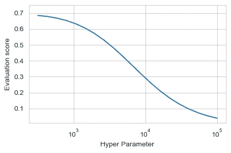
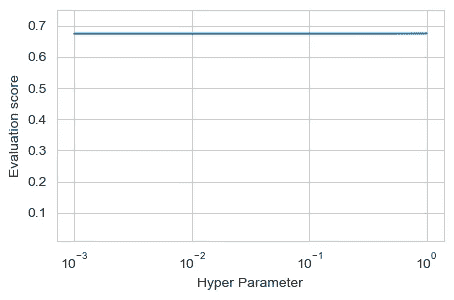
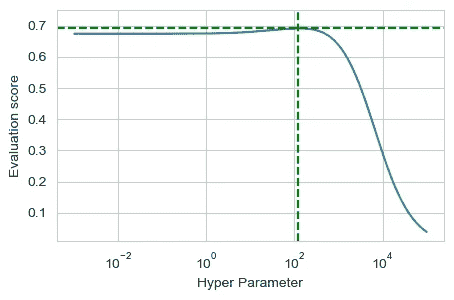
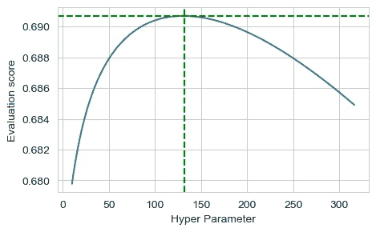
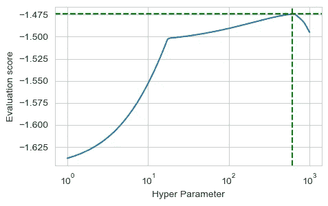

# 超参数调整中的常见错误

> 原文：<https://towardsdatascience.com/common-mistakes-in-hyper-parameters-tuning-ff5951e6c2d>

## 机器学习模型的超参数调整是一个反复试验的游戏。要想成功，最好避免以下错误。

照片由[丹尼斯·莱昂](https://unsplash.com/@denisseleon?utm_source=unsplash&utm_medium=referral&utm_content=creditCopyText)在 [Unsplash](https://unsplash.com/?utm_source=unsplash&utm_medium=referral&utm_content=creditCopyText) 上拍摄

从给定的数据集开始，训练机器学习模型意味着计算最小化/最大化给定度量或优化函数的一组模型参数。通常使用基于[梯度下降](/hyper-parameter-tuning-techniques-in-deep-learning-4dad592c63c8)的方法找到最佳点。

然而，大多数模型都定义了一个额外的参数层，称为**超参数**。它们的值影响模型训练期间计算的参数，并且它们不能从数据中直接估计。例如，岭回归模型的正则化参数、随机森林模型的树的数量、神经网络的层数等等。

[推荐的超参数调整方法](https://medium.com/criteo-engineering/hyper-parameter-optimization-algorithms-2fe447525903)取决于您正在训练的模型类型和您考虑的超参数数量。我将在这里重点介绍**网格搜索**，这是一种简单的超参数调优方法，也是数据科学学生首先想到的方法之一。它需要为每个参数定义一个潜在值列表，为每个组合训练模型，并根据给定的标准选择产生最佳结果的值。

虽然原理很简单，但这种方法仍然容易出错。以下是我遇到的最常见的错误。

# 1.不检查所选网格的灵敏度

这个错误我已经见过好几次了。学生在一个参数上定义一个网格，运行 GridSearchCV，提取对应于最佳分数的超参数值，然后…就是这样！

没有进一步的分析，没有调查围绕这个最佳值发生了什么的图表。根据网格定义的好坏，仅查看最佳分数及其相应的超参数值可能不足以得出正确的结论。这就引出了下一点。

# 2.选择不合适的值范围

当定义组成网格的值时，最好首先选择一个包含大范围值的粗粒度网格，以便能够确定要微调的感兴趣的区域。

根据网格的定义方式，您可能会认为模型对参数变化非常敏感:

所选择的超参数值显示了相对于该超参数的评估分数的高灵敏度(图片由作者提供)

或者该模型对于所选择的参数根本不敏感:

所选择的超参数值显示出评估分数对该超参数缺乏敏感性(图片由作者提供)

事实可能在中间的某个地方，所以为第一次测试选择足够大的范围是很重要的。

(图片由作者提供)

在确定了总灵敏度范围之后，可以进行微调步骤，以便找到最佳值。

作者图片

# 3.没有注意度量标准

下一点更有哲理性，但我认为记住这一点很重要。超参数的最佳值取决于所使用的评估分数。

在第一个例子中，我使用 R2 分数进行岭回归。sklearn 软件包提供了广泛的预定义模型性能[测量值](https://scikit-learn.org/stable/modules/model_evaluation.html)，用于评分参数。使用上例中的“最大误差”分数会导致超参数的不同最佳值:

超参数的最佳值取决于所选的评估指标(图片由作者提供)

需要根据模型的目的来选择用于超参数调整的分数。它应该根据业务逻辑或我们试图使用模型解决的整体问题来定义。GridSearchCV 非常灵活，允许我们定义任何类型的自定义函数来评估模型得分。

让我们考虑一个分类问题，我们想训练一个逻辑回归模型。我们希望根据使用专业领域知识定义的自定义分数来调整正则化参数。

让我们假设在我们的自定义分数中，假阳性的惩罚是假阴性的 10 倍。我们可以定义一个函数，将已知的训练输出值和模型预测的值作为参数，并计算所需的度量。我们可以通过调用 skearn metrics 模块中的 make_scorer 函数，将其转换为 GridSearchCV 可以使用的分数。

# 减去

在为网格选择正确的值范围和分析返回的结果时，超参数调优需要非常注意。所获得结果的质量还取决于所使用的[评估度量](/why-we-need-to-deal-with-imbalanced-classes-ec0dc1a7b803)，在许多情况下，改变评估度量将导致最佳超参数值的改变。