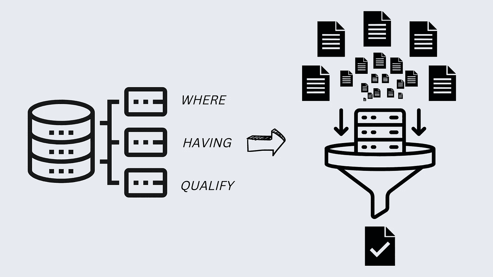
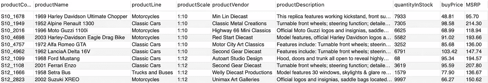
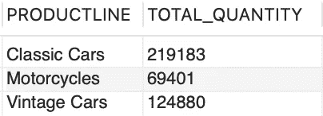
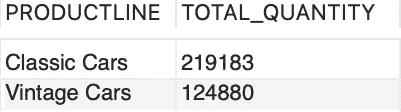
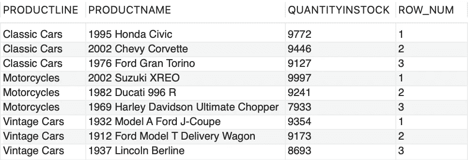

# 常见的面试问题:vs 在哪里有资格

> 原文：<https://towardsdatascience.com/commonly-asked-interview-question-where-vs-having-vs-qualify-1445a1d15902>

## 基础知识回归| SQL 初学者基础知识



作者图片，创建于 [canva](https://www.canva.com/)

你是否曾经被分配了一个分析新数据集的任务，但你不知道从哪里开始？当我第一次作为商业智能顾问开始处理数据时，我也遇到过同样的情况。开始处理包含数百万条您不熟悉的记录的数据有时会让人不知所措。

因此，从较小的数据块开始并向前推进始终是一种最佳实践(是的！数据分析 101)。首先选择一个子集，如部门、产品或位置，然后转移到更大的数据子集。

相信我，知道如何有效地检索企业数据是一项需要磨练的关键技能，因为它会进一步放大数据的价值；不仅仅是日常的商业任务，从面试的角度来看也是如此，因为这是我到目前为止遇到的最常见的面试问题。

下面是大多数 SQL 风格中最常用的数据过滤子句的快速指南。*其中*、*有*和*有*均用于基于条件表达式过滤查询结果集，但用例不同。

我在用[**classic models**](https://www.mysqltutorial.org/mysql-sample-database.aspx)MySQL 样本数据库进行演示；它保存汽车零售商的业务数据。下面是 ER 图，以便快速理解，


作者图片

***其中***

*   *其中*是根据条件表达式过滤出结果集的最常用子句。
*   通过子句可以使用/不使用*组。一起使用时， *GROUP BY* 子句总是跟在 *WHERE* 子句后面。*

这是来自*产品*表的样本数据，

```
SELECT * FROM CLASSICMODELS.PRODUCTS LIMIT 10;
```



作者图片

比方说，我们想要按每条产品线分组的*产品线* *老爷车、老爷车*和*摩托车、*的当前总库存数量信息。

```
#where clause exampleSELECT
    PRODUCTLINE,
    SUM(QUANTITYINSTOCK) AS TOTAL_QUANTITY
FROM 
    CLASSICMODELS.PRODUCTS
WHERE PRODUCTLINE IN ('Classic Cars', 'Vintage Cars', 'Motorcycles')
GROUP BY PRODUCTLINE;
```

上面的查询将返回以下输出:



作者图片

***拥有***

*   *HAVING* 类似于 *WHERE* 子句，不同之处在于它用于使用任何集合函数的过滤条件，并涉及作为过滤条件/表达式的 *GROUP BY* 子句。
*   *GROUP BY* 先于 *HAVING* 子句。(具有子句的*总是用在由*子句分组的*之后)*
*   当在查询中使用 HAVING 子句时，只有满足条件表达式的组才会出现在输出中。

继续上一个示例，我们进一步希望将结果集过滤到总量超过 100000 的*产品系列*,

```
#having clause exampleSELECT
    PRODUCTLINE,
    SUM(QUANTITYINSTOCK) AS TOTAL_QUANTITY
FROM 
    CLASSICMODELS.PRODUCTS
WHERE PRODUCTLINE IN ('Classic Cars', 'Vintage Cars', 'Motorcycles')
GROUP BY PRODUCTLINE
HAVING TOTAL_QUANTITY > 100000;
```

该查询将返回以下输出，



作者图片

*WHERE* 和*有*子句的一些关键区别，

*   语法方面的*，其中*子句在 *GROUP BY* 子句之前，这意味着它将在执行聚合计算之前基于条件表达式过滤行。
    而在语法上，具有子句的*位于 *GROUP BY* 子句之后，因此它将在执行聚合计算后过滤行。从性能优化的角度来看，具有*子句的*比*慢，在*中，应尽可能避免*。**
*   当两者一起使用时， *WHERE* 子句将首先过滤单个行，然后将这些行分组，执行聚合计算，最后将使用 *HAVING* 子句过滤组。
*   *其中*子句可用于所有 DML 命令，而具有的*只能用于 SELECT 语句。*

***晋级***

*   *限定*用于过滤表达式根据用户指定的条件使用任何分析/窗口函数的情况。

继续*产品线*的例子，之前我们查询了产品线*老爷车、老爷车*和*摩托车的当前库存产品总量。*现在，我们来看看产品线中库存数量最高的前 3 种产品。由于 MySQL 不支持 *QUALIFY* 子句，请尝试在其他支持的 SQL 环境中运行下面的查询。

```
#qualify clause example
SELECT 
    PRODUCTLINE,
    PRODUCTNAME,
    QUANTITYINSTOCK,
    ROW_NUMBER() OVER (PARTITION BY PRODUCTLINE ORDER BY   QUANTITYINSTOCK DESC) AS ROW_NUM
FROM 
    CLASSICMODELS.PRODUCTS
WHERE PRODUCTLINE IN ('Classic Cars', 'Vintage Cars', 'Motorcycles') 
QUALIFY ROW_NUM <= 3;
```

上面的查询将返回，



作者图片

通过使用嵌套查询可以得到相同的结果，

```
#qualify clause work-around using nested query
SELECT 
    PRODUCTLINE,
    PRODUCTNAME,
    QUANTITYINSTOCK,
    ROW_NUM
FROM 
   (
    SELECT
        PRODUCTLINE,
        PRODUCTNAME,
        QUANTITYINSTOCK,
        ROW_NUMBER() OVER (PARTITION BY PRODUCTLINE ORDER BY QUANTITYINSTOCK DESC) AS ROW_NUM
    FROM 
       CLASSICMODELS.PRODUCTS
    WHERE PRODUCTLINE IN ('Classic Cars','Vintage Cars','Motorcycles')
   )SUBQ
WHERE SUBQ.ROW_NUM <= 3;
```

还是我个人的最爱；使用[*【CTE(常用表表达式)*](https://dev.mysql.com/doc/refman/8.0/en/with.html)

```
*#qualify clause work-around using cte
WITH STOCK_RANKING
AS
 (
  SELECT
      PRODUCTLINE,
      PRODUCTNAME,
      QUANTITYINSTOCK,
      ROW_NUMBER() OVER (PARTITION BY PRODUCTLINE ORDER BY QUANTITYINSTOCK DESC) AS ROW_NUM
 FROM 
      CLASSICMODELS.PRODUCTS
 WHERE PRODUCTLINE IN ('Classic Cars','Vintage Cars','Motorcycles')
 )

SELECT 
   PRODUCTLINE,
   PRODUCTNAME,
   QUANTITYINSTOCK,
   ROW_NUM
FROM 
   STOCK_RANKING
WHERE ROW_NUM <= 3;*
```

# *结论*

*出于上述原因，我个人尽量避免使用带有子句的*。我通常会创建一个临时的或中间的表，在那里获取数据的子集，然后在另一个查询中使用；为了*的可读性*和*的复用性*。总而言之，如果它是针对您的业务案例的性能优化解决方案，了解这些条款并使用它总是值得的。**

*这里有一些有用的资源，*

*   *[*其中*](https://www.mysqltutorial.org/mysql-where/) 从句*
*   *[*拥有*](https://www.mysqltutorial.org/mysql-having.aspx) 条款*
*   *[*限定*](https://docs.teradata.com/r/2_MC9vCtAJRlKle2Rpb0mA/1z5LI8ycTW55f53vLJ0WjQ) 子句*

*快乐学习！*