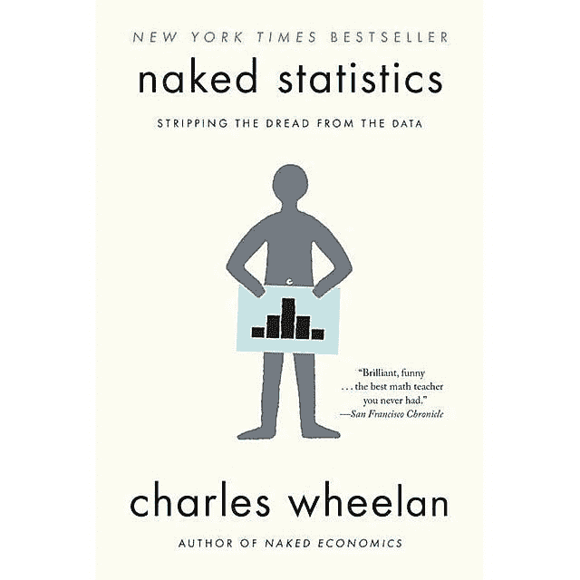

# 作为数据科学家进行交流

> 原文：<https://towardsdatascience.com/communicating-as-a-data-scientist-why-it-matters-and-how-to-do-it-well-f1c34d28c7c4>

# 作为数据科学家进行交流

## 为什么它很重要以及如何做好它

托马斯·勒在 [Unsplash](https://unsplash.com?utm_source=medium&utm_medium=referral) 上的照片

作为一名数据科学家，你需要**向非技术同事传达你的发现和建议。**这可能包括高级管理层、贵公司的其他部门，甚至客户。因此，你**必须发展强大的沟通技巧。**

我们经常谈论作为一名数据科学家，沟通是多么重要。然而，**我们对阐明和发展它说得还不够。**

在这篇博文中，我们将讨论沟通在数据科学中的重要性，并概述一些有效沟通的技巧。

# 通信在数据科学中的重要性

沟通是任何数据科学角色的关键。作为一名数据科学家，我们将依赖您向非技术同事传达您的发现和建议。这可能包括高级管理层、公司内的其他部门，甚至客户。因此，培养良好的沟通技巧是至关重要的。

随着数据科学的发展，数据科学家将他们的发现有效地传达给没有技术背景的人变得越来越重要。此外，沟通是理解复杂概念并将其转化为利益相关者可以理解并采取行动的明确建议的关键。这篇博文将讨论沟通在数据科学中的重要性，并为成为一名有效的沟通者提供一些建议。

# 但是为什么它在数据科学中如此重要呢？

首先，数据科学就是要清晰简洁地理解和交流复杂的概念。你需要向没有技术背景的人解释你的发现，这样他们才能理解其中的含义并做出明智的决定。

第二，数据科学家经常与不同部门的利益相关者合作。为了提高效率，数据科学家需要了解业务环境，以及他们的发现如何影响公司的其他部门。

第三，数据科学在不断发展，新的技巧和技术也在不断涌现。作为一名数据科学家，跟上这些变化并将其有效地传达给你的团队或组织是非常重要的。

第四，数据科学可用于各种目的，如改善客户体验、推动创新或优化运营。如果您希望您的团队或组织在这一领域进行投资，阐明数据科学项目价值的能力是必不可少的。

# 关于沟通的一些规则

现在，我们已经了解了沟通在数据科学中如此重要的一些原因，让我们来看看如何成为更有效的沟通者的一些规则，之后我将分享一些建议。

首先，数据科学家在解释他们的发现时需要**清晰简洁**。这意味着避免复杂的行话，使用每个人都能理解的简单语言。

其次，数据科学家应该花时间了解业务环境，以及他们的发现如何影响公司的其他部门。这将有助于他们与不同部门的利益相关者有效沟通。

第三，数据科学家应该跟上该领域的变化，并准备好向非技术同事解释新的技巧或技术。

# 如何做这件事的一些建议

## 交流是关于与某人的联系

数据科学家将数据与故事联系起来，让外行人更容易理解。要做到这一点，数据科学家必须首先了解对他们的受众来说什么是重要的。他们希望得到回答的问题是什么？然后，数据分析师可以将发现转化为有意义的故事，并提供背景。这不是把数据转储到某人身上。

## 作为一名数据科学家，交流需要清晰的思路

这是关于有清晰的想法。如果多人阅读你的发现，他们会得出相同的结论吗？他们是否以同样的方式理解你的数据、方法和结果？交流也是关于验证的。

## **解释的效率至关重要；你能快点说重点吗？**

能够简化数据以便任何人都能理解是一项有价值的技能。数据科学中的术语过于复杂或过度使用会导致误解和不信任。

**让你的听众感到与你有联系。**

数据科学是关于人类的。数据科学家必须记住这一点，而且不仅仅是在向非技术背景的人演示时。重要的是找到与你一起工作的每个人的共同点，以建立信任并有效地前进。

# 请务必阅读这本书

[**赤裸裸的统计—查尔斯·惠兰**](https://www.awin1.com/cread.php?awinmid=16829&awinaffid=1007489&ued=https%3A%2F%2Fwww.bookdepository.com%2FNaked-Statistics-Charles-Wheelan%2F9780393347777%3Fref%3Dgrid-view%26qid%3D1643219943774%26sr%3D1-1)

书中的图片

《裸统计》这本书讲的是数据通信。它教导如何以一种让没有技术背景的人容易理解的方式来解释数据。这本书涵盖了数据可视化，统计学和通信技术等主题。对于想要提高沟通技巧的数据科学家来说，这是一个极好的资源。

# 结论

作为一名数据科学家，有多种有效沟通的方式。这些只是作为一名数据科学家成为有效沟通者的一些技巧。记住，沟通是关键。

准备好回答关于你的数据和分析的问题。耐心点，花点时间详细解释你的发现。记住，不是每个人都有技术背景，所以你需要能够解释事情。

培养强大的沟通技能对于数据科学家来说至关重要。通过遵循这篇博文中概述的技巧，您可以成为一名更有效的沟通者，并对您的数据科学项目产生更大的影响。

*免责声明:本帖中有附属链接支持我的写作。如果你通过他们购买，我可以赚取佣金，而且你不用为此付出任何代价。*

干杯