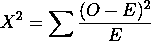
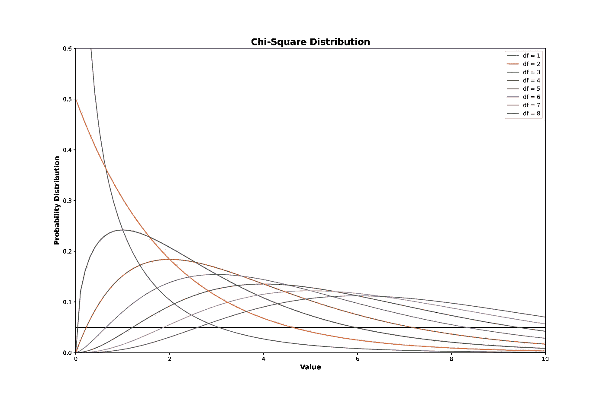
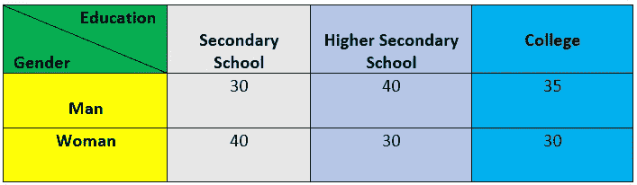
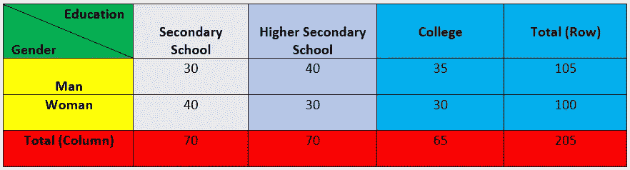
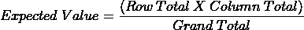
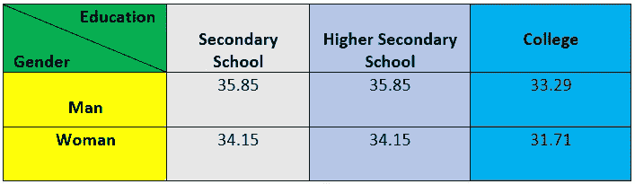
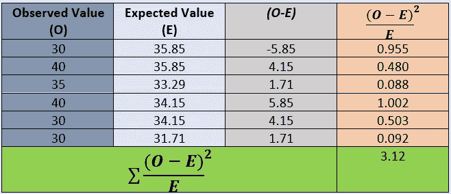
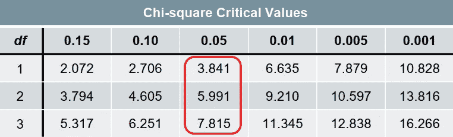
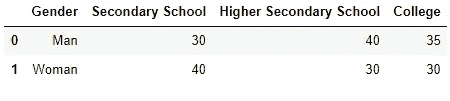
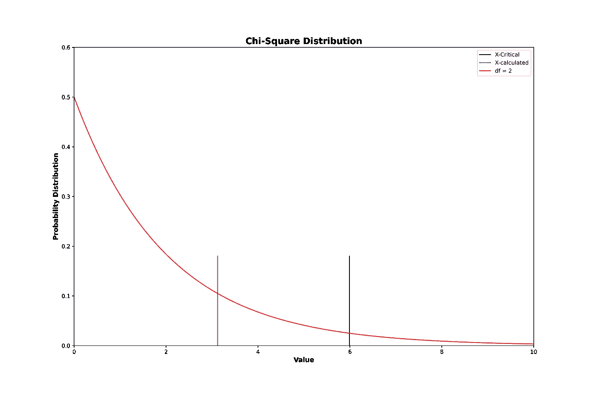

# 用卡方检验比较分类变量的相关性(Stat-12)

> 原文：<https://towardsdatascience.com/compare-dependency-of-categorical-variables-with-chi-square-test-982baff64e81>

## 使用卡方检验寻找分类变量间依赖关系的完整指南


在 [Unsplash](https://unsplash.com?utm_source=medium&utm_medium=referral) 上 [Kier In Sight](https://unsplash.com/@kierinsight?utm_source=medium&utm_medium=referral) 的照片

## 动机

许多统计测试是可用的，像 p-测试，z-测试，学生的 t-测试，方差分析测试等。为什么我们需要卡方检验？上述测试都没有显示分类变量的依赖性。卡方检验是做这项工作的最好的统计武器。测试背后的主要思想是下面的条款[2]—

> **“契合度”**

让我们用一个例子让它变得简单一点。假设你掷一枚硬币 18 次。一般头尾胜负的概率是 o.5 .所以，概率上说如果你掷一个硬币 18 次，你应该得到 9 次头和 9 次尾。但是你观察到头部的出现次数是 12 次而不是 9 次。这意味着预期值和观察值之间存在差异。 ***卡方检验显示我们的观察值和期望值有多接近！***

## 卡方检验

卡方检验是一种检验，用于确定某一事件的观察发生次数与预期发生次数之间是否存在显著差异。根据维基百科—

> 皮尔逊卡方检验用于确定在列联表的一个或多个类别中，预期频率和观察频率之间是否存在统计学上的显著差异[1]。

1900 年，卡尔·皮尔逊写了一篇关于卡方检验的论文

> 在相关变量系统的情况下，一个给定的偏离概率的系统是这样的，它可以被合理地认为是来自随机抽样

标题有点长，难以实现。所以，他也表达了测试的目的，他说—

*“本文的目的是研究任何理论上的观测误差系统的概率标准，并将其应用于确定频率曲线的拟合优度。”*

卡尔·皮尔逊从未在测试中使用卡方这个名字，他只是用符号 ***X*** 来代表测试。之后，根据希腊字母的名称***【X】，*** 人们称这种检验为卡方检验。

卡方( ***X*** )的计算公式很简单。



其中， ***O*** 为观测值， ***E*** 为期望值。

## 卡方分布

卡方分布有一个标准值。有了标准值，我们决定是接受还是拒绝我们的假设。教程[3]帮助我轻松地实现了发行版。让我们尝试用几行 Python 代码来绘制分布图。

***输出***



作者图片

这些线条显示了不同自由度的卡方值分布。水平线与曲线相交，交点表示各个自由度的临界值。

*让我们做一些计算，并用 python 实现卡方检验。关于卡方的文章提供了一个实现指南[4]。*

假设你有一些关于受教育程度和性别的数据，如下图。



作者图片

基于以上数据，我们想确定男女之间是否存在基于教育水平的显著差异。

## X 值计算的逐步计算

**假设**

> ***零假设→*** 性别和受教育程度无显著差异。
> 
> ***替代假设→*** 性别和受教育程度存在显著差异。

首先，我们将计算行总计和列总计。



作者图片

现在，我们需要计算每个条目的期望值。它可以通过以下公式计算。



在我们的例子中，*总计=* ***205。*** 所以，期望值为 `**Gender → Man and Education → Secondary School is (105 x 70)/205 = 35.85**` **。如果我们计算所有的值，我们将得到表中所示的值。**



期望值表(图片由作者提供)

最后，我们将通过应用公式来计算卡方值。



对于给定的数据，我们计算出的***【X】***值为 **3.12。**自由度可以与教育级别(中学、高中和大学)和性别(男性和女性)相关联。所以，自由度为=***(3–1)x(2–1)= 2。***



卡方表(图片由作者提供)

*   ***置信度为 95%的 2 自由度 X 的临界值为 5.991。***

*这里，****X<X-临界。***

结果表明，我们不能拒绝零假设。因此，我们可以得出结论，性别和教育水平之间没有显著差异。

## **用 python 实现**

让我们创建数据集。

```
import pandas as pd
data=pd.DataFrame([['Man',30,40,35],['Woman',40,30,30]],columns=['Gender','Secondary School','Higher Secondary School','College'])
```

**输出**



作者图片

我们将通过`importing` 的`chi2_contingency`模块来使用 Python 的`Scipy library` 。该模块仅处理数值。因此，我们只需要提取数值。

```
data.iloc[:,1:].values
```

上面的代码将完成这项工作。是时候装上`chi2_contingency` 型号了。

```
from scipy.stats import chi2_contingency
stat, p, dof, expected = chi2_contingency(data.iloc[:,1:].values)

print('The Chi-Square value is {:.3f}.\nDegree of freedom is {}.\nExpected table value is \n {}'.format(stat,dof,expected)
```

***输出***

```
The Chi-Square value is 3.122.
Degree of freedom is 2.
Expected table value is 
 [[35.85365854 35.85365854 33.29268293]
 [34.14634146 34.14634146 31.70731707]]
```

它显示了与我们手工计算相同的结果。让我们尝试将输出可视化。

***输出***



作者图片

黑色竖线的右边是拒绝区域，线的左边是零假设的接受区域。由于我们计算的卡方值落在可接受区域，我们不能拒绝零假设。

## 结论

统计学是一种从样本数据推断总体的有趣技术。没有统计数据，我们就无法建立预测模型，因为预测模型可以帮助我们借助过去的数据洞察未来的结果。然而，不同的统计技术和测试被用来分析不同的事物。卡方检验帮助我们显示两个分类变量之间的关系。

*【注意:对* [*的说明】何塞·波尔蒂利亚*](https://www.oreilly.com/pub/au/7412) *，关于卡方检验帮助我把概念弄清楚。】*

## 参考

1.  [https://en.wikipedia.org/wiki/Chi-squared_test](https://en.wikipedia.org/wiki/Chi-squared_test)
2.  卡尔·皮尔逊 F.R.S. (1900) X. *关于在相关变量系统的情况下，给定系统与概率的偏差是这样的标准，即可以合理地认为它是从随机抽样中产生的*,《伦敦、爱丁堡和都柏林哲学杂志和科学杂志》，50:302，157–175，DOI:[10.1080/147888463897](https://doi.org/10.1080/14786440009463897)
3.  [Python-卡方检验(tutorialspoint.com)](https://www.tutorialspoint.com/python_data_science/python_chi_square_test.htm)
4.  [Python —皮尔逊卡方检验— GeeksforGeeks](https://www.geeksforgeeks.org/python-pearsons-chi-square-test/)

## 关于数据科学统计学的完整系列文章

1.  [*少即是多；采样的‘艺术’(Stat-01)*](/less-is-more-the-art-of-sampling-dda8b59d399?source=your_stories_page-------------------------------------)
2.  [*熟悉数据科学最重要的武器~变量(Stat-02)*](/get-familiar-with-the-most-important-weapon-of-data-science-variables-48cc7cd85dc5?source=your_stories_page-------------------------------------)
3.  [*要提高数据分析能力，您必须了解频率分布(Stat-03)*](/to-increase-data-analysing-power-you-must-know-frequency-distribution-afa438c3e7a4?source=your_stories_page-------------------------------------)
4.  [*通过可视化频率分布找到数据集的模式(Stat-04)*](/find-the-patterns-of-a-dataset-by-visualizing-frequency-distribution-c5718ab1f2c2?source=your_stories_page-------------------------------------)
5.  [*比较多个频率分布，从数据集中提取有价值的信息(Stat-05)*](/compare-multiple-frequency-distributions-to-extract-valuable-information-from-a-dataset-10cba801f07b?source=your_stories_page-------------------------------------)
6.  [*用简短的讨论消除你对意思的误解(Stat-06)*](https://medium.datadriveninvestor.com/eliminate-your-misconception-about-mean-with-a-brief-discussion-a9fed67d4b08?source=your_stories_page-------------------------------------)
7.  [*通过规范化提高您的数据科学模型效率(Stat-07)*](https://medium.datadriveninvestor.com/increase-your-data-science-model-efficiency-with-normalization-918484b4626f?source=your_stories_page-------------------------------------)
8.  [*数据科学的基本概率概念(Stat-08)*](/basic-probability-concepts-for-data-science-eb8e08c9ad92?source=your_stories_page-------------------------------------)
9.  [*从朴素贝叶斯定理到朴素贝叶斯分类器的路线图(Stat-09)*](/road-map-from-naive-bayes-theorem-to-naive-bayes-classifier-6395fc6d5d2a?source=your_stories_page-------------------------------------)
10.  [](https://medium.datadriveninvestor.com/all-you-need-to-know-about-hypothesis-testing-for-data-science-enthusiasts-30cfe1dce028?source=your_stories_page-------------------------------------)*数据科学爱好者关于假设检验的所有知识(Stat-10)*
11.  *[*多组间统计比较用 ANOVA (Stat-11)*](/statistical-comparison-among-multiple-groups-with-anova-d4ac27f6e59e?source=your_stories_page-------------------------------------)*
12.  *[*用卡方检验比较分类变量的相关性(Stat-12)*](/compare-dependency-of-categorical-variables-with-chi-square-test-982baff64e81?source=your_stories_page-------------------------------------)*

**您可以通过以下链接订阅媒体上的每一篇文章。**

*[](https://mzh706.medium.com/membership) [## 通过我的推荐链接加入 Medium-MD . Zubair

### 阅读 Md. Zubair 的每一个故事你的会员费直接支持 Md. Zubair 和你阅读的其他作家。你会…

mzh706.medium.com](https://mzh706.medium.com/membership) 

*订阅以下链接，获取我的文章通知。*

[](https://mzh706.medium.com/subscribe) [## 每当 Md. Zubair 发表文章时，就收到一封电子邮件。

### 每当 Md. Zubair 发表文章时，就收到一封电子邮件。通过注册，您将创建一个中型帐户，如果您还没有…

mzh706.medium.com](https://mzh706.medium.com/subscribe)*