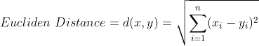
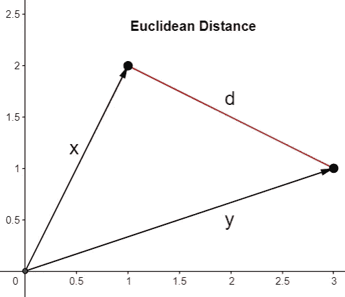
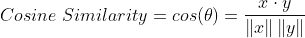
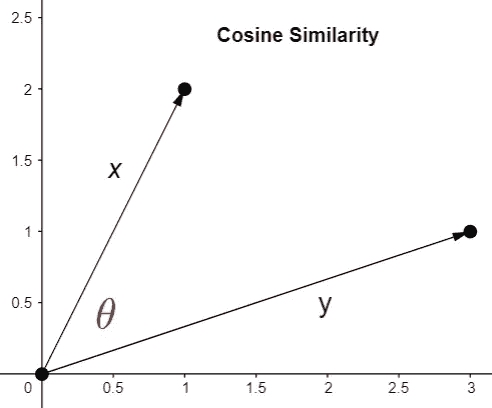
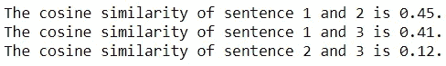

# 使用相似性度量比较文档

> 原文：<https://towardsdatascience.com/comparing-documents-with-similarity-metrics-e486bc678a7d>

## 自然语言处理中如何利用数学比较文本的初步研究

帕特里克·托马索在 [Unsplash](https://unsplash.com?utm_source=medium&utm_medium=referral) 上的照片

评估文档之间的相似性是自然语言处理中的一个常见步骤。它在许多具有信息检索和翻译等功能的微服务中扮演着不可或缺的角色。

花点时间问问自己:机器首先是如何比较文本的？

如果您想为自己利用这些技术，您需要了解一点执行文本比较背后的数学知识。

虽然许多确定文档相似性的微服务非常复杂，并且采用了先进的技术和概念，但是您可以通过首先了解可以量化文本片段之间的相似性的更简单的度量标准，朝着正确的方向迈出一步。

相似性度量虽然很幼稚，但却是向自己介绍比较文档概念的好方法。在这里，我们探讨两个比较著名的相似性度量:欧几里德距离和余弦相似性。

## 欧几里得距离

请记住，在 NLP 中，文本的主体被表示为向量。

那么，从数学的角度来看，比较向量最合适的方法是什么？

直觉上，比较两个向量之间的距离似乎是最合理的方法。

测量两个向量之间距离的度量是**欧几里德距离。**

其公式如下所示:

注意:在 Python 中，可以使用 Sklearn 模块的 [euclidean_distances](https://scikit-learn.org/stable/modules/generated/sklearn.metrics.pairwise.euclidean_distances.html) 函数轻松计算这个度量。

虽然用这种度量来比较向量可能有意义，但在 NLP 中使用时，它会引入一个明显的问题。

请看下图:

矢量图(由作者创建)

向量 x 和 y 之间的距离取决于这些向量的大小。在这种情况下，向量 x 或 y 的大小增加会导致更大的欧几里德距离。

就 NLP 而言，这意味着在多样性和频率方面具有更多单词的较大正文文本将比较小正文文本具有更大的量级，即使它们共享相同的主题。

这可能是一个问题，因为比较文档的人对文档的主题比对文本的数量更感兴趣。

想想我们已经变得如此依赖的搜索引擎。如果我们在谷歌中搜索“气球”，我们会希望看到与气球最相关的文章。我们不想局限于与查询本身一样长的结果。

因此，欧几里德距离可能不是文档相似性的最佳度量。

那么，我们如何在数学上比较文档，同时忽略大小，专注于主题呢？

## 余弦相似性

一个学派建议考虑向量之间的角度而不是距离。

表示为向量的文档可以通过评估两个向量之间的角度来进行比较。

考虑两个向量的角度的度量是**余弦相似性度量**。

余弦相似度的公式如下所示:

余弦相似度(由作者创建)

余弦相似性值的范围可以从 0 到 1，0 表示最低相似性，1 表示最高相似性。

要理解余弦相似性如何胜过欧几里德距离，请看下图。

矢量图(由作者创建)

不管矢量 x 和 y 的大小变化多少，矢量 x 和 y 之间的角度将保持不变。

这意味着余弦相似性考虑两个向量之间的角度，而不检查向量的大小。这消除了欧几里德距离度量带来的问题。

作为余弦相似性度量的演示的一部分，考虑以下 3 个句子:

我喜欢在炎热的夏天吃冰淇淋。

只有无聊的人才不喜欢吃冰淇淋。

我不喜欢在夏天出去，因为天气太热了。

我们可以通过推导这些句子的向量表示之间的角度余弦来评估这些句子之间的相似性。

由于 Sklearn 模块的[余弦相似度](https://scikit-learn.org/stable/modules/generated/sklearn.metrics.pairwise.cosine_similarity.html)函数，这在 Python 中很容易实现。

首先，让我们创建一个函数来计算两个给定文本的余弦相似度。这个函数将用 TF-IDF 算法将给定的句子转换成向量，并计算生成的向量的余弦相似度。

我们可以使用这个函数来确定这三个句子之间的相似度。

代码输出(由作者创建)

基于结果，句子 1 和 2 以及句子 1 和 3 具有最高的相似度，而句子 2 和 3 具有最低的相似度。

这是有道理的，因为句子 1 和 2 都提到了“吃冰淇淋”，而句子 1 和 3 都提到了“炎热的夏天”。另一方面，句子 2 和 3 实际上没有共享任何主题，因此导致低余弦相似性分数。

## 结论

照片由[普拉蒂克·卡蒂亚尔](https://unsplash.com/@prateekkatyal?utm_source=medium&utm_medium=referral)在 [Unsplash](https://unsplash.com?utm_source=medium&utm_medium=referral) 拍摄

自然，我们经常依赖的微服务是复杂的，依赖的不仅仅是简单的矢量化和相似性度量。

但是，如果您掌握了比较文本的简单方法，您将朝着理解 NLP 中用于文档相似性的更高级技术迈进了一步。

我祝你在数据科学的努力中好运！