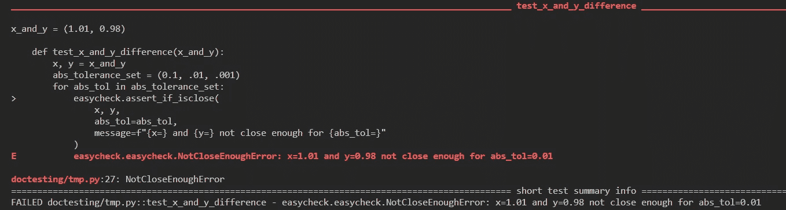

# 用 easycheck 比较浮点数

> 原文：<https://towardsdatascience.com/comparing-floating-point-numbers-with-easycheck-dcbae480f75f>

## easycheck 可以帮助您在类似断言的情况下比较浮点数


比较浮点数。图片作者。

在 Python 中比较浮点数比您想象的要简单。这要感谢`math`模块，但不仅仅是。大卫·阿莫斯最近在他的 [*关于数据科学的*文章](https://medium.com/better-programming/the-right-way-to-compare-floats-in-python-ee18042abcc)中非常好地描述了这个主题，所以如果你对基础知识感兴趣，请先阅读它。

在本文中，我将向您展示如何在类似断言的情况下比较浮点数。人们不应该在*生产*代码中使用`assert`语句，因为在调用 Python 脚本时，所有断言都可能被屏蔽，这是通过`-O`优化标志完成的。所以，在你的产品代码中使用`assert`是有风险的，尤其是当它们负责重要的检查时。这样的应用程序可能会出现意外行为。

上面我强调了“生产”。这是因为在开发过程中，当您检查代码中的各种条件时，您可以使用`assert`。但是，您需要记住，不要运行带有优化标志的代码。记住，一旦你完成了开发，以后就要依赖它们了。

如果您想在生产代码中使用断言，该怎么办？如果不是`assert`，那是什么？

幸运的是，还有其他选择，在这里我们将讨论其中的一个:`[easycheck](https://github.com/nyggus/easycheck)`包。它提供了我们称之为类似于`assert`的功能。这些函数允许检查一个条件(或几个条件)并在违反条件时抛出异常(或发出警告);当一个条件满足时，什么都不会发生。

你看到与`assert`陈述的相似之处了吗？事实上，`easycheck`的行为与此类似，但是提供了更丰富的功能。

在本文中，我们将在一个上下文中讨论`easycheck`:比较浮点数。在此之前，我们需要讨论比较浮点数的基础知识。主要的 Python 工具是标准库中的`math.isclose()`函数。了解其工作原理将为我们分析`easycheck`的报价提供背景。

# 比较浮动有什么大惊小怪的？

一方面，

一切都好。另一方面，

一点都不好！

这些都是常见的问题，当浮点数以这种意想不到的方式运行时，我可以提供更多类似的例子。但这不是本文的目的。你可以在 David Amos 的文章中看到更多的例子和相当详细的解释。

最常见的——也是大多数情况下最好的——解决方案是使用标准库`math.isclose()`函数。它允许使用差异的相对容差(`rel_tol`，默认为`rel_tol=1e-09`)或差异的绝对容差(`abs_tol`，默认为`abs_tol=0.0`)来比较两个浮点数。这是最简单的用例:

上面，我使用了该函数的默认设置，这意味着用相对容差`1e-09`和无绝对容差(默认设置为 0)来比较这两个数字。换句话说，这两个数字被认为相对*不接近*时

```
abs(x — y)/min(x, y) > rel_tol
```

否则，它们被认为是相对*接近*。当然，我们必须在提供的容差范围内考虑这个*接近度*。两个数字在一个容差的上下文中可以接近，在另一个容差的上下文中可以不接近。

注意*关闭*并不意味着*没有不同*和*没有关闭*并不意味着*不同。*这只是文字，我们如何解读数字取决于我们自己。然而，本质上，这个函数并不能让你判断两个数字是否相同。顾名思义，它使您能够分析两个数字有多接近。

要了解更多信息，请阅读 Python 的 `[math](https://docs.python.org/3/library/math.html)` [模块](https://docs.python.org/3/library/math.html)的文档，以及上面提到的 David Amos 的文章。

# 用`easycheck`比较浮动

`math.isclose()`函数返回一个布尔值，告知两个数字在给定容差下是否接近，是相对还是绝对，或者两者都有。这样，当你想回答这样一个问题:这两个数字是否接近时，它将满足你的需要。

然而，当您想在类似断言的上下文中这样做时，`math.isclose()`不能直接应用。您可以使用一个`if-else`块来实现，在这个块中，当条件不满足时，您会引发一个异常。但是你可以使用一个专用的工具来完成，因为这正是`easycheck`包设计的目的。

通过类似断言的上下文，我理解了检查条件的情况，当条件不满足时，就会引发异常；如果是的话，什么也不会发生。这就是`assert`的工作原理。有了`easycheck`，你可以发出警告，但是你还可以做更多的事情。因此，在提供`assert`所提供的同时，`easycheck`实际上提供了更多:

*   `assert`语句不应该在生产代码中使用，因为在运行程序时，它在代码中的所有实例都可以被优化标志(`-O`)屏蔽。在某些情况下，这是一件好事，因此`easycheck`将很快获得类似的功能。
*   `assert`语句使您能够仅引发`AssertionError`，并带有可选消息。使用`easycheck`，您可以引发任何您想要的异常并发出任何您想要的警告。
*   `assert`作为裸机工具，速度更快。

可以使用一个`if`块或一系列`if`块来代替`easycheck`。然而，`easycheck`更加优雅，提供了更加丰富的功能。此外，`if`-与`easycheck`不同，块用于各种目的。因此，当你看到一个`if`-块时，你必须阅读它，看看它的目的是什么。当你看到一个`assert`语句或者一个`easycheck`函数调用时，你马上就知道它是验证码。

为了比较浮点数，我们可以使用`easycheck.check_if_isclose()`函数。它的名字，你也看到了，和`math.isclose()`差不多，很好记。它的 API 也和`math.isclose()`差不多。我写“几乎相同”只是因为它有几个额外的(我们在下面讨论它们)。关键是在比较数字方面，这两个函数的工作方式完全相同，因为`easycheck.check_if_isclose()`是`math.isclose()`的直接包装器。

因此，从数学的角度来看，这两个函数的工作方式完全相同。区别在于它们的行为方式:

*   `math.isclose()`返回一个布尔值:如果数字足够接近，则返回`True`，否则返回`False`。
*   当两个数字足够接近时，不执行任何操作。当它们不是时，它要么引发一个错误，要么发出一个警告，这取决于您的请求。您可以使用可选消息。

下一节将详细分析这个函数。

# `easycheck.check_if_isclose()`在行动

这是该函数的签名:

这里，

*   `x`和`y`都是仅位置参数，是传递给`math.isclose()`的两个参数(作为`a`和`b`)。
*   `handle_with`是一个典型的`easycheck`参数，用在它的所有检查函数中。它设置不满足条件时使用的异常类。在这个函数中，默认为`NotCloseEnoughError`，一个在`easycheck`中定义的异常类。如果您需要捕捉和处理这个异常，您必须从包中导入它。
*   `message`当然是与异常一起使用的消息。你可以随意定制。默认值是`None`，对于这个函数来说，这实际上意味着消息将是`"The two float numbers are not close enough"`。如果不想使用任何信息，使用`message=""`。
*   `rel_tol`和`abs_tol`与`math.isclose()`中使用的参数完全相同。它们具有相同的名称、默认值和行为，并且它们被直接传递给`math.isclose()`。

所以，如果你已经知道如何使用`math.isclose()`——如果你想使用`easycheck.check_if_isclose()`，你就应该知道后者如何比较数字。*注意一个微小的区别*:调用`math.isclose()`时，您可以使用关键字参数`a`和`b`，而`easycheck`函数只使用位置参数。因此，如果您在`isclose()`函数中使用了`a`和`b`参数名称，请记住删除它们。

因此，您可以做的唯一额外定制是特定于`easycheck`的参数，即`handle_with`和`message`，尽管实际上您可以简单地将它们保留。默认错误可能工作得很好，它的名字传达了您需要的一切:`NotCloseEnoughError`。当然，你也可以使用任何其他的例外，一个[自定义一个](/should-we-use-custom-exceptions-in-python-b4b4bca474ac)。

是时候看看这个函数的实际作用了。我确信，如果你知道如何使用`math.isclose()`并且使用过几次，你在理解下面例子中发生的事情时不会有任何问题。

***注意*** :一定要记住，如果满足条件，什么都不会发生，几次检查都会看到这个。

上述对`easycheck.check_if_isclose()`的调用既不改变`handle_with`也不改变`message`。让我们看看我们能做些什么:

花几分钟分析上面的片段，自己决定`easycheck.check_if_isclose()`是否容易使用。

# 用`easycheck`比较单元测试中的浮点

由于单元测试是基于断言的环境，你可以在单元测试中使用`easycheck.check_if_isclose()`，例如在`[pytest](https://docs.pytest.org/en/7.1.x/)`和`[doctest](https://docs.python.org/3/library/doctest.html)`中。然而，`easycheck`带有一个别名`easycheck.check_if_isclose()`，专用于测试:`easycheck.assert_if_isclose()`。作为别名，它的用法和`easycheck.check_if_isclose()`完全一样。下面的脚本展示了一个典型的`pytest`文件的例子:

当然，这个代码没有什么特别的。这与之前的检查类似，但是之前是在代码上下文中进行的，而现在是在单元测试上下文中进行的。

如果您运行测试文件，您将会看到测试将会失败:



pytest 中`easycheck.assert_if_isclose()`的使用:失败测试的输出。图片作者。

# 结论

浮动相对容易比较，但是只有当你知道如何比较的时候。在大多数情况下，`math.isclose()`将是首选方法。这是一个简单的函数，我认为使用起来相当简单，我希望你同意我的观点。

然而，在某些情况下，`easycheck.check_if_isclose()`或者它的单元测试别名`easycheck.assert_if_isclose()`会更适合您的需要。例如，您可能更喜欢在生产代码中使用前者。

`easycheck`是一个外部包，需要安装。它可以从 PyPi 获得，所以您可以使用`pip`安装它:

如果您决定使用`easycheck`，您将得到一个模块，您不仅可以使用它来比较两个浮点数，还可以执行各种检查。但是这个故事我以后会讲的…

感谢阅读！留下你对比较浮动、`math.isclose()`和`easycheck.check_if_isclose()`的看法的评论。也许你知道另一个工具，在这些或不同的场景中，它对比较浮点数特别有帮助？

# 资源

*   大卫·阿莫斯(2022)。Python 中比较浮点数的正确方法，*走向数据科学*
*   [仓库中的](https://github.com/nyggus/easycheck) `[easycheck](https://github.com/nyggus/easycheck)` [包](https://github.com/nyggus/easycheck)
*   `[math](http://Documentation of the math module)`[模块](http://Documentation of the math module)的文档
*   科萨克米(2022)。我们应该在 Python 中使用自定义异常吗？*走向数据科学*
*   `[pytest](https://docs.pytest.org/en/7.1.x/)` [的网页](https://docs.pytest.org/en/7.1.x/)
*   `[doctest](https://docs.python.org/3/library/doctest.html)`[模块](https://docs.python.org/3/library/doctest.html)的文档

# 感谢

感谢 [David Amos](https://medium.com/u/2b3100272a2a?source=post_page-----dcbae480f75f--------------------------------) 关于比较浮点数的好文章。如果没有它，我将不得不把这篇文章写得更长，这样就不那么关注它的内容:使用`easycheck`来比较浮动。