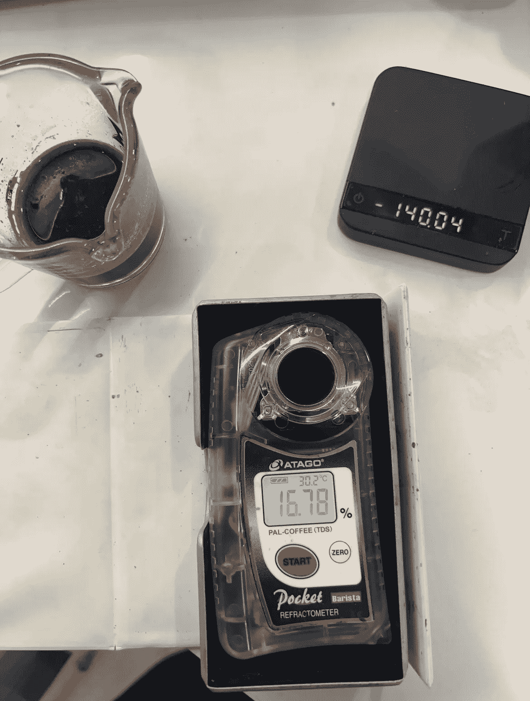
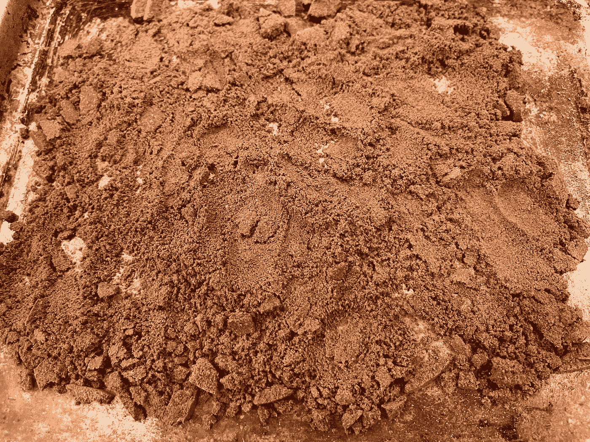
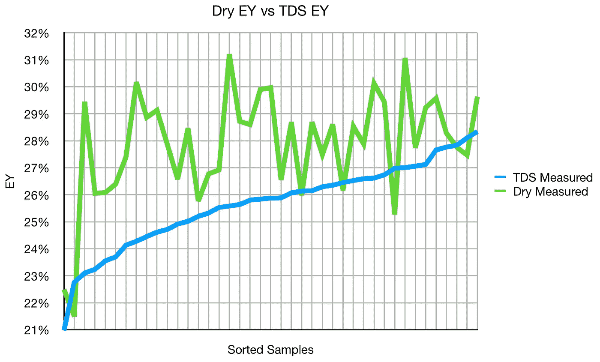
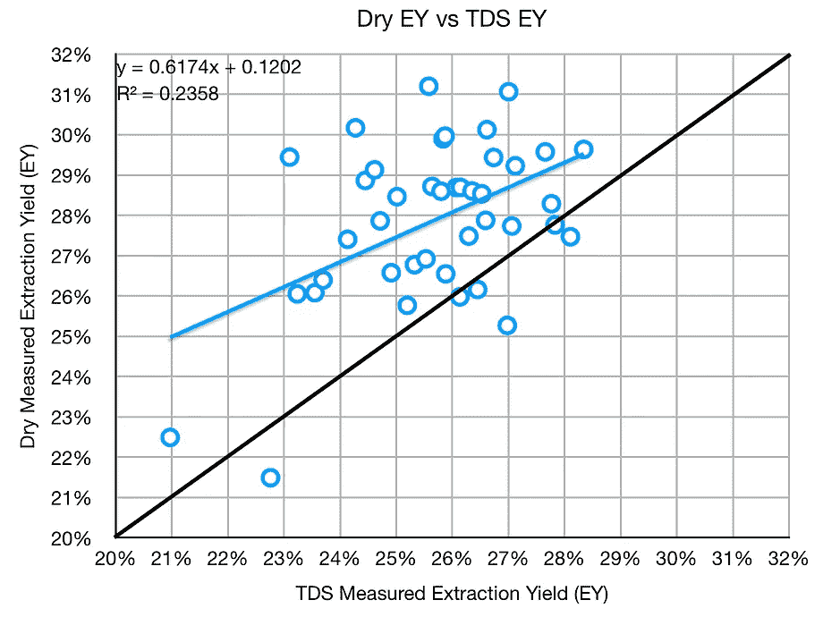
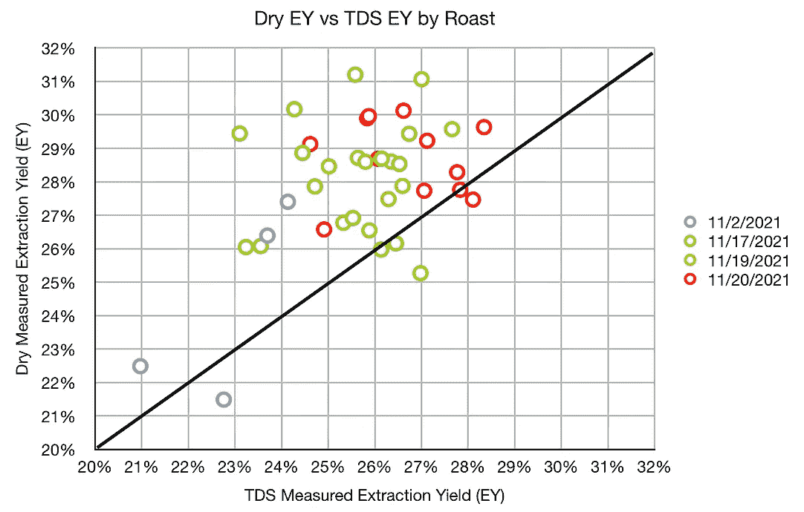

# 浓缩咖啡提取率测量方法的比较

> 原文：<https://towardsdatascience.com/comparing-methods-for-measuring-extraction-yield-4fd4da584be1>

## 咖啡数据科学

# 浓缩咖啡提取率测量方法的比较

## 干测量与湿测量

冲泡咖啡时，主要的定量质量指标是提取率(EY)。EY 有两种测定方法:烘干废咖啡和测量总溶解固体(TDS)来计算 EY。我想知道这两种方法的一致性如何，所以我收集了一些数据。

咖啡含有大约 30%的可溶性固形物，通常情况下，浓缩咖啡的良好提取率在 18%到 22%之间。特殊的技术可以将提取率提高到接近 30%，而不会对风味产生负面影响。

# 测量方法

干燥一个用过的圆盘会去除所有的水分，如果你将干燥的重量与输入的重量进行比较，你就会知道现在有百分之多少的粉末被去除或提取。需要注意的是，假设拍摄前的咖啡不含水。

**用折射仪测量总溶解固体量(TDS)，这个数字结合弹丸的输出重量和咖啡的输入重量用来确定提取到杯中的咖啡的百分比，称为**提取率(EY)** 。**

****

**使用 Atago 仪表测量 TDS。所有图片由作者提供**

**用 200 华氏度或 93 摄氏度的烤箱或烤面包机烤 30 分钟左右相对容易。**

****

# **设备/技术**

**[浓缩咖啡机](/taxonomy-of-lever-espresso-machines-f32d111688f1):金特快**

**咖啡研磨机:[小生零](/rok-beats-niche-zero-part-1-7957ec49840d)**

**咖啡:[家庭烘焙咖啡](https://rmckeon.medium.com/coffee-roasting-splash-page-780b0c3242ea)，中杯(第一口+ 1 分钟)**

**[预灌注](/pre-infusion-for-espresso-visual-cues-for-better-espresso-c23b2542152e):长**

**输液:[压力脉动](/pressure-pulsing-for-better-espresso-62f09362211d)**

**[过滤篮](https://rmckeon.medium.com/espresso-baskets-and-related-topics-splash-page-ff10f690a738) : 20g VST**

**其他设备: [Atago TDS 计](/affordable-coffee-solubility-tools-tds-for-espresso-brix-vs-atago-f8367efb5aa4)、 [Acaia Pyxis 秤](/data-review-acaia-scale-pyxis-for-espresso-457782bafa5d)**

# **表演**

**一个简单的比较显示读数很接近，但有很多噪音。**

****

**散点图显示更好的观点。干燥的 EY 几乎总是高于 TDS 测量的 EY。似乎有一个大致的线性趋势，但似乎有很多变化。甚至当通过烘烤分割时，图案被展开。**

********

**如果有的话，这些结果表明，TDS 测量的 EY 可能低于实际 EY。问题是要确切知道能提取多少。用用过的咖啡和 T2 浓缩咖啡粉可以做到这一点，所以也许我会在一次性实验中尝试一下。**

**如果你愿意，可以在[推特](https://mobile.twitter.com/espressofun?source=post_page---------------------------)、 [YouTube](https://m.youtube.com/channel/UClgcmAtBMTmVVGANjtntXTw?source=post_page---------------------------) 和 [Instagram](https://www.instagram.com/espressofun/) 上关注我，我会在那里发布不同机器上的浓缩咖啡照片和浓缩咖啡相关的视频。你也可以在 [LinkedIn](https://www.linkedin.com/in/dr-robert-mckeon-aloe-01581595) 上找到我。也可以在[中](https://towardsdatascience.com/@rmckeon/follow)关注我，在[订阅](https://rmckeon.medium.com/subscribe)。**

# **[我的进一步阅读](https://rmckeon.medium.com/story-collection-splash-page-e15025710347):**

**[我未来的书](https://www.kickstarter.com/projects/espressofun/engineering-better-espresso-data-driven-coffee)**

**[浓缩咖啡系列文章](https://rmckeon.medium.com/a-collection-of-espresso-articles-de8a3abf9917?postPublishedType=repub)**

**工作和学校故事集**

**[个人故事和关注点](https://rmckeon.medium.com/personal-stories-and-concerns-51bd8b3e63e6?source=your_stories_page-------------------------------------)**

**[乐高故事启动页面](https://rmckeon.medium.com/lego-story-splash-page-b91ba4f56bc7?source=your_stories_page-------------------------------------)**

**[摄影飞溅页面](https://rmckeon.medium.com/photography-splash-page-fe93297abc06?source=your_stories_page-------------------------------------)**

**[改善浓缩咖啡](https://rmckeon.medium.com/improving-espresso-splash-page-576c70e64d0d?source=your_stories_page-------------------------------------)**

**[断奏生活方式概述](https://rmckeon.medium.com/a-summary-of-the-staccato-lifestyle-dd1dc6d4b861?source=your_stories_page-------------------------------------)**

**[测量咖啡研磨分布](https://rmckeon.medium.com/measuring-coffee-grind-distribution-d37a39ffc215?source=your_stories_page-------------------------------------)**

**[浓缩咖啡中的粉末迁移](https://medium.com/nerd-for-tech/rebuking-fines-migration-in-espresso-6790e6c964de)**

**[咖啡萃取](https://rmckeon.medium.com/coffee-extraction-splash-page-3e568df003ac?source=your_stories_page-------------------------------------)**

**[咖啡烘焙](https://rmckeon.medium.com/coffee-roasting-splash-page-780b0c3242ea?source=your_stories_page-------------------------------------)**

**[咖啡豆](https://rmckeon.medium.com/coffee-beans-splash-page-e52e1993274f?source=your_stories_page-------------------------------------)**

**[浓缩咖啡用纸质过滤器](https://rmckeon.medium.com/paper-filters-for-espresso-splash-page-f55fc553e98?source=your_stories_page-------------------------------------)**

**[浓缩咖啡篮及相关主题](https://rmckeon.medium.com/espresso-baskets-and-related-topics-splash-page-ff10f690a738?source=your_stories_page-------------------------------------)**

**[意式咖啡观点](https://rmckeon.medium.com/espresso-opinions-splash-page-5a89856d74da?source=your_stories_page-------------------------------------)**

**[透明 Portafilter 实验](https://rmckeon.medium.com/transparent-portafilter-experiments-splash-page-8fd3ae3a286d?source=your_stories_page-------------------------------------)**

**[杠杆机维修](https://rmckeon.medium.com/lever-machine-maintenance-splash-page-72c1e3102ff?source=your_stories_page-------------------------------------)**

**[咖啡评论和想法](https://rmckeon.medium.com/coffee-reviews-and-thoughts-splash-page-ca6840eb04f7?source=your_stories_page-------------------------------------)**

**[咖啡实验](https://rmckeon.medium.com/coffee-experiments-splash-page-671a77ba4d42?source=your_stories_page-------------------------------------)**