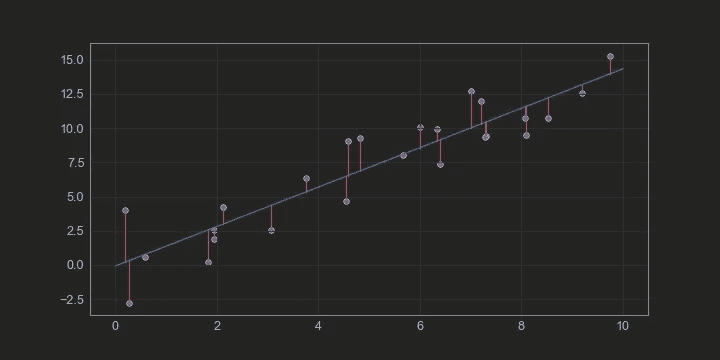
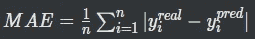
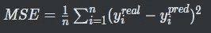
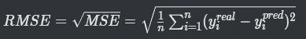
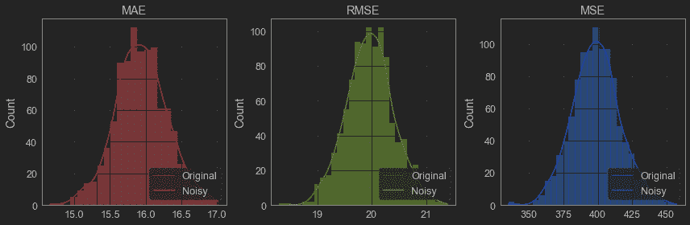
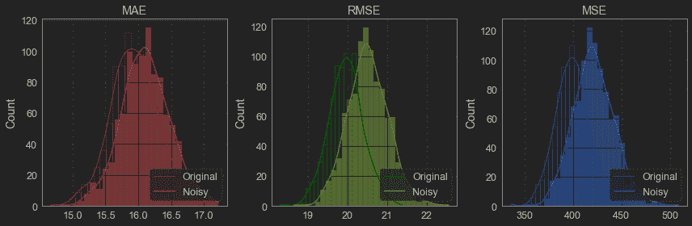
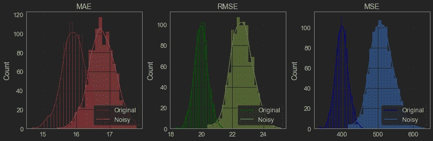
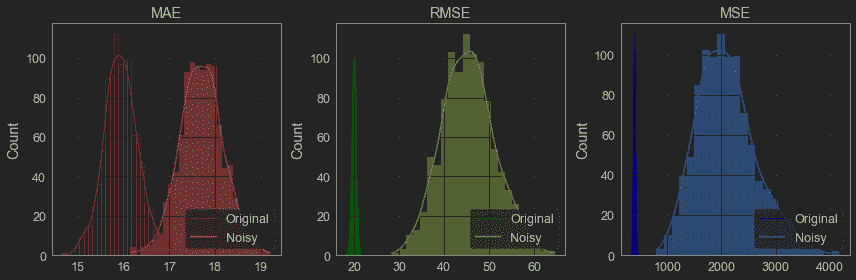

# MAE、MSE 和 RMSE 的稳健性比较

> 原文：<https://towardsdatascience.com/comparing-robustness-of-mae-mse-and-rmse-6d69da870828>

## 存在异常值时主要回归指标的表现


由克里斯·利维拉尼在 [Unsplash](https://unsplash.com/photos/dBI_My696Rk) 上原创

如果您处理数据，您可能已经知道 MSE 比 MAE 对异常值更敏感。但是你测试过吗？我做到了，这篇文章就是关于它的。

许多回归模型依赖于距离度量来确定向最佳结果的收敛。甚至“最佳”结果的定义也需要用某种度量标准来定量解释。

通常使用的度量是平均误差(MAE)、均方误差(MSE)或均方根误差(RMSE)。



作者图片

简而言之， **MAE** 评估观测值(数据集的条目)到回归预测值的绝对距离，取所有观测值的平均值。我们使用距离的绝对值，因此负误差被适当地考虑。这正是上图描述的情况。



另一种方法是平方距离，这样结果就是正的。这是由 **MSE** 完成的，由于幂函数的性质，较高的误差(或距离)在度量中比较低的误差权重更大。



MSE 中的一个反弹是，度量单位也是平方的，因此如果模型试图以美元预测价格，MSE 将产生一个没有意义的单位(美元)数。 **RMSE** 然后被用于通过对 MSE 误差求平方根来将 MSE 误差返回到原始单位，同时保持惩罚较高误差的属性。



# 稳健性

稳健性可以定义为系统或模型在暴露于噪声或夸大的输入时保持稳定并且只有很小变化(或根本没有变化)的能力。

因此，一个健壮的系统或指标必须较少受到异常值的影响。在这种情况下，很容易得出 MSE 可能不如 MAE 稳健的结论，因为误差的平方将对异常值施加更高的重要性。

让我们证明这一点。

# 代码准备

这项研究的代码可以在我的 [github](https://github.com/vinyluis/Articles/tree/main/Comparing%20robustness%20of%20MAE%20MSE%20and%20RMSE) 上找到，所以可以随意跳到下一节。

首先，我们定义计算所有三个指标的代码。在这种情况下，我们不会将观察值与回归线进行比较，而是测量每个观察值到集合平均值的距离:

然后，我们创建包含许多随机观察值的集合。这些点将从均值= 100、方差= 20 的正态分布中取样。

现在进行主功能`evaluate_metrics()`。这里的目标是评估每组观测值的平均误差、均方误差和 RMSE。当然，由于创建集合的随机过程，指标会略有不同。我们可以在没有异常值的情况下绘制这种分布，称之为“原始”分布。

然后我们可以对每个集合中的随机点进行采样，并乘以一个很高的数，这样它们肯定会成为异常值。通过对那些现在有噪声的观测重复上述过程，我们可以绘制另一条分布曲线，并与原始曲线进行比较。

该函数的代码如下。

# 实验

通过改变离群值的数量(`num_outliers`)和原始观测点(`amplitude_outliers`)所乘以的标量的幅度，可以在许多不同的场景中比较指标的稳健性。

因此，作为一个对照组，我们可以将函数设置为零异常值

```
evaluate_metrics(data, num_outliers = 0, amplitude_outliers = 1)
```

结果是原始分布和噪声分布完全相同，正如所料:



作者图片

不过，有几件事值得注意。MAE 分布的平均值约为 16，MSE 分布的平均值约为 400。预计 MSE 误差的值比 MAE 误差高大约 2 的幂，所以这并不是什么新鲜事。

但是，当取均方差的平方根并得到 RMSE 时，我们得到的平均值约为 20，高于均方差。这是因为 MSE 和 RMSE 对较高误差的放大作用大于较低误差。

此外，RMSE 和 MSE 曲线是相同的，这也是意料之中的，因为平方根不应该改变分布，只有规模。(注意:要比较它们，请关注曲线，忽略直方图)

现在我们可以开始用噪声数据进行比较。在第一个测试中，我们只能添加两个振幅= 2 的异常值:

```
evaluate_metrics(data, num_outliers = 2, amplitude_outliers = 2)
```

正如预期的那样，异常值将增加平均误差，并导致噪声分布右移:



作者图片

当将任何噪声分布与其原始对应物进行比较时，可以注意到噪声分布现在是变形的。预计它们不会具有与原始分布相同的形式，因为异常值可以随机改变这些不再完全正态(高斯)的分布。

此外，很明显，噪声 MSE 和 RMSE 分布比 MAE 分布移动得更多。这进一步证明了它们对异常值的鲁棒性较差。

通过添加更多的异常值，我们可以得到更远的分布:

```
evaluate_metrics(data, num_outliers = 10, amplitude_outliers = 2)
```



作者图片

振幅也起着重要的作用，所以我们可以回到有两个异常值，但振幅较高的情况

```
evaluate_metrics(data, num_outliers = 2, amplitude_outliers = 10)
```

在这种情况下，由于 MSE 和 RMSE 受高强度异常值的影响更大，因此对它们的分离甚至更差:



作者图片

总之，现在已经清楚了异常值对 MSE 或 RMSE 等平方误差的影响，重要的是要说明，在没有噪声的应用中，这些指标利大于弊，因为它们可以最小化更大的误差，即使这意味着接受更频繁、更小的误差。

查看本文的 github 资源库:

<https://github.com/vinyluis/Articles/tree/main/Comparing%20robustness%20of%20MAE%20MSE%20and%20RMSE>  

# 如果你喜欢这个帖子…

支持我一杯咖啡！

[](https://www.buymeacoffee.com/vinitrevisan)

给我买杯咖啡！

看看这个很棒的帖子

</5-tips-to-start-a-career-in-data-211ad15a7ca8> 