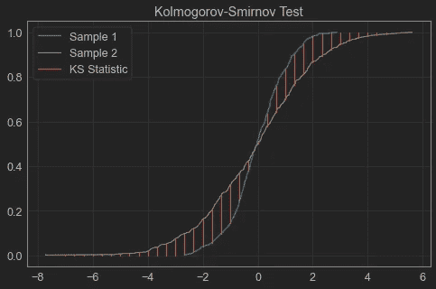
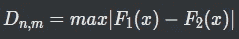
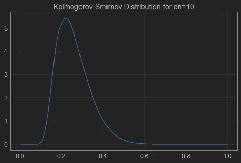
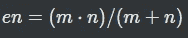
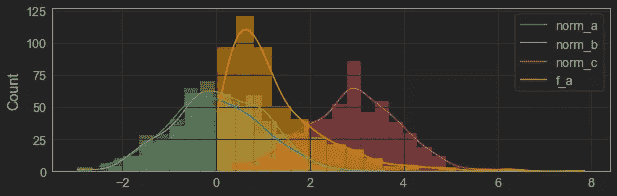

# 用 Kolmogorov-Smirnov (KS)检验比较样本分布

> 原文：<https://towardsdatascience.com/comparing-sample-distributions-with-the-kolmogorov-smirnov-ks-test-a2292ad6fee5>

## 如何使用 python 比较样本并了解它们是否来自同一个发行版


由[杨致远](https://unsplash.com/@chrisyangchrisfilm)原创于 [Unsplash](https://unsplash.com/)

假设您有两组来自传感器的读数，您想知道它们是否来自同一种机器。你如何比较这些分布？

简单的回答是:您可以使用两样本 Kolmogorov-Smirnov (KS)检验，本文将带您完成这个过程。

# 比较分布

在统计学中，我们经常需要了解给定的样本是否来自特定的分布，最常见的是正态(或高斯)分布。为此，我们有所谓的正态性检验，如夏皮罗-维尔克、安德森-达林或柯尔莫哥洛夫-斯米尔诺夫检验。

它们都衡量样本来自正态分布的可能性，并有相关的 p 值来支持这种衡量。

然而，Kolmogorov-Smirnov 检验更进一步，允许我们比较两个样本，并告诉我们它们来自同一分布的可能性。这个测试对于评估回归和分类模型非常有用，这将在后面解释。

# 科尔莫戈罗夫-斯米尔诺夫试验(KS)

简单地说，我们可以将双样本检验的 KS 统计量定义为每个样本的 CDF(累积分布函数)之间的最大距离。



KS 测试。图片作者。

在上图中，蓝线代表样本 1 的 CDF(***【F1(x)***)，绿线代表样本 2 的 CDF(***【F2(x)***)。Kolmogorov-Smirnov 统计量 ***D*** 由下式给出



用 ***n*** 作为样本 1 的观察次数， ***m*** 作为样本 2 的观察次数。然后，我们将 KS 统计量与各自的 KS 分布进行比较，以获得测试的 p 值。



KS 分布。图片作者。

双样本检验的 KS 分布取决于参数 ***en*** ，可以很容易地用表达式计算出来



# 累积分布函数

好吧，这个测试和其他统计测试很相似。但是为了计算 KS 统计量，我们首先需要计算每个样本的 CDF。

函数 ***cdf(sample，x)*** 简单来说就是样本上低于 ***x*** 的观测值的百分比。对于给定的值 ***x*** ，我们可以用一个简单的算法来计算任何样本的 CDF:

*   对样品进行分类
*   统计样本中有多少观察值小于或等于 ***x***
*   除以样本的观察总数

或者使用等效的 python 代码:

# 评估正态性(单样本检验)

正如我之前所说，KS 检验主要用于检查样本是否正态分布。我们可以使用 KS“单样本”测试来做这件事。

`scipy.stats`库有一个 ks_1samp 函数可以为我们完成这项工作，但是出于学习的目的，我将从头开始构建一个测试。这方面的代码可以在 [my github](https://github.com/vinyluis/Articles/tree/main/Kolmogorov-Smirnov) 上找到，所以可以跳过这一部分。

<https://github.com/vinyluis/Articles/tree/main/Kolmogorov-Smirnov>  

为了构建评估 KS 1 样本正态性检验的`ks_norm(sample)`函数，我们首先需要计算 KS 统计量，将样本的 CDF 与正态分布的 CDF 进行比较(均值= 0，方差= 1)。然后我们可以通过使用 KS 分布的生存函数`scipy.stats.kstwo.sf`【3】来计算`n = len(sample)`的 KS 分布的 p 值:

像这样简单。

现在我们需要一些样本来测试它:

```
# Create random samples
norm_a = np.random.normal(loc = 0, scale = 1, size = 500)
norm_b = np.random.normal(loc = 0.1, scale = 1, size = 500)
norm_c = np.random.normal(loc = 3, scale = 1, size = 500)
f_a = np.random.f(dfnum = 5, dfden  = 10, size = 500)
```



示例的样本。图片作者。

样本`norm_a`和`norm_b`来自正态分布，非常相似。样本`norm_c`也来自正态分布，但是均值更高。`f_a`样本来自 f 分布。

重要的是[在测试前标准化](https://en.wikipedia.org/wiki/Standard_score)样本，否则具有不同平均值和/或变化的正态分布(如`norm_c`)将无法通过测试。我们现在可以对它们的正态性进行 KS 检验:

```
# Performs the KS normality test in the samples
ks_norm_a = ks_norm(standardize(norm_a))
ks_norm_b = ks_norm(standardize(norm_b))
ks_norm_c = ks_norm(standardize(norm_c))
ks_f_a = ks_norm(standardize(f_a))# Prints the result
print(f"norm_a: ks = {ks_norm_a['ks_stat']:.4f} (p-value = {ks_norm_a['p_value']:.3e}, is normal = {ks_norm_a['p_value'] > 0.05})")
print(f"norm_b: ks = {ks_norm_b['ks_stat']:.4f} (p-value = {ks_norm_b['p_value']:.3e}, is normal = {ks_norm_b['p_value'] > 0.05})")
print(f"norm_c: ks = {ks_norm_c['ks_stat']:.4f} (p-value = {ks_norm_c['p_value']:.3e}, is normal = {ks_norm_c['p_value'] > 0.05})")
print(f"f_a: ks = {ks_f_a['ks_stat']:.4f} (p-value = {ks_f_a['p_value']:.3e}, is normal = {ks_f_a['p_value'] > 0.05})")
```

结果是:

```
norm_a: ks = 0.0252 (p-value = 9.003e-01, is normal = True)
norm_b: ks = 0.0324 (p-value = 6.574e-01, is normal = True)
norm_c: ks = 0.0333 (p-value = 6.225e-01, is normal = True)
f_a: ks = 0.1538 (p-value = 8.548e-11, is normal = False)
```

我们比较 p 值和显著性。如果 ***p < 0.05*** 我们拒绝零假设，假设样本不来自正态分布，就像`f_a`发生的那样。所有其他三个样本被认为是正常的，正如预期的那样。

如前所述，使用`scipy.stats.ks_1samp()`函数可以获得相同的结果:

```
# Evaluates the KS test
ks_norm_a = stats.ks_1samp(x = standardize(norm_a), cdf = stats.norm.cdf)
ks_norm_b = stats.ks_1samp(x = standardize(norm_b), cdf = stats.norm.cdf)
ks_norm_c = stats.ks_1samp(x = standardize(norm_c), cdf = stats.norm.cdf)
ks_f_a = stats.ks_1samp(x = standardize(f_a), cdf = stats.norm.cdf)
```

# 比较两个样本(双样本测试)

双样本 KS 检验允许我们比较任意两个给定的样本，并检查它们是否来自相同的分布。

它在三个主要方面不同于单样本测试:

*   我们需要计算两种分布的 CDF
*   KS 分布使用参数 ***en*** ，该参数涉及两个样本中的观察次数。
*   如果我们想知道样本的分布是否相同，就不应该对样本进行标准化。

很容易将前面的代码用于双样本 KS 测试:

我们可以评估所有可能的样本对:

输出是:

```
norm_a vs norm_b: ks = 0.0680 (p-value = 1.891e-01, are equal = True)
norm_a vs norm_c: ks = 0.8640 (p-value = 1.169e-216, are equal = False)
norm_a vs f_a: ks = 0.5720 (p-value = 6.293e-78, are equal = False)
norm_b vs norm_c: ks = 0.8680 (p-value = 5.772e-220, are equal = False)
norm_b vs f_a: ks = 0.5160 (p-value = 2.293e-62, are equal = False)
norm_c vs f_a: ks = 0.6580 (p-value = 1.128e-106, are equal = False)
```

正如预期的那样，只有样本`norm_a`和`norm_b`可以从相同的分布中取样，以达到 5%的显著性。我们不能认为所有其他对的分布都是相等的。

# Scipy

出于教学目的，我已经详细介绍了 KS 测试，但是这两个测试都可以通过使用 python 上的 scipy 模块轻松执行。

使用 [scipy.stats.ks_1samp](https://docs.scipy.org/doc/scipy/reference/generated/scipy.stats.ks_1samp.html) 函数可以进行单样本(正态)测试，使用 [scipy.stats.ks_2samp](https://docs.scipy.org/doc/scipy/reference/generated/scipy.stats.ks_2samp.html) 函数可以进行双样本测试。看看吧！

# **结论**

现在您有了一个比较分布的新工具。KS 真的很有用，而且由于嵌入在 scipy 上，也很好用。

KS 测试对于评估分类模型也是相当有用的，我将在以后的文章中展示我们如何做到这一点。

# 如果你喜欢这个帖子…

支持我一杯咖啡！

[](https://www.buymeacoffee.com/vinitrevisan)

给我买杯咖啡！

看看这个很棒的帖子

</evaluating-classification-models-with-kolmogorov-smirnov-ks-test-e211025f5573>  

# 参考

[1] Scipy Api 参考。 [scipy.stats.ks_2samp。](https://docs.scipy.org/doc/scipy/reference/generated/scipy.stats.ks_2samp.html)

[2] Scipy Api 参考。 [scipy.stats.ks_1samp。](https://docs.scipy.org/doc/scipy/reference/generated/scipy.stats.ks_1samp.html)

[3] Scipy Api 参考。 [scipy.stats.kstwo](https://docs.scipy.org/doc/scipy/reference/generated/scipy.stats.kstwo.html) 。