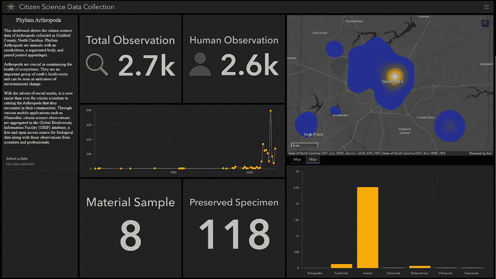
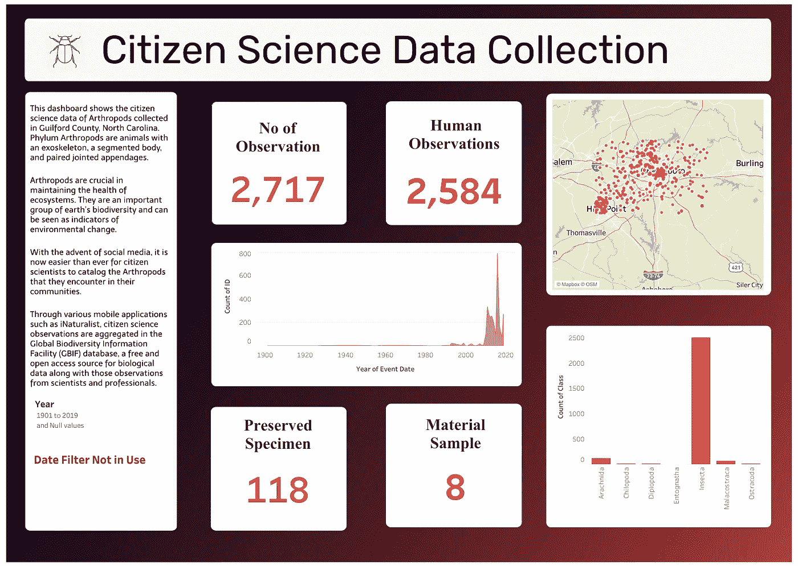
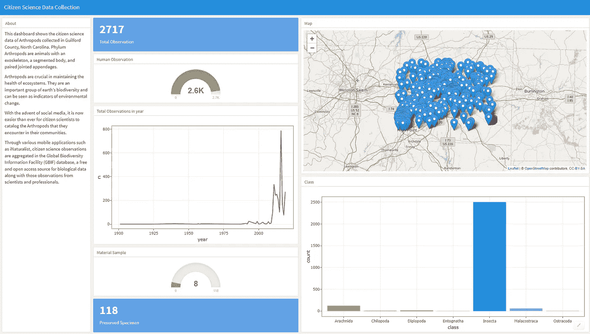

# ArcGIS Dashboard、Tableau Dashboard 和 R Flexdashboard 的比较

> 原文：<https://towardsdatascience.com/comparison-between-arcgis-dashboard-tableau-dashboard-and-r-flexdashboard-86604cd125d1>

## 为数据分析项目选择正确的工具

卢卡斯·布拉塞克在 [Unsplash](https://unsplash.com?utm_source=medium&utm_medium=referral) 上的照片

仪表板提供增强的数据可见性，并帮助企业获得更深入的见解。然而，市场上充斥着许多可以用来创建仪表板的工具和软件。作为一名数据科学家，选择正确的数据可视化工具可能是一项艰巨的任务，因为大多数平台都提供类似的核心功能，但每个平台都专注于特定的业务用例。为您的组织选择正确的工具对于其长期成功至关重要，尤其是因为在项目中期很难更改数据分析的核心组件。在本文中，我将讨论三种工具，即 ArcGIS Dashboards、Tableau Dashboards 和 R Flexdashboards，并讨论它们的优缺点，以帮助您的组织更轻松地实现可视化目标。

## ArcGIS 仪表盘

最近，在新冠肺炎疫情启动期间，ArcGIS 因其公共报告用途而广受欢迎。这些新冠肺炎仪表板中最著名的是[约翰·霍普斯金大学冠状病毒资源中心仪表板](https://coronavirus.jhu.edu/map.html)。该仪表盘是使用 ArcGIS 仪表盘创建的，并由 ESRI 的 Living Atlas 团队提供支持。《时代》杂志甚至将约翰霍普金斯大学冠状病毒资源中心列入其 2020 年最佳发明名单，成为疫情全球和区域传播的首选数据源。许多其他州和政府机构也创建了类似的仪表板，以努力传播对该病毒的认识和透明度。ArcGIS 不仅可用于新冠肺炎报告。它在许多商业和专业环境中有着广泛的用途。

ArcGIS Dashboard 是环境系统研究所(ESRI)的产品。据 [ARC 咨询集团](https://www.esri.com/about/newsroom/announcements/independent-report-highlights-esri-as-leader-in-global-gis-market/)称，ESRI 是地理信息系统(GIS)的领导者，控制着该领域约 43%的全球市场份额。图 1 显示了我使用 ArcGIS Online 应用程序创建的 ArcGIS 仪表盘示例。此示例代表了 ArcGIS Dashboard 的一般布局和美学属性。

图 ArcGIS 仪表盘示例。图片作者。

如果空间信息(纬度和经度)是数据集的重要组成部分，并且您需要定期计算地理统计数据，那么 ArcGIS dashboard 将是一个值得考虑的便捷工具。ArcGIS 通过工具箱提供统计分析工具，如 Moran's I 索引工具和空间聚类分析工具，无需编写大量代码即可访问这些工具。还可以对空间数据进行高级业务和网络分析。该仪表盘产品可与其他 ESRI 产品(如 ArcMap、ArcGIS Story Maps 和 ArcGIS Online)轻松集成，从而使数据驱动的故事讲述变得更加个性化和有效。同样，如果您需要在空间数据表示中具有高度的准确性和精确性，ESRI 产品是这一领域的冠军。ArcGIS 可以有效地处理矢量和栅格数据，您可以在 ArcGIS 环境中轻松地将一种数据类型转换为另一种数据类型。ESRI 还提供 ArcGIS online，您可以在其中为利益相关方发布仪表盘。

但是，ArcGIS 许可可能非常昂贵，可能不适合小型企业。ArcGIS 中的大多数功能都可以通过点击式界面来访问，但对于初学者来说，学习曲线可能会很陡。新用户将不得不学习许多关于如何在地球表面上表示空间栅格和矢量数据的新概念，而更高级的概念，如三角不规则网络或空间统计，可能需要大量的时间来学习。使用地理坐标系和投影坐标系投影数据对于来自非空间背景的新用户来说也是一个挑战。

在撰写本文时，ESRI 提供的仪表板布局选项非常少，而且很难改变仪表板的美观。为此，ESRI 引入了 ArcGIS Arcade，一种轻量级表达式语言。然而，这种语言摒弃了简单的点击式用户界面，这种界面使得大多数初学者能够直观地创建仪表板。类似地，仪表板中只有少数几种图表类型可用，制作雷达图等复杂的图表可能具有挑战性。因此，ESRI 的 dashboard 产品可能不太适合希望创建专门可视化的组织，尤其是在涉及有限空间数据的情况下。ArcGIS dashboard 最适合于空间数据科学家、土地使用规划者以及需要在日常工作中不断进行位置分析的企业和政府机构。

## **Tableau 仪表盘**

Tableau 是数据可视化和商业智能领域的领导者之一。Tableau 最初是在斯坦福大学开发的，后来作为一家私人公司进入市场。该公司于 2019 年被 Salesforce 收购。根据 Slintel 的数据，Tableau 在商业智能领域拥有大约 17.09%的市场份额，其客户遍布全球 166 个国家。图 2 显示了 Tableau 仪表板的一个例子。

图 2:在 Tableau 中创建的仪表板示例。图片作者。

Tableau 帮助用户快速创建交互式可视化。该软件在幕后处理大部分腿部工作，并提供简单的布局，可以配置为制作图表和图形。与其他工具相比，Tableau 易于学习，因为大多数可视化工作可以通过使用简单的拖放界面来完成。Tableau 仪表板可用于使数据讲述个性化和有效，因为可以用最少的代码创建自定义可视化。即使需要编码，这种语言也类似于 SQL，已经被多个行业的许多数据专业人员使用。Tableau 还可以用来可视化空间数据。它可以识别 ESRI 的 shapefile 格式，以及 KML 和 GeoJason 格式来显示地理单位，如县、州或国家。用户还可以将 Mapbox 地图添加到他们的仪表板中，这使得进行位置分析工作更加容易和快速。可以轻松过滤或调整地形或海岸线等地图图层属性。同样，该软件可以连接到许多数据库，如 MySQL 和 Teradata，并可以有效地处理大量数据。作为一名从业者，你也可以在 Tableau Server 或 Tableau Public 中为你的利益相关者分享和发布你的结果，使他们更容易访问你的发现。

要在 Tableau 中进行可视化，您的组织需要购买许可。幸运的是，这个许可比 ArcGIS 便宜。如果成本仍然是一个问题，可以在 Tableau Public 中创建和发布您的仪表板，这是免费的。尽管 Tableau 在可视化空间数据的能力方面有所发展，但它仍然落后于竞争对手，尤其是与 ESRI 相比。如果您有纬度和经度格式的数据，您可以快速可视化和绘制见解，但是，在进行任何空间分析时必须小心谨慎。空间分析过程(如空间裁剪)在 Tableau 中也不可用。Tableau 也不擅长导入光栅数据，尽管可以执行一些操作，例如导入光栅图像作为背景并识别其像素行号和列号。

对于非空间数据的可视化，Tableau 比 ArcGIS 更具优势。首先，它有各种各样的可视化效果，无需任何编码就可以创建和定制。它还具有许多独特的功能，使得数据准备和混合工作比 ArcGIS 更加简单和直观。在各行各业，Tableau 也是一种更常用的产品，由于它的广泛使用，组织可能会更容易雇用和留住人才。因此，对于需要干净快速开发可视化产品的简单直观的业务用例，Tableau 是最佳选择。

## **Flexdashboard**

Flexdashbaord 是 R 的一个包，可以从[起重机](https://cran.r-project.org/)上自由安装。r 是数据科学领域中一种流行的编程语言，已经成为数据科学家在操作、可视化和分析数据时的首选工具。Flexdashboard 特别基于 R Markdown，支持 html 小部件和网格图形。

图 3:flex dashboard 的例子。图片作者。

Flexdashboard 的主要优势之一是它是开源和免费的。r 还可以有效地处理空间和非空间数据类型。RStudio 对 Flexdashboard 的支持最好，这是一个流行的 r GUI，也是免费的。r 为各种统计分析提供了大量的软件包。对于空间数据，R 有*栅格*和 *sf* 包，可以分别处理栅格数据和矢量数据。这些分析的结果可以导入到 Flexdashboard 中，用于仪表板目的。Flexdashboard 的美妙之处在于，它基于基于行和列的样式，使得更改仪表板的网格布局变得很容易。如果你想让你的 dashboarding 之旅变得有趣和容易，你可以使用 *Tidyverse，*一个在 R 中流行的包，它使用了图形原理的语法。您可以使您的统计数据，甚至您的仪表板可重复，您可以更改参数或修复错误，没有太大的麻烦。最后，您可以用 HTML 呈现仪表板，并将其附加到您的电子邮件中或嵌入到您的网站中。您还可以在 Rpubs 中发布您的仪表板，Rpubs 是一个免费的 web 发布站点。

r 是一种编程语言，它也有一个有点陡峭的学习曲线。像 *ggplotgui* 这样的软件包已经试图通过为初学者提供一些 gui 界面来减少这种学习曲线。同样，像 *dplyr、*和 *ggplot2* 这样的库也让学习 R 的旅程不那么痛苦。然而，从 Flexdashboard 创建的仪表板只是静态的。如果你需要让你的仪表盘具有交互性，你可以安装 R Shiny 包。然而，托管/发布闪亮的仪表板可能具有挑战性。你可以将你的 R Shiny 应用和仪表盘免费部署到 Shinnyapps.io 的云上，但在本文撰写之时仅限于 5 个应用。如果您想部署更多的应用程序，它们有不同的定价等级。

R 和 Flexdashboard 的天才之处在于它是免费的，任何人都可以使用，不管有没有许可证。能够整合来自 *ggplot2* 的独特可视化意味着它提供了比 ArcGIS 和 Tableau 更大的灵活性，但这种仪表板创建方法也因其需要用户来自编码背景而受到阻碍。

## **结论**

本文中讨论的所有三种工具(ArcGIS、Tableau Dashboard 和 Flexdashboard)都可以帮助您的组织实现其数据可视化目标。但是，因为他们每个人都专注于自己的利基领域，所以他们可能比其他人更适合某些项目。有一些功能可用于将一个平台连接到另一个平台，例如，您可以将 Tableau 连接到 ESRI ArcGIS Server，甚至可以在 Tableau 工作流中使用 R 脚本。但是，这些跨平台连接器提供的功能有限，不建议在生产环境中使用它们。

对于一个新的组织，或者对于一个刚刚涉足商业领域的数据科学家来说，我建议从一个单一的仪表板产品开始。对于涉及空间数据的业务用例，ArcGIS 是至高无上的。为了便于创建和非空间可视化，Tableau 可能是最好的选择。另一方面，Flexdashboard 为那些有编码背景的人提供了空间和非空间能力的良好平衡。无论您为自己或您的组织选择哪种仪表板创建平台，最重要的是您要创新并找到创造性的方法来将数据传达给您的业务利益相关者。作为一名新兴的科学家，我发现学习这些工具是一个非常有益的过程，我希望你也一样。