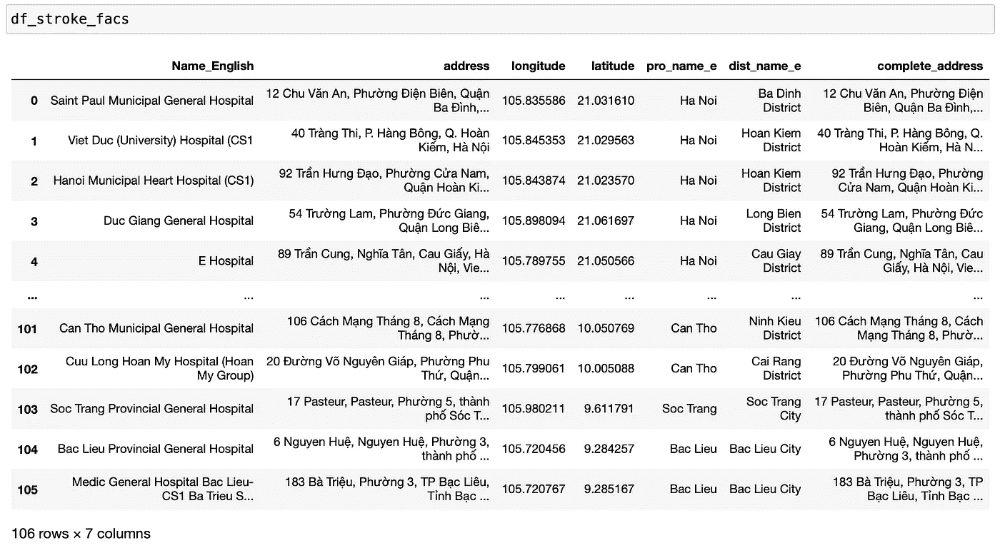
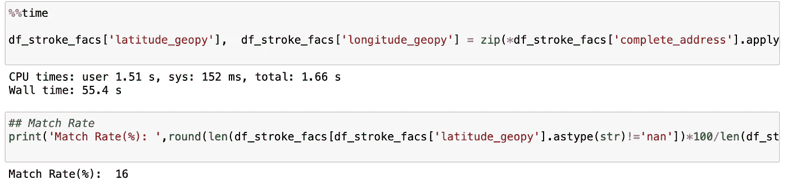
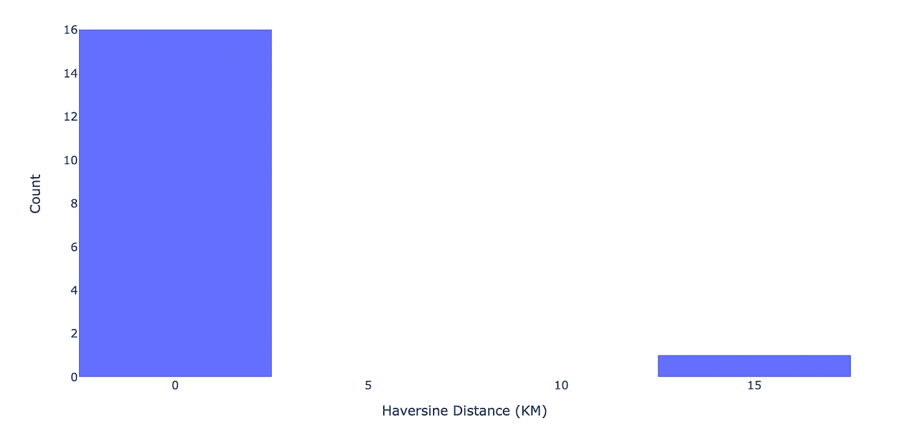
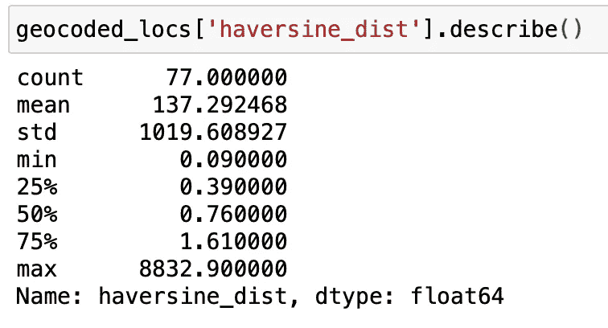
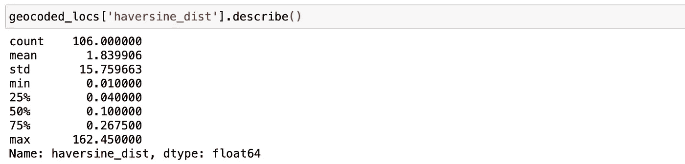
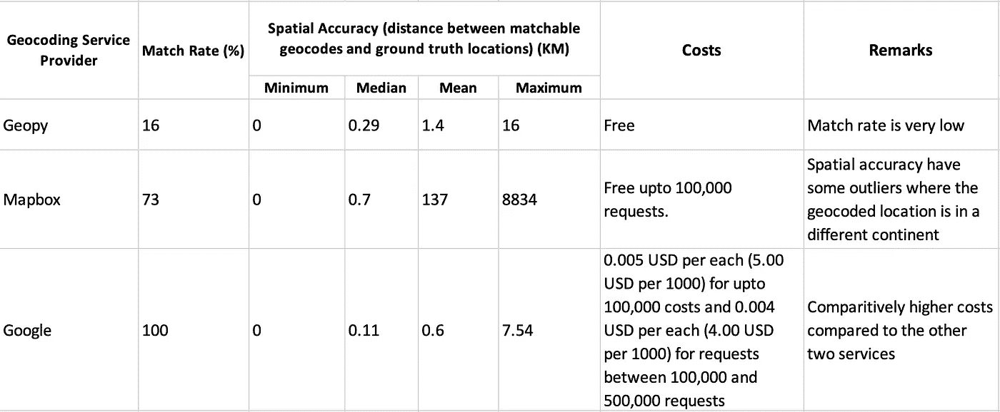
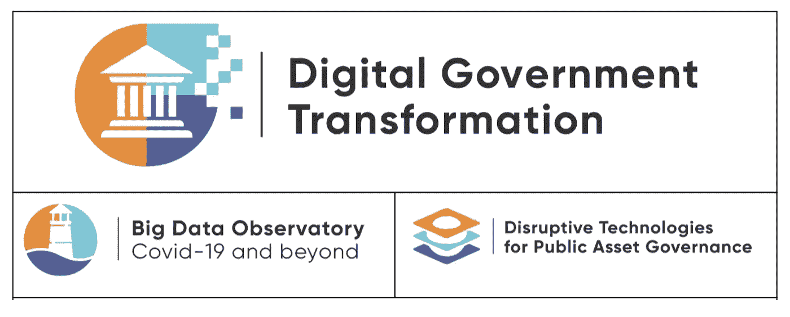

# Python 在越南卒中医疗机构地理编码服务中的应用比较

> 原文：<https://towardsdatascience.com/comparison-of-geocoding-services-applied-to-stroke-care-facilities-in-vietnam-with-python-ff0ba753a590>

## Python 实践教程

## 仔细观察匹配率和空间精度

*这部作品与* [*凯凯泽*](https://medium.com/u/ea66398a2a31?source=post_page-----ff0ba753a590--------------------------------) *和* [*迈赫迪法耶兹巴赫什*](https://medium.com/u/3138ef9e59d5?source=post_page-----ff0ba753a590--------------------------------) *合著。所有错误和遗漏都是作者的。*

由[塔玛斯·图兹-卡泰](https://unsplash.com/@tamas_tuzeskatai?utm_source=medium&utm_medium=referral)在 [Unsplash](https://unsplash.com?utm_source=medium&utm_medium=referral) 上拍摄的照片

**地理编码**是将文本格式的地址转换为经纬度等地理坐标的过程，文本格式是定位建筑物、地块或结构所需的信息，通常以特定格式使用，包含政治边界、街道名称、建筑编号、组织名称和邮政编码等内容。只有地址可用时进行地理编码是位置验证(例如，通过卫星叠加)和分析(例如，访问分析、[气候暴露、](https://medium.com/towards-data-science/local-climate-analytics-health-facility-rain-exposure-in-vietnam-6f7a40442e83)以及任何基于空间的研究)的第一步，前提是解决方案需要了解兴趣点(例如，卫生设施、人口、学校、道路)的位置。

> [在健康环境中，这项任务通常是在基于空间的健康研究中进行所有操作之前执行的基本的第一步。因此，这些机构内使用的地理编码系统的质量是机构(生产者)和希望使用这些数据的研究人员或决策者(消费者)最关心的问题。然而，随着新产品不断上市，地理编码系统也在不断发展。当面临关于构建、购买或维护任何特定地理编码系统的决策时，机构必须开发和使用跨数轴的标准。](https://ij-healthgeographics.biomedcentral.com/articles/10.1186/1476-072X-12-50)

尤其是在发展中国家应用现有工具进行地理编码时，分析人员需要密切关注进行这种转换的过程和陷阱。特别是在弱寻址的设置中，这可能会导致转换中的间隙。

> **我们通过使用一组经过验证的越南卒中机构地址数据集来证明这一点，该数据集由世界银行驻越南团队进行人工地理编码和验证。**

在这篇博客中，我们将通过 **OpenStreetMap、Mapbox 和谷歌**在 **Python** 中对越南中风护理机构的地址进行地理编码，并演示一种计算地理编码质量的方法**。**文献中报告了各种衡量地理编码质量的指标。

地理编码系统质量指标(来源— [一个用于比较地理编码系统的评估框架](https://ij-healthgeographics.biomedcentral.com/articles/10.1186/1476-072X-12-50))

在本博客中，我们将报告 ***匹配率*** (所有能够被地理编码的记录的百分比)，以及 ***空间精度*** (可匹配地理编码和地面真实位置之间的距离的频率分布)。

> **我们的目标不是推荐使用其中一个，而是展示如何在不同国家的 Python 中的 Jupyter Notebook environment(JPNE)中轻松完成这样的评估。**

我们在这个练习中使用的数据集是越南 106 个中风护理机构的列表，这些机构的完整地址是已知的。我们的团队还人工编制了这些位置的地面真实数据，并验证了纬度和经度。

包含越南 106 个中风护理机构的地址和地理坐标的数据框架(图片由作者提供)

## 1.通过 Geopy 使用 OpenStreetMaps (OSM)数据进行地理编码

Geopy 是一个 Python 客户端，使得 Python 开发者能够使用第三方地理编码器和其他数据源来定位全球各地的地址、城市、国家和地标的坐标。[nomim](https://github.com/osm-search/Nominatim)是一个通过名称和地址搜索 OpenStreetMap 数据(地理编码)并生成 OSM 点的合成地址(反向地理编码)的工具。通过 Python 中的 geopy 客户端，可以使用 nomist 查询 OSM 数据以对地址进行地理编码，如以下代码所示-

代码执行时间为 55.4 秒，匹配率仅为 16%，这意味着在 106 个设施中，Nominatim 只能返回 17 个地址的地理编码。

使用 Geopy 进行地理编码的时间和匹配率(图片由作者提供)

为了计算**空间精度**，计算 Geopy 返回的地理编码与地面真值坐标之间的[哈弗辛](https://pypi.org/project/haversine/)距离([球面上两点间的大圆距离](https://www.igismap.com/haversine-formula-calculate-geographic-distance-earth/))。然后，我们绘制哈弗线距离的频率分布，以可视化的空间精度。

使用 Geopy 进行地理编码的空间精度(图片由作者提供)

使用 Geopy 进行地理编码的位置地图(图片由作者提供)

> **Python 中的“Geocoder”库**
> 
> 许多在线地理编码服务提供商(尤其是 Google、HERE 和 Mapbox 等专有平台)不包含 Python 库。为了用 Python 从这些平台获取数据，我们需要使用请求和不同的 JSON 响应，而没有标准化的查询和响应模式。为了帮助克服这一挑战，并为这些平台提供一个单一的访问库，已经开发了 [Geocoder](https://github.com/DenisCarriere/geocoder) 库。对于使用 Mapbox 和 Google 进行地理编码，我们将演示如何通过几行代码，使用地理编码器库查询这些服务。

## 2.通过地理编码器使用 Mapbox 进行地理编码

代码执行耗时 23 秒，匹配率为 73%(106 个 stroke 设施中有 77 个地址进行了地理编码)。

地图框地理编码位置和实际位置之间的哈弗线距离统计(图片由作者提供)

由于存在一些具有极值的异常值，[我们将所有异常值](https://stackoverflow.com/questions/52225944/how-to-bin-all-outliers-into-one-bin-using-histogram-in-plotly/52334437)(大于 30 公里)归入直方图的一个柱中。

地图框地理编码位置与实际位置之间距离的频率分布(图片由作者提供)

使用 Mapbox 进行地理编码的位置地图(图片由作者提供)

Mapbox 给出了不同国家的搜索结果，比如台湾和利比亚。如果我们去除这些异常值，我们可以清楚地看到越南内部的哈弗线距离分布。

使用 Mapbox 进行地理编码的位置地图(无异常值)(图片由作者提供)

## 3.通过地理编码器使用谷歌地理编码

代码执行时间为 1 分 12 秒，匹配率为 100%**(对所有 106 个 stroke 设施进行地理编码)。**

地图框地理编码位置与实际位置之间的哈弗线距离分布(图片由作者提供)

空间精度-使用 Google 进行地理编码(图片由作者提供)

用谷歌地理编码的地图(图片由作者提供)

谷歌对越南境内的所有地点进行地理编码，匹配率为 100%。只有一个位置与实际位置的误差大于 4 km。

## 结论

在这篇博客中，我们探索了通过 Python 使用 Geopy、Google 和 Mapbox 地理编码服务，并使用越南中风护理机构位置的手动地理编码数据集验证了结果。对于这三种服务，将计算并报告匹配率和空间精度指标。由于与这些服务相关的成本也与中低收入国家的应用密切相关，我们在下表中总结了这些指标以及与平台相关的成本-

Geopy、Mapbox 和 Google 地理编码的比较结果摘要(图片由作者提供)

我们想要重申的是，我们的目标并不是推荐使用一个而不是另一个，而是展示如何针对不同的国家环境，在 Python 中的 Jupyter Notebook environment(JPNE)中轻松完成这样的评估。

*我们在部署基于云的 JPNE 流程方面积累了越来越多的经验，包括世界银行的新冠肺炎及其他地区大数据观察站(BDO)和越南公共资产治理颠覆性技术(DT4PAG)项目。通过正在进行的一系列中型博客投稿(例如，* [*【用 Python 可视化全球人口数据集】*](/visualising-global-population-datasets-with-python-c87bcfc8c6a6)*[*【当地气候分析:越南卫生机构的雨水暴露】*](https://medium.com/towards-data-science/local-climate-analytics-health-facility-rain-exposure-in-vietnam-6f7a40442e83) *)，我们将继续分享我们的经验，特别是他们如何帮助推进数据驱动的见解，以实现可持续发展目标，并推动应用技术的实践学习和技能建设，重点关注公共部门。**

**

**本教程的完整代码可以在*[*GitHub repo*](https://github.com/Analytics-for-a-Better-World/Blogs)*中找到。*即使你不是 Python 程序员，我们也希望这篇文章能让你直观地感受到利用这类数据进行新一代决策支持的可能性和过程。*