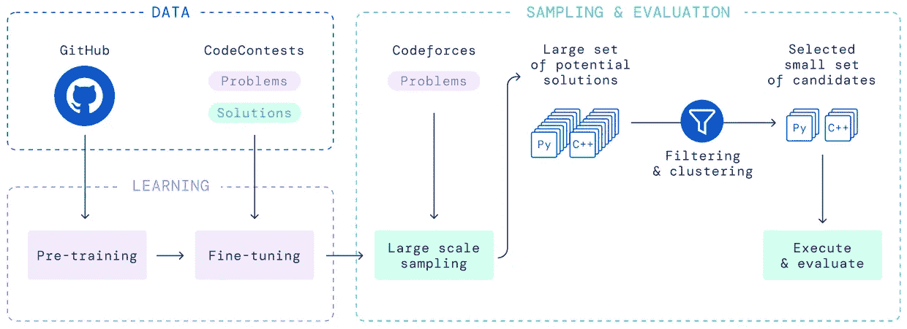
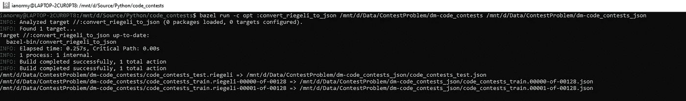

# 竞争性编程和字母代码

> 原文：<https://towardsdatascience.com/competitive-programming-alphacode-e9ebc3f88000>

## 解决竞争性编程挑战的培训模型



他们论文中展示的 DeepMind 的 AlphaCode 概述

## DeepMind 的字母代码

DeepMind 最近发表了一篇论文，介绍了他们如何训练一个名为 AlphaCode 的模型，该模型可以将一个竞争性编程问题作为输入，然后生成一个解决方案，在参与这些竞争性编程挑战的人中排名 54%。那相当令人印象深刻！这里是博客和 T2 论文的链接。

他们使用来自许多举办这些比赛的不同网站的大量示例挑战和解决方案来训练他们的模型。他们还建立了一个 GitHub 网站，将这些数据提供给那些想尝试训练自己模型的人。读完报纸后，我认为这将是一件伟大的事情。当时我一点也不知道，要做到这一点需要做多少工作。这就是这篇博文的主要目的。我想向您展示我做了什么，以及我如何能够接受他们提供的输入，这是一种专有的格式，并将其转换为简单的 JSON。这是一种非常简单的格式，可以用作您自己模型的输入。

## 克隆存储库并下载数据

AlphaCode 团队为代码竞赛[创建了一个 GitHub 知识库。将存储库克隆到您本地机器上。我们将在后面的步骤中用到它。该库中的自述文件告诉您如何下载数据。按照他们给你的步骤去做。我觉得这有点可怕，因为你必须使用谷歌云，如果你不小心，它会开始从你的信用卡上收取你没有清理和删除的服务费用。在你把文件下载到你的机器上之后，确保你删除了你必须创建的应用程序。我下载了数据，放在 D:\ Data \ contest problem \ DM-code-contests。](https://github.com/deepmind/code_contests)

## Riegeli 格式和 protobuf

下载完数据后，你会注意到它们都是 [Riegeli](https://github.com/google/riegeli) 格式的文件。这是 protobuf 的一种特殊格式，可以很好地压缩字符串。不幸的是，你无法在谷歌环境之外处理这些文件。TensorFlow 的最新版本提到了它们，但我无法从 TensorFlow 中读取它们。

## 安装 Ubuntu 18.04

为了构建和运行程序来访问 riegeli 文件，我们需要安装 Ubuntu 18.04。我在我的 Windows 10 PC 上使用 WSL，所以我简单地用这个命令在上面安装了 Ubuntu 18.04 发行版:

```
wsl --install -d Ubuntu-18.04
```

如果你有一台 Windows 10 PC，但没有安装 WSL，我发现最简单的安装方法是安装 Docker Desktop，并告诉它使用 WSL 作为后端。

## 安装 Bazel

为了在克隆的存储库中构建东西，我们需要 Bazel。你可以在 https://bazel.build/install 找到如何安装的说明。首先，您需要添加密钥:

```
sudo apt install apt-transport-https curl gnupg
curl -fsSL https://bazel.build/bazel-release.pub.gpg | gpg --dearmor >bazel-archive-keyring.gpg
sudo mv bazel-archive-keyring.gpg /usr/share/keyrings
echo "deb [arch=amd64 signed-by=/usr/share/keyrings/bazel-archive-keyring.gpg] https://storage.googleapis.com/bazel-apt stable jdk1.8" | sudo tee /etc/apt/sources.list.d/bazel.list
```

然后，您可以安装和升级它:

```
sudo apt update && sudo apt install bazel
sudo apt update && sudo apt full-upgrade
```

## 安装 clang 和 python 3 开发

最终的构建需求是 clang 和 python 3 开发:

```
sudo apt install clang
sudo apt install python3-dev
```

## 构建示例

现在我们可以开始建造东西了。在 linux 提示符下，转到您克隆存储库的目录。从那里发出以下命令:

```
bazel run -c opt :print_names_and_sources /mnt/d/Data/ContestProblem/dm-code_contests/code_contests_valid.riegeli
```

这将需要相当长的时间来运行，因为 Bazel 将下载并构建所有必要的依赖项。如果一切顺利，您应该会看到验证样本及其来源的列表。做这件事的实际 python 代码在存储库中的**print _ name _ and _ sources . py**中。

## 创建脚本将 riegeli 文件转换为 JSON

现在我们知道构建环境可以工作了，我们将创建一个新的 python 脚本，它将通读所有的训练、验证和测试 riegeli 文件，并将它们转换成 JSON。创建一个名为**的文件 convert_riegeli_to_json.py** :

为了能够构建和运行它，我们需要在构建文件的末尾添加一些行:

## 将 riegeli 文件转换为 JSON

现在一切就绪，我们只需构建并运行脚本，指定输入文件夹和输出文件夹，如下所示:

```
bazel run -c opt :convert_riegeli_to_json /mnt/d/Data/ContestProblem/dm-code_contests /mnt/d/Data/ContestProblem/dm-code_contests_json
```

然后应该构建并运行脚本，当它转换每个文件时，您应该会看到类似这样的内容:



Bazel 构建并运行 convert_riegeli_to_json.py

## 完成更改

我为 DeepMind 项目创建了一个 PR 草案，以便您可以详细了解我所做的更改。这里可以看到[。](https://github.com/deepmind/code_contests/pull/21)

## 结论

我发现让 Bazel 工作，然后构建项目很有趣。在这个过程中，我发现了很多关于 protobuf 和 riegeli 格式的东西。现在我已经有了 JSON 文件，下一步是尝试创建和训练一个模型，以实现类似于 AlphaCode 的东西。

## 资源

1.  AlphaCode 博客文章:[https://www . deep mind . com/Blog/competitive-programming-with-alpha code](https://www.deepmind.com/blog/competitive-programming-with-alphacode)
2.  AlphaCode 论文:h[ttps://arxiv . org/ABS/2203.07814](https://arxiv.org/abs/2203.07814)
3.  代码竞赛 GitHub:[https://github.com/deepmind/code_contests](https://github.com/deepmind/code_contests)
4.  巴泽尔:[https://bazel.build/install](https://bazel.build/install)
5.  https://github.com/google/riegeli
6.  原蟾蜍:【https://developers.google.com/protocol-buffers】T4
7.  我的公关:[https://github.com/deepmind/code_contests/pull/21](https://github.com/deepmind/code_contests/pull/21#issuecomment-1214380753)