# 用 PostgreSQL 中的例子完整解释 SQL 连接和联合

> 原文：<https://towardsdatascience.com/complete-explanation-on-sql-joins-and-unions-with-examples-in-postgresql-cbd868fe9e95>


罗马卡夫在 [Unsplash](https://unsplash.com?utm_source=medium&utm_medium=referral) 上拍摄的照片

## 所有常用的连接类型和一些有趣的类型

本文将是 SQL 联合和连接的综合指南。许多时间数据库的设计方式是连接和联合必不可少的。为了方便起见，数据可以存储在几个独立的表中，而不是有一个大表。因此，学习联合和连接以正确使用它们是很重要的。

在这个演示中，我们将使用 PostgreSQL。这是现在非常流行的 SQL 引擎。但是同样的查询也可以在许多其他主流 SQL 引擎中工作。

> 如果您阅读本文是为了学习，请键入并尝试自己运行查询。这是唯一的学习方法。

让我们开始吧。

## 准备数据表

我将为这次演示准备一些虚拟数据表。这些是创建三个表的命令:游戏、制造和黄金。

```
CREATE TABLE public.games(country character varying(50) NOT NULL,games character varying(50) NOT NULL,year integer NOT NULL);CREATE TABLE makes (country varchar (50) NOT NULL,clubs varchar (50) NOT NULL,games varchar (50) NOT NULL);create table gold (player_name varchar (100) not null,years varchar (10) not null,games varchar (50) null);
```

游戏表有三列:国家、游戏和年份。makes 表有三列:国家、俱乐部和游戏。最后，黄金表有三列:玩家姓名、年份和游戏。

我们需要在表格中插入一些数据来继续:

```
insert into gamesvalues("USA", "Baseball", 2012),("China", "Wrestling", 2011),("England", "Cricket", 2015),("India", "Cricket", 2011),("USA", "Football", 2018),("Spain", "Football", 2014),("China", "Basketball", 2019),("Italy", "Football", 2017);insert into makesvalues('USA', 'gk', 'Basketball'),('China', 'kl', 'Wrestling'),('Finland', 'ds', 'Football'),('England', 'nj', 'Cricket'),('Spain', 'lp', 'Football'),('Norway', 'ko', 'Basketball'),('India', 'kg', 'Wresling'),('South Africa', 'ep', 'Cricket'),('Nigeria', 'wm', 'Swimming'); insert into goldvalues('Jimmy', '2018', 'Football'),('Danny', '2012', 'Baseball'),('Indra', '2011', 'Cricket'),('Yun', '2019', 'Basketball'),('Mojo', '2017', 'Football'),('David', '2015', 'Cricket');
```

数据插入完成。让我们看一下表格。这是游戏桌:

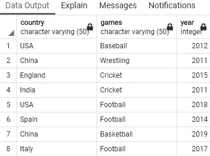

这是制造商表:

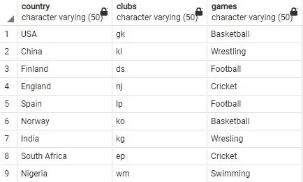

这是金桌:

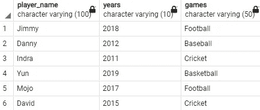

桌子准备好了。它们可能看起来不完整。但是我们将能够学习使用它们，并在我们现实世界的项目中使用这个概念。

## 联合

游戏和制作表都有国家列。我们希望在一个地方看到所有的国家:

```
select country from games union allselect country from makes;
```

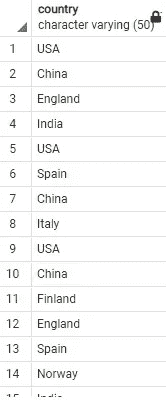

下面是部分结果。结果，一个国家来了好几次，这可能是不必要的。**这怎么解决？**

还有另一种类型的联合称为 union distinct。它只会返回不同的值:

```
select country from games union distinct 
select country from makes;
```

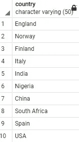

我们也可以使用多列。在下一个示例中，我们将看到国家和游戏列。因此，它将显示两个表中的列。

```
select country, games from games union allselect country, games from makes;
```

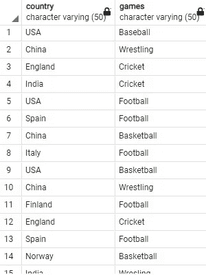

union distinct 在这里也可以用来获得国家和游戏的不同组合。

```
select country, games from games union distinct
select country, games from makes;
```

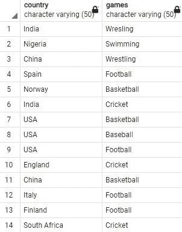

我们在结果中有 14 行数据。你可能会多次找到一个国家或一个游戏。但是在这两个表格中有 14 种独特的国家和游戏组合。

请注意，在游戏列中，我们将“year”作为整数值，在黄金列中，我们将“years”列作为 varchar 值。我们能在他们身上使用联合吗？

我们可以，但是我们需要首先使它们具有相同的数据类型。这里我将把 gold 表中的“years”列转换为一个整数，然后执行 union。我们还使用了一个别名，并将“years”列设置为“year”来匹配

```
select year from gamesunion distinctselect cast(years as int) as year from gold;
```

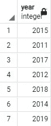

可以在两个以上的表上使用 union 吗？

是的。这里有一个例子:

```
select games from games 
union all
select games from makes
union all
select games from gold;
```

这是输出的一部分。

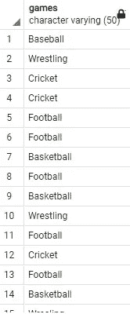

我们也可以使用不同的联合。或者，一个“所有”一个“不同”:

```
select games from games 
union all
select games from makes
union distinct
select games from gold;
```

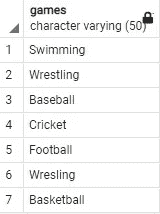

它只返回所有三个牌桌中不同的游戏。**摔跤来了两次。但是如果你仔细注意，拼写是不同的。这是数据库中的一个错误。所以，你需要注意表格中的拼写。**

## 连接

连接的工作方式不同。它连接着柱子。我们将研究不同类型的连接。首先，看一些简单的默认连接。

游戏和制作表都有国家列。

这是使用国家/地区列的默认联接:

```
select * from games joinmakes on games.country = makes.country;
```

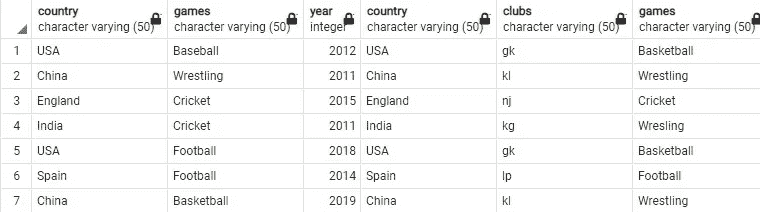

两个表是基于它们之间的共同国家和所有其他列连接的，因为我们没有指定结果中需要哪些列。**同一个国家栏出现了两次，这是不必要的。**

在下一个例子中，我将指定我想在结果中返回的列。这里我对最后一个查询做了一些修改。

我们对表使用别名或简称。例如，我们将用 g 表示“游戏”表，用 m 表示“制造”表。

我们希望从游戏表中得到的列将被指定为 g.column_name。列 country 将来自游戏表。所以，它会被称为 g.country。

在上一个例子中，我们在表中还有两个“游戏”列。但它们并不完全相同。所以，我们两个都想要。为了清楚起见，我们将使用列别名，将 games 表中的列命名为 g_games，将 makes 表中的 games 列命名为 m_games。

```
select g.country, g.year, g.games as g_games, m.clubs, m.games as m_games 
from games g
join makes m on g.country = m.country;
```

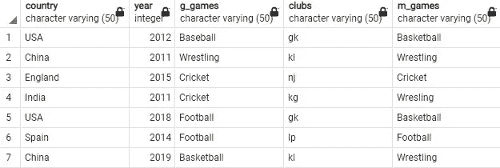

## **连接类型**

有不同类型的连接。让我们一个接一个地处理所有的连接。

> **内部连接**

我要提到的第一种类型是内部连接。这实际上是默认类型。如果你没有提到任何类型，它会给你内部连接。在我们最后的两个例子中，我们没有提到任何类型。因此，它自动执行内部连接。

我们正在对 country 列执行内部联接。因此，它将只返回两个表之间的公共国家。

我们可以将最后一个示例重写如下，只使用 inner join 而不是' join '。

```
select g.country, g.year, g.games as g_games, m.clubs, m.games as m_games from games ginner join makes m on g.country = m.country;
```


> **左外连接**

我们再次使用同一个例子。这一次将使用左外部联接代替内部联接。当我们在 country 列上进行连接时，在左外部连接中，左侧的所有国家都将被接受。在这里，游戏表位于左侧，因为它是这个查询中首先提到的。从右侧或 makes 表中，它将只使用左侧国家/地区的可用信息。如果 makes 表中没有关于 games 表中任何国家的任何信息，这些位置将显示为空。以下结果中有一些空值:

```
select g.country, g.year, g.games as g_games, m.clubs, m.games as m_games from games gleft outer join makes m on g.country = m.country;
```

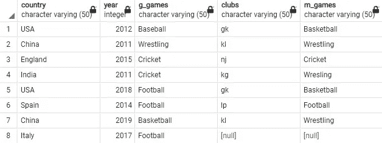

如果我们想在游戏桌面上看到游戏桌面所在国家所有游戏的俱乐部名称，该怎么办？

在这种情况下，我们将需要根据游戏和国家列加入。就这么办吧。

> **多列上的左外部连接**

在这个查询中，左外部连接是使用 country 和 games 列完成的。这一次，它将返回右表(制造商表)中的值，其中国家和游戏值将与游戏表匹配。

```
select g.country, g.year, g.games, m.clubs 
from games g
left outer join makes m on g.country = m.country and 
g.games = m.games;
```

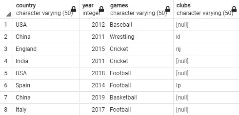

我们也可以连接两个以上的表。

> **连接两个以上的桌子**

现在，我们希望在最后一个查询中包含在游戏中提到的年份中赢得金牌的玩家姓名。因此，我们还必须在游戏和年份上将黄金表与游戏表连接起来，并在输出中包含玩家姓名。

提醒一下，gold 表中的“year”列存储为 varchar。需要将其转换为整数才能进行连接。

```
select g.country, g.year, g.games, m.clubs, gd.player_name
from games g
left outer join makes m on g.country = m.country and 
g.games = m.games
left outer join gold gd on g.games = gd.games and
g.year = cast(gd.years as int);
```

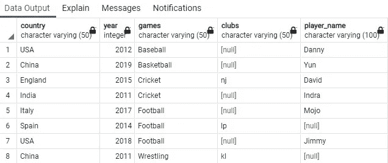

现在我们有了游戏表中提到的国家中与游戏相关的俱乐部，以及那些年赢得金牌的运动员的名字。

> 您可以在内部联接、右外部联接和完全外部联接中对多个列和两个以上的表执行联接。

我们将快速浏览右外连接和全外连接。

> **右外连接**

这一次，我们将加入游戏，并再次制作国家表，以执行正确的外部连接。所以，后面要提到的表将获得优先权。我们将像以前一样，先放“游戏”表，再放“制造”表。

但是在输出表中，我们将从 makes 表中获取所有国家，只有当左表中的信息与右表中的国家相匹配时，才从左表中获取信息。

```
select m.country, g.year, g.games as g_games, m.clubs, m.games as m_games from games gright outer join makes m on g.country = m.country;
```

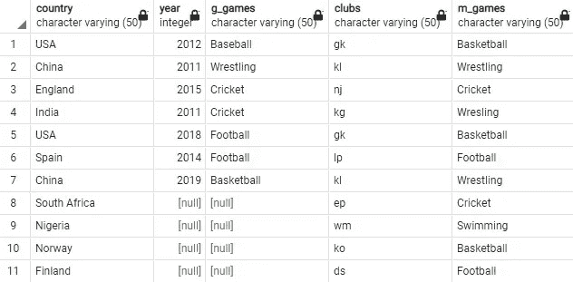

因为我们只在“国家”加入，所以相应的 m _ 游戏和俱乐部都来自那个国家。由于美国和中国在“游戏”表中出现了两次，“制造”表中的信息与这两行连接了两次。所以，总共有 11 行。

在这种情况下，同时使用“国家”和“游戏”更合适:

```
select m.country, g.year, g.games as g_games, m.clubs, m.games as m_games 
from games g
right outer join makes m on g.country = m.country
and g.games = m.games;
```

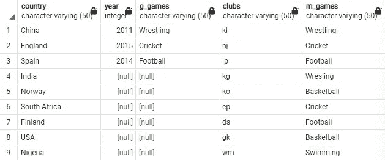

> **全外连接**

我们将只对“country”执行完全联接，我们将同时返回 m.country 和 g.country，因为完全联接将返回这两列中所有国家的信息:

```
select g.country, g.year, g.games as g_games, m.country, m.clubs, m.games as m_games 
from games g
full outer join makes m on g.country = m.country
and g.games = m.games;
```

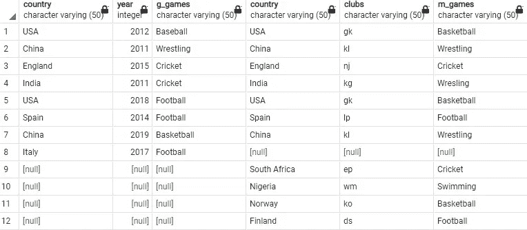

当我们对国家和游戏列进行完全连接时，将从两个表中获取国家和游戏的所有组合:

```
select g.country, g.year, g.games as g_games, m.country, m.clubs, m.games as m_games 
from games g
full outer join makes m on g.country = m.country
and g.games = m.games;
```

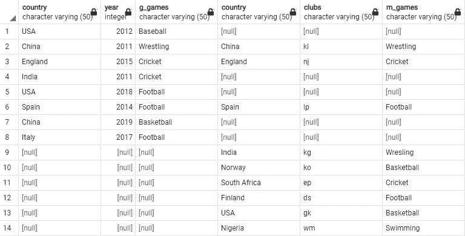

这些都是非常常见的连接类型。

**PostgreSQL 和许多其他 SQL 引擎也支持在“join”语句中使用关键字“using”而不是“on”:**

```
select g.country, g.year, g.games as g_games, m.clubs, m.games as m_games from games gfull outer join makes m using (country);
```

请随意试用。

## 自然连接

PostgreSQL 和其他一些 SQL 引擎，如 MySQL，支持自然连接，如果你不提及连接条件，它会使用公共列自然地“连接”。让我们使用“游戏”和“制作”表进行自然连接:

```
select g.country, g.year, m.clubs 
from games g natural join makes m;
```

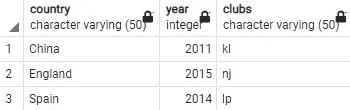

如您所见，我没有提到任何连接条件。尽管如此，它还是在乡村和游戏栏目上做了一个内部连接。因为国家和游戏列在“游戏”和“制造”表之间是通用的。

使用自然内部连接将得到完全相同的结果，如下所示:

```
select g.country, g.year, m.clubs 
from games g natural inner join makes m;
```

> 还可以执行自然左外连接、自然右外连接和自然全外连接。

**自然左外连接示例**

```
select g.country, g.year, m.clubs 
from games g natural left outer join makes m;
```

输出:

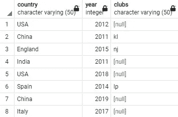

**自然右外连接的例子**

```
select g.country, g.year, m.clubs 
from games g natural right outer join makes m;
```

输出:

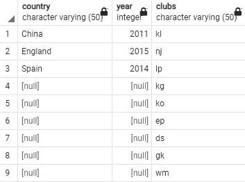

**自然全外连接的例子**

```
select g.country, g.year, m.clubs 
from games g natural full outer join makes m;
```

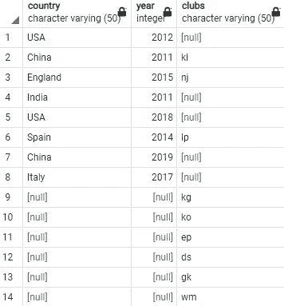

## **一些其他类型的连接**

这里还可以提到一些其他类型的连接。一个是交叉连接。

> **交叉连接**

交叉连接就像两个表的点积。左表的每一行都与右表的每一行连接。这里举个例子。

```
select * from games cross join makes;
```

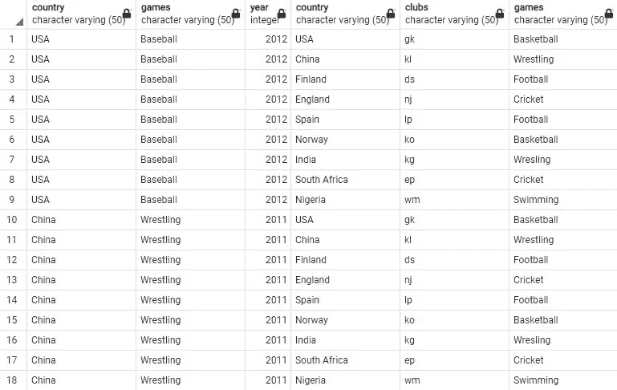

这里我展示了输出的一部分。因为产量这么大。

> 我从两个表中取出所有的列，但是您可以像我们之前做的那样指定某些列。

你可能会想为什么会有人做交叉连接。在这种类型的数据表中帮助不大。但有时它会很有用。

以上提到的连接都是 92 式连接。但是还有一些其他类型的语法，我想在这里提一下。

还有一种 89 式的联接，只执行内联接。它使用“where”子句而不是“join”。

```
select g.country, g.year, g.games as g_games, m.country, m.clubs, m.games as m_games 
from games g, makes m
where g.country = m.country;
```

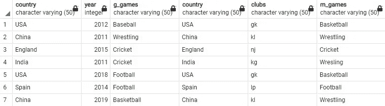

注意，它做的和内部连接完全一样。

## 结论

这些都是我想在这里谈论的工会和加入。我希望它有帮助。这些连接中的大多数也可以在其他 SQL 引擎中执行。有时你可能需要一个小的语法变化。你只需要检查文档。请随意尝试您正在使用的任何 SQL 引擎。

请随时关注我的 [Twitter](https://twitter.com/rashida048) 和[脸书页面](https://www.facebook.com/Regenerative-149425692134498)，并查看我的 [YouTube 频道](https://www.youtube.com/channel/UCzJgOvsJJPCXWytXWuVSeXw)。

## 更多阅读

[](https://pub.towardsai.net/an-overview-of-the-major-sql-query-clauses-and-most-commonly-used-functions-60720e2a20d7) [## SQL 查询子句和函数概述

### 可以用作 SQL 的备忘单

pub.towardsai.net](https://pub.towardsai.net/an-overview-of-the-major-sql-query-clauses-and-most-commonly-used-functions-60720e2a20d7) [](/a-complete-guide-for-detecting-and-dealing-with-outliers-bad26b1e92b6) [## 检测和处理异常值的完整指南

### 6 种检测异常值的方法和 4 种处理异常值的方法

towardsdatascience.com](/a-complete-guide-for-detecting-and-dealing-with-outliers-bad26b1e92b6) [](/30-very-useful-pandas-functions-for-everyday-data-analysis-tasks-f1eae16409af) [## 30 个非常有用的熊猫函数，用于日常数据分析任务

### 熊猫小型张

towardsdatascience.com](/30-very-useful-pandas-functions-for-everyday-data-analysis-tasks-f1eae16409af) [](/animated-and-racing-bar-plots-tutorial-7967a45c4753) [## 动画和赛车酒吧情节教程

### 完整的工作代码

towardsdatascience.com](/animated-and-racing-bar-plots-tutorial-7967a45c4753) [](/regression-in-tensorflow-using-both-sequential-and-function-apis-314e74b537ca) [## TensorFlow 中使用顺序 API 和函数 API 的回归

### 演示几种不同类型的模型结构

towardsdatascience.com](/regression-in-tensorflow-using-both-sequential-and-function-apis-314e74b537ca) [](/what-is-a-recurrent-neural-network-and-implementation-of-simplernn-gru-and-lstm-models-in-keras-f7247e97c405) [## 在 Keras 中实现简单网络、GRU 和 LSTM 模型…

### 什么是递归神经网络以及三种递归神经网络在 Tensorflow 和

towardsdatascience.com](/what-is-a-recurrent-neural-network-and-implementation-of-simplernn-gru-and-lstm-models-in-keras-f7247e97c405)