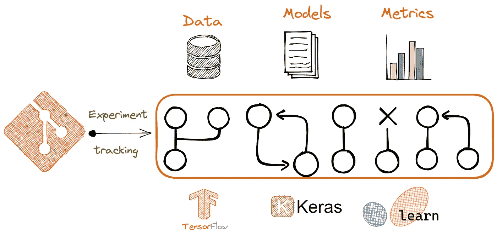
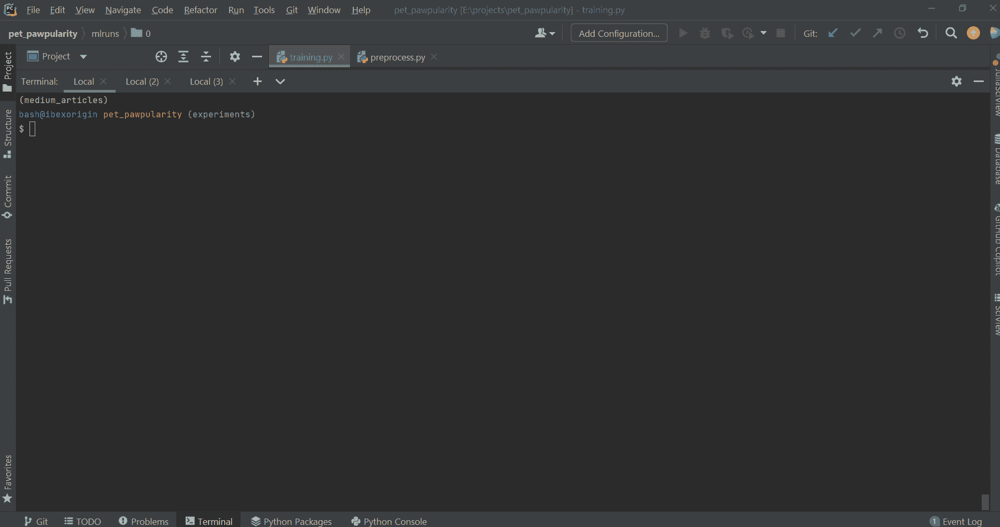
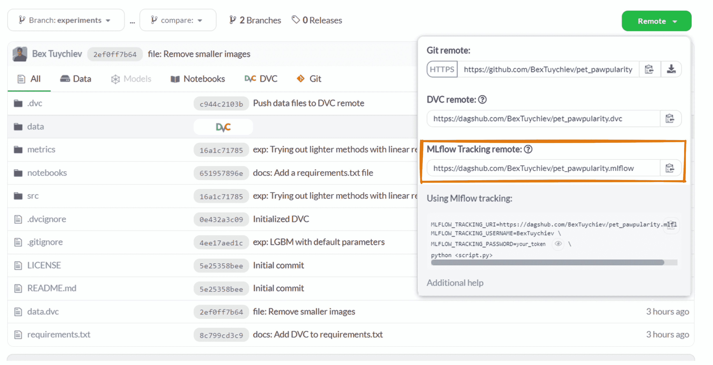
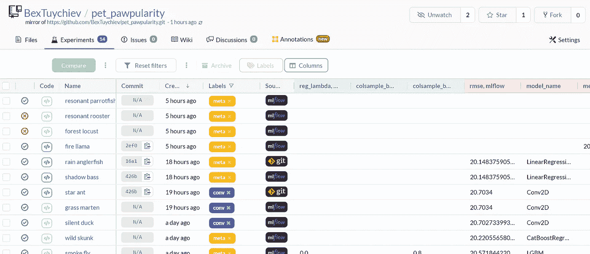
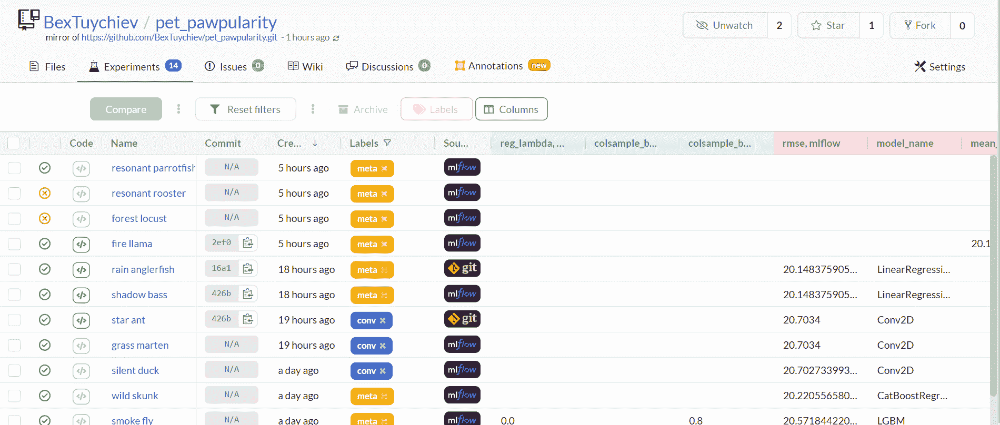
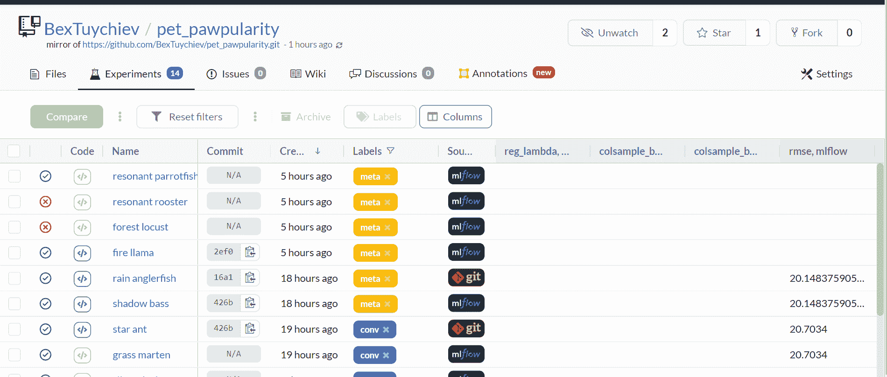
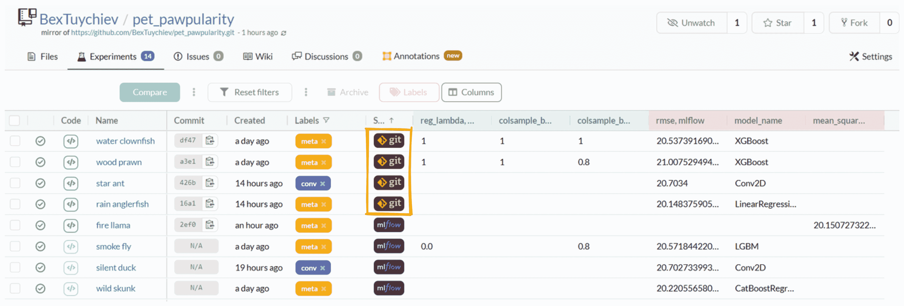
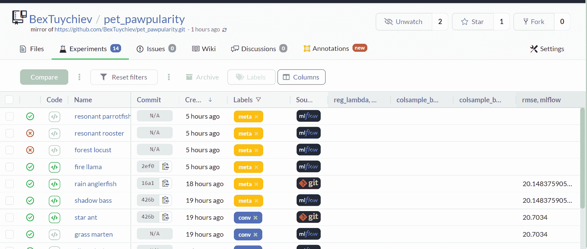
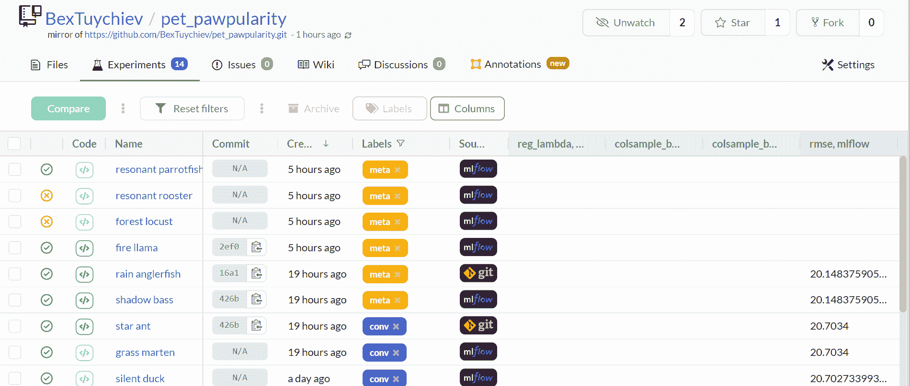

# 使用 MLflow 和 DagsHub 进行实验跟踪的完整指南

> 原文：<https://towardsdatascience.com/complete-guide-to-experiment-tracking-with-mlflow-and-dagshub-a0439479e0b9>

## 创建可重复且灵活的 ML 项目

作者图片

## 介绍

当人们不停地说数据专家花 80%的时间清理数据时，你会感到厌烦吗？虽然这是事实，但机器学习工作流程的另一部分也值得关注，那就是机器学习实验。

跟踪许多机器学习模型及其超参数就像试图在浴缸中养五只狗一样。没有帮助，不可能不让其中一个从你手中溜走。你需要一些灵活而强大的东西来组织每一个实验，所有的细节、代码和数据。

拥有一个所有试验的真实数据库，可以让您将全部注意力放在编写代码上，而不是担心基础设施问题。

在本文中，您将了解机器学习中强大的实验跟踪技术。具体来说:

1.  什么是 MLflow 及其跟踪 API 的基础知识。
2.  如何将 MLflow 连接到 DagsHub 以获得更好的 UI 和免费存储
3.  深入 MLflow 工作流，了解如何为流行的 ML 框架启用自动日志记录
4.  使用 DagsHub 客户端日志记录器通过 git 进行轻量级实验跟踪
5.  使用 DagsHub 的实验选项卡来管理您的所有实验及其结果

## 什么是机器学习中的实验跟踪？

任何成功的生产模式背后，都有许多失败的实验和想法。如果不努力组织你的工作流程以及你如何对待每一个新想法，你不可能神奇地得到一个完美的模型。

机器学习中的实验跟踪是关于保存和版本化与每个实验相关的相关细节(元数据)。根据您的期望和业务需求，这些细节可能会发生变化，但以下是几乎每个项目都需要的最重要的细节:

*   培训和测试指标
*   模型超参数和结构
*   运行时间
*   模型的依赖性
*   重现实验的代码
*   训练模型所需的数据等。

如果没有合适的工具，你会发现手动跟踪这么多东西是非常麻烦的。

## 为什么要为实验跟踪而烦恼呢？

实验跟踪不是为了保存一大堆模型和超参数。它是关于跟踪什么有效，什么无效。

在任何严肃的项目中，你都会尝试很多模型类型和架构，很容易失去对这些细节的感觉。通过拥有一个你所有想法及其结果的数据库，你可以专注于改进工作原型，而不是担心所有令人讨厌的失败细节。

此外，单个项目中可以有许多“最佳模型”。为您的所有实验建立一个共享的存储库可以很容易地根据不同的需求对它们进行分类。根据您的约束，如果可解释性是您的主要关注点，您可以选择具有最佳验证分数的模型，或者具有最短运行时间的模型，或者具有最少参数的模型。

开始实验跟踪的最佳方式是使用经过实战检验的工具，这些工具集成了您需要的所有功能，而不是发明轮子。

## 设置

在我们开始使用用于实验跟踪的库之前，让我们进行一些设置。

尽管你可以自己阅读这篇文章，但它是我用 Kaggle 的宠物流行度竞赛数据做的项目的第二部分。该项目旨在根据图像和元数据预测宠物的可爱程度。

在[第一部分](/open-source-ml-project-with-dagshub-improve-pet-adoption-with-machine-learning-1-e9403f8f7711?source=your_stories_page----------------------------------------)，我解释了我解决这个问题的方法，我使用的工具，并且第一次看到了图像和它们的元数据。建议你看 EDA 部分熟悉一下。

您还可以运行以下命令，将 repo 下载到您的环境中并设置依赖关系。

请注意，数据文件超过 1GB，所以最后一个`dvc pull`命令需要一段时间才能完成。此外，有许多严重的依赖安装。

如果您不想执行上述步骤，我建议您只安装这些库并下载图像的元数据 CSV:

他们将足以跟随。

<https://ibexorigin.medium.com/membership>  

获得由强大的 AI-Alpha 信号选择和总结的最佳和最新的 ML 和 AI 论文:

<https://alphasignal.ai/?referrer=Bex>  

## MLflow 测井实验基础

机器学习实验最好的开源包之一是 MLflow。虽然它的主要吸引力是它的实验跟踪 API，但它有打包 ML 项目并将它们部署到产品中的功能。我们今天只关注它的跟踪 API。

跟踪 API 是以尽可能简单的方式设计的。导入库后，您可以立即开始记录模型参数和实验结果。这里有一个例子:

这两个基本命令在根目录中生成一个名为`mlruns`的特殊缓存。它看起来是这样的:

现在，关于这些目录，你需要知道的是，你总是使用版本控制工具，如 Git 或 DVC，来跟踪它们。一旦有了足够多的实验进行比较，就可以在终端上运行`mlflow ui`命令:

作者

但是这个本地服务器 UI 只对您可见。一个更好的选择是使用免费的跟踪服务器，这样所有的 MLflow 文件都可以远程存储，其他人都可以看到。这就是达格·哈马舍尔德的用武之地。

上一篇文章提到过，DagsHub 是数据科学家的 GitHub。除了托管代码，它还有专门的存储系统用于数据版本控制(DVC)和使用 MLflow 进行实验跟踪。DagsHub 上的任何存储库都公开了 MLflow 的远程跟踪 URI。这是我的宠物木瓜项目的[回购:](https://dagshub.com/BexTuychiev/pet_pawpularity)

作者

要开始向该跟踪服务器发送实验详细信息，您需要采取以下步骤:

导入 MLflow 后，将跟踪 URI 设置为您的回购页面上的链接。然后，为您的 DagsHub 用户名和密码设置两个环境变量，这可以在您的 DagsHub 帐户设置下找到。

如果您不想将敏感信息添加到您的脚本中，并意外地将它们提交给 git，您可以系统创建环境变量。以下是在 Windows 上的操作方法:

或者在 MacOS 上:

现在，所有实验都将被记录到 DagsHub 中，这将在 experiments 选项卡下可见。以下是 Pet Pawpularity 项目的外观(这是一个[链接](https://dagshub.com/BexTuychiev/pet_pawpularity/experiments/#/)):

作者

所有这些实验都是使用我在开始时列出的步骤手工记录的。我用过 XGBoost，LGBM，CatBoost，Sklearn，Keras 这些型号。

该实验选项卡具有 MLFlow 原生 UI 的所有功能，并提供了更多的灵活性和设计。我们将在后面讨论实验选项卡的特性。

## 深入了解 MLflow 工作流程

到目前为止，我们还没有看到 MLflow 承诺的自动化工作流及其跟踪 API。我们一直在使用`log_params`或`log_metrics`手工记录参数和指标。

过一段时间后，这种方法将变得乏味，因为我们仍然在自己提取参数和指标。此外，记录额外的参数，如运行时间、神经网络的模型架构等，需要更多的工作和代码。

MLflow 为许多流行的 ML 框架公开了单独的自动日志记录类来解决这个问题。以下是其中的一些:

*   [sklearn.autolog](https://mlflow.org/docs/latest/python_api/mlflow.sklearn.html)
*   [tensorflow.autolog](https://mlflow.org/docs/latest/python_api/mlflow.tensorflow.html)
*   [keras.autolog](https://mlflow.org/docs/latest/python_api/mlflow.keras.html)
*   [xgboost.autolog](https://mlflow.org/docs/latest/python_api/mlflow.xgboost.html)
*   [lightgbm.autolog](https://mlflow.org/docs/latest/python_api/mlflow.lightgbm.html)
*   [pytorch.autolog](https://mlflow.org/docs/latest/python_api/mlflow.pytorch.html)

这些自动日志记录类记录模型的参数、训练指标，以及任何可用的拟合参数，如早期停止、时期等。在 Sklearn 的情况下，`sklearn.autolog`类还记录用 GridSearch 进行超参数调优试验的结果或管道对象的结果。

让我们先来看看这个类的一个例子:

您不必理解代码中发生的所有事情，因为有一些自定义函数。但是如果你好奇，这里有一个高层次的概述:

*   第 10 行:`get_metadata`函数加载宠物 Pawpularity 元数据训练 CSV，返回两组。
*   第 12 行初始化一个 RandomForestRegressor 示例。

关键部分从第 20 行开始，我们调用了`start_run`上下文管理器。MLflow 工作流程基于*运行*的概念。运行可以是在这个`start_run`上下文管理器下编写的一段代码。由于我们在脚本开始时调用了`sklearn.autolog()`函数，在`start_run`之后发生的实验细节将被记录下来，包括:

*   模型超参数
*   回归的训练指标，如均方误差、R2、平均误差等。
*   来自`sklearn.metrics`的自定义指标，如 RMSE

`end_run()`功能是可选的。您应该注意到，为了让自动记录器检测来自`sklearn.metrics`的定制指标，您应该在导入它们之前启用自动记录器。以下是 DagsHub 上记录的实验:

作者

让我们看看 Keras 的另一个自动记录器示例:

下面是代码正在做的事情:

*   第 1 行启用 Keras 自动记录器
*   第 13 行开始运行
*   第 15 行用顺序 API 构建了一个 Keras 模型
*   第 18–29 行通过提前停止回调来编译模型

让我们看看实验结果如何:

作者

你可以阅读这些文档来了解更多关于自动记录器[的信息。](https://mlflow.org/docs/latest/tracking.html#automatic-logging)

## 使用 Git 和 DagsHub 进行日志记录实验

如果这些信息太多，您可以选择一个更轻量级的选项，比如 DagsHub 客户机包来记录您的实验。有了`dagshub`，几乎没有学习曲线。下面是一个简单的函数，它将用户定义的超参数和指标记录到 git:

一旦您使用期望的参数运行这个函数，它将在项目根目录下创建两个文件(除非您在函数中指定另一个位置)——`metrics.csv`和`params.yml`。将这两个文件添加到 git 并提交更改后，DagsHub 会识别它们，并将参数和指标放在 Experiments 选项卡下。您将会看到这些实验都标有 Git 标签:

作者

尽管 DagsHub 客户端没有漂亮的自动记录器，但它是完全可复制的。假设您正在使用 DVC 来跟踪数据，那么您可以通过一个`git checkout`切换到任何实验以及完成实验时的项目状态。

MLflow 确实记录了提交散列，但是所有 MLflow 运行都将自己附加到最近一次提交，即实验发生之前的*。所以，你需要做的不仅仅是“点击一个按钮”来回到实验的代码。*

与 DagsHub 客户端相比，这是一个明显的劣势。

## 用 DagsHub 分析实验结果

当然，实验选项卡不仅仅显示一个列表。最重要的特点是对比实验。只需选择您想要的，DagsHub 就会生成几个有用的比较指标:

作者

您还可以为具有不同目标或数据的实验分配标签。例如，我使用了`meta`和`conv`标签来表示实验使用了元数据图像或图像卷积。

由于`dagshub`使用 git 进行跟踪，MLflow 可以推断出当前的提交哈希，所以可以直接进入运行实验时的项目状态。

最后，您可以直接从 DagsHub 运行`git diffs`。您可以采取以下步骤来查看两个实验之间的代码和文件差异:

作者

在复制了您想要的实验的提交散列之后，转到 files 选项卡并将它们粘贴到两个字段中。已更改的文件和目录将突出显示。

如果您按下“文件比较”按钮，您会看到每个更改过的文件、脚本和笔记本的深入概述:

作者

## 结论

现在，您知道了如何使用 Git、MLflow 和 DagsHub 跟踪您的实验。您可以自动记录您的所有实验，并在 DagsHub 上生成漂亮的图表进行比较。任何人都可以从你的实验中看到和学到东西，不管是成功的还是失败的。最重要的是，你获得了一个强大的工具来组织你的试验和想法，这对机器学习项目的成功至关重要。

在本教程中，您已经学习了:

1.  什么是实验跟踪，为什么你要为它费心
2.  简单的跟踪工作流是什么样子的
3.  如何将 MLflow 连接到 DagsHub 这样的远程跟踪服务器
4.  如何使用 MLflow 及其自动记录器类
5.  如何使用 DagsHub 和 git 跟踪进行轻量级实验
6.  如何使用 DagsHub 的实验选项卡分析您的实验结果

感谢您的阅读！

**您可以使用下面的链接成为高级媒体会员，并访问我的所有故事和数以千计的其他故事:**

<https://ibexorigin.medium.com/membership>  

**或者订阅我的邮件列表:**

<https://ibexorigin.medium.com/subscribe> 