# 从零开始完成逐步遗传算法的全局优化

> 原文：<https://towardsdatascience.com/complete-step-by-step-genetic-algorithm-from-scratch-for-global-optimization-6fee5c55dd3b>

## 深潜

## 再也不用担心陷入局部最小值了


[Braňo](https://unsplash.com/@3dparadise?utm_source=medium&utm_medium=referral) 在 [Unsplash](https://unsplash.com?utm_source=medium&utm_medium=referral) 上拍照

```
**Table of Contents**[**🌎 What is Global Optimization?**](#388a)[**🧾 Problem Statement**](#c315)[**🔢 Encoding and Decoding Functions**](#b6fa)[**🧬 Selection, Crossover, and Mutation**](#13df)
   ∘ [Selection](#d8ec)
   ∘ [Crossover](#92f8)
   ∘ [Mutation](#03db)
[**👨‍💻 Genetic Algorithm**](#daea)[**🧪 Experiment**](#0239)
   ∘ [Experiment 1: m = 15](#066e)
   ∘ [Experiment 2: m = 30](#bd6a)
[**📌 Conclusion**](#64df)
```

# 🌎什么是全局优化？

> 数学和相关领域的知识之“树”不会只靠长出新枝来生长。事实上，经常发生的情况是，被认为完全不同的分支突然被认为是相关的。
> 
> 米歇尔·哈兹温克尔

优化过程的一个问题是目标函数经常有许多局部最小值。在某些情况下，如果目标函数足够复杂或者整体模型太大，这是可以容忍的。例如，在典型的神经网络模型中，损失函数的优化器并不是为解决局部极小值问题而设计的。为了克服这一点，一些从业者使用具有不同初始权重或不同优化器参数的相同模型，希望一个模型会给出比其他模型稍好的结果。

在特殊情况下，局部极小值是不可容忍的，因此全局优化器是非常需要的。它们被设计来寻找不可微的或者甚至未知的潜在目标函数的全局最小值。有三种最常见的算法:

1.  遗传算法
2.  粒子群优化
3.  模拟退火

最让我感兴趣的是，这些算法都是受现实生活现象的启发。遗传算法是基于进化原理的模拟。粒子群优化最初是为了模拟社会行为，作为鸟群或鱼群中生物运动的程式化表示。模拟退火模拟在缓慢降低的温度下晶体的凝固。

在这个故事中，我们将把注意力集中在遗传算法上。我们先导入一些库。

# 🧾问题陈述

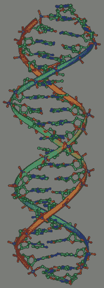

DNA，生物遗传的分子基础，由[公有领域](https://commons.wikimedia.org/w/index.php?curid=853549)

我们今天看到的世界，有各种不同的生物，有高度适应环境的个体，有生态平衡(乐观的假设仍然存在)，是三十亿年实验的产物，我们称之为*进化*，一个基于有性和无性繁殖、自然选择、突变等等的过程。如果我们向内看，今天的生物的复杂性和适应性是通过长期提炼和组合遗传物质而实现的。

在生物学中，我们知道遗传信息被总结在*染色体*中，染色体是由蛋白质和单分子 DNA 组成的细胞成分。对于遗传算法，我们用一串 0 和 1 对染色体进行建模，这也将被称为*个体*(为简单起见，我们假设每个个体由一条染色体表示)。一些个体将会参与竞争，而那些 T4 健康状况良好的个体将会繁衍后代。我们所说的具有良好的适应性是指优化目标函数。

具体地说，我们将引入一个简单的问题并同时构建遗传算法。问题是找到…的根源

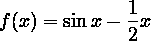

其中*x*∈【1，3】。当然， *f* 是已知的，可微的，并且在区间[1，3]中有一个根，因此如果我们使用普通的局部优化技术，我们应该是好的。然而，出于学习的目的，我们将采用遗传算法来代替。

首先，让我们创建一个等价的最大化问题

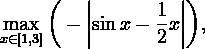

也就是说，我们使 *f* 为非正，然后寻找最大值。如果找到的最大值接近于零(具有一定的容差 *ε* ),那么导致最大值的 *x* 就是有问题的根。如果不是，那么算法还没有找到 *f* 的根。

# 🔢编码和解码功能

与传统的优化算法不同，遗传算法是一种概率优化方法。而且遗传算法对一个函数*f*:*x*→*ℝ*的搜索空间并不是直接在 *X* 上，而是在 *X* 的编码结果上。假设我们用 *S* 表示这个编码结果。在使用遗传算法之前，我们首先要做的是找到一个将 *X* 映射到 *S* 的编码函数。然后，我们在优化后做的最后一件事是执行这个编码函数(解码函数)的逆函数，它将 *S* 映射到 *X* 。编码和解码函数不必是双射的。然而，在大多数情况下，如果解码函数是内射的，就容易多了。

我们使用的编码函数是


在哪里

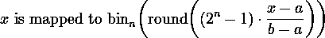

对于每一个 *x* ∈ *X* 。这里，{0，1} *ⁿ* 是由 0 和 1 组成的长度为 *n* 的字符串的完整集合，bin *ₙ* 是将集合{0，1，…，2 *ⁿ* ⁻ }映射到其长度为 *n* 的二进制表示的函数，round 是将实数舍入到最接近的整数的函数。既然*x*∈【1，3】，那么 *a* = 1、 *b* = 3。注意，由于循环运算，我们的编码函数不是双射的。

老实说，编码功能看起来很吓人，至少对我来说是这样。幸运的是，我们真的不需要在算法中定义编码函数，因为我们已经为 *x* 设置了随机值。策略不是为 *x* ∈ *X* 初始化随机值，而是为二进制表示 *s* ∈ *S* 初始化随机值。下面是代码。

从这里，我们可以将解码函数定义如下

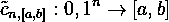

在哪里

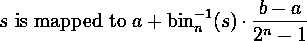

每隔*秒* ∈ *秒*。注意这个解码函数是内射的。

在这个故事中，我们将固定 *n* = 20，尽管我们鼓励您尝试其他的 *n* 值，看看会发生什么。当 *n* = 20 时，遗传算法在区间[1，3]中执行的精度达到

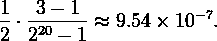

因此，我们不能使用小于 9.54 × 10⁻⁷.的误差容差 *ε* 在这个故事中，默认情况下，我们选择 *ε* = 1 × 10⁻⁵，但是您可能想在程序中更改这个参数。

# 🧬选择、交叉和变异

基本上，遗传算法执行以下步骤:

1.  随机初始化字符串种群 *B₀* = ( *b₁₀，b₂₀，…，bₘ₀* )，其中每个 *bᵢ₀* 为{0，1} *ⁿ* 中的个体字符串， *m* 为种群中的个体数，索引 *0* 表示种群 *B₀* 为第 *0* 代。
2.  执行选择、交叉和变异循环，直到满足停止标准。在这个故事中，选择的停止标准是当一个种群的最佳适应度满足|*f*(*x*)|≤*ε*或达到最大迭代次数(最大世代数)时。默认情况下，最大迭代次数是 1000，但是您可以在程序中更改该参数。

## 选择

选择是通过从第 *t* 代的种群中抽取一个样本，使 *t* = 1，2，…，然后从这个样本中选出一个最适合的个体，继续进入第( *t* +1)代的种群。第 *t* 代中没有被选中的个体会相继死去。在这个故事中，使用的样本大小是

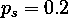

从人口中的个体数量来看。这个过程要执行 *m* 次，这样每一代种群中的个体数量是相同的。

这种选拔过程被称为*锦标赛选拔*。我们使用这种选择方案而不是*轮盘赌选择*来避免过早收敛到局部最大值的可能性(尽管这可以通过突变来避免)，因为具有良好适应性的个体在下一代中填充种群的速度太快。

## 交叉

第 *t* 代种群中的每个个体都是成双成对的(如果 *m* 是奇数，那么就有一个个体没有伴侣)。然后，对于每个单独的对和某个概率，从{1，2，…，*n***1 }中随机选择一个指数。在这个故事中，概率是**

**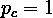**

**这意味着必须发生交叉。此后，交换两个个体中所选索引之后的每个比特分量。**

**这个交叉过程叫做*单点交叉*。**

## **变化**

**突变是对第 *t* 代群体中每个个体的每一位进行反转(从 0 到 1 或从 1 到 0)。以某个小概率执行反演。在这个故事中，概率**

**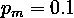**

**已使用。将 *pₘ* 的值设置得很小，以避免遗传算法期间出现混乱。执行变异过程以避免收敛到局部最大值。**

**当然，你可以改变**

**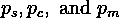**

**如果你想的话。**

# **👨‍💻遗传算法**

**在进入算法之前，让我们创建一个 python 函数`print_result`来显示第一代和最后一代的种群、适应度和平均适应度。它还显示最佳适应性以及达到最佳适应性的点 *x* 。**

**现在我们准备好了。遗传算法建立在我们到目前为止已经创建的函数之上。大致的算法是这样的:**

```
Initialize a random population
While the stopping criterion is not met, do:
    Selection
    Crossover
    Mutation
    Decode population
```

**请在下面找到完整的算法。注意，我们使用参数`random_state`来确保再现性。**

**接下来，为了漂亮地显示结果，我们创建了另一个名为`plot_result`的 python 函数，它将显示:**

1.  ****—**|*f*|的图，以及图上最后一个人口的位置(解码后)**
2.  **每一代人的最佳健身**

# **🧪实验**

**除了取决于随机性，迭代收敛还取决于串的长度 *n* 和群体中个体的数量 *m* 。如前所述，我们固定 *n* = 20。现在我们就来玩玩 *m* 的值。我们尝试 *m* 的两种选择如下。**

## **实验一: *m* = 15**

```
====================================================================
Generation 1 max fitness -0.0174 at x = 1.9165
# 1	[0 1 1 1 0 1 0 1 0 1 0 1 0 0 0 0 1 0 0 1]   fitness: -0.0174
# 2	[1 1 0 1 0 0 1 1 0 0 1 1 0 1 0 1 1 1 0 0]   fitness: -0.8531
# 3	[1 1 0 1 0 0 0 1 0 1 1 1 0 1 0 1 0 1 0 1]   fitness: -0.8342
# 4	[1 0 1 0 1 0 1 0 1 0 0 1 0 1 0 1 0 0 1 1]   fitness: -0.4428
# 5	[1 1 1 0 0 1 0 0 1 0 1 1 0 1 1 1 0 1 1 1]   fitness: -1.0461
# 6	[1 1 1 0 1 1 1 0 1 1 0 1 1 1 1 1 1 0 1 0]   fitness: -1.1612
# 7	[0 1 0 1 0 1 0 0 0 1 0 1 1 0 0 1 1 1 1 0]   fitness: -0.1666
# 8	[0 1 0 0 1 0 0 1 1 0 1 0 1 0 0 1 1 0 1 1]   fitness: -0.2122
# 9	[0 1 0 1 1 0 0 1 1 1 1 0 0 1 0 1 1 1 1 1]   fitness: -0.1402
# 10	[0 0 0 0 0 0 0 0 1 1 1 1 0 1 0 1 1 0 1 0]   fitness: -0.3417
# 11	[0 1 0 1 1 0 1 0 0 1 0 0 0 0 1 1 1 0 1 0]   fitness: -0.1384
# 12	[0 0 1 0 1 1 1 1 1 1 1 1 0 1 1 1 0 1 1 0]   fitness: -0.2935
# 13	[0 1 0 1 1 1 1 0 0 1 0 1 1 0 0 0 1 1 0 0]   fitness: -0.1177
# 14	[1 1 0 1 1 0 1 1 1 1 1 0 1 1 0 0 1 1 0 0]   fitness: -0.9482
# 15	[0 1 1 0 1 1 1 1 1 0 0 0 0 1 1 0 0 0 1 1]   fitness: -0.0196
Average fitness: -0.4489
==================================================================== 

====================================================================
Generation 27 max fitness -0.0000 at x = 1.8955
# 1	[0 1 1 1 0 0 1 0 1 0 0 1 1 0 1 0 0 0 0 1]   fitness: -0.0001
# 2	[0 1 1 0 0 0 1 0 0 0 0 1 1 0 0 1 0 0 1 1]   fitness: -0.0977
# 3	[0 1 1 1 0 1 1 1 0 1 1 1 1 1 1 1 0 1 1 1]   fitness: -0.0319
# 4	[0 1 1 1 0 0 1 0 0 1 0 1 1 0 1 1 0 1 1 0]   fitness: -0.0017
# 5	[0 0 1 1 0 0 1 0 0 0 1 1 1 0 1 1 0 0 0 1]   fitness: -0.2879
# 6	[0 1 1 1 0 0 0 0 0 1 1 1 1 0 1 1 0 0 1 0]   fitness: -0.0136
# 7	[0 1 1 1 0 0 0 0 1 0 1 1 1 1 1 1 0 1 0 1]   fitness: -0.0119
# 8	[0 1 1 1 0 0 1 0 0 1 1 1 1 1 1 1 1 1 0 1]   fitness: -0.0008
# 9	[1 1 1 1 0 0 1 0 0 0 1 1 1 0 1 1 1 0 0 0]   fitness: -1.1996
# 10	[0 1 1 0 0 0 1 1 1 1 1 1 1 0 1 1 1 1 1 0]   fitness: -0.0874
# 11	[1 1 1 1 0 1 1 0 0 1 1 1 1 0 1 1 0 1 1 0]   fitness: -1.2485
# 12	[0 1 1 1 0 0 1 0 0 1 1 1 0 0 0 1 1 1 0 0]   fitness: -0.0011
# 13	[0 1 1 1 0 0 1 0 1 0 0 1 1 1 1 1 1 0 1 0]   fitness: -0.0000
# 14	[0 0 1 1 0 0 0 0 0 1 1 1 1 0 0 0 1 1 1 1]   fitness: -0.2923
# 15	[0 1 1 1 0 0 1 0 0 1 1 1 0 0 1 1 1 1 0 1]   fitness: -0.0011
Average fitness: -0.2184
==================================================================== 

Solution found at iteration 27
```

**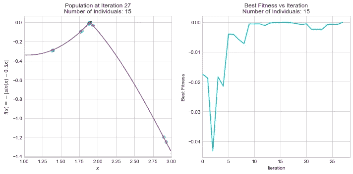**

**图片作者[作者](http://dwiuzila.medium.com/membership)**

## **实验二:m = 30**

```
====================================================================
Generation 1 max fitness -0.0174 at x = 1.9165
# 1	[0 1 1 1 0 1 0 1 0 1 0 1 0 0 0 0 1 0 0 1]   fitness: -0.0174
# 2	[1 1 0 1 0 0 1 1 0 0 1 1 0 1 0 1 1 1 0 0]   fitness: -0.8531
# 3	[1 1 0 1 0 0 0 1 0 1 1 1 0 1 0 1 0 1 0 1]   fitness: -0.8342
# 4	[1 0 1 0 1 0 1 0 1 0 0 1 0 1 0 1 0 0 1 1]   fitness: -0.4428
# 5	[1 1 1 0 0 1 0 0 1 0 1 1 0 1 1 1 0 1 1 1]   fitness: -1.0461
# 6	[1 1 1 0 1 1 1 0 1 1 0 1 1 1 1 1 1 0 1 0]   fitness: -1.1612
# 7	[0 1 0 1 0 1 0 0 0 1 0 1 1 0 0 1 1 1 1 0]   fitness: -0.1666
# 8	[0 1 0 0 1 0 0 1 1 0 1 0 1 0 0 1 1 0 1 1]   fitness: -0.2122
# 9	[0 1 0 1 1 0 0 1 1 1 1 0 0 1 0 1 1 1 1 1]   fitness: -0.1402
# 10	[0 0 0 0 0 0 0 0 1 1 1 1 0 1 0 1 1 0 1 0]   fitness: -0.3417
# 11	[0 1 0 1 1 0 1 0 0 1 0 0 0 0 1 1 1 0 1 0]   fitness: -0.1384
# 12	[0 0 1 0 1 1 1 1 1 1 1 1 0 1 1 1 0 1 1 0]   fitness: -0.2935
# 13	[0 1 0 1 1 1 1 0 0 1 0 1 1 0 0 0 1 1 0 0]   fitness: -0.1177
# 14	[1 1 0 1 1 0 1 1 1 1 1 0 1 1 0 0 1 1 0 0]   fitness: -0.9482
# 15	[0 1 1 0 1 1 1 1 1 0 0 0 0 1 1 0 0 0 1 1]   fitness: -0.0196
# 16	[1 0 1 0 1 0 1 1 0 0 1 1 1 1 0 0 0 1 0 1]   fitness: -0.4489
# 17	[1 0 0 1 1 1 0 0 0 0 0 1 1 0 0 1 0 0 0 1]   fitness: -0.3129
# 18	[0 0 1 1 0 0 0 0 0 1 0 1 0 0 1 1 1 1 1 0]   fitness: -0.2926
# 19	[1 1 0 1 1 0 0 0 0 0 1 1 1 0 1 1 0 1 1 0]   fitness: -0.9076
# 20	[0 0 1 1 0 1 0 1 0 0 1 1 0 1 1 0 1 0 1 0]   fitness: -0.2801
# 21	[1 1 0 1 0 0 1 0 1 0 0 0 0 1 0 0 1 1 1 0]   fitness: -0.8456
# 22	[1 1 0 0 0 1 1 0 1 1 0 1 0 0 0 0 0 0 1 1]   fitness: -0.7216
# 23	[0 1 1 0 1 0 1 0 1 0 0 0 0 1 0 1 1 1 1 0]   fitness: -0.0499
# 24	[0 1 0 0 1 0 0 1 1 1 1 1 1 0 1 1 1 0 1 0]   fitness: -0.2110
# 25	[0 0 0 1 1 1 0 1 1 0 1 1 0 1 0 1 1 1 1 1]   fitness: -0.3271
# 26	[0 0 1 1 0 0 1 1 0 1 1 1 1 1 1 1 1 0 1 0]   fitness: -0.2847
# 27	[1 1 0 0 1 1 1 0 1 1 0 0 0 1 0 0 1 1 0 1]   fitness: -0.8054
# 28	[1 1 0 0 0 1 1 0 1 0 0 0 0 1 0 1 1 0 1 0]   fitness: -0.7186
# 29	[1 0 0 1 0 1 0 1 0 0 0 0 0 1 0 1 0 1 0 1]   fitness: -0.2531
# 30	[0 1 1 1 1 0 0 1 1 0 0 0 0 0 1 0 1 0 0 0]   fitness: -0.0454
Average fitness: -0.4413
==================================================================== 

====================================================================
Generation 11 max fitness -0.0000 at x = 1.8955
# 1	[0 1 1 1 0 0 1 0 1 0 0 1 0 1 1 1 1 0 0 1]   fitness: -0.0002
# 2	[0 1 1 1 0 0 1 0 1 0 0 1 1 1 1 1 1 0 1 0]   fitness: -0.0000
# 3	[0 1 1 1 1 0 1 0 1 0 1 1 0 1 0 1 1 1 1 1]   fitness: -0.0536
# 4	[1 1 1 1 0 0 0 0 1 0 0 1 0 0 1 1 1 1 0 1]   fitness: -1.1807
# 5	[0 1 1 0 1 0 1 0 0 0 0 0 0 1 1 1 1 1 0 1]   fitness: -0.0528
# 6	[0 1 1 1 1 0 1 0 1 0 0 1 0 1 1 0 1 1 1 1]   fitness: -0.0528
# 7	[0 0 1 1 0 0 1 0 1 0 0 1 0 1 1 1 1 1 0 0]   fitness: -0.2870
# 8	[0 0 0 1 0 0 0 0 1 0 0 1 0 1 1 1 1 1 1 0]   fitness: -0.3394
# 9	[1 1 1 1 0 0 0 0 0 1 0 1 0 1 1 1 1 1 0 1]   fitness: -1.1780
# 10	[0 1 1 1 0 0 1 0 1 0 0 1 0 1 1 1 1 1 0 0]   fitness: -0.0002
# 11	[0 1 1 1 0 0 1 0 1 1 0 1 1 1 0 1 1 1 0 0]   fitness: -0.0016
# 12	[0 1 1 1 0 1 1 0 0 1 0 1 0 1 1 0 1 1 1 0]   fitness: -0.0242
# 13	[0 1 1 0 1 0 1 0 1 0 0 1 0 1 1 1 0 1 0 0]   fitness: -0.0495
# 14	[0 1 1 1 0 0 1 0 0 0 0 1 1 1 0 1 1 1 1 0]   fitness: -0.0032
# 15	[0 0 1 1 0 1 1 0 1 0 0 1 1 1 0 0 1 1 0 0]   fitness: -0.2763
# 16	[0 0 1 1 1 0 1 0 0 0 0 0 0 1 0 1 1 1 1 1]   fitness: -0.2665
# 17	[0 0 1 1 1 1 1 0 1 0 0 1 1 0 0 0 1 0 1 0]   fitness: -0.2521
# 18	[0 1 0 1 0 0 0 1 1 0 0 1 0 1 1 0 1 0 0 0]   fitness: -0.1791
# 19	[0 1 1 1 0 0 1 0 1 0 0 1 0 0 1 1 1 0 0 0]   fitness: -0.0003
# 20	[0 1 1 1 0 0 1 0 1 0 1 1 0 1 1 1 1 1 1 0]   fitness: -0.0006
# 21	[0 1 1 1 0 0 1 0 1 0 0 1 1 1 0 1 1 1 0 1]   fitness: -0.0000
# 22	[0 1 0 1 0 0 1 0 0 1 0 1 0 0 1 1 1 0 1 0]   fitness: -0.1758
# 23	[0 1 1 1 0 0 1 0 1 1 0 1 0 1 1 1 1 1 1 0]   fitness: -0.0014
# 24	[0 1 1 1 0 0 1 0 1 0 0 1 0 1 1 1 1 1 0 1]   fitness: -0.0002
# 25	[0 1 1 1 0 0 1 0 0 1 0 1 1 1 1 0 1 1 1 1]   fitness: -0.0016
# 26	[1 1 0 1 0 0 1 1 0 0 0 1 1 0 0 1 1 1 0 0]   fitness: -0.8519
# 27	[0 1 1 1 1 0 1 0 1 0 0 1 1 1 1 0 1 1 0 1]   fitness: -0.0530
# 28	[0 1 1 1 1 0 1 0 1 0 1 1 0 1 0 1 1 0 1 0]   fitness: -0.0536
# 29	[0 1 1 1 0 0 1 0 1 0 0 1 0 1 1 0 0 1 1 0]   fitness: -0.0002
# 30	[0 1 1 1 0 0 1 0 1 0 0 1 0 1 1 1 0 1 1 0]   fitness: -0.0002
Average fitness: -0.1779
==================================================================== 

Solution found at iteration 11
```

**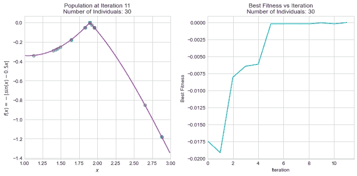**

**图片作者[作者](http://dwiuzila.medium.com/membership)**

**从上面的结果可以看出，对于这两种情况，程序都能找到**

****

**在[1，3]中，即 *x* ≈ 1.8955。从上面 *f* 的洋红色图上的预测种群图可以看出，对于两种情况，种群都聚集在**-**|*f*(*x*)|≈0 附近。**

**然而，这个解决方案是在不同数量的迭代中发现的:**

1.  **在 *m* = 15 的情况下，经过 27 次迭代后找到解，这意味着程序已经执行了 27 × 15 = 405 次求值。由于搜索空间的数量是 2 ⁵，程序只需要 405 / 2 ⁵ =总搜索空间的 1.24%。**
2.  **在 *m* = 30 的情况下，经过 11 次迭代后找到解，这意味着程序已经执行了 11 × 30 = 330 次求值。由于搜索空间数为 2 ⁰，程序只需要 330 / 2 ⁰ = 3.07 × 10⁻⁷部分总搜索空间。**

**在 *m* = 30 的情况下所需的世代数小于在 *m* = 15 的情况下所需的世代数，这是有意义的，因为在前一种情况下人口更多。总而言之，遗传算法比在一个搜索空间中随机寻找一个解 *x* 要有效得多，尤其是在 *m* = 30 的情况下。**

**最后，从上面的最佳适应度对迭代的曲线图(用青色表示)可以看出，一般来说，每一代都会有适应度比上一代更好的个体。然而，可能有某些代人的健康状况比上一代人差。由于突变过程，这是很自然的事情。**

# **📌结论**

**遗传算法是一种强大的全局优化技术，如果应用正确的设置，可以根除局部陷阱。这完全是概率性的，结果取决于过程的随机性，个体中染色体的长度，以及群体中个体的数量。我们已经看到了搜索函数根的遗传算法。据观察，遗传算法比在搜索空间中随机寻找根有效得多。**

****

**🔥你好！如果你喜欢这个故事，想支持我这个作家，可以考虑 [***成为会员***](https://dwiuzila.medium.com/membership) *。每月只需 5 美元，你就可以无限制地阅读媒体上的所有报道。如果你注册使用我的链接，我会赚一小笔佣金。***

**🔖*想了解更多关于经典机器学习模型的工作原理，以及它们如何优化参数？或者 MLOps 大型项目的例子？有史以来最优秀的文章呢？继续阅读:***

**

[艾伯斯·乌兹拉](https://dwiuzila.medium.com/?source=post_page-----6fee5c55dd3b--------------------------------)** 

## **从零开始的机器学习**

**[View list](https://dwiuzila.medium.com/list/machine-learning-from-scratch-b35db8650093?source=post_page-----6fee5c55dd3b--------------------------------)****8 stories****************

[艾伯斯乌兹拉](https://dwiuzila.medium.com/?source=post_page-----6fee5c55dd3b--------------------------------)** 

## **高级优化方法**

**[View list](https://dwiuzila.medium.com/list/advanced-optimization-methods-26e264a361e4?source=post_page-----6fee5c55dd3b--------------------------------)****7 stories****************

[艾伯斯乌兹拉](https://dwiuzila.medium.com/?source=post_page-----6fee5c55dd3b--------------------------------)** 

## **MLOps 大型项目**

**[View list](https://dwiuzila.medium.com/list/mlops-megaproject-6a3bf86e45e4?source=post_page-----6fee5c55dd3b--------------------------------)****6 stories****************

[艾伯斯乌兹拉](https://dwiuzila.medium.com/?source=post_page-----6fee5c55dd3b--------------------------------)** 

## **我最好的故事**

**[View list](https://dwiuzila.medium.com/list/my-best-stories-d8243ae80aa0?source=post_page-----6fee5c55dd3b--------------------------------)****24 stories****************

[艾伯斯·乌兹拉](https://dwiuzila.medium.com/?source=post_page-----6fee5c55dd3b--------------------------------)** 

## **R 中的数据科学**

**[View list](https://dwiuzila.medium.com/list/data-science-in-r-0a8179814b50?source=post_page-----6fee5c55dd3b--------------------------------)****7 stories****************[](https://dwiuzila.medium.com/membership)**