# 从头开始完成分步粒子群优化算法

> 原文：<https://towardsdatascience.com/complete-step-by-step-particle-swarm-optimization-algorithm-from-scratch-74471d064f91>

## 深潜

## 以及它在解决一个非线性控制理论问题中的实现

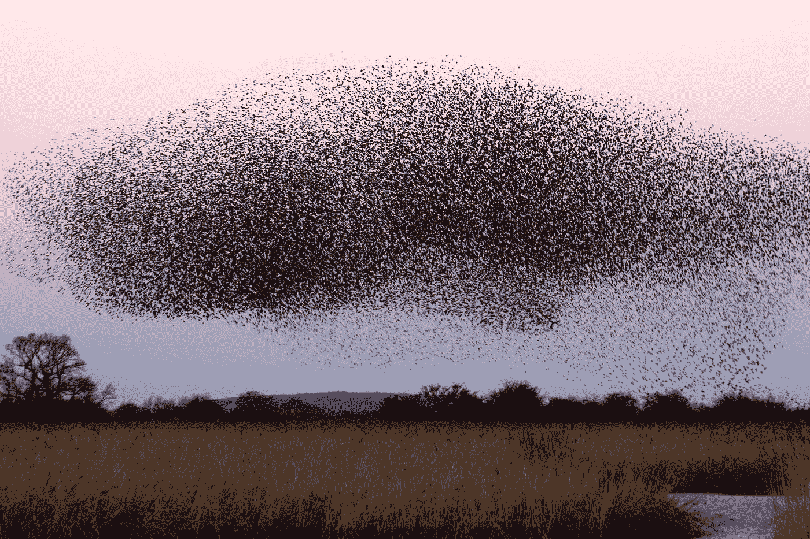

在 [Unsplash](https://unsplash.com?utm_source=medium&utm_medium=referral) 上由 [James Wainscoat](https://unsplash.com/@tumbao1949?utm_source=medium&utm_medium=referral) 拍摄

```
**Table of Contents**[🐦 An Inspiration from Nature](#bf74)
[✍️ Problem Statement](#f3fb)
[💻 Building the PSO Algorithm](#caa0)
[🧪 Testing the Algorithm by Running Once](#5e1c)
[📉 Analyzing Performance](#2954)
   ∘ [Case 1: N = 3 and scaling = 0.10](#b940)
   ∘ [Case 2: N = 6 and scaling = 0.03](#a1e3)
   ∘ [Case 3: N = 12 and scaling = 0.01](#f990)
[📌 Conclusion](#053b)
```

# 🐦来自大自然的灵感

粒子群优化(PSO)算法是一种基于群体的搜索算法，基于对鸟群中鸟类社会行为的模拟。粒子群概念的最初意图是用图形模拟鸟群优雅而不可预测的编排，发现控制鸟类同步飞行能力的模式，并通过以最佳队形重组来突然改变方向。从这个最初的目标，这个概念演变成一个简单而有效的优化算法。

所以，就像[遗传算法](/complete-step-by-step-genetic-algorithm-from-scratch-for-global-optimization-6fee5c55dd3b)一样，粒子群算法是受自然启发的。

[](/complete-step-by-step-genetic-algorithm-from-scratch-for-global-optimization-6fee5c55dd3b) [## 从零开始完成逐步遗传算法的全局优化

towardsdatascience.com](/complete-step-by-step-genetic-algorithm-from-scratch-for-global-optimization-6fee5c55dd3b) 

在粒子群优化算法中，个体，也称为粒子，在超多维搜索空间中“飞行”。搜索空间内粒子位置的改变是基于个体模仿其他个体成功的社会心理倾向。因此，群体中一个粒子的变化受到其邻居的经验或知识的影响。因此，一个粒子的搜索行为受到群体中其他粒子的影响(因此，PSO 是一种共生的合作算法)。对这种社会行为进行建模的结果是，搜索过程的进行使得粒子随机地返回到搜索空间中先前成功的区域。

像往常一样，我们先导入一些库。

# ✍️问题陈述

> 我们将涉及一点数学。您可能希望阅读本节，以掌握并完全理解问题陈述。但是，如果您想向前跳，可以随意向下滚动到本节的编码部分。

我们介绍了一个非线性控制理论问题，并使用粒子群算法来解决它。给定以下系统

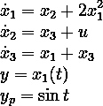

我们将设计控件 *u* ，使 *y* = *x₁* ( *t* )跟随 *yₚ* ( *t* )。这里，对于 *i* = 1，2，3，所有的 *xᵢ* 和 *u* 都是时间 *t* 的函数， *ẋᵢ* 是 *xᵢ* 相对于 *t* 的一阶导数。我们今后将把所有函数的集合称为{ *x₁* 、 *x₂* 、 *x₃* } by *x* 。

随着输出*y*=*x₁*(*t*)，系统的相对度为 2，即 *y* ( *t* )对时间的二阶导数显式包含 *u* 。接下来，我们建立系统的范式。假设

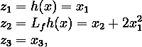

然后，通过定义 *żᵢ* 为 *zᵢ* 相对于 *t* 的一阶导数，我们得到了下面的范式

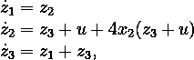

这是一个不稳定的系统，因为*ż₃*=*z₁*+*z₃*。在非线性控制系统理论中，它处于非最小阶段。所以设计 *u* 来跟踪 *yₚ* ( *t* )被 *y* ( *t* )是没用的。根据非线性控制理论，采用输出重定义的方法，仍然可以设计出 *u* ，从而可以通过 *y* ( *t* )跟踪 *yₚ* ( *t* )。

此外，如果选择了另一个输出(输出重新定义)，例如*y*=*x₃*(*t*)，我们将得到如下新系统

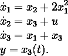

这个系统的相对度是 3。系统的标准形式是通过声明

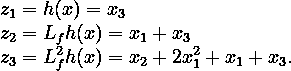

因此，我们得到

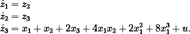

该系统处于正常状态，可以通过选择控制*u*(*t*)=*v*(*t*)***a*(*x*)来稳定，其中**

**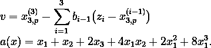**

**这里， *x₃⸴ₚ* 是我们为 *x₃* 和 *x₃⸴ₚ* ⁽ *ⁱ* ⁾是*I*x₃⸴ₚ相对于 *t* 的第*阶导数。注意，*x₃⸴ₚ*⁽⁰⁾=*x₃⸴ₚ*。同样， *bᵢ* 是一个常数。所以，我们有***

**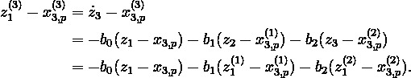**

**假设*w*=*z₁*—*x₃⸴ₚ*和 *w* ⁽ *ⁱ* ⁾是 *w* 相对于 *t* 的第 *i* 阶导数，我们得到 ODE**

**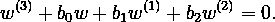**

**选择 *b₀* = 6， *b₁* = 11， *b₂* = 6，则上述 ODE 的特征方程为*λ*+6*λ*+11*λ*+6 = 0，因此有负根 *λ* ∈ {-1，-2，-3}。颂歌的解决方案是**

**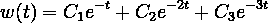**

**用实常数 *C₁* 、 *C₂* 、 *C₃* 。作为设计控件 *u* 的一部分，我们可以用 *C₂* = *C₃* = 0 来设置初始条件 *x₁* (0) = 0。那么请注意**

**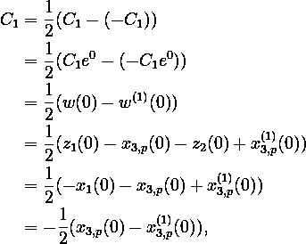**

**以便**

**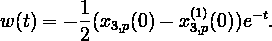**

**因此，**

**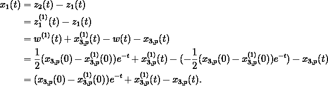**

**换句话说，如果已知 *x₃⸴ₚ* ( *t* )，就可以确定 *x₁* ( *t* )，看 *x₁* ( *t* )是否逼近 sin *t* 。函数 *x₃⸴ₚ* ( *t* )通常可以写成以下傅立叶级数**

**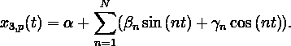**

**注意，我们还需要 *x₃⸴ₚ* ( *t* )的一阶导数，简单来说就是**

**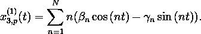**

**参数 *α* 、 *βₙ* 、 *γₙ* 可以近似使得 *x₁* ( *t* )接近 sin *t* 。在这个故事中，我们将通过解决下面的优化问题来寻找它们**

**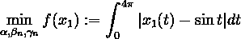**

**通过假设 *x₁* ( *t* )对 sin *t* 的逼近只会在区间[0，4π]上看到。**

**但是积分很难编码。相反，我们将区间[0，4π]划分为 100 个大小相等的子区间。然后，使用梯形法数值求解 *f* 的最小化过程，如下所示**

**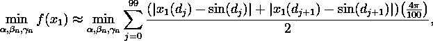**

**其中𝒫( *d₀* ， *d₁* ，…， *d₁₀₀* )是区间[0，4π]的划分。**

# **💻构建粒子群算法**

****

**照片由 [Danist Soh](https://unsplash.com/@danist07?utm_source=medium&utm_medium=referral) 在 [Unsplash](https://unsplash.com?utm_source=medium&utm_medium=referral) 上拍摄**

**上述最小化问题使用粒子群算法解决。PSO 算法是概率性的，因为它包含随机过程。所有 2 个 *N 个* + 1 个参数存储在一个数组中，该数组在 PSO 上下文中通常被称为“粒子”。在这个故事中，形成了 800 个粒子 *pₖ* ，它们用遵循正态分布的随机值进行初始化，从而获得了大小为 800 × (2 *N* +1)的矩阵。**

**然后，对这些初始参数进行缩放，以校正过大的尖峰(请记住，我们想要近似的函数是 sin *t* ，它仅在-1 ≤ sin *t* ≤ 1 时定义，因此远离[-1，1]的尖峰数量需要尽可能少)。比例常数遵循 *N* 的大小，并将在下面的 [**实验**](#2954) 部分中进行公式化。所有这些初始参数都是每个粒子的*个人最佳**pₖ⸴ᵦₑₛₜ**pₖ*。也就是说，对于每个粒子，这些初始参数的值是最佳的，使得 *f* 最小。另外，我们可以选择这 800 个粒子中的一个作为*全局最优* *gᵦₑₛₜ* ，即所有粒子中 *f* 最小的粒子。每个粒子的速度*vₖ*pₖ*也以类似的方式初始化。***

**然后迭代，直到满足停止标准。在一次迭代中，执行以下操作:**

1.  **在区间[0，1]上均匀选取大小为 2 *N* + 1 的随机数 *r₁* 和 *r₂* 。**
2.  **对于每个粒子 *pₖ* 在任何时候 *t* ，使用以下公式更新速度**

**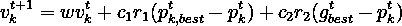**

**其中 *c₁* 和 *c₂* 分别是*认知*和*社会*常数。在这个故事中，设定 *c₁* = *c₂* = 1。变量 *w* 是*惯性权重*，其在本例中被初始化为 1，然后在每次迭代中被减少一个因子 *r* = 0.99。您可以在程序中更改 *c₁* 、 *c₂* 、 *w* 和 *r* 的值。**

**3.通过设置*w*:=*w*×*r*减少 *w* 。**

**4.对于每个粒子 *pₖ* 在任何时候 *t* ，使用公式更新 *pₖ***

**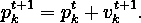**

**5.如果 *f* 值小于先前的全局最佳值，则通过选择 800 个粒子中具有最小 *f* 的 1 个来更新*全局最佳值*。**

**6.更新*个人最好*。对于每个粒子 *pₖ* ，比较 *pₖ* 的 *f* 和 *pₖ⸴ᵦₑₛₜ* 的 *f* 。如果 *pₖ* 的 *f* 小于 *pₖ⸴ᵦₑₛₜ* 的 *f* ，更新*pₖ⸴ᵦₑₛₜ*=*pₖ*。**

**如果不满足以下 3 个语句中的一个，迭代将停止:**

*   ***gᵦₑₛₜ* 的 *f* 值大于公差 *ε* 。在这个故事中，我们选择了 *ε* = 10⁻⁵.**
*   **当前迭代次数仍然小于最大迭代次数。在这个故事中，最大迭代次数设置为 1000。**
*   **在 *gᵦₑₛₜ* 的 *f* 没有减少的情况下进行的连续迭代次数仍然小于*提前停止*迭代限制。在这个故事中，*提前停止*设置为 100。也就是说，如果在 100 次迭代后 *gᵦₑₛₜ* 的 *f* 没有减少，迭代停止。实现*提前停止*的目的是为了在多次执行 PSO 时节省时间(参见 [**实验**](#2954) 部分)。**

**您可以在程序中更改参数 *ε* 、最大迭代次数、*提前停止*。**

# **🧪通过运行一次来测试算法**

**现在，我们将尝试运行一次 PSO 算法，看看它是否正常工作。我们用 *N* = 3，比例= 0.1。**

```
Initial condition:   params = [0.1 -0.1 -0.3 0.1 -0.1 -0.0 -0.1]
		     error = 5.1687Iteration: 1	best params = [0.1 -0.2 -0.3 0.0 -0.1 -0.1 -0.1]
		error = 4.0092
Iteration: 2	best params = [0.1 -0.6 -0.4 0.0 -0.1 -0.1 0.0]
		error = 3.6121
Iteration: 3	best params = [0.0 -0.4 -0.5 0.0 -0.0 0.0 0.0]
		error = 1.2643
Iteration: 4	best params = [0.0 -0.4 -0.6 -0.0 -0.0 0.0 -0.0]
		error = 1.2772
Iteration: 5	best params = [-0.0 -0.5 -0.8 -0.1 -0.0 0.0 -0.0]
		error = 2.7673
Iteration: 6	best params = [-0.0 -0.6 -0.6 0.0 0.0 0.0 -0.0]
		error = 1.9027
Iteration: 7	best params = [-0.0 -0.5 -0.6 -0.0 0.0 0.0 -0.0]
		error = 1.3108
Iteration: 8	best params = [0.1 -0.4 -0.5 0.0 0.0 -0.0 0.0]
		error = 1.4853
Iteration: 9	best params = [-0.1 -0.5 -0.5 -0.0 0.0 0.0 -0.0]
		error = 1.4060
Iteration: 10	best params = [0.0 -0.5 -0.5 0.0 0.0 0.0 -0.0]
		error = 0.8704
Iteration: 11	best params = [0.0 -0.5 -0.5 0.0 0.0 -0.0 0.0]
		error = 1.4382
Iteration: 12	best params = [0.0 -0.5 -0.5 -0.0 -0.0 0.0 0.0]
		error = 0.8478
Iteration: 13	best params = [0.0 -0.5 -0.5 -0.0 -0.0 0.0 0.0]
		error = 0.7722
Iteration: 14	best params = [0.0 -0.5 -0.5 0.0 -0.0 -0.0 0.0]
		error = 0.8501
Iteration: 15	best params = [-0.0 -0.5 -0.5 0.0 0.0 -0.0 -0.0]
		error = 1.1804
Iteration: 16	best params = [0.1 -0.5 -0.5 0.0 0.0 0.0 -0.0]
		error = 0.9567
Iteration: 17	best params = [-0.0 -0.5 -0.5 -0.0 -0.0 0.0 0.0]
		error = 0.7197
Iteration: 18	best params = [0.0 -0.5 -0.5 0.0 -0.0 0.0 -0.0]
		error = 0.4595
Iteration: 19	best params = [0.0 -0.5 -0.5 0.0 -0.0 0.0 0.0]
		error = 0.2959
Iteration: 20	best params = [-0.0 -0.5 -0.5 0.0 -0.0 0.0 -0.0]
		error = 0.4951
Iteration: 21	best params = [0.0 -0.5 -0.5 0.0 -0.0 0.0 -0.0]
		error = 0.4831
Iteration: 22	best params = [-0.0 -0.5 -0.5 0.0 -0.0 0.0 0.0]
		error = 0.6799
Iteration: 23	best params = [-0.0 -0.5 -0.5 -0.0 0.0 0.0 0.0]
		error = 0.4144
Iteration: 24	best params = [-0.0 -0.5 -0.5 -0.0 0.0 0.0 -0.0]
		error = 0.5413
Iteration: 25	best params = [0.0 -0.5 -0.5 -0.0 -0.0 0.0 0.0]
		error = 0.4145
Iteration: 26	best params = [0.0 -0.5 -0.5 -0.0 -0.0 0.0 0.0]
		error = 0.3616
Iteration: 27	best params = [-0.0 -0.5 -0.5 -0.0 0.0 0.0 -0.0]
		error = 0.3272
Iteration: 28	best params = [-0.0 -0.5 -0.5 0.0 -0.0 -0.0 0.0]
		error = 0.2329
Iteration: 29	best params = [-0.0 -0.5 -0.5 0.0 -0.0 -0.0 -0.0]
		error = 0.2442
Iteration: 30	best params = [0.0 -0.5 -0.5 0.0 -0.0 0.0 0.0]
		error = 0.2628
Iteration: 31	best params = [-0.0 -0.5 -0.5 0.0 -0.0 0.0 -0.0]
		error = 0.1614
Iteration: 32	best params = [-0.0 -0.5 -0.5 0.0 -0.0 -0.0 -0.0]
		error = 0.2218
Iteration: 33	best params = [0.0 -0.5 -0.5 0.0 -0.0 0.0 0.0]
		error = 0.1540
Iteration: 34	best params = [-0.0 -0.5 -0.5 -0.0 -0.0 -0.0 -0.0]
		error = 0.1594
Iteration: 35	best params = [-0.0 -0.5 -0.5 0.0 0.0 -0.0 -0.0]
		error = 0.1561
Iteration: 36	best params = [-0.0 -0.5 -0.5 0.0 -0.0 -0.0 0.0]
		error = 0.0816
Iteration: 37	best params = [-0.0 -0.5 -0.5 0.0 -0.0 -0.0 -0.0]
		error = 0.0612
Iteration: 38	best params = [-0.0 -0.5 -0.5 -0.0 -0.0 -0.0 0.0]
		error = 0.0926
Iteration: 39	best params = [0.0 -0.5 -0.5 -0.0 -0.0 -0.0 0.0]
		error = 0.0501
Iteration: 40	best params = [0.0 -0.5 -0.5 -0.0 -0.0 -0.0 -0.0]
		error = 0.0544
Iteration: 41	best params = [0.0 -0.5 -0.5 -0.0 -0.0 -0.0 -0.0]
		error = 0.0417
Iteration: 42	best params = [-0.0 -0.5 -0.5 -0.0 -0.0 -0.0 -0.0]
		error = 0.0285
Iteration: 43	best params = [-0.0 -0.5 -0.5 -0.0 0.0 -0.0 -0.0]
		error = 0.0228
Iteration: 44	best params = [-0.0 -0.5 -0.5 -0.0 0.0 -0.0 -0.0]
		error = 0.0284
Iteration: 45	best params = [-0.0 -0.5 -0.5 -0.0 0.0 -0.0 -0.0]
		error = 0.0340
Iteration: 46	best params = [0.0 -0.5 -0.5 -0.0 -0.0 -0.0 -0.0]
		error = 0.0240
Iteration: 47	best params = [0.0 -0.5 -0.5 -0.0 0.0 0.0 -0.0]
		error = 0.0159
Iteration: 48	best params = [0.0 -0.5 -0.5 -0.0 0.0 -0.0 -0.0]
		error = 0.0153
Iteration: 49	best params = [-0.0 -0.5 -0.5 -0.0 0.0 0.0 -0.0]
		error = 0.0156
Iteration: 50	best params = [-0.0 -0.5 -0.5 -0.0 0.0 0.0 -0.0]
		error = 0.0149
Iteration: 51	best params = [-0.0 -0.5 -0.5 -0.0 -0.0 0.0 -0.0]
		error = 0.0152
Iteration: 52	best params = [-0.0 -0.5 -0.5 -0.0 -0.0 -0.0 -0.0]
		error = 0.0110
Iteration: 53	best params = [0.0 -0.5 -0.5 -0.0 -0.0 -0.0 -0.0]
		error = 0.0069
Iteration: 54	best params = [0.0 -0.5 -0.5 -0.0 0.0 -0.0 -0.0]
		error = 0.0076
Iteration: 55	best params = [0.0 -0.5 -0.5 -0.0 0.0 -0.0 0.0]
		error = 0.0056
Iteration: 56	best params = [0.0 -0.5 -0.5 -0.0 0.0 -0.0 -0.0]
		error = 0.0035
Iteration: 57	best params = [-0.0 -0.5 -0.5 -0.0 -0.0 0.0 -0.0]
		error = 0.0038
Iteration: 58	best params = [0.0 -0.5 -0.5 -0.0 0.0 -0.0 0.0]
		error = 0.0025
Iteration: 59	best params = [0.0 -0.5 -0.5 0.0 -0.0 0.0 0.0]
		error = 0.0011
Iteration: 60	best params = [0.0 -0.5 -0.5 0.0 0.0 0.0 0.0]
		error = 0.0014
Iteration: 61	best params = [-0.0 -0.5 -0.5 0.0 0.0 0.0 0.0]
		error = 0.0009
Iteration: 62	best params = [0.0 -0.5 -0.5 0.0 0.0 0.0 0.0]
		error = 0.0005
Iteration: 63	best params = [0.0 -0.5 -0.5 -0.0 0.0 0.0 0.0]
		error = 0.0007
Iteration: 64	best params = [0.0 -0.5 -0.5 -0.0 0.0 0.0 0.0]
		error = 0.0007
Iteration: 65	best params = [0.0 -0.5 -0.5 -0.0 0.0 0.0 0.0]
		error = 0.0005
Iteration: 66	best params = [0.0 -0.5 -0.5 -0.0 0.0 -0.0 0.0]
		error = 0.0003
Iteration: 67	best params = [0.0 -0.5 -0.5 -0.0 0.0 0.0 0.0]
		error = 0.0003
Iteration: 68	best params = [0.0 -0.5 -0.5 0.0 0.0 0.0 0.0]
		error = 0.0002
Iteration: 69	best params = [0.0 -0.5 -0.5 -0.0 -0.0 0.0 0.0]
		error = 0.0002
Iteration: 70	best params = [-0.0 -0.5 -0.5 0.0 0.0 0.0 0.0]
		error = 0.0001
Iteration: 71	best params = [0.0 -0.5 -0.5 -0.0 0.0 0.0 0.0]
		error = 0.0001
Iteration: 72	best params = [-0.0 -0.5 -0.5 0.0 -0.0 0.0 0.0]
		error = 0.0001
Iteration: 73	best params = [-0.0 -0.5 -0.5 0.0 0.0 -0.0 0.0]
		error = 0.0001
Iteration: 74	best params = [-0.0 -0.5 -0.5 0.0 0.0 -0.0 0.0]
		error = 0.0001
Iteration: 75	best params = [0.0 -0.5 -0.5 -0.0 -0.0 -0.0 0.0]
		error = 0.0000
Iteration: 76	best params = [0.0 -0.5 -0.5 -0.0 0.0 0.0 0.0]
		error = 0.0000
Iteration: 77	best params = [0.0 -0.5 -0.5 0.0 -0.0 -0.0 -0.0]
		error = 0.0000
Iteration: 78	best params = [0.0 -0.5 -0.5 -0.0 0.0 -0.0 0.0]
		error = 0.0000
Iteration: 79	best params = [-0.0 -0.5 -0.5 -0.0 -0.0 0.0 -0.0]
		error = 0.0000
Iteration: 80	best params = [0.0 -0.5 -0.5 0.0 -0.0 -0.0 -0.0]
		error = 0.0000
```

**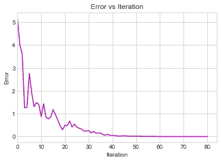**

**图片作者[作者](http://dwiuzila.medium.com/membership)**

**太好了，非常管用！在迭代过程中，我们看到最佳误差波动，但总体趋势下降。这并不奇怪，因为粒子会四处移动，有时会通过局部最小值。**

**由于 *N* = 3，所以有 2 × 3 + 1 = 7 个参数可以玩。该算法找到的最终参数是**

**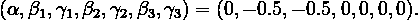**

**因此，**

**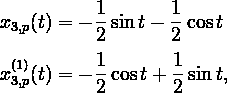**

**这可以很容易地用来验证**

**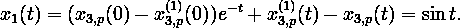**

**经过对 *x₂* 和 *x₃* 的计算，我们得到 *u* 的设计为**

**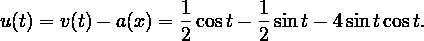**

**很容易检查所有这些函数是否满足问题陈述中给出的系统。**

**从上面可以看出，PSO 算法需要 80 次迭代来解决优化问题。为了查看逼近进度，我们将使用`plot_result` python 函数在一些迭代中在区间[0，4π]中绘制 *x₁* ( *t* )和 sin *t* ，如下所示。注意，我们使用了`basic_units.py`，一个来自 [matplotlib 文档](https://matplotlib.org/stable/gallery/units/basic_units.html)的 python 文件，因此需要定义我们自己的`sin`函数。这种费力的工作只是为了将 *x* 轴网格线显示为弧度的倍数。**

**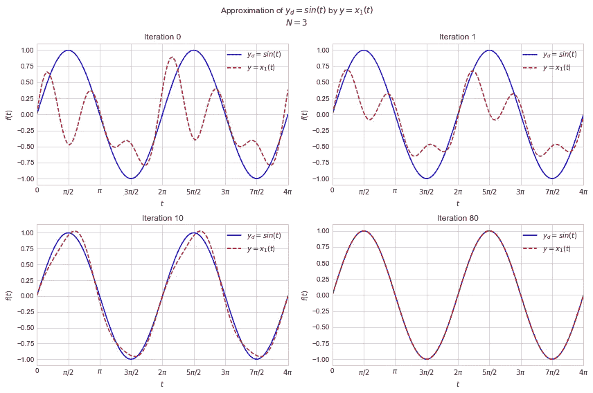**

**图片作者[作者](http://dwiuzila.medium.com/membership)**

# **📉分析性能**

**我们已经得到了我们想要的。因此，尝试 *N* 的其他值是没有用的。所以，把这个部分当作一个沙箱，我们在这里尝试改变 *N* ，多次运行 PSO 算法，看看它什么时候崩溃。**

**迭代收敛高度依赖于初始参数的选择和所执行的缩放。另外， *x₃⸴ₚ* 的参数个数(由 *N* 决定)也影响迭代收敛。一个容易看到的观察结果是，如果 *N* 足够大，那么所选择的比例常数必须足够小。这是因为大的 *N* 导致三角函数 sin( *nt* )和 cos( *nt* )很有可能达到极值 1 或-1，从而导致 *x₁* 上的尖峰。为此，我们尝试了三种选择 *N* 和缩放:**

*   ***N* = 3，缩放比例= 0.10**
*   ***N* = 6，缩放= 0.03**
*   ***N* = 12，缩放= 0.01**

**对于每种情况，我们将运行粒子群算法 100 次。然后，绘制结果的平均值，以查看整体性能。为此，我们构建了一个名为`plot_average_result`的 python 函数，如下所示。**

## **情况 1: N = 3，缩放比例= 0.10**

```
Average number of iterations: 78.23
Average parameters found    : [-0.0 -0.5 -0.5 0.0 0.0 -0.0 -0.0]
Average errors              : 4.663474180805023e-07
```

**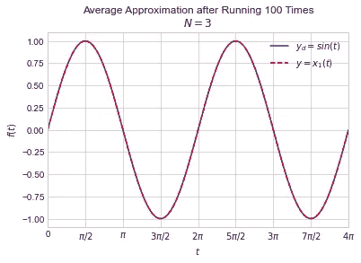**

**图片由[作者](http://dwiuzila.medium.com/membership)**

**该程序运行大约 78 次迭代，并找到返回 10⁻⁷阶的 *gᵦₑₛₜ* 的 *f* ，小于 *ε* = 10⁻⁵.的参数找到的参数是[0，-0.5，-0.5，0，0，0，0]。我们已经检查过这些参数确实产生了*y*=*x₁*(*t*)非常接近 *y* = sin *t* ，从上图中也可以看出，两者的图形在[0，4π]内的所有点都重合。**

## **情况 2: N = 6，缩放比例= 0.03**

```
Average number of iterations: 155.96
Average parameters found    : [0.0 -0.5 -0.5 -0.0 0.0 -0.0 0.0 0.0 0.0 -0.0 0.0 -0.0 -0.0]
Average errors              : 0.0033187883813983877
```

**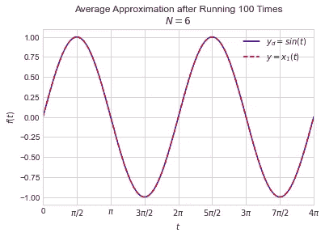**

**图片作者[作者](http://dwiuzila.medium.com/membership)**

**该程序运行大约 156 次迭代，并设法找到生成具有 10⁻顺序的 *gᵦₑₛₜ* 的 *f* 的参数。100 次跑步中的一些因为提前停止而停止。所得到的参数实际上与情况 1 中的参数相似，从上图中也可以看出，曲线图 *y* 和 *yₚ* 几乎在所有点上重合。**

## **情况 3: N = 12，缩放比例= 0.01**

```
Average number of iterations: 146.63
Average parameters found    : [0.0 -0.5 -0.5 -0.0 0.0 -0.0 -0.0 0.0 0.0 0.0 0.0 -0.0 0.0 -0.0 0.0 0.0
 0.0 -0.0 0.0 -0.0 0.0 0.0 0.0 -0.0 -0.0]
Average errors              : 0.6630980162922079
```

**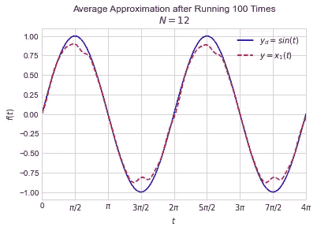**

**图片作者[作者](http://dwiuzila.medium.com/membership)**

**该程序运行了大约 147 次迭代，并设法找到生成具有 10⁻顺序的 *gᵦₑₛₜ* 的 *f* 的参数。查看比情况 2 中更低的平均迭代次数，我们得出结论，许多运行(从 100 次运行)停止是因为它们达到了早期停止。从上图可以看出， *y* 和 *yₚ* 的曲线图在波峰和波谷处略有偏离。**

# **📌结论**

**粒子群优化算法(PSO)是一种全局优化算法，本质上是概率性的，因为它包含随机过程。群体的概念最初是为了用图形模拟鸟群优雅而不可预测的舞蹈动作而研究的。然而，我们已经实现了粒子群算法来解决一个非线性控制理论问题。该算法能够以高精度找到控制 *u* 。**

****

**🔥你好！如果你喜欢这个故事，想支持我这个作家，可以考虑 [***成为会员***](https://dwiuzila.medium.com/membership) *。每月只需 5 美元，你就可以无限制地阅读媒体上的所有报道。如果你注册使用我的链接，我会赚一小笔佣金。***

**🔖*想了解更多经典机器学习模型的工作原理，以及它们是如何优化参数的？或者 MLOps 大型项目的例子？有史以来最优秀的文章呢？继续阅读:***

**

[艾伯斯·乌兹拉](https://dwiuzila.medium.com/?source=post_page-----74471d064f91--------------------------------)** 

## **从零开始的机器学习**

**[View list](https://dwiuzila.medium.com/list/machine-learning-from-scratch-b35db8650093?source=post_page-----74471d064f91--------------------------------)****8 stories****************

[艾伯斯·乌兹拉](https://dwiuzila.medium.com/?source=post_page-----74471d064f91--------------------------------)** 

## **高级优化方法**

**[View list](https://dwiuzila.medium.com/list/advanced-optimization-methods-26e264a361e4?source=post_page-----74471d064f91--------------------------------)****7 stories****************

[艾伯斯·乌兹拉](https://dwiuzila.medium.com/?source=post_page-----74471d064f91--------------------------------)** 

## **MLOps 大型项目**

**[View list](https://dwiuzila.medium.com/list/mlops-megaproject-6a3bf86e45e4?source=post_page-----74471d064f91--------------------------------)****6 stories****************

[艾伯斯·乌兹拉](https://dwiuzila.medium.com/?source=post_page-----74471d064f91--------------------------------)** 

## **我最好的故事**

**[View list](https://dwiuzila.medium.com/list/my-best-stories-d8243ae80aa0?source=post_page-----74471d064f91--------------------------------)****24 stories****************

[艾伯斯·乌兹拉](https://dwiuzila.medium.com/?source=post_page-----74471d064f91--------------------------------)** 

## **R 中的数据科学**

**[View list](https://dwiuzila.medium.com/list/data-science-in-r-0a8179814b50?source=post_page-----74471d064f91--------------------------------)****7 stories****************[](https://dwiuzila.medium.com/membership)**