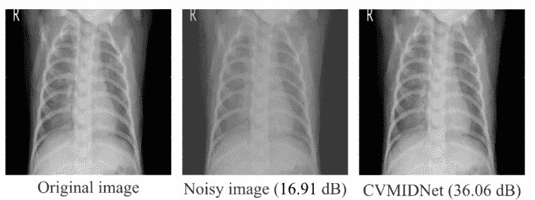
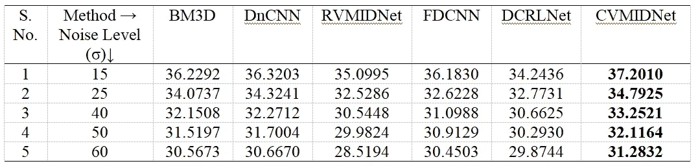
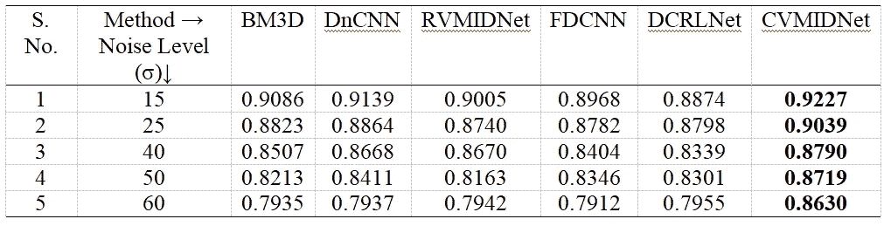
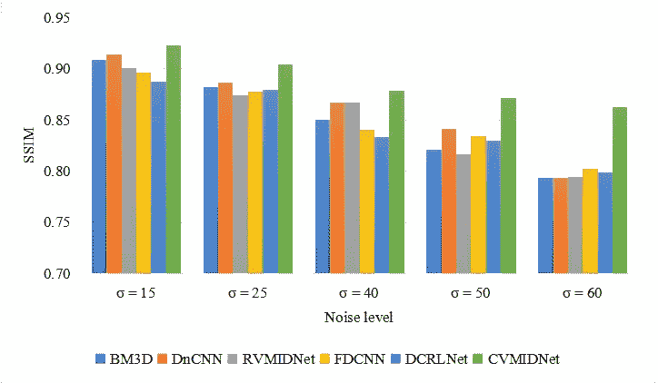
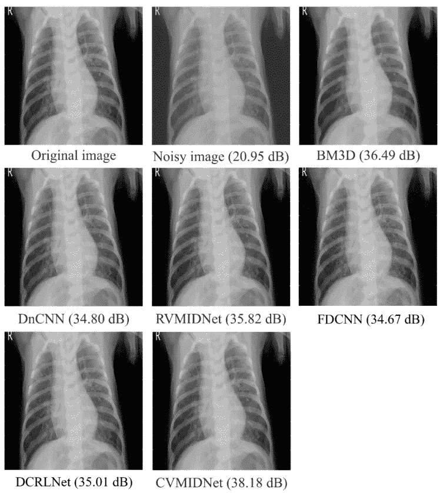

# 用于医学图像去噪的复值 CNN

> 原文：<https://towardsdatascience.com/complex-valued-cnns-for-medical-image-denoising-12a4262c6ef6>

## 一种新的医学图像去噪方法

[来源](https://doi.org/10.1016/j.bspc.2021.102859)

深度学习，特别是卷积神经网络(CNN)，正在塑造数据驱动的问题解决的未来。从文本相关的问题，如语音生成、内容编写等，到视觉任务，如图像分类、对象检测，CNN 被广泛使用。在过去的几年中，已经提出了许多先进的 CNN 架构，如图形 CNN、基于注意力的 CNN、复值 CNN 等。在这篇文章中，我将总结我在[这里](https://doi.org/10.1016/j.bspc.2021.102859)发表的研究论文，其中提出了一种新的基于复值 CNN 的深度学习模型用于医学图像去噪。

## 介绍

医学成像通过以多种方式帮助医疗专业人员，包括疾病诊断、治疗和风险预测，彻底改变了卫生部门。然而，X 射线、计算机断层扫描(CT)、超声波和磁共振成像(MRI)等医学图像容易受到各种噪声的影响。例如，胸部 X 射线(CXR)图像经常被高斯噪声破坏，高斯噪声出现在采集、存储、传输和处理过程中。医学图像中的噪声会降低图像质量，甚至使其在诊断上无法使用。这可能会阻碍进一步的决策，导致疾病的诊断、治疗或分析不佳。因此，总是迫切需要在不损害潜在信息的情况下降低医学图像的噪声，因为由此产生的诊断直接影响人类健康和生命。

一些传统的医学图像去噪(MID)技术包括基本的数字图像滤波器、自适应滤波器、非局部均值算法和多尺度技术。然而，医学图像中复杂的噪声导致这些技术的性能不尽人意。“然后是卷积神经网络(CNN)”。毫无疑问，CNN 已经成为众多数据驱动任务，尤其是图像处理的主流解决方案。对于 MID，已经报道了各种基于 CNN 的架构，如卷积自动编码器和生成式对抗网络(GANs)。这些 CNN 技术涉及两种 CNN 架构，例如，在 GANs 中，我们有一个生成器和鉴别器，在自动编码器中，我们有一个编码器和解码器。然而，有许多方法只涉及一种 CNN 架构，如 DnCNN。

给定用于 MID 的基于 CNN 的方法，可以得出结论，所有这些方法都涉及实值 CNN，即处理实数的 CNN 架构。这促使我为 MID 开发 CVC nn，正如你可能已经猜到的，这是为 MID 实现 CVC nn 的第**篇研究论文**(同时，这也是我的第一篇研究论文)。

最近，复值 CNN(cv CNN)越来越受欢迎，因为它们提供了比实值 CNN 更好的结果，并且由于硬件行业的进步，这些模型的实现已经成为可能。现在出现了以下问题:

1.  CVCNNs 如何优于它们的实值对应物
2.  CVCNNs 如何用于 MID

我不会主要关注第一个问题，因为它超出了本文的范围。不过，我可能会写另一篇文章，说明 CVCNNs 相对于其实值对等物的优势，所以请继续关注:)

## 提议的方法

提出的用于 MID 的 CVCNN 模型被称为 CVMIDNet。模型框架如图 1 所示，其中 Conv、BN 和 ReLU 代表卷积层、批量归一化和校正线性单元函数。

**图一。**CVMIDNet 的架构。[来源](https://doi.org/10.1016/j.bspc.2021.102859)

以下是该模型的主要组成部分:

## 复值卷积层(CVCL)

在 CVCL 中，实值卷积运算被推广到复数域。在实值卷积层中，在输入矩阵 I 和实值核 K，即 I*K 之间执行卷积运算。在复值卷积层中，I 和 K 都是复矩阵，使得:

> I = Ir + iIc
> K = Kr + iKc

其中，Ir、Ic、Kr 和 Kc 是实矩阵。现在，复值卷积运算变为:

> I * K =(Ir * Kr Ic * Kc)+I(Ic * Kr+Ir * Kc)

## 复值批量规范化(CVBN)

类似于 CVCL，在 CVBN 中，实值 BN 运算以如下方式推广到复数域:

> CNB(Z) = BN(A) + i(BN(B))

其中 BN()和 CNB()分别表示实值和复值 BN 运算。Z 是被认为是 Z = A + iB 的复值参数

## 复值 ReLU (CVReLU)

当涉及到一般化实值激活函数(在这个例子中是 ReLU)时，我们有许多方法可以做到这一点，因此我们有不同版本的 CVReLU。最常见的包括 ModReLU、zReLU 和 CReLU。在文献中，有足够的证据表明 CReLU 的性能优于其他潜在的同类产品，尤其是在与图像相关的任务中，因此它被考虑用于 CVMIDNet。CReLU 按如下方式获得:

> CReLU(z) = ReLU(R(z)) + i(ReLU(I(z)))

其中，z、R(z)和 I(z)表示复值参数、z 的实部和 z 的虚部。

## 数据集和实验细节

本研究考虑了一个公开可用的 CXR 图像数据集([链接](https://data.mendeley.com/datasets/rscbjbr9sj/3))，其中图像受到高斯噪声的影响。CXR 图像被考虑用于去噪，因为由于其成本效益和非侵入性方法，它们是最重要的医学成像技术类型之一。为训练选择了 400 幅图像，为测试集选择了 100 幅(与训练集不重叠)图像。

整个工作的代码是使用 Tensorflow 在 Python 中开发的。必要时还开发了定制层和数据生成器。

## 结果

峰值信噪比(PSNR)和结构相似性指数(SSIM)被用来评估 CVMIDNet。此外，该模型还与 BM3D、DnCNN、FDCNN 等其他先进的 MID 技术进行了比较。CVMIDNet 的实值对应物(通过用其实值对应物替换 CVMIDNet 中的复值运算而开发的)，称为 RVMIDNet，也被考虑用于性能评估。

考虑了许多高斯噪声水平，即 sigma = 15、25、40、50 和 60 (sigma 代表高斯噪声中的噪声水平，更多的是这里的)。结果显示在下表和下图中。

**表 1** 去噪图像的 PSNR 结果。[来源](https://doi.org/10.1016/j.bspc.2021.102859)

**表 2** 去噪图像的 SSIM 结果。[来源](https://doi.org/10.1016/j.bspc.2021.102859)

**图二。**去噪图像的平均 PSNR 图。[来源](https://doi.org/10.1016/j.bspc.2021.102859)

**图 3。**去噪图像的平均 SSIM 图。[来源](https://doi.org/10.1016/j.bspc.2021.102859)

通过与其他最新技术进行比较，发现 CVMIDNet 在各种噪声水平下对受高斯噪声影响的 CXR 图像进行去噪方面优于所有其他方法。

图 sigma = 15 的去噪图像。[来源](https://doi.org/10.1016/j.bspc.2021.102859)

## 结论

首次提出并实现了一种新的基于复值 CNN 的深度学习模型 CVMIDNet，该模型具有用于医学图像去噪的残差学习。CVMIDNet 使用复值卷积层、复值批量归一化和 CReLU 激活来实现，以从胸部 X 射线图像中去除高斯噪声。CVMIDNet 的去噪性能与四种潜在的最先进的去噪方法进行了比较，即块匹配和 3D 滤波、DnCNN、特征引导去噪卷积神经网络以及除 RVMIDNet 之外的具有残差学习的深度 CNN 模型，其中 RVMIDNet 具有与 CVMIDNet 相同的架构，但所有操作都是实值的。据观察，CVMIDNet 在所有调查的五个噪音水平上以显著的优势优于所有其他模型。此外，视觉评估还清楚地表明，CVMIDNet 比其他比较模型更有效地降低了噪声并恢复了图像。

## 结尾注释

所以这是一个关于我的一个新方法的研究的简介，这个方法被杂志接受:[生物医学信号处理和控制](https://www.sciencedirect.com/journal/biomedical-signal-processing-and-control)。

如果这篇文章对你有用，那么你可能会发现我的其他文章同样有趣。此外，如果你想或正在寻找开发这样的模式，那么你可以联系我在五月:【https://www.fiverr.com/shubhankarrawat 

快乐学习！！