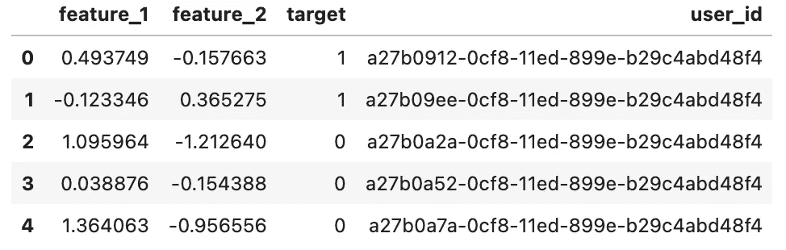
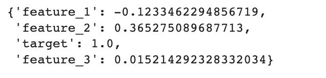
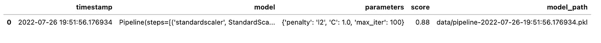
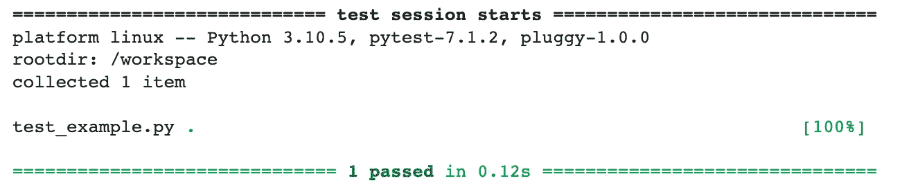
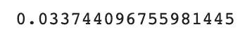

# 仅使用 Python 的生产 ML 系统的组件

> 原文：<https://towardsdatascience.com/components-of-a-production-ml-system-using-only-python-d6cf27405c82>

## 学习和构建 MLOps 组件基础的基础

我最近为纽约数据科学学院做了一个关于[生产中的机器学习的演讲，我根据这个演讲改编了这篇文章。这篇文章的目的是使用*唯一的* Python 代码演示一个生产 ML 系统的一些组件的基本功能。对于感兴趣的人，](https://www.youtube.com/watch?v=Zu9WDwBwEW4&feature=youtu.be])[我还将在 2022-23](https://info.nycdatascience.com/waitinglistforupcomingclass?hs_preview=CfYnYAcl-80863152231)的生产课上教授机器学习！


由 [Devilz 拍摄。](https://unsplash.com/@devilbitez?utm_source=medium&utm_medium=referral) on [Unsplash](https://unsplash.com?utm_source=medium&utm_medium=referral)

**免责声明**:本文不代表*实际*生产系统的设置，而是作为一个教育工具，代表这些工具的一些轻量级功能，以帮助那些没有机会使用这些系统的人熟悉这些系统。

也就是说，下面的每个代码片段都是为了演示您可能在实现 MLOps 的生产 ML 系统中看到的一些东西——仅使用*Python！酷吧？要开始使用，请确保安装了以下库:*

```
pandas
sklearn
pytest
```

下面是一些我们将在本教程中使用的合成用户数据。它包含两个输入要素和一个目标。这并不代表真实的场景，但有利于演示:

```
**import** pandas **as** pdurl = "[https://raw.githubusercontent.com/kylegallatin/components-of-an-ml-system/main/data/user_data.csv](https://raw.githubusercontent.com/kylegallatin/components-of-an-ml-system/main/data/user_data.csv)"user_data **=** pd**.**read_csv(url, index_col**=**0)
user_data**.**head()
```



现在让我们开始吧…

# 功能存储

特征库(和特征系统)旨在使机器学习系统的特征易于管理、产品化和定义。它们通常可用于模型训练和低延迟服务。一些技术来看看:泰克顿，盛宴。

下面的解决方案允许我们将用户数据转换成一个以`user_id`为关键字的字典——这样我们就可以快速检索我们想要预测的用户的特征。它也不妨碍我们在培训过程中读取所有数据。

我们可以用我们的数据初始化这个类，然后将新的特性定义为函数！该函数将自动应用于我们的数据并创建新功能:

```
feature_store **=** SuperSimpleFeatureStore(user_data)

**def** new_feature(feature_dict: Dict) **->** Dict:
    **return** feature_dict["feature_1"] ****** 2

feature_store**.**register_feature("feature_3", new_feature)
feature_store**.**get_user_feature("a27b09ee-0cf8-11ed-899e-b29c4abd48f4")
```



# ML 元数据存储(实验跟踪)和模型注册

ML 元数据(实验跟踪)本质上是你的数据科学项目的实验室笔记本。这个想法是你捕捉所有的元数据和实验运行的信息，使事情具有可重复性。在此之上是一个模型注册中心，这将是一个更集中的管理和版本化模型的地方。一些可以参考的工具:MLFlow，Weights and Biases，Comet，Sagemaker。

在这种情况下，我们的设计更简单。我们将在一个 CSV 文件中捕获关于我们实验的所有信息，用于跟踪结果。

现在我们有了助手函数，我们可以进行不同的训练运行并记录结果:



每当我们运行上面的代码时，我们将向我们的“ML 元数据存储”追加另一行。

# 自动化培训渠道

一旦模型代码、数据和参数被优化，代码可以被抽象到源代码控制的 repo (git)中，训练代码可以被调度和自动化。在像电子商务这样的情况下，已经有新的数据进入，模型经常需要重新训练。您想要自动化训练和部署模型的过程，这些模型的参数已经被合理地设置。一些可以参考的工具:气流，库伯流。

在可能是迄今为止最大的过度简化中，我这样编译了代码，并将其放入自己的 Python 脚本中——然后添加了一个无限循环，以在每次运行之间休息 1 分钟来持续训练模型。这样，我们可以在后台运行脚本来不断训练新的模型(在运行之间有 60 秒的睡眠时间)。

要在后台运行该脚本，请使用:

```
python3 main.py &
```

# 连续累计

持续集成是主动向中央存储库提交变更的行为，也包括自动化测试和构建。大多数这些动作都是由 git 提交和推送到 Github 这样的远程存储库来触发的。在本例中，我添加了一个可以使用`pytest`运行的简单测试。虽然还没有自动化，但这是在 ML repo 中设置测试的一个很好的起点。值得关注的工具:Jenkins、云构建、Buildkite。

```
pytest
```



**动作**:通过添加`pytest` [命令作为 git 预提交挂钩](https://pre-commit.com/)，自己练习 CI(ie 将在您尝试提交代码时运行)。

# 持续交付/部署和模型服务器

连续交付是可靠地发布软件的小的迭代变更的实践，以确保它可以被可靠地发布。持续部署就是持续部署。在 ML 的情况下，这将是自动化过程的一部分——其中模型训练管道自动将新训练的模型发送到模型服务器。要看的工具:Jenkins，Cloud Build，Buildkite，Argo CD。

模型服务器通常是接受预测输入(要素)并返回预测的 HTTP 服务器。要看的工具:Tensorflow 发球，谢顿核心。

在这种情况下，不是做“CD ”,我们只是在每次预测时更新加载最新的训练模型(记住它在后台更新)。然后，我们使用一个`predict`函数代替模型服务器来获取给定用户 ID 的特性并进行预测。

```
array([0.])
```

在真实的场景中，我们永远不会为每个预测再次加载模型，但是这段代码确保我们无论如何都使用最新的模型。为了改进这个解决方案，请尝试添加代码，以便在我们的模型存储发生变化时只读取新的模型！

# 性能监控

生产系统的监控和可观察性绝对是一个系统中最重要的组成部分之一。真正的系统也有警报，通知工程师生产问题。在这种情况下，我们将创建一个简单的监视器，记录预测的延迟并报告平均值。一些研究工具:普罗米修斯，格拉夫纳。

这段代码添加了一个非常简单的监视类，它跟踪并记录做出预测所需的时间。

如果我们想在继续预测时看到平均预测时间，我们可以使用监视器来实现！

```
monitor**.**mean()
```



## 结论

生产系统是困难的，如果没有在工业部门工作过相当长的时间，就更难获得实际经验。虽然上面的代码或示例都不是“生产就绪”的，但是它们应该为您提供一个学习这些组件的基础知识的基础，然后在它们的基础上进行构建。

在野外，您可能会看到这里所表示的组件的许多不同的组合和实现——包括我没有包括的其他组件！如果您想在本文中看到更多的概念，请告诉我！在这里看这个项目的 [git 回购。](https://github.com/kylegallatin/components-of-an-ml-system)

今年秋天，我将教授一门生产机器学习课程，如果感兴趣，请联系 LinkedIn 或 Twitter！