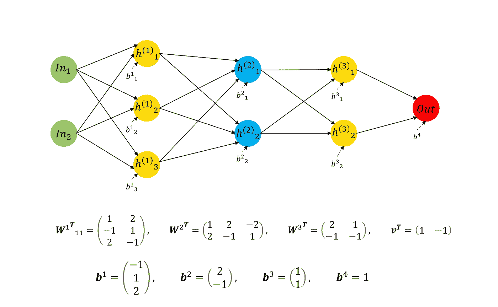
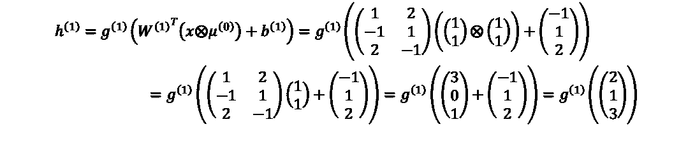
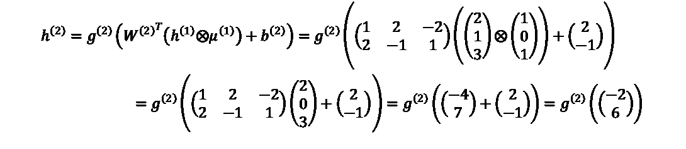
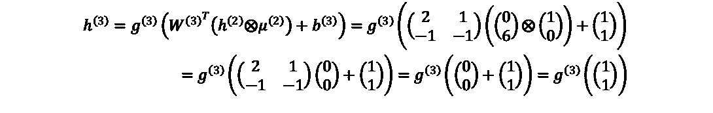

# 理解辍学:通过做玩具例子进行深度学习

> 原文：<https://towardsdatascience.com/comprehend-dropout-deep-learning-by-doing-toy-examples-d07f985c8e2f>

## 丢弃是深度神经网络中主要的正则化技术之一。这个故事有助于你深刻理解什么是辍学，它是如何运作的。


完全连接的网络(由作者创建)

在深度学习中，尤其是在物体检测中，很容易发生过拟合。过度拟合意味着模型非常复杂，以至于它非常适合训练集，但在测试集上失败。失败意味着它有时甚至检测到测试图像中的噪声。

在对象检测中，通常使用预训练的骨干进行训练，或者继续使用预训练的模型进行训练。这就是为什么在几个时代之后，验证的损失高于训练的损失。在这种情况下，添加一个下降层是有帮助的。

在 Pytorch 中，我们可以简单地通过以下方式添加一个 Dropout 层:

```
from torch import nn
dropout = nn.Dropout(p=0.2)
```

但是引擎盖下会发生什么呢？

# **辍学正规化方案**

Dropout 技术通过选择隐藏层中的一些神经元，从原始神经网络创建子神经网络。选择是重新采样神经网络中的节点(仅隐藏层中的节点)并定义一些遮罩。

**辍学不是为了偏向节点！**剔除是一种正则化技术，其思想是减少由权重引起的过拟合。因此，正则化不适用于偏差节点，因为它们不接收任何输入。因此，放弃它们无助于改进预测。

# 玩具示例

**考虑下面的全连接网络，其中激活函数是 ReLU。**(要看网络和矩阵的关系，看上面的 GIF。)



辍学玩具示例

**在本例中，目标是使用以下漏失掩码预测 x = (1，1)。**


漏屏

为了计算预测，我们应该计算隐藏层中的值。

## 第一个隐藏层:



其中 g⁽ ⁾是激活函数，则


**注意:**第一个丢弃层μ⁰是所有节点的丢弃层。因此，对结果没有任何影响。

## 第二个隐藏层:



其中 g⁽ ⁾是 *ReLU* 激活函数，则


## **第三个隐藏层:**



其中 g⁽ ⁾是 *ReLU* 激活函数，则


## 输出层:


## 练习:

如果缺失掩码为:


最后的答案是:


# 摘要

这个故事有助于你理解辍学技巧。我计划在机器学习和深度学习中增加更多这样的玩具例子。因此，如果你喜欢阅读更多，请继续关注😊。

[](https://sciencenotes.medium.com/membership) [## 加入媒体阅读伟大的教程和故事！

### 我写机器学习、深度学习和数据科学教程。升级阅读更多…

sciencenotes.medium.com](https://sciencenotes.medium.com/membership)